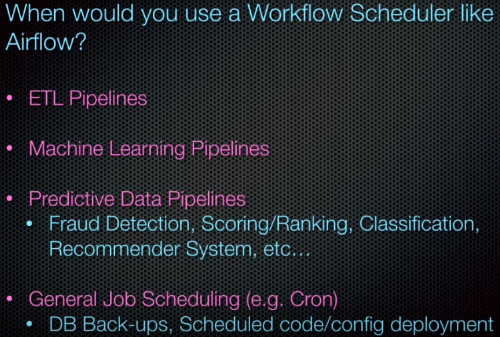
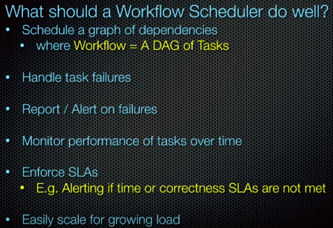
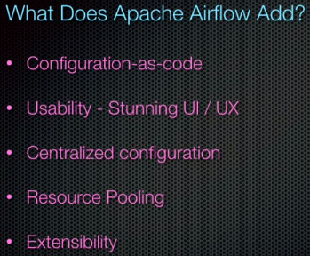

# Apache Airflow Note

## Overview 

Airflow is a platform to programmatically author, schedule and monitor workflows.

Airflow is not a data streaming solution. It is comparable to Oozie or Azkaban.

Workflows are expected to be mostly static or slowly changing.

---

## Airflow Pipeline 

An Airflow pipeline is just a Python script that happens to define an Airflow DAG object, where we nest tasks into. 

A task must include or inherit the arguments "task_id" and "owner", otherwise Airflow will raise an exception.

### Templating with Jinja

Template variable: `{{ variable_name }}`

Code logic: ``