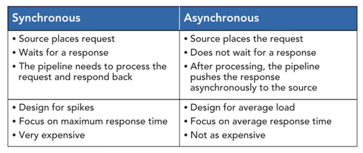
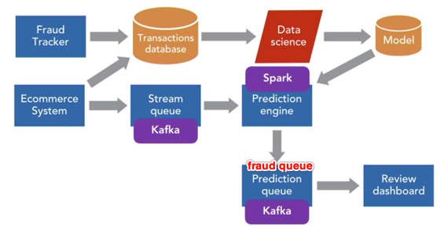
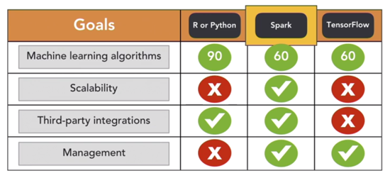
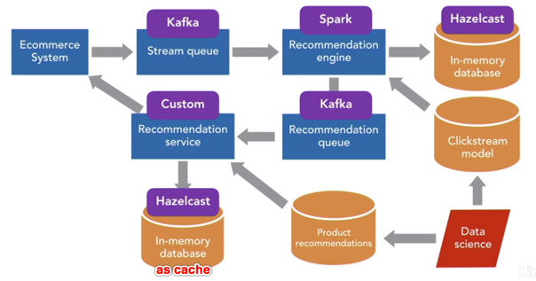
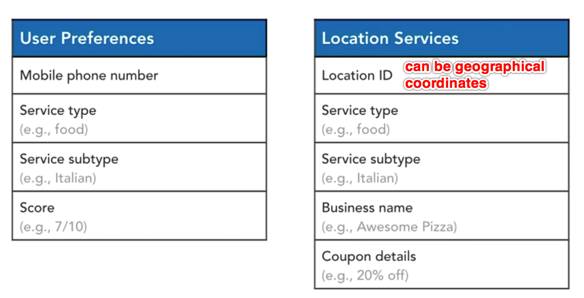

# Big Data Architecture Note

- [Big Data Architecture Note](#big-data-architecture-note)
  - [Big Data Logical Architecture](#big-data-logical-architecture)
  - [Real-Time Applications](#real-time-applications)
    - [Social Media Sentiment Analysis](#social-media-sentiment-analysis)
      - [Problem](#problem)
      - [Solution](#solution)
      - [Technologies](#technologies)
        - [Stream Processing](#stream-processing)
        - [Streaming Message Queues](#streaming-message-queues)
        - [Real-Time Subscribers](#real-time-subscribers)
        - [Sentiment Analysis Engine](#sentiment-analysis-engine)
        - [Message Database](#message-database)
      - [Best Practice of Real-Time Streaming](#best-practice-of-real-time-streaming)
    - [Payment Fraud Detection](#payment-fraud-detection)
      - [Problem](#problem-1)
      - [Solution](#solution-1)
      - [Technologies](#technologies-1)
        - [Machine Learning](#machine-learning)
      - [Best Practices of Predictive Analytics](#best-practices-of-predictive-analytics)
    - [E-Commerce Product Recommendations](#e-commerce-product-recommendations)
      - [Problem](#problem-2)
      - [Solution](#solution-2)
      - [Technologies](#technologies-2)
        - [Recommendation Service](#recommendation-service)
        - [In-Memory Database](#in-memory-database)
      - [Best Practices of Parallel Processing](#best-practices-of-parallel-processing)
    - [Mobile Couponing](#mobile-couponing)
      - [Problem](#problem-3)
      - [Solution](#solution-3)
      - [Technologies](#technologies-3)
        - [User Preferences & Location Services Databases](#user-preferences--location-services-databases)
        - [Mobile Gateway](#mobile-gateway)
      - [Best Practices of Pipeline Management](#best-practices-of-pipeline-management)

---

[(Online course: Big Data for Architects)](https://learning.oreilly.com/videos/big-data-for/9781801075596/)

## Big Data Logical Architecture

---

[(Online course: Architecting Big Data Applications: Real-Time Application Engineering)](https://www.linkedin.com/learning/architecting-big-data-applications-real-time-application-engineering)

## Real-Time Applications

Real-Time

- As the response time expectations get higher, or the target response times get lower, the cost increases exponentially.
- Go as high as possible for the response time value without impacting user experience or application effectiveness.

Synchronous vs. Asynchronous Pipelines

Strategies

- Use asynchronous pipelines wherever possible.
- **DO NOT** use synchronous pipelines unless absolutely required.
- Build horizontally scalable systems that maximize **parallel processing**.
- Use **buffering queues** between producers and consumers to adjust for differences in throughput.
- Service components in the architecture should be **stateless**.
- If state needs to be stored, use database, in memory data grids or clusters.
- Every request in a real-time pipeline has a time to live, after which, it goes stale or out of context. Monitor it and drop the request if it exceeds.

### Social Media Sentiment Analysis

#### Problem

Business needs an overall real-time (a few minutes) tracking board and list of negative posts and posters.

Goals:

- real-time monitoring: a few minutes
- horizontal scalability for future growth in posts and additional analytics
- real-time summary for the overall social media sentiment
- capability to add more social media channels

#### Solution

- You can create separate subscription threads for each of the hashtags.
- Use one single Kafka topic.
- The number of Spark and Kafka partitions should be the same.
- Each post can be processed independently.
- Use map operations to cleanse text.
- Use sentiment analysis engine.
- Use reduce to summarize tweets by sentiment.
- Keep batch intervals as high as possible.

#### Technologies

##### Stream Processing

##### Streaming Message Queues

- :negative_squared_cross_mark: RabbitMQ

- :negative_squared_cross_mark: Apache ActiveMQ

- :white_check_mark: Apache Kafka (choose this one because of excellent integration with Apache Spark)

The above three have equivalent capabilities.

##### Real-Time Subscribers

- Build customized subscribers to subscribe to messages in real time, and then push them to Kafka.

##### Sentiment Analysis Engine

- Build a web service (application) based on Python libraries (NTLK package).
- Scale by using multiple web servers behind a load balancer.

##### Message Database

- MySQL can easily handle 100,000 records per day.
- If the number of records increases in the future, you may need to use NoSQL.  

#### Best Practice of Real-Time Streaming

- Different streaming products offer different kinds of guarantees like only once, at least one and at most once.
- Requery data from an earlier point if failures happen.
- Decouple the publishers and the subscribers.
- Redundacny to support failover.
- Should be horizontally scalable.

### Payment Fraud Detection

#### Problem

When a customer buys online, your business wants to determine fraud before order shipment.

Goals:

- real-time: within minutes
- asynchronous
- predictive analysis
- enable human review of fraudulent transactions

#### Solution

- In order to have minimum or no backlog at all times, you can create enough partitions on Kafka and Spark to de-queue at the speed messages are queued.
- Load the data science model in each of the partitions in Spark.
- Keep the prediction model loaded and stored in Spark broadcast variables, which will automatically distribute the model to all the partitions and will avoid frequent network traffic.
- Predict in map operations as each transaction is independent.
- The number of Spark and Kafka partitions should be the same.

#### Technologies

##### Machine Learning

#### Best Practices of Predictive Analytics

- Should be possible to run predictions on a number of transactions simultaneously and easily scalable.
- Keep the prediction process as asynchronous as possible.
- Measure and benchmark prediction times.
- Benchmark user response times during synchronous predictions.

### E-Commerce Product Recommendations

#### Problem

Your business wants to recommend products in real time (a few seconds) while the user is browsing your e-commerce website.

- Recommendation based on the product currently being viewed.
- Recommendation based on the clickstream during the current browsing session.

Goals:

- real-time: a few seconds
- context specific
- scalable to support thousands of online users simultaneously

#### Solution

- Combine two kinds of recommendations to give a consolidated list of products.
- Each event is handled and predicted and the in-memory database is accessed inside the map function to ensure parallelism.
- Adopt asynchronous recommendation.
- Purge old data once session expires.

#### Technologies

##### Recommendation Service

- Should be stateless.
- Any state should be stored in the central in-memory database.

##### In-Memory Database

- Use in-memory database to store current user, session and recommendations.

#### Best Practices of Parallel Processing

- Store all data including session state in a central database, which should be able to scale horizontally.
- Services should be stateless.
- Deploy multiple recommendation services behind a load balancer.
- Spend time learning and designing partition management.
- Data processing should be done in map operations as much as possible to ensure parallelism.
- Reduced operations should be kept to a minimum and should be in the last stage.

### Mobile Couponing

#### Problem

- Your business pushes mobile couponing to customers' mobile phones depending on the location they are currently in and based on their past buying behaviors and preferences.
- Your business gets paid only if customers use the coupons.
- Customers have your mobile app installed on their mobile phones.

Goals:

- real-time: a few seconds
- location specific
- user-based recommendations
- scalable to support hundreds of thousands of active mobile phones

#### Solution

- The mobile gateway should be horizontally scalable and capable of processing multiple requests in parallel.
- The recommendations should be queried and decided within map operations so that the work is distributed amongst Spark partitions.
- Coupon queue will have a smaller load since not all location information coming in will find coupon matches.

#### Technologies

##### User Preferences & Location Services Databases

##### Mobile Gateway

- Should be stateless.
- Should be horizontally scalable.
- Coupons have a time to live (TTL): a few seconds, as the user could have moved to another location when the coupons finally arrive.
- Drop coupons if their TTL expires.

#### Best Practices of Pipeline Management

- Use cluster managers (Yarn or Mesos) for
  - monitoring cluster health
  - scheduling jobs
  - job management
  - failover
  - scaling with additional nodes
  - reporting of cluster health
  - backlog tracking
