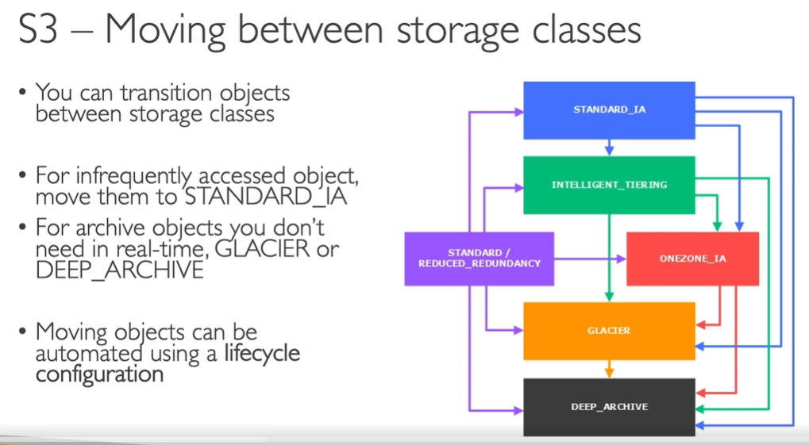
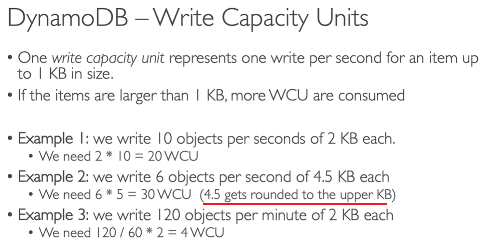

# AWS Big Data Specialty Certification Note

- [AWS Big Data Specialty Certification Note](#aws-big-data-specialty-certification-note)
  - [Simple Queue Service (SQS)](#simple-queue-service-sqs)
    - [Overview](#overview)
    - [SQS Queue](#sqs-queue)
    - [SQS Use Cases](#sqs-use-cases)
    - [SQS Limits](#sqs-limits)
    - [SQS Security](#sqs-security)
    - [**Exam Preparation**](#exam-preparation)
    - [Kinesis VS. SQS](#kinesis-vs-sqs)
  - [IoT](#iot)
    - [Overview](#overview-1)
    - [Device Gateway](#device-gateway)
    - [Message Broker](#message-broker)
    - [Thing Registry](#thing-registry)
    - [Authentication](#authentication)
    - [Authorization](#authorization)
    - [Device Shadow](#device-shadow)
    - [Rules Engine](#rules-engine)
    - [Greengrass](#greengrass)
    - [**Exam Preparation**](#exam-preparation-1)
  - [Database Migration Service (DMS)](#database-migration-service-dms)
  - [Direct Connect](#direct-connect)
  - [Snow Family](#snow-family)
    - [Data Migration](#data-migration)
    - [Snowball Edge](#snowball-edge)
    - [Snowcone](#snowcone)
    - [Snowmobile](#snowmobile)
    - [Data Migration Comparison](#data-migration-comparison)
    - [Usage Process](#usage-process)
    - [Edge Computing](#edge-computing)
    - [OpsHub](#opshub)
  - [Managed Streaming for Apache Kafka (MSK)](#managed-streaming-for-apache-kafka-msk)
    - [Overview](#overview-2)
    - [Configuration](#configuration)
    - [Security](#security)
    - [Monitoring](#monitoring)
    - [Kinesis Data Streams VS. MSK](#kinesis-data-streams-vs-msk)
    - [**Exam Preparation**](#exam-preparation-2)
  - [Simple Storage Service (S3)](#simple-storage-service-s3)
    - [Overview](#overview-3)
    - [Consistency Model](#consistency-model)
    - [Storage Classes](#storage-classes)
    - [Lifecycle Rules](#lifecycle-rules)
    - [Versioning](#versioning)
    - [Replication](#replication)
    - [Performance](#performance)
    - [Encryption](#encryption)
    - [Security](#security-1)
    - [S3 Select & Glacier Select](#s3-select--glacier-select)
    - [Event Notifications](#event-notifications)
  - [DynamoDB](#dynamodb)
    - [Overview](#overview-4)
    - [Primary Keys](#primary-keys)
    - [Use Cases](#use-cases)
    - [Provisioned Throughput](#provisioned-throughput)
    - [Partitions Internal](#partitions-internal)
    - [APIs](#apis)
    - [Indexes](#indexes)

---

## Simple Queue Service (SQS)

### Overview

### SQS Queue

### SQS Use Cases

### SQS Limits

### SQS Security

### **Exam Preparation**

SQS is a small topic in the exam. Do not need to remember all details. Just having a general idea is enough.

**You need to know when to use Kinesis and when to use SQS. (real important)**

### Kinesis VS. SQS

---

## IoT

### Overview

Device Shadow: When the IoT device is not connected with AWS Cloud, the data will be updated at Device Shadow. After the device is connected again, the update will be synced.

### Device Gateway

### Message Broker

### Thing Registry

### Authentication

### Authorization

### Device Shadow

### Rules Engine

### Greengrass

### **Exam Preparation**

IoT is a quite light subject in the exam. Do not need to remember all details. Just having a general idea is enough.

Q: How to get IoT devices send data to Kinesis? 

A: Do not directly put records on Kinesis. Instead, send records to IoT topic, and define IoT Rule Action, then send to Kinesis. 

---

## Database Migration Service (DMS)

---

## Direct Connect

---

## Snow Family

They are hardware, physical devices. 

1. Get the Snow Family devices from AWS via delivery, e.g. post offices. 
2. You load your data onto those devices. 
3. You ship the devices back to AWS facility. 
4. AWS plugs the devices to their infrastructure. Then the data will be migrated to AWS Cloud. 

### Data Migration

### Snowball Edge

### Snowcone

Snowcone is much smaller than Snowball Edge.

### Snowmobile

### Data Migration Comparison

### Usage Process

### Edge Computing

### OpsHub

---

## Managed Streaming for Apache Kafka (MSK)

### Overview 

Compared with Kinesis, MSK is more configurable, which allows you to get around Kinesis limits.  

### Configuration

### Security

### Monitoring

### Kinesis Data Streams VS. MSK

### **Exam Preparation**

The exam will mainly try to make you choose between Kafka and Kinesis based on some scenarios. Most likely, you will have to choose Kinesis Data Streams over MSK because AWS would like you to use their products. But maybe in one or two edge cases, MSK is the right choice.

---

## Simple Storage Service (S3)

### Overview

### Consistency Model

### Storage Classes

### Lifecycle Rules

### Versioning

### Replication

### Performance

### Encryption

### Security

### S3 Select & Glacier Select

### Event Notifications

---

## DynamoDB

### Overview

### Primary Keys

### Use Cases

### Provisioned Throughput

### Partitions Internal

### APIs

### Indexes

(really important)

