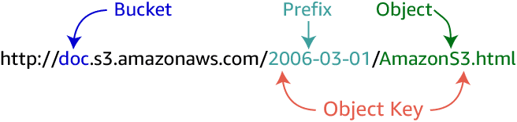

# AWS Note

- [AWS Note](#aws-note)
  - [Quick Look](#quick-look)
  - [Overview](#overview)
  - [Global Infrastructure](#global-infrastructure)
    - [AWS Regions](#aws-regions)
    - [Availability Zones (AZ)](#availability-zones-az)
  - [API Gateway](#api-gateway)
  - [Athena](#athena)
  - [CloudFormation](#cloudformation)
  - [CloudFront](#cloudfront)
  - [CloudWatch](#cloudwatch)
  - [DynamoDB](#dynamodb)
  - [EC2](#ec2)
    - [Amazon Machine Image (AMI)](#amazon-machine-image-ami)
    - [Instance Types](#instance-types)
    - [VPC and Subnet](#vpc-and-subnet)
    - [EBS Volumes](#ebs-volumes)
    - [Security Groups](#security-groups)
    - [Key Pairs](#key-pairs)
  - [Elastic Beanstalk (EB)](#elastic-beanstalk-eb)
  - [ElastiCache](#elasticache)
  - [EMR](#emr)
    - [EMRFS](#emrfs)
  - [IAM (Identity and Access Management)](#iam-identity-and-access-management)
    - [Cognito](#cognito)
  - [Lake Formation](#lake-formation)
  - [Lambda](#lambda)
    - [Lambda Programming Model](#lambda-programming-model)
      - [Triggers](#triggers)
      - [Handler Function](#handler-function)
      - [Execution Models](#execution-models)
  - [Redshift](#redshift)
    - [Redshift Spectrum](#redshift-spectrum)
  - [RDS](#rds)
  - [S3](#s3)
  - [SNS](#sns)
  - [SQS](#sqs)
  - [Step Functions](#step-functions)
  - [Create an Elastic Web Application by Using AWS](#create-an-elastic-web-application-by-using-aws)
  - [Glossary](#glossary)
  - [Tips](#tips)
  - [Questions Collection](#questions-collection)

---

## Quick Look

- API Gateway: Create, public, maintain, monitor, and secure APIs.
- Athena: Interactive query service against data in S3 using standard SQL.
- EMR: A platform providing open source tools.
- Glue: Catalog data, understand the data within your data lake, prepare it, and load it reliably into data stores.
- Kinesis: Ingest streaming data.
- Lake Formation: Set up data lake.
- Redshift: A data warehousing service.
- Redshift Spectrum: Combine data lake and data warehouse, allowing you to query across both spaces.
- S3: Objects or files storage.
- Snowball: Ingest large volumes of on-premises data.

When you consider using Hadoop within AWS, go to Amazon EMR and AWS Glue. 

---

## Overview

Four primary benefits of using cloud services:

- high availability 
- fault tolerant
- scalability
- elasticity


---

## Global Infrastructure

### AWS Regions

Each region is a geographical area, which is a collection of AWS availability zones and data centers. 

Define different services in the same region if you want them to interact.

**By default**, different regions cannot communicate with each other.

How to pick a region? 

- Service availability: Not all AWS services are available in each of the regions.
- Pricing: The cost of an AWS service is different across regions.
- Latency: The service should be close to your customers.
- Compliance: Special type of data needs to be taken care, such as financing info, banking info and health care info.

### Availability Zones (AZ)

- A geographical physical location that holds in AWS **data center**. 
- Each availability zone is geographically separated from the other. 
- Availability Zones in a Region are connected through low-latency links. 
- Multiple availability zones are for redundancy. 

---

##  API Gateway

It is used to create, public, maintain, monitor, and secure APIs.

- Traffic management, authorization, access control, monitoring, and API management. 
- No minimum fees, and startup costs.
- Pay for how much you use.

---

## Athena

Amazon Athena is an interactive query service that makes it easy to analyze data in Amazon S3 using standard SQL. 

- Serverless, no infrastructure to manage. 
- Pay only for the queries that you run.

---

## CloudFormation 

The cloud formation stack helps you configure and maintain your system by provisioning and managing stacks of AWS resources based on a template.

Elastic Beanstalk creates the template for you.

---

## CloudFront

- Global content delivery network (CDN).
- Securely and quickly delivers data, video, applications, and APIs with low latency and high data transfer speeds.
- Global network of edge locations and regional edge caches.
- Ensures that end-user requests are served by the closest edge location: shorter distance = higher performance.
- Not cached? Persistent connections to origin servers for fast fetching.
- Using CloudFront is particularly helpful when performance is vital, especially on media.

Delivery method options:

- Web: for general use
- RTMP: for streaming media

---

## CloudWatch

- Helps with monitoring and management service.
- Provides data and actionable insights to determine health of your system.
- Monitor data in forms of logs, metrics, and events.
- Creates "high-resolution" alarms monitoring such as your costs and S3 buckets, and automated actions.

Workflow example: CloudWatch Alarm -> SNS -> SQS -> Lambda function

CloudWatch has two alarms to monitor loads, and they trigger when the alarms are too high or too low for the auto scaling group.

CloudWatch dashboards show metrics from different AWS resources. Totally customizable. 

---

## DynamoDB

A NoSQL database service for all applications that need consistent, single-digit millisecond latency at any scale. 

The **primary key** is made up of a partition key (hash key) and an optional sort key. 

The **partition key** is used to partition data across hosts for scalability and availability. Choose an attribute which has a wide range of values and is likely to have evenly distributed access patterns.

**DynamoDB triggers** connect DynamoDB streams to Lambda functions. Whenever an item in the table is modified, a new stream record is written, which in turn triggers the Lambda function and causes it to execute.

---

## EC2

Elastic Compute Cloud (EC2): The virtual equivalent of the server computer. VM instance running Amazon Linux or Microsoft Windows Server configured for web apps.

Common uses: 

- As a web hosting server.
- Be good for any type of "processing" activity such as encoding and transcoding.

By default, the EC2 instance will not be able to access the objects in the S3 bucket. 

By default, your EC2 instances are launched using shared hardware.

Basic monitoring: collecting data with 5 mins interval.

If the utilization of CPU is below the baseline of CPU performance, it is accumulating the CPU credits. Having a positive credit balance will allow the EC2 instance to burst above the baseline of CPU performance.

Make sure your EC2 instance has been attached a security group with allowing SSH inbound before you log in the instance from local machine.

### Amazon Machine Image (AMI) 

The first step to launch an EC2 instance is to select an AMI.

### Instance Types

The most popular type: T2

T2 microsize type: 1 virtual CPU, 1 GB RAM.

### VPC and Subnet

Virtual Private Cloud (VPC):  

- A virtual, logically isolated network of your AWS account. 
- Simply an IP range. 
- Your private section of AWS, where you can place AWS resources, and allow / restrict access to them.

Each AWS account has a default VPC.


Subnet: A range of IP addresses in your VPC.

Mapping: 

- VPC - region
- Subnet - availability zone

In networking, the bigger you subnet mask, the smaller the IP range.

How to logically isolate web servers from databases: 

1. Set two subnets in one VPC. One public and one private. 
2. Use public subnet for web servers, which has Internet access.
3. Use private subnet for databases, which does not have Internet access. 

### EBS Volumes

Elastic Block Store (EBS) Volumes: Block level storage volumes for use with EC2 instances.

- Raw, unformatted storage volumes.
- 1 EC2 instance : n volumes. One volume can only be attached to one instance.
- The EBS volume and instance must be in the same AZ.
- EBS volumes persist independently from the life of an instance.

Root volume is used to install OS.

### Security Groups

It is like a virtual firewall for your EC2 instance to control your inbound and outbound traffic.

By default, the same security group does not apply to the other instance. It works on instance level.

**Only allow rules can be specified, no deny rules.**

By default, all outbound traffic is allowed and all inbound traffic is blocked.

Security groups are stateful. If you send a request from your instance, the response traffic for this request is allowed to flow in regardless of inbound security group rules. Since it is part of the connection that was already allowed outbound, the inbound response will be automatically allowed.

When you configuring a security group using the EC2 instance launch wizard, you can only configure the inbound rules.

By default, a rule for SSH has been added for Linux based AMI; a rule for RDP (Remote Desktop Protocol) for Windows based AMI. 

1 EC2 instance : n security groups

### Key Pairs

It is not compulsory to specify a key pair name when launching EC2 instances.

Key pairs are regional. If you create a key pair in one region, you cannot use the same key pair to access the instances that belong to other regions. 

You will not be able to download the key pair again after it is created. The only chance to download it is when creating it before launching the EC2 instance.

---

## Elastic Beanstalk (EB)

EB is used to deploy, monitor, and scale web apps and services quickly and easily.

It will create following components: 

- A EC2 instance.
- Security group: EC2 security configuration for port 80 HTTP ingress only. (needs VPC and does not create it)
- Auto Scaling group: configured to replace an instance if terminated or unavailable.
- S3 bucket: for source code, logs, and other artifacts created for Elastic Beanstalk needs.
- CloudWatch alarms: two to monitor load and triggers when too high or low for the Auto Scaling group.
- Domain name: routes to your web app subdomain.region.elasticbeanstalk.com

How to use: 

1. Select a platform.
2. Upload app or use sample.
3. Run it.

When you delete your app, the S3 bucket will not be deleted automatically. You need to go to "Permissions" of the S3 bucket -> "Bucket Policy", then delete "deny effect of deleting bucket by anyone" -> Save.

EB uses CloudFormation to manage resources.

---

## ElastiCache

A web service that makes it easier to launch, manage, and scale a distributed in-memory cache in the cloud.

help with performance

Cluster engine options:

- Redis
- Memcached (easier to set up)

---

## EMR

Amazon Elastic MapReduce (EMR): A cloud big data platform for processing vast amounts of data using open source tools such as Apache Spark, Apache Hive, Apache HBase, Apache Flink, Apache Hudi, and Presto. 

Amazon EMR is a managed Hadoop framework. Amazon EMR is the AWS service that implements Hadoop frameworks.

**The first principle of data analysis is to separate storage from processing.** Amazon EMR is a perfect example of this principle.

Amazon EMR has the ability to implement two different file systems: 

- HDFS 
- Elastic MapReduce File System (**EMRFS**): an alternative to HDFS.

### EMRFS

No need to copy data into the cluster before transforming and analyzing the data as with HDFS, which can dramatically improve performance of the cluster.

EMR File System can catalog data within an Amazon S3 data lake and from an on-premises Hadoop File System at the same time.

---

## IAM (Identity and Access Management)

- users
- groups
- policies
- rules - services

By default, all users and groups are created with no permissions at all.

**Good practice**: Bond groups and policies, then add users to groups. 

### Cognito 

It offers: 

- User pools: provides sign-up and sign-in options for app users.
- Identity pools: provides AWS credentials to users to access AWS services.

Think of the **user pool** as a database for user accounts that allows them to login and the **identity pool** gets them into the right role to give them permissions into the rest of AWS.

---

## Lake Formation

AWS Lake Formation is 

- a service that makes it easy to set up a secure data lake in days. 
- a service that organizes and curates data within Amazon S3 data lakes. 

It makes it easy to ingest, clean, catalog, transform, and secure your data and make it available for analysis and machine learning. 

It automatically configures underlying AWS services to ensure compliance with your defined policies. 

---

## Lambda

Serverless computing: 

- Pay for what you use.
- Do not need to manage infra.
- Scale services automatically up and down.

When not to use Lambda:

- Extreme real-time responses. (Lambda may take a while to respond.)
- Complex computing with high memory.
- 100% reliability is needed.

Lambda pricing is based on: 

- The number of requests.
- The duration of each request.
- The amount of memory Lambda needs to handle each request.

### Lambda Programming Model

#### Triggers

Examples: 

- API Gateway trigger (the most popular): HTTP request -> API Gateway -> Lambda
- DynamoDB trigger: A record in a specific table is created/deleted/updated -> DynamoDB Streams -> Lambda
- S3 trigger: A file is created/deleted/updated in a specific path or with a specific extension -> S3 -> Lambda
- SQS trigger: A new message arrives at the queue -> SQS -> Lambda
- Kinesis trigger: A new event arrives -> Kinesis stream -> Lambda

#### Handler Function

```javascript 
module.exports.handler = function(event, context, callback) {
  ...
};
```

Handler function: function to be executed upon invocation. `module.exports.handler`

Event object: data sent during invocation. `event`

Context object: methods available to interact with the runtime info. `context`

Callback: return info to the invoker. `callback` (Not mandatory. Not available in all cases.)

#### Execution Models

- synchronous
- asynchronous
- poll/stream based


---

## Redshift

Amazon Redshift is a data warehousing service that lets you set up and deploy a new data warehouse in minutes. 

It is built to store and query datasets ranging from gigabytes to petabytes in size.

Up to 10 times the performance that can be achieved with a comparable, on-prem data warehouse solution.

Amazon Redshift overcomes all of [negatives of traditional DW](https://github.com/lizhanmit/learning-notes/blob/master/data-warehouse-note/data-warehouse-note.md#pros-and-cons). 

Benefits: 

- Faster performance
- 10x faster than other data warehouses
- Easy to set up, deploy, and manage
- Secure
- Scales quickly to meet your needs


### Redshift Spectrum

Redshift Spectrum combines data lake and data warehouse as if they were a single source of data, allowing you to query across both spaces. 

No data movement.

Only analyzing data in data warehouse is a huge limitation in today's data landscape. You can create a data analytics solution that spans structured data in the data warehouse and semi-structured and unstructured data stored in the data lake. 

---

## RDS 

Relational Database Service (RDS):  AWS provisioned database service.

Common uses: 

- Storing customer account information and cataloging inventory.

---

## S3

Simple Storage Service (S3): Basically just a large **"unlimited"** storage bucket.

- Provides **object storage** to store and retrieve any amount of data from anywhere.
- Multiple redundancies and backups of the files.
- An **object** is composed of a file and any metadata that describes that file.
- **Buckets** are logical containers for objects.
- You can have one or more buckets in your account.
- Once objects have been stored in an Amazon S3 bucket, they are given an **object key**. Use this, along with the bucket name, to access the object.
- Every object in Amazon S3 can be uniquely addressed through the combination of the web service endpoint, bucket name, key, and (optionally) version.



Common uses: 

- Mass storage. 
- Long term storage.
- The best place to store all of semistructured and unstructured data.


Three key ways to implement S3:

- Decoupling storage from processing: may have separate buckets for raw data, temporary processing results, and final results.
- Parallelization: running process in parallel.
- Centralized location: providing access for multiple analytic processes at the same time, to avoid costly moving data between storage systems and processing systems.

The benefits of S3:

- Store anything
- Secure object storage
- Natively online, HTTP access
- Unlimited scalability 
- 99.999999999% durability

Tips: 

- To upload a file larger than 160 GB, use the AWS CLI, AWS SDK, or Amazon S3 REST API.
- You can access S3 buckets across regions. But if you are defining something like a lambda that is going to use this bucket, you might want to define it in the same region for performance. 
- You would not want to store sensitive data in a region of another country. 

---

## SNS

Simple Notification Service (SNS)

- topics
- subscribers

Whenever there is a message for SNS on a topic, it pushes it out to all of its subscribers.

SQS can be a subscriber.

You can create notification using S3, e.g. the event that a new file is PUT. Then the message flow: S3 -> SNS -> SQS -> Lambda function that processes the message.

---

## SQS

Simple Queue Service (SQS): a reliable, scalable, fully-managed message queuing service.

- Send, store, and receive messages between apps and software components. 
- Decouple and scale better.
- User server side encryption (SSE) and Key Management Service (KMS) for security.

Two types of queues: 

- Standard: maximum throughput, best-effort ordering (not guaranteed the order), at-least-once delivery
- FIFO: processed exactly once, in order

Example: A Lambda function that can process messages. Configure trigger for the Lambda function on queue when the message is ready and send the message via message body and its attributes. And you can watch that through CloudWatch Logs.

SNS + SQS = Kafka

---

## Step Functions

It makes it easy to coordinate the components of distributed applications as a series of steps in a visual workflow. You can quickly build and run state machines to execute the steps of your application in a reliable and scalable fashion.

Based on concepts of tasks and state machines.

Tasks: Code (Lambda) or activity (waits for operator to perform sth.)

State machines are made up of states, their relationships, and the input and output defined by the Amazon States Language.

States make decisions based on input, perform actions, and pass output to other states.

Step Function examples: 

- Syncing/backing up S3 buckets
- Email verification/confirmation/authorization of process
- Scaling image automation

---

## Create an Elastic Web Application by Using AWS


公网对外，私网对内。 私网不能直接访问公网，需通过NAT（相当于router）。

---

## Glossary 

- ARN: AWS Resource Name
- IdP: Identity Provides and Federation 
- STS: Security Token Service
- WIF: Web Identity Federation 

---

## Tips

Clean up resources from the top as much as possible, especially with CloudFormation stacks. 

---

## Questions Collection 

Q: In IAM, which areas need to be considered with restriction and access?

A: Computing, Storage, Database, and App services. 

---

Q: There are tow ways to create a User Pool. What are they?

A: Review defaults and Step through settings. 

---

Q: What is Anonymous Access?

A: It creates Identity pools for you. 