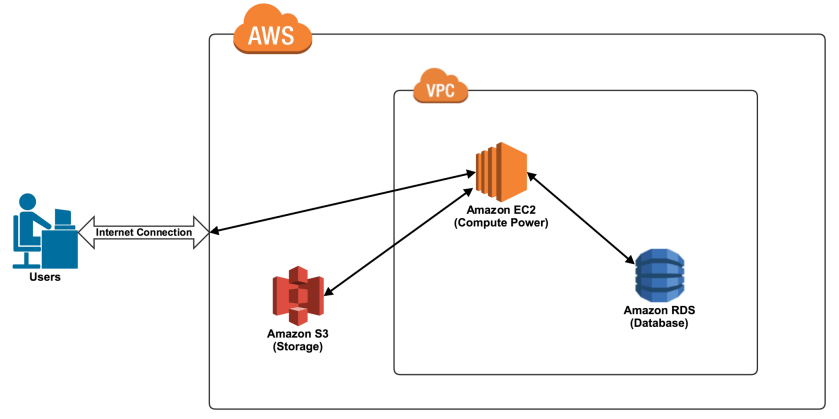
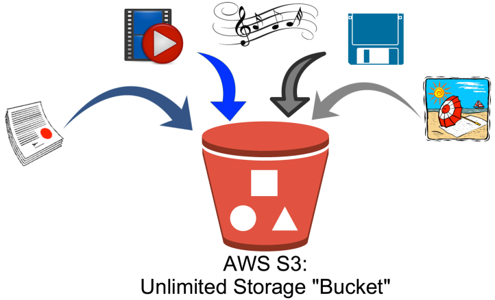
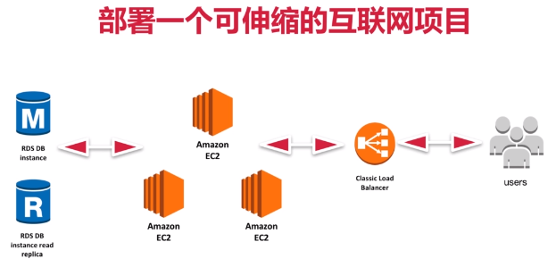

# AWS Note

## Overview

Four primary benefits of using cloud services:

- high availability 
- fault tolerant
- scalability
- elasticity

---

## Global Infrastructure

**AWS region**: 

- Each region is a geographical area, which is a collection of AWS availability zones and data centers. 

Define different services in the same region if you want them to interact.

**Availability zone**: 

- A geographical physical location that holds in AWS **data center**. 
- Each availability zone is geographically separated from the other. 
- Multiple availability zones are for redundancy. 

---

## DynamoDB

A NoSQL database service for all applications that need consistent, single-digit millisecond latency at any scale. 

The **primary key** is made up of a partition key (hash key) and an optional sort key. 

The **partition key** is used to partition data across hosts for scalability and availability. Choose an attribute which has a wide range of values and is likely to have evenly distributed access patterns.

---

## EC2

**Elastic Compute Cloud** (EC2): It is the virtual equivalent of the server computer.

Common uses: 

- As a web hosting server.
- Be good for any type of "processing" activity such as encoding and transcoding.

---

## IAM

**Good practice**: bond groups and policies, then add users to groups. 

- users
- groups
- policies
- rules - services

ARN: AWS Resource Name

### Cognito 

It offers: 

- User pools: provides sign-up and sign-in options for app users.
- Identity pools: provides AWS credentials to users to access AWS services.

---

## Lambda

serverless

---

## RDS 

**Relational Database Service** (RDS):  AWS provisioned database service.

Common uses: 

- Storing customer account information and cataloging inventory.

---

## S3

**Simple Storage Service** (S3): Basically just a large "unlimited" storage bucket.

- Provides object storage.
- Multiple redundancies and backups of the files.

Common uses: 

- Mass storage. 
- Long term storage.

To upload a file larger than 160 GB, use the AWS CLI, AWS SDK, or Amazon S3 REST API.

---

## VPC

**Virtual Private Cloud** (VPC):  Your private section of AWS, where you can place AWS resources, and allow / restrict access to them.

---

## Create an Elastic Web Application by Using AWS

公网对外，私网对内。 私网不能直接访问公网，需通过NAT（相当于router）。