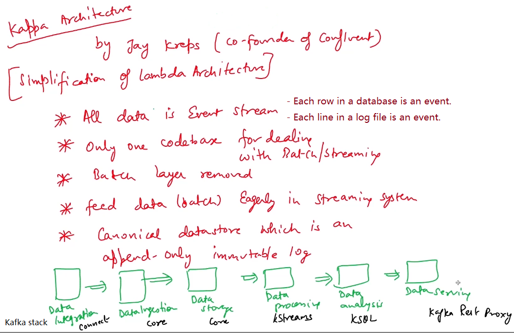

# Big Data Architecture Note

- [Big Data Architecture Note](#big-data-architecture-note)
  - [Holistic View of Architectures and Pipelines](#holistic-view-of-architectures-and-pipelines)
    - [Big Data Logical Architecture](#big-data-logical-architecture)
    - [Key Big Data Architectures](#key-big-data-architectures)
      - [Lambda Architecture](#lambda-architecture)
      - [Kappa Architecture](#kappa-architecture)
    - [Typical Big Data Batch Pipeline](#typical-big-data-batch-pipeline)
    - [Typical Big Data Streaming Pipeline](#typical-big-data-streaming-pipeline)
      - [Examples](#examples)
  - [Key Data Processing Frameworks](#key-data-processing-frameworks)
    - [Spark VS Flink](#spark-vs-flink)
  - [Rule of Thumb](#rule-of-thumb)
  - [Types of Data Architecture](#types-of-data-architecture)
  - [Data Serving Layer](#data-serving-layer)
  - [Case Study](#case-study)
    - [Log Monitoring](#log-monitoring)
    - [IoT Sensor Data](#iot-sensor-data)
    - [Media and Behavioral Analytics](#media-and-behavioral-analytics)
    - [HR Tech and Recruitment](#hr-tech-and-recruitment)
  - [Real-Time Applications](#real-time-applications)
    - [Social Media Sentiment Analysis](#social-media-sentiment-analysis)
      - [Problem](#problem)
      - [Solution](#solution)
      - [Technologies](#technologies)
        - [Stream Processing](#stream-processing)
        - [Streaming Message Queues](#streaming-message-queues)
        - [Real-Time Subscribers](#real-time-subscribers)
        - [Sentiment Analysis Engine](#sentiment-analysis-engine)
        - [Message Database](#message-database)
      - [Best Practice of Real-Time Streaming](#best-practice-of-real-time-streaming)
    - [Payment Fraud Detection](#payment-fraud-detection)
      - [Problem](#problem-1)
      - [Solution](#solution-1)
      - [Technologies](#technologies-1)
        - [Machine Learning](#machine-learning)
      - [Best Practices of Predictive Analytics](#best-practices-of-predictive-analytics)
    - [E-Commerce Product Recommendations](#e-commerce-product-recommendations)
      - [Problem](#problem-2)
      - [Solution](#solution-2)
      - [Technologies](#technologies-2)
        - [Recommendation Service](#recommendation-service)
        - [In-Memory Database](#in-memory-database)
      - [Best Practices of Parallel Processing](#best-practices-of-parallel-processing)
    - [Mobile Couponing](#mobile-couponing)
      - [Problem](#problem-3)
      - [Solution](#solution-3)
      - [Technologies](#technologies-3)
        - [User Preferences \& Location Services Databases](#user-preferences--location-services-databases)
        - [Mobile Gateway](#mobile-gateway)
      - [Best Practices of Pipeline Management](#best-practices-of-pipeline-management)

---

[(Oreilly Learning course: Big Data for Architects)](https://learning.oreilly.com/videos/big-data-for/9781801075596/)

## Holistic View of Architectures and Pipelines

### Big Data Logical Architecture

Key points: 

- Impala does not reply on Yarn. 

### Key Big Data Architectures

#### Lambda Architecture

Lambda architecture is a popular technique where records are processed by a batch system and streaming system in parallel. The results are then combined during query time to provide a complete answer. 

The key **downside** to this architecture is the development and operational overhead of managing two different systems. 

#### Kappa Architecture

### Typical Big Data Batch Pipeline

### Typical Big Data Streaming Pipeline

When there are many data sources, data integration can be a separate process. 

Kafka can be used for long-term storage with fault tolerance. 

#### Examples

## Key Data Processing Frameworks

### Spark VS Flink

CEP: Complex Event Processing

---

[(Udemy course: Every (big) data architecture is the same)](https://www.udemy.com/course/every-data-architecture-is-the-same/)

## Rule of Thumb

As a rule of thumb, try to minimize choices of everything (or the amount of components in the architecture such as databases, processing tools, jobs etc.) as much as possible. But do not overdo it.

A good data architect is one that standardizes as much as possible but does not lose pragmatism. 

## Types of Data Architecture 

- BI-like towards OLAP/Data Warehouse
- Data lake in big data science
- Lambda architecture: Batch and stream processing use different toolings.
- Kappa architecture: Batch and stream processing use the same tooling.
- Data mesh: Domain-driven, without moving source, ETL or storage to a centralized place. Highly focused on OLAP/Data Warehouse-type of applications.
  - Core principles: 
    - Data infrastructure as a service
    - Decentralized data storage and processing. Every domain is responsible for their own logic.
    - Treat decentralized data hubs/domains as a microservice on its own.
    - Connect data hubs with each other in whatever way necessary. (This creates the actual mesh.)

## Data Serving Layer 

Two scenarios of serving data:

- Explorational: Applications that are not business critical. 
  - Dashboarding 
  - Monitoring 
  - Sale figures
- Operational: Applications that are business critical. 
  - Recommendation
  - Fraud detection 
  - Real-time bidding when buying and selling stocks

Tools: 

- Traditional BI tools, e.g. Power BI, Tableau, Qlik Viewer.
- Big data-capable tools, e.g. Kibana.

Considerations: 

- IAM (Who can access what data)
- Security
- Auditability

## Case Study

### Log Monitoring

Background: 

- Large consumer electronic and devices brand. 
- Devices and IT systems all generate logs.
- Logs are low-level in different shapes and formats, internal and external systems.

Goal: Set up a central data hub that filters, analyzes and makes these logs available for monitoring and alerting. 

Constraints: 

- Infrastructure on AWS.
- Use managed services as many as possible.
- Most log sources cannot be modified.
- Data is not well-known so exploration is needed.
- Splunk is the operational tool used by business.

Data architecture design: 

- Different tools can be used for source data ingestion from various source systems such as API Gateway, Lambda pull, Splunk HK and so forth. 
- Data is ingested into Kinesis Firehose firstly. 
- Then get data from Kinesis Firehose and save to data lake. At the same time, tag data with source system and timestamp.
  - S3: Raw data. 
  - DynamoDB: Integrated storage.
- Use Spark to build integrated ETL data pipeline to process raw data and save to integrated storage.
- Move data from integrated storage to Athena where data analysts and scientists can do analysis. Another S3 is also provided to them as playground for uploading data themselves. 
- Spark integrated ETL saves data to Kinesis Data Streams, which is regarded as data serving layer. 
- Kinesis Data Streams can be integrated with Splunk HEC which allows business users to consume data, or other AI/ML vendor tools.

### IoT Sensor Data

Background: 

- Ship engine builder company.
- IoT collectors on vessels.
- Connectivity of source systems is problematic.
- Deadbanded data.

Goal: Onboard and collect data of all sensors into a data lake. Implement use cases on top of the data.

Constraints: 

- Infrastructure on AWS, in early days, not all managed services were mature enough.
- Teams were split into data engineers and scientists.
- Deploying updates to data collectors was problematic as they live on ferrying ships.

Data architecture design: 

- Use Kinesis or Snowball for data ingestion. 
- Data is ingested into Kinesis Data Streams firstly. Not able to use Kinesis Firehose as it was unavailable at that time. 
- Then get data from Kinesis Data Streams and save to data lake. At the same time, tag data with source system and timestamp.
  - S3: Raw data. 
  - DynamoDB: Integrated storage.
- Use Spark to build integrated ETL data pipeline to process raw data and save to integrated storage.
- Get data from integrated storage to build use cases such as uptime tracking, anomaly detection, and predictive maintenance. Then save output data to use case specific storage. 
- At data serving layer, alerting and monitoring applications consume use case data. In addition, Qlik View enables business users to get insights into sensors based on integrated storage.

### Media and Behavioral Analytics

Background: 

- Large media brand.
- Products are magazines, TV, online news and offline events.
- Existing data infrastructure is obsolete. 
- Main business model: advertising. 

Goal: Replace the obsolete data infrastructure with a future-proof one in limited time, with limited budget and team.

Constraints: 

- Infrastructure on AWS.
- GDPR needs attention because of personal data involved.
- Online and offline data needs to be combined. 
- Integration with the existing systems (Xandr, DMPs (Data Management Platforms), CMS (Content Management Systems), etc.).
- No team yet, need to hire.

Data architecture design: 

- Use API Gateway to ingest data from CMS. In daily dump manner, ingest data of visitors of offline events, magazines and subscription information from SAS. Build a pixel server to collect pixel data on website (user behaviors). 
- For data from CMS, build Spark Streaming real-time NLP enrichment pipeline to process it, and then save result in Postgres RDS in data lake. 
- For data from pixel server, ingest into Kinesis. Use Spark Streaming to do real-time user profiling analysis, and then save result of new profiles or changes to the existing profiles in MongoDB in data lake. Use Spark Streaming to do real-time content statistics analysis, and then save result in Postgres RDS in data lake. Between the pixel server and MongoDB, there is a cache that can be used bidirectionally - collecting data from and recommending content to end users. 
- For data from SAS, it is ingested into S3 in data lake. 
- Use Spark to build integrated ETL data pipeline to process data from S3, MongoDB and Postgres RDS, and then save back into MongoDB in data lake. 
- In data serving layer, some of the outputs are saved into in DMP for advertising. Others are saved into Athena and Qlik View for monitoring by business users about like how often people read specific articles to give editors an idea how good their articles are performing compared with others, or how many advertisements have been sold.

### HR Tech and Recruitment 

Background: 

- 

Goal:

Constraints: 

Data architecture design: 

---

[(LinkedIn Learning course: Architecting Big Data Applications: Real-Time Application Engineering)](https://www.linkedin.com/learning/architecting-big-data-applications-real-time-application-engineering)

## Real-Time Applications

Real-Time

- As the response time expectations get higher, or the target response times get lower, the cost increases exponentially.
- Go as high as possible for the response time value without impacting user experience or application effectiveness.

Synchronous vs. Asynchronous Pipelines

Strategies

- Use asynchronous pipelines wherever possible.
- **DO NOT** use synchronous pipelines unless absolutely required.
- Build horizontally scalable systems that maximize **parallel processing**.
- Use **buffering queues** between producers and consumers to adjust for differences in throughput.
- Service components in the architecture should be **stateless**.
- If state needs to be stored, use database, in memory data grids or clusters.
- Every request in a real-time pipeline has a time to live, after which, it goes stale or out of context. Monitor it and drop the request if it exceeds.

### Social Media Sentiment Analysis

#### Problem

Business needs an overall real-time (a few minutes) tracking board and list of negative posts and posters.

Goals:

- real-time monitoring: a few minutes
- horizontal scalability for future growth in posts and additional analytics
- real-time summary for the overall social media sentiment
- capability to add more social media channels

#### Solution

- You can create separate subscription threads for each of the hashtags.
- Use one single Kafka topic.
- The number of Spark and Kafka partitions should be the same.
- Each post can be processed independently.
- Use map operations to cleanse text.
- Use sentiment analysis engine.
- Use reduce to summarize tweets by sentiment.
- Keep batch intervals as high as possible.

#### Technologies

##### Stream Processing

##### Streaming Message Queues

- :negative_squared_cross_mark: RabbitMQ

- :negative_squared_cross_mark: Apache ActiveMQ

- :white_check_mark: Apache Kafka (choose this one because of excellent integration with Apache Spark)

The above three have equivalent capabilities.

##### Real-Time Subscribers

- Build customized subscribers to subscribe to messages in real time, and then push them to Kafka.

##### Sentiment Analysis Engine

- Build a web service (application) based on Python libraries (NTLK package).
- Scale by using multiple web servers behind a load balancer.

##### Message Database

- MySQL can easily handle 100,000 records per day.
- If the number of records increases in the future, you may need to use NoSQL.  

#### Best Practice of Real-Time Streaming

- Different streaming products offer different kinds of guarantees like only once, at least one and at most once.
- Requery data from an earlier point if failures happen.
- Decouple the publishers and the subscribers.
- Redundacny to support failover.
- Should be horizontally scalable.

### Payment Fraud Detection

#### Problem

When a customer buys online, your business wants to determine fraud before order shipment.

Goals:

- real-time: within minutes
- asynchronous
- predictive analysis
- enable human review of fraudulent transactions

#### Solution

- In order to have minimum or no backlog at all times, you can create enough partitions on Kafka and Spark to de-queue at the speed messages are queued.
- Load the data science model in each of the partitions in Spark.
- Keep the prediction model loaded and stored in Spark broadcast variables, which will automatically distribute the model to all the partitions and will avoid frequent network traffic.
- Predict in map operations as each transaction is independent.
- The number of Spark and Kafka partitions should be the same.

#### Technologies

##### Machine Learning

#### Best Practices of Predictive Analytics

- Should be possible to run predictions on a number of transactions simultaneously and easily scalable.
- Keep the prediction process as asynchronous as possible.
- Measure and benchmark prediction times.
- Benchmark user response times during synchronous predictions.

### E-Commerce Product Recommendations

#### Problem

Your business wants to recommend products in real time (a few seconds) while the user is browsing your e-commerce website.

- Recommendation based on the product currently being viewed.
- Recommendation based on the clickstream during the current browsing session.

Goals:

- real-time: a few seconds
- context specific
- scalable to support thousands of online users simultaneously

#### Solution

- Combine two kinds of recommendations to give a consolidated list of products.
- Each event is handled and predicted and the in-memory database is accessed inside the map function to ensure parallelism.
- Adopt asynchronous recommendation.
- Purge old data once session expires.

#### Technologies

##### Recommendation Service

- Should be stateless.
- Any state should be stored in the central in-memory database.

##### In-Memory Database

- Use in-memory database to store current user, session and recommendations.

#### Best Practices of Parallel Processing

- Store all data including session state in a central database, which should be able to scale horizontally.
- Services should be stateless.
- Deploy multiple recommendation services behind a load balancer.
- Spend time learning and designing partition management.
- Data processing should be done in map operations as much as possible to ensure parallelism.
- Reduced operations should be kept to a minimum and should be in the last stage.

### Mobile Couponing

#### Problem

- Your business pushes mobile couponing to customers' mobile phones depending on the location they are currently in and based on their past buying behaviors and preferences.
- Your business gets paid only if customers use the coupons.
- Customers have your mobile app installed on their mobile phones.

Goals:

- real-time: a few seconds
- location specific
- user-based recommendations
- scalable to support hundreds of thousands of active mobile phones

#### Solution

- The mobile gateway should be horizontally scalable and capable of processing multiple requests in parallel.
- The recommendations should be queried and decided within map operations so that the work is distributed amongst Spark partitions.
- Coupon queue will have a smaller load since not all location information coming in will find coupon matches.

#### Technologies

##### User Preferences & Location Services Databases

##### Mobile Gateway

- Should be stateless.
- Should be horizontally scalable.
- Coupons have a time to live (TTL): a few seconds, as the user could have moved to another location when the coupons finally arrive.
- Drop coupons if their TTL expires.

#### Best Practices of Pipeline Management

- Use cluster managers (Yarn or Mesos) for
  - monitoring cluster health
  - scheduling jobs
  - job management
  - failover
  - scaling with additional nodes
  - reporting of cluster health
  - backlog tracking
