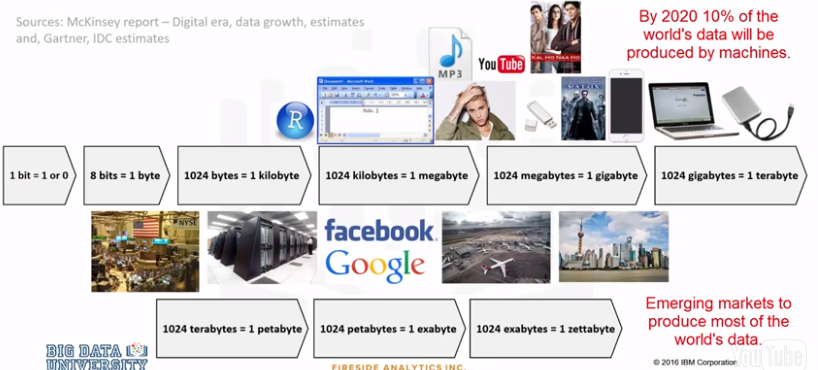
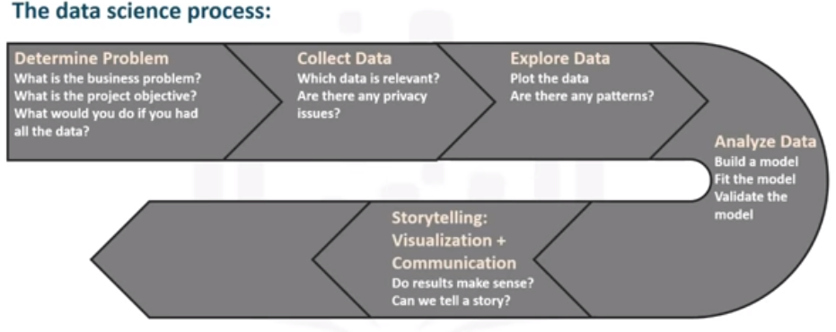
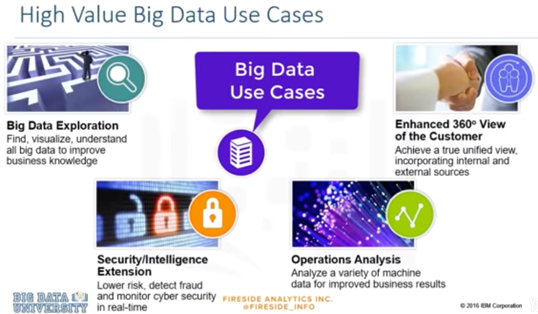
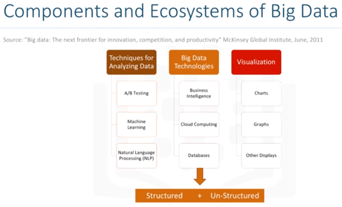
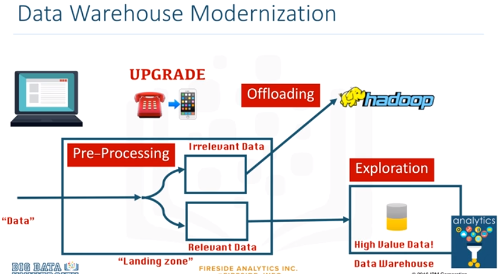
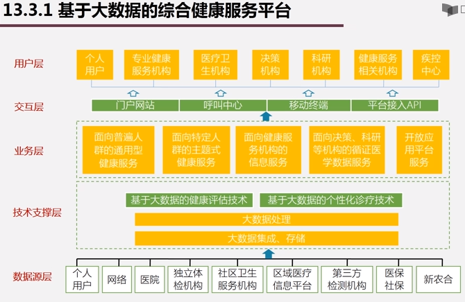
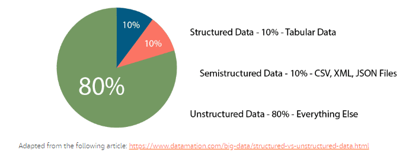

# Big Data Basics Note

---

---

---

---

---

---

Big questions:  

- What products do our customers like to buy? 
- Are the most viewed products also the most sold? (or for other scenarios, the most searched for, the most chatted about…)  
- Which products are most commonly purchased together? 

---

In-memory computing offers very high bandwidth - 10 GB/second, compared to a hard disk's 200 MB/second.

---

## Big Data Basics

Big data pain points: 

- I/O bottleneck
- network bottleneck
- data shuffling 
- processing time

Big data challenges / characteristics - 5 Vs: 

- volume
- velocity
- variety 
- veracity 
- value

Not all organizations experience challenges in every area. 

Key aspects of a big data platform:

- integration 
- analysis
- visualization 
- workload optimization 
- security 
- governance 

Big data types:

---

## Data Processing

### Batch Processing

Two forms: 

- Scheduled: 
  - Very large volume of data.
  - Regular schedule—hourly, daily or weekly.
  - Generally the same amount of data each time.
  - Workloads are predictable.
- Periodic:
  - At random times, on-demand.
  - Often run once a certain amount of data has been collected.
  - Workloads are unpredictable and hard to plan around.

You often use a single application to collect, process, and temporarily store data while it is processing.

### Stream Processing

Two forms: 

- Real time: 
  - Within milliseconds.
- Near-real time: 
  - Within minutes.
