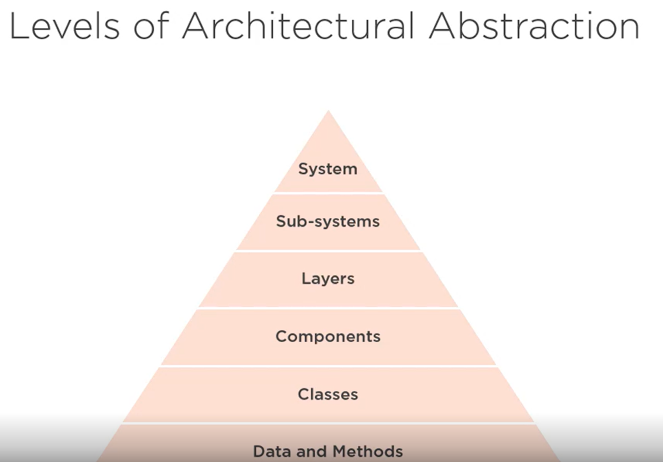
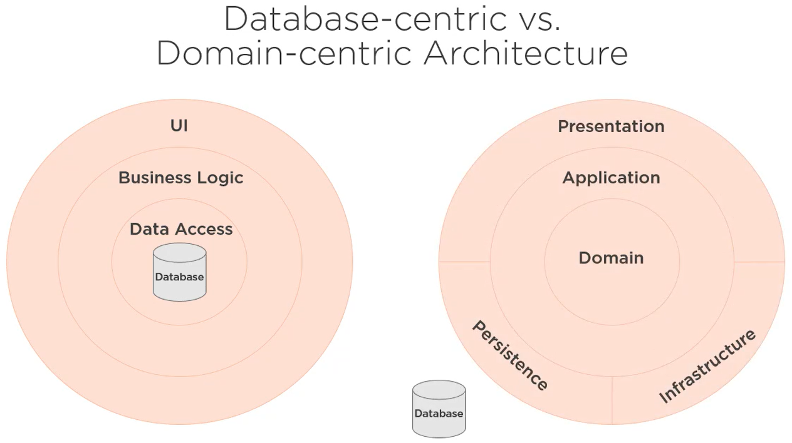
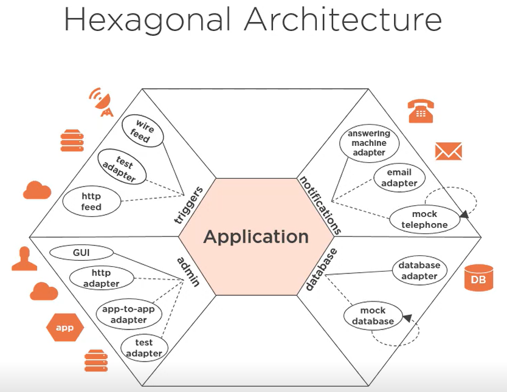
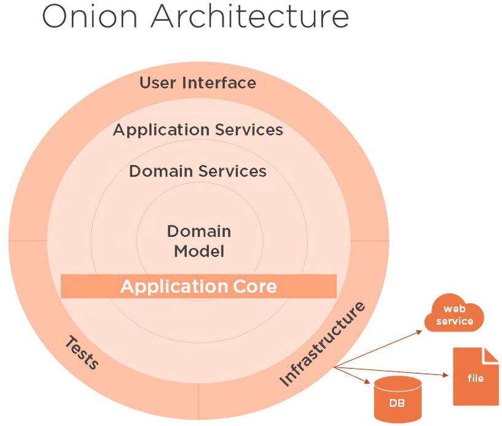
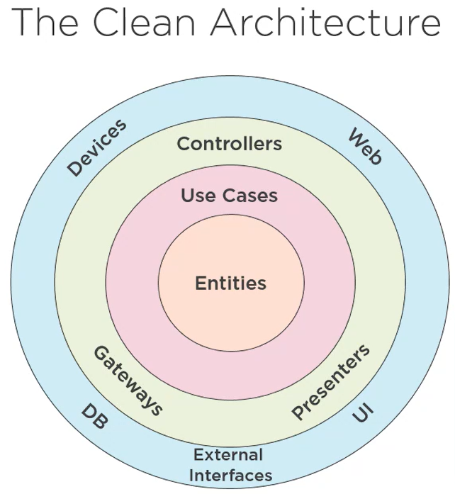

# Clean Architecture Note

(Pluralsight course: [Clean Architecture: Patterns, Practices, and Principles](https://www.pluralsight.com/courses/clean-architecture-patterns-practices-principles))

- [Clean Architecture Note](#clean-architecture-note)
  - [Introduction](#introduction)
  - [Domain-centric Architecture](#domain-centric-architecture)

## Introduction 

Bad architecture: 

- Complex (due to accidental complexity rather than necessary complexity)
- Incoherent 
- Rigid
- Brittle
- Untestable 
- Unmaintainable 

Good architecture: 

- Simple
- Understandable 
- Flexible 
- Emergent 
- Testable 
- Maintainable 

**Clean architecture: Architecture that is designed for the inhabitants (users and developers) of the architecture, not for the architect or the machine.**

- Focus on the essential. 
- Build only what is necessary. 
- Optimize for maintainability. 

**Avoid premature optimization which is the root of all evil in software development.**

When making decisions: 

- Context is king in the land of architecture. 
- All decisions are a tradeoff.
- Align with business goals.

Ultimate goal of an architect: 

- Minimize cost. 
- Maximize business value. 
- Maximize a return-on-investment (ROI) of the software project as a whole. 

## Domain-centric Architecture 

> "The first concern of the architect is to make sure that the house is usable. It is not to ensure that the house is made of brick." - Uncle Bob

Pros: 

- Focus on domain 
- Less coupling 
- Allow for Domain Driven Design 

Cons: 

- Change is difficult 
- Require more thought
- Initial higher cost 

Three types of domain-centric architecture: 

