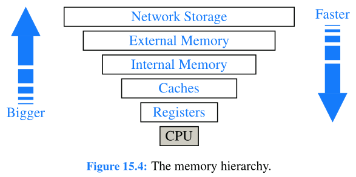

# Computer Science Note

## Memory Management

### Memory Systems

During the execution of a program, data is routinely copied from one level of the hierarchy to a neighboring level, and these transfers can become a computational bottleneck.

### Caching Strategies

Access times for internal memory can be as much as 10 to 100 times longer than those for cache
memory. (External memory 100,000 to 1,000,000 times longer than those for internal memory.)

**Caching**: Bringing data into primary memory.

**Blocking**: If data stored at a secondary-level memory location ℓ is accessed, then we bring into primary-level memory a large block of contiguous locations that include the location ℓ.

Primary-level memory is much smaller than secondary-level memory.

**Cache lines**: Blocks in the interface between cache memory and internal memory.

**Pages**: Blocks in the interface between internal memory and external memory.

#### Cache Replacement Policies

- Random: easiest, O(1) time.
- First-in, first-out (FIFO): simple, uses a queue Q to store references to the pages in the cache. O(1) time, extra space.
- Least recently used (LRU): uses a priority queue Q that supports updating the priority of existing pages, which can be implemented with a linked list, **less attractive from a practical point of view**. O(1) time, extra space.

Comparison:

From a **worst-case** point of view, the FIFO and LRU are almost the **worst**, which require a page replacement on every page request.

(better) LRU > FIFO > Random