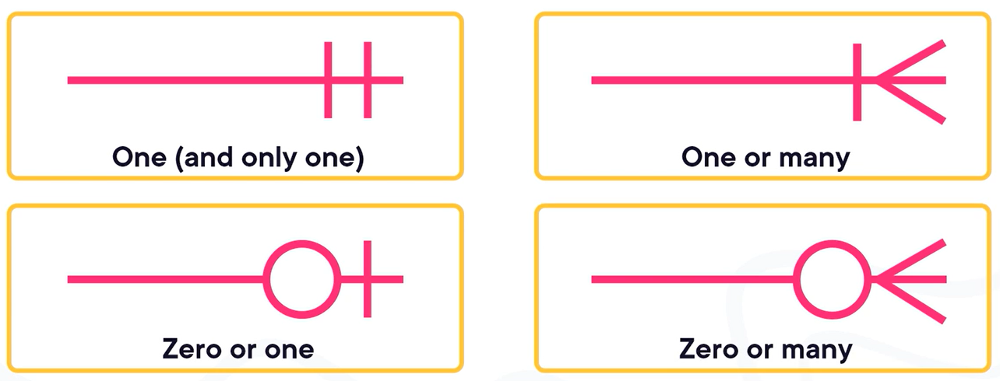
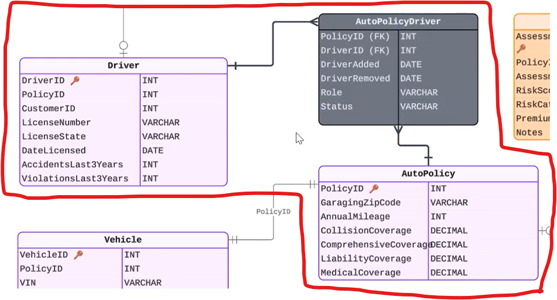

# Data Modeling Note

- [Data Modeling Note](#data-modeling-note)
  - [Conceptual Data Modeling](#conceptual-data-modeling)
  - [Logical Data Modeling](#logical-data-modeling)
    - [Many-to-Many Relationships](#many-to-many-relationships)
    - [Supertype and Subtype Relationships](#supertype-and-subtype-relationships)
    - [Documentation Artifacts](#documentation-artifacts)
      - [Data Dictionary](#data-dictionary)
      - [Relationship Matrix](#relationship-matrix)
      - [Business Rule Catalog](#business-rule-catalog)
    - [Data Normalization](#data-normalization)
    - [Denormalization](#denormalization)
    - [Logical Model Readiness Check](#logical-model-readiness-check)
  - [Physical Data Modeling](#physical-data-modeling)

---

Conceptual -> Logical -> Physical data modeling 

- Conceptual: "Big picture" view of business concepts 
- Logical: Technical detail without database specifics. 
- Physical: Implementation detail with database specifics.

## Conceptual Data Modeling

Conceptual data model is used to answer questions:  

- What are the key concepts in our business? 
- How to they relate to one another?

Conceptual Entity Relationship Diagram includes: 

- Entities (e.g., customer, policy, claim)
- Relationships with or without cardinality 

Cardinality defines how many of one thing can be associated with how many of another.

Crow's foot notation:

Cardinality symbols: 

## Logical Data Modeling

Logical data model is used to answer questions:  

- What data, which tables, how do tables link together? 

Logical Entity Relationship Diagram includes: 

- Entities (e.g., customer, policy, claim)
- Relationships with cardinality 
- Attributes
- Data types
- Primary keys
- Foreign keys 

Natural key: Real-world ID that already exists in the organization. 

Surrogate key: System-generated ID with no business meaning. 

### Many-to-Many Relationships 

Relational databases do not support many-to-many relationships without junction tables. 

Junction tables: 

- Represents the relationship itself as a table. 
- Contains foreign keys to both related tables. 
- Turns many-to-many into two one-to-many relationships. 

Example:

### Supertype and Subtype Relationships 

Option 1: Separate subtype tables

- Separates shared data from type-specific details.
- Shared data is stored once.
- Each type has a clear structure.
- Type-specific rules are easier to enforce.
- Introduces complexity with more tables.
- **When to choose:** Subtypes are often separated when they differ significantly, data quality and rules matter, and the system will evolve over time. 

Option 2: Single table

- Store all data in a single table.
- Simple – queries only need to reference a single table, no joins.
- Low scalability - many columns are null for most rows.
- Business rules are harder to enforce.
- Table becomes cluttered.
- **When to choose:** Using a single table works best when types are very similar, type-specific attributes are minimal, and reporting simplicity is a priority. 

### Documentation Artifacts

#### Data Dictionary

| Table name | Column name | Data type | Required (Yes/No) | Description | Allowed values | Example values |
|---|---|---|---|---|---|---|

#### Relationship Matrix

| Cardinality | Business meaning |
|---|---|
| 1 to Many | ... |
| 1 to 1 | ... |

#### Business Rule Catalog 

| Rule ID | Rule description |
|---|---|
| BR-01 | ... |
| BR-02 | ... |

### Data Normalization

Data normalization: The process of structuring tables so that each fact is stored once, in the most appropriate place.

Normalization often increases the number of
tables and relationships. Queries may require more joins. This trade-off is expected and acceptable at the logical level which prioritizes accuracy and clear business meaning over query simplicity.

### Denormalization

Denormalization is the deliberate duplication
of data for a specific purpose. 

At the logical modeling stage

- Denormalization should be minimal.
- Duplicated data should be intentional.
- The reason for duplication should be
documented.

### Logical Model Readiness Check

- All business rules are captured.
- Data types and constraints are selected.
- Keys and relationships are defined.

## Physical Data Modeling

One logical model can support multiple
physical designs, such as:

- Transactional relational database
- Analytical warehouse
- Reporting layer

Within physical models, you will define:

- Indexing strategies
- Partitioning
- Storage formats

