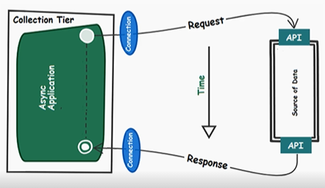

# Data Stream Development with Apache Spark, Kafka, and Spring Boot Note 

Use case: Analyzing Meetup RSVPs in Real-Time.

## Data Collection Tier 

Collection tier is built as a Spring Boot application that uses the Spring WebSocket API to communicate with the Meetup RSVP WebSocket endpoint.

### Interaction Patterns 

Interaction between data collection tier and data streaming API.

#### Request Response Pattern 

- Request response pattern (sync): This is a proper choice only when the potential delay is acceptable. For example, browse the web (navigate on Internet). Advantage: easy to implement.

- Client-async request response variation (half-async): The application can perform other tasks between a request-response cycle. This pattern is useful if your collection tier performs some extra tasks that are independent of the current request. It is **recommended** to rely on a framework that comes with asynchronous support, such as Netty, Play, or Node.js. Mainly, this will simplify and speed up the implementation time. 

- Full-async request response variation: 
In modern applications, this is preferable. It is **recommended** to rely on frameworks that comes with asynchronous capabilities.

#### Request Acknowledge Pattern 

No response is needed. 

Acknowledgement that the request was received successfully is needed. 

Acknowledgement can be eventually/optionally used for further requests. 

#### Pub/Sub Pattern 

Extremely used pattern in message-based data systems. 

#### One Way (Fire-and-Forget-Message) Pattern

This is useful when a system can trigger a request without expecting a response.

Relies only on requests. 

No responses. 

Useful when losing some data is acceptable. 

Example: sensors emitting data very fast (millisecond level).

#### Stream Pattern 

The collection tier triggers a single request to the data streaming API. This will result in a persistent connection between them. Further, the collection tier will consume the data as a stream, or, in other words, the response is a continuously flow of data.

For the use case, this is the interaction pattern that will be used for Meetup RSVPs.

###  Protocols For Ingesting Data

