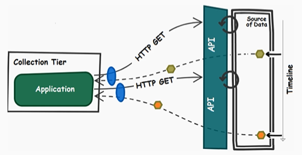

# Data Stream Development with Apache Spark, Kafka, and Spring Boot Note 

**Use case: Analyzing Meetup RSVPs in Real-Time.**

## Data Collection Tier 

Collection tier is built as a Spring Boot application that uses the Spring WebSocket API to communicate with the Meetup RSVP WebSocket endpoint.

### Interaction Patterns 

Interaction between data collection tier and data streaming API.

#### Request Response Pattern 

- Request response pattern (sync): This is a proper choice only when the potential delay is acceptable. For example, browse the web (navigate on Internet). Advantage: easy to implement.

- Client-async request response variation (half-async): The application can perform other tasks between a request-response cycle. This pattern is useful if your collection tier performs some extra tasks that are independent of the current request. It is **recommended** to rely on a framework that comes with asynchronous support, such as Netty, Play, or Node.js. Mainly, this will simplify and speed up the implementation time. 

- Full-async request response variation: 
In modern applications, this is preferable. It is **recommended** to rely on frameworks that comes with asynchronous capabilities.

#### Request Acknowledge Pattern 

No response is needed. 

Acknowledgement that the request was received successfully is needed. 

Acknowledgement can be eventually/optionally used for further requests. 

#### Pub/Sub Pattern 

Extremely used pattern in message-based data systems. 

#### One Way (Fire-and-Forget-Message) Pattern

This is useful when a system can trigger a request without expecting a response.

Relies only on requests. 

No responses. 

Useful when losing some data is acceptable. 

Example: sensors emitting data very fast (millisecond level).

#### Stream Pattern 

The collection tier triggers a single request to the data streaming API. This will result in a persistent connection between them. Further, the collection tier will consume the data as a stream, or, in other words, the response is a continuously flow of data.

**For the Meetup RSVPs use case, this is the interaction pattern that will be used.**

###  Protocols For Ingesting Data

#### Webhooks 

Webhook protocol relies on registering callbacks. 

Sometimes, step 1 is done manually by users filling up the needed information on a website, e.g. configuring Jenkins webhook on GitHub website.

Disadvantages: 

- The latency of data going over HTTP is average.
- Since it relies on HTTP POST request, it is not a good fit for high rate of updates. 
- This protocol is unidirectional, always from the streaming API to the collection tier, which means that supporting fault tolerance will be an issue. For example, we cannot acknowledge the streaming API that received the data.

Conclusion: this protocol has **low efficiency**. 

#### HTTP Long Polling

HTTP Long Polling holds each connection open till there is an update.

Advantages: 

- This protocol supports higher rate than Webhook protocol, like chat applications.

Disadvantages: 

- The latency of data going over HTTP is average.
- Since it relies on HTTP, it is not a good fit for high rate of updates. 
- Overhead of closing the connections and the collection tier has to reopen them.

Conclusion: Considering the rise of asynchronous programming in client side, this protocol has **average efficiency**.

#### Server-Sent Events

Client connects to the server side.

Server side can push data the the client until the client closes the connection.

Advantages: 

- Since the network is used in a more efficient way, this protocol supports higher rate than HTTP Long Polling protocol.

Disadvantages: 

- Server-Sent Event is a unidirectional protocol based on HTTP. Average latency.
- No fault tolerance support. 

Conclusion: Good performance. Allows us to provide a more resilient API. **High efficiency**.

#### Server-Sent Events Push Proxy Variation 

Useful for mobile devices in order to save battery. 

Mobile delegates a proxy server to hold the connection open. 

Proxy will use a handset-specific push technology. 

Mobile devices wake to process the messages and then resume saving battery mode. 

#### WebSockets 

Full-duplex protocol that uses TCP for the communication transport. 

WebSockets use HTTP for the initial handshake and protocol upgrade request, and then switch to TCP. The streaming API sends updates to the collection tier via TCP.

The connection can be closed at any moment by the collection tier or the streaming API.

WebSockets use port 80 or 443 and URL scheme ws:// or wss://.

All major desktop and mobile browsers support WebSockets.

Advantages: 

- TCP is used for communication transport. Low latency, and supports high rate of updates. 
- Bidirectional from the beginning to the end. Allows us to build fault tolerant and reliable semantics into it.

Conclusion: This is one of the **most-used protocols for streaming**. **High efficiency**. 

**For the Meetup RSVPs use case, this is the protocol that will be used.**

#### Comparison of Protocols 

#### Scaling Collection Tier and WebSocket Problem

Problem: WebSockets are powerful for real-time applications, but more difficult to scale. It can be seen as below, the connection for the first instance is persistent while the other two instances are idle.

Solution 1: Add a buffer layer in the middle.

The single collection node is vertically scaled. 

Solution 2: Add a full-featured broker, such as Kafka or RabbitMQ. 

---

## Message Queuing Tier

### What is the Point of Message Queuing Tier? 

If there is no message queuing tier, it seems the data pipeline is faster and simpler. But there are coupled tiers. 

**Rule 1**: In distributed architectures, we want to decouple tiers.

Coupled tiers mean a lower level of abstraction. 

**Rule 2**: We strive for working with higher level of abstraction.

**Rule 3**: What is apparently simpler does not really mean that it is simpler.

Backpressure issue: 

Data durability issue: 

Data delivery semantics issue:

