# Data Structures and Algorithms Note

- [Data Structures and Algorithms Note](#data-structures-and-algorithms-note)
  - [Data Structures](#data-structures)
    - [When to Use What](#when-to-use-what)
      - [Arrays & LinkedLists](#arrays--linkedlists)
      - [Hash Tables](#hash-tables)
      - [Binary Trees](#binary-trees)
      - [Stacks](#stacks)
      - [Priority Queues](#priority-queues)
      - [Graphs](#graphs)
      - [Sorting](#sorting)
      - [External Storage](#external-storage)
        - [Sequential Storage](#sequential-storage)
        - [Indexed Files](#indexed-files)
        - [B-trees](#b-trees)
        - [External Hashing](#external-hashing)
        - [Virtual Memory](#virtual-memory)
    - [Array](#array)
    - [Dynamic Array](#dynamic-array)
    - [StringBuilder](#stringbuilder)
    - [Linked List](#linked-list)
      - [Singly Linked List](#singly-linked-list)
      - [Doubly Linked List](#doubly-linked-list)
      - [Circular Linked List](#circular-linked-list)
        - [Singly Circular Linked List](#singly-circular-linked-list)
        - [Doubly Circular Linked List](#doubly-circular-linked-list)
    - [Stack](#stack)
    - [Queue](#queue)
      - [Circular Queue](#circular-queue)
      - [Deque (Double-Ended Queue)](#deque-double-ended-queue)
    - [Priority Queue (PQ)](#priority-queue-pq)
    - [Heap](#heap)
      - [Max Heap](#max-heap)
      - [Min Heap](#min-heap)
    - [Hash Table](#hash-table)
      - [Hashing](#hashing)
      - [Collision](#collision)
      - [Load Factors](#load-factors)
      - [Resize](#resize)
      - [Applications](#applications)
    - [Skip List](#skip-list)
    - [Graph](#graph)
      - [Depth First Search (DFS)](#depth-first-search-dfs)
      - [Breadth First Search (BFS)](#breadth-first-search-bfs)
    - [Tree](#tree)
      - [Binary Tree](#binary-tree)
      - [Full Binary Tree](#full-binary-tree)
      - [Binary Search Tree (BST)](#binary-search-tree-bst)
      - [Self-Balancing Binary Search Tree](#self-balancing-binary-search-tree)
      - [AVL Tree (Balanced Binary Search Tree)](#avl-tree-balanced-binary-search-tree)
      - [Red-Black Tree](#red-black-tree)
      - [Spanning Tree](#spanning-tree)
        - [Minimum Spanning Tree (MST)](#minimum-spanning-tree-mst)
  - [Algorithms](#algorithms)
    - [Tips](#tips)
    - [Basic Concepts](#basic-concepts)
      - [Algorithm Complexity](#algorithm-complexity)
      - [Asymptotic Analysis](#asymptotic-analysis)
      - [Big O Complexity Chart](#big-o-complexity-chart)
      - [Big O Cheat Sheet](#big-o-cheat-sheet)
      - [Classic Examples](#classic-examples)
      - [Approaches to Develop Algorithms](#approaches-to-develop-algorithms)
        - [Greedy Algorithms](#greedy-algorithms)
        - [Divide and Conquer](#divide-and-conquer)
        - [Dynamic Programming](#dynamic-programming)
    - [Bit Operations](#bit-operations)
    - [Expression Parsing](#expression-parsing)
    - [Searching Algorithms](#searching-algorithms)
      - [Linear Search](#linear-search)
      - [Binary Search](#binary-search)
      - [Inverted Index](#inverted-index)
    - [Sorting Algorithms](#sorting-algorithms)
      - [Bubble Sort](#bubble-sort)
      - [Selection Sort](#selection-sort)
      - [Insertion Sort](#insertion-sort)
      - [Shell Sort](#shell-sort)
      - [Merge Sort](#merge-sort)
      - [Quick Sort](#quick-sort)
      - [Counting Sort](#counting-sort)
      - [Bucket Sort](#bucket-sort)
      - [Radix Sort](#radix-sort)
      - [Sorting Algorithms Complexity Table](#sorting-algorithms-complexity-table)
    - [Recursion](#recursion)
      - [Tower of Hanoi](#tower-of-hanoi)
      - [Fibonacci Series](#fibonacci-series)
      - [Factorial (n!)](#factorial-n)
    - [Pattern-matching Problem](#pattern-matching-problem)
      - [Brute-force (BF) Algorithm](#brute-force-bf-algorithm)
      - [Boyer-Moore (BM) Algorithm](#boyer-moore-bm-algorithm)
      - [Knuth-Morris-Pratt (KMP) Algorithm](#knuth-morris-pratt-kmp-algorithm)
  - [Appendices](#appendices)

---

## Data Structures

[Data Structures for Coding Interviews](https://www.interviewcake.com/article/java/data-structures-coding-interview)

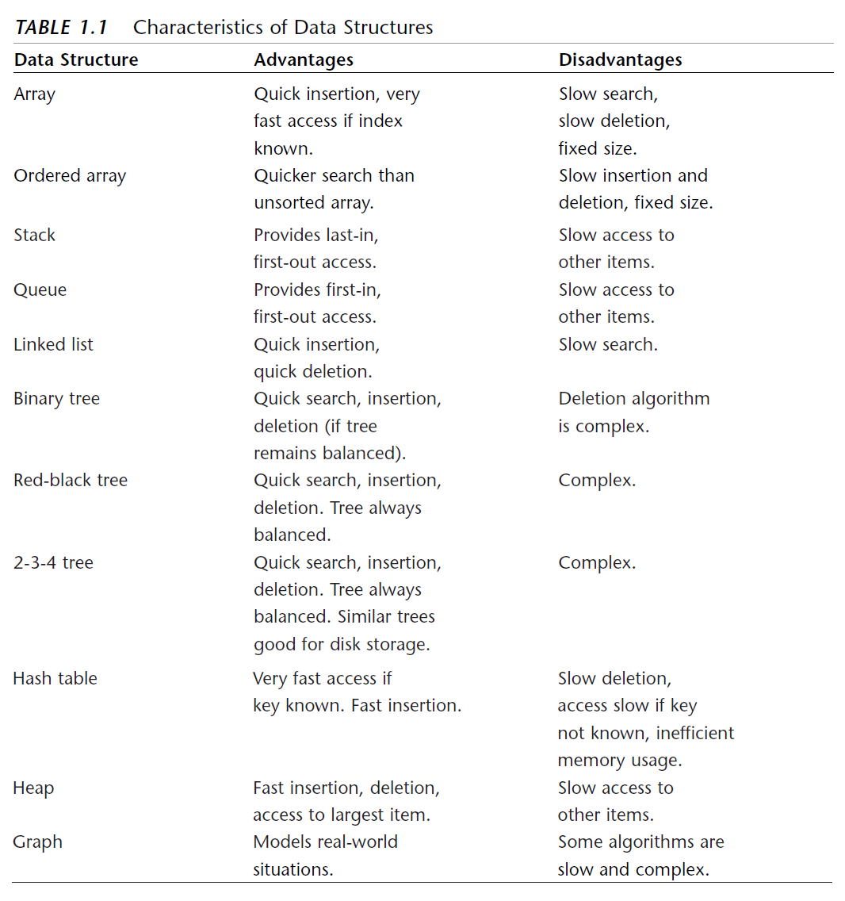

### When to Use What

The fast structures come with penalties.

A trend in data structures: To get a nice property, you will often have to lose something.

**Rule of thumb**: Start by considering the simple data structures, and code a simple version of an array or linked list and see what happens. Only when experimentation shows their performance to be too slow should you revert to more sophisticated data structures.

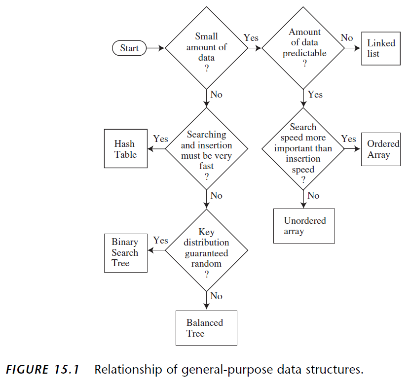

#### Arrays & LinkedLists

**Roughly speaking** in terms of speed: Arrays and linked lists are slow, trees are fairly fast, and hash tables are very fast.

#### Hash Tables 

- require you to know in advance about how much data can be stored.
- do not use memory very efficiently, so require additional memory, especially for open addressing. 

#### Binary Trees

**A binary tree is the first structure to consider when arrays and linked lists prove too slow.**

#### Stacks

A stack is often implemented as an array or a linked list. **A linked list is slightly slower than an array** because memory allocation is necessary to create a new link for insertion, and deallocation of the link is necessary at some point following removal of an item from the list.

#### Priority Queues

Priority queues can be implemented as an ordered array or as a heap. With the **heap** implementation, both insertion and deletion take **O(log N) time**. Use an array or a double-ended linked list if insertion speed is not a problem. If speed is important, a heap is a better choice.

#### Graphs

How to represent the graph:

- use an **adjacency matrix** when the graph is full. 
  - O(V^2) for BFS and DFS run, minimum spanning tree and shortest path run.
- use an **adjacency list** when the graph is sparse.
  - O(V+E) for BFS and DFS run.
  - O((V+E) log V) for minimum spanning tree and shortest path run.

How to know the graph is full or sparse: estimate V and E for the graph.

#### Sorting

As a wild guess, the slow sort such as insertion sort, might be appropriate for fewer than **1,000** items.

**Insertion sort is good for almost-sorted data** - O(n). This is typically the case where a few new items are added to an already-sorted data.

If insertion sort proves too slow, consider **shell sort**. Easy to implement. Useful up to **5,000** items. 

Only when the shell sort proves too slow should you use one of the more complex but faster sorts. **Quick sort** is the usual choice when the fastest sorting time is necessary.

**Do not use quick sort if data distribution is not random** - O(n^2). **For non-random data, heap sort is better** - O(n log n).

For quick sort, small mistakes in coding can make it work poorly for certain arrangements of data, a situation that may be hard to diagnose.

**Conclusion**: 

- For **small number** of items and **almost-sorted** data, use **insertion sort**. If too slow, use **shell sort**.
- For **large number** of items and **random data**, use **quick sort**. If **non-random**, use **heap sort**.

#### External Storage

When the amount of data is too large to store in memory, use external storage, which generally means **disk files**. Data is stored in a disk file in fixed-size units called **blocks**, each of which holds a number of **records**. Reading and writing operations always involve a single block.

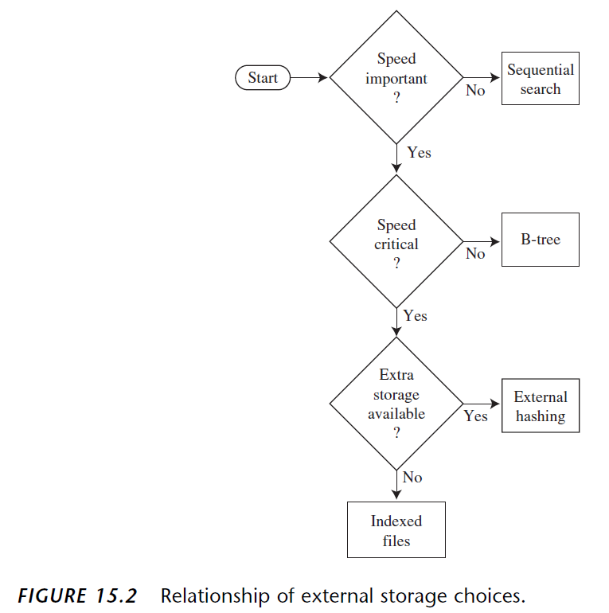

##### Sequential Storage

The simplest approach is to store records randomly and read them sequentially.

New records are appended at the end of the file.

Searching and deletion - O(n), **satisfactory
for a small number of records**.

##### Indexed Files

Indexed files will be read into memory as needed. An index of keys and corresponding block numbers is kept in main memory. 

Reading - O(1).

Disadvantage: 

- The index could become too large to fit in memory.
- When creating the index, need to read through the file sequentially, which is slow.
- When new items are added to the file, the index needs to be updated.

##### B-trees

Nodes correspond to blocks on the disk.

Searching, insertion and deletion - O(log n).

Works well for very large files.

The programming is complex.

##### External Hashing

Reading - O(1). 

Can handle larger files than indexed files.

##### Virtual Memory

If you read a file that is too big to fit in main memory, the virtual memory system will read in that part of the file that fits and store the rest on the disk. You can do operation just as if the entire file is in memory.

---

### Array

cache-friendly

O(1) fast lookup capability is the **most important** property of arrays.

If arrays are fixed length, when an array is full, a typical implementation is to double in size. Each doubling takes O(n) time. Amortized insertion time is still O(1).

```java
ArrayList<String> merge(String[] words, String[] more) {
  ArrayList<String> sentence = new ArrayList<String>();
  for (String w : words) {
    sentence.add(w);
  }
  for (String w : more) {
    sentence.add(w);
  }
  return sentence;
}
```

[Find the index of an element in an array in Java.](https://www.techiedelight.com/find-index-element-array-java/)

---

### Dynamic Array

Steps of appending: 

1. Make a new, bigger array. Usually twice as big - doubling append.
2. Copy each element from the old array into the new array.
3. Free up the old array. 
4. Append your new item.

Average or amortized time cost of appending: O(1)

The worst-case of appending: O(n)

Advantage over array: Do not have to specify the size ahead of time.

Disadvantage: Some appends can be expensive.

---

### StringBuilder

When you concatenate a listing of strings, if you use String type to store the final string, complexity is O(n^2). However, you can use StringBuilder to create a resizable array.

```java
String joinWords(String[] words) {
    StringBuilder sentence = new StringBuilder();
    for (String w : words) {
        sentence.append(w);
    }
    return sentence.toString();
}
```

---

### Linked List

A list of data items connected with links.

not cache-friendly

Types of linked list:

- Singly Linked List
- Doubly Linked List
- Circular Linked List

When to use a linked list:

- You do not need random access to any specific elements.
- You need to do constant insertions and deletions.
- You are not sure how many items will be in the list.

#### Singly Linked List


- Advantages: insertion and deletion can be very quick.
  - insertion (prepend) - **O(1)** time
  - insertion (append) - **O(n)** time
- Disadvantages
  - Slow to access an element. **O(n)** time
  - Memory is a concern. Require data and pointers.

Steps to insert a new value into a singly linked list (not as the head or last node): **O(1)** time

1. Create a new node with the new value.
2. Point the new node to the next node.
3. Point the pre node to the new node. 

Delete a node (not the head node): **O(n)** time

```java
public LinkedListNode getIthItemInLinkedList(LinkedListNode head, int i) {
  if (i < 0) {
    throw new IllegalArgumentException(String.format("The index i (%d) cannot be negative.", i));
  }

  LinkedListNode currentNode = head;
  int currentPosition = 0;

  while (currentNode != null) {
    if (currentPosition == i) {
      return currentNode;
    }

    currentNode = currentNode.next;
    currentPosition++;
  }

  throw new IllegalArgumentException(String.format("%d exceeds the length of the linked list.", i));
}
```

#### Doubly Linked List


#### Circular Linked List

##### Singly Circular Linked List


##### Doubly Circular Linked List

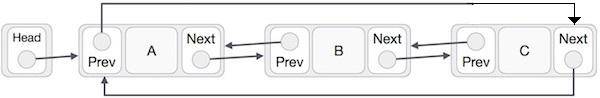

---

### Stack

An Abstract Data Type (ADT) used to store and retrieve values in Last In First Out method.

flexible size

time factor - O(n)


When to use stack:

- recursive function calls
- expression parsing
- depth first traversal of graphs

Basic operations:

- push():
  - Firstly check if the stack is full.
- pop():
  - Firstly check if the stack is empty.
  - Return the top value.
- peek(): get the top data element of the stack, without removing it.
  - `return stack[top]`
- isFull(): check if stack is full.
  - ```
    // array implementation
    if (top == MAXSIZE - 1)
        return true;
    else
        return false;
    ```
- isEmpty(): check if stack is empty.
  - ```
    // array implementation
    if (top == -1)
        return true;
    else
        return false;
    ```

---

### Queue

An Abstract Data Type (ADT) used to store and retrieve values in First In First Out method.

flexible size


When to use queue:

- priority queues
- breadth first traversal of graphs

Basic operations:

- enqueue():
  - Firstly check if the queue is full.

- dequeue():
  - Firstly check if the queue is empty.
  - Return the front value.

- peek(): get the element at the front of the queue without removing it.
  - `return queue[front]`

- isFull(): check if queue is full.
  - ```
    // array implementation
    if (rear == MAXSIZE - 1)
        return true;
    else
        return false;
    ```

- isEmpty(): check if queue is empty.
  - ```
    // array implementation
    if (front < 0 || front > rear)
      return true;
    else
      return false;
    ```

O(1) time for both array-based and linkedList-based implementations. 
 
Linked lists have a large number of primitive operations per call. **In practice, the linkedList method is more expensive than the array-based method.**

circular queue > array-based queue > linked list-based queue

#### Circular Queue

Use cases:

- multiplayer, turn-based games 
- round-robin scheduling of computing processes

```java
public class MyCircularQueue {

	private int[] data;
	
	private int front, rear;
	
	public MyCircularQueue(int k) {
		data = new int[k];
		front = -1;
		rear = -1;
	}
	
	
	public boolean enqueue(int value) {
		if (isFull()) return false;
		
		if (isEmpty()) {
			front = 0;
		}
		
		rear = (rear + 1) % data.length;
		data[rear] = value;
		
		return true;
	}
	
	public boolean dequeue() {
		if (isEmpty()) return false; 
		
		// It is also special when there is only one element in the array.
		if (front == rear) {
			front = -1;
			rear = -1;
			return true;
		}
		
		front = (front + 1) % data.length;
		return true;
	}
	
	public int getFront() throws Exception {
		if (isEmpty()) throw new Exception();
		
		return data[front];
	}
	
	public int getRear() throws Exception {
		if (isEmpty()) return throw new Exception();
		
		return data[rear];
	}

	// The essence is as long as the array is empty, set front as -1.
	public boolean isEmpty() {
		return front == -1;
	}
	
	// The essence is to check if rear move one more step will meet front.
	public boolean isFull() {
		return (rear + 1) % data.length == front;
	}
	
}
```

#### Deque (Double-Ended Queue)

A doubly linked list is most appropriate for implementing all operations efficiently.

---

### Priority Queue (PQ)

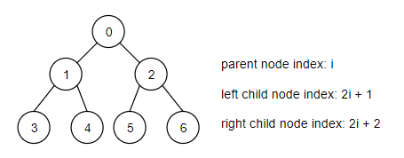

Generally implemented in heap because of better time performance.

When to use: 

- Used in certain implementation of Dijkstra's Shortest Path algorithm to fetch the next node to explore. 
- Anytime you need to dynamically fetch the "next best" or "next worst" element.
- Used in Huffman coding (which is often used for lossless data compression).
- Used in BFS algorithms to continuously grab the next most promising node.
- Used in Minimum Spanning Tree algorithms. 

Turn Min PQ to Max PQ: Change the sign of all elements to its opposite. Poll them out one by one and change the sign back. For instance, given a Min PQ 1, 2, 3, 4, 5, change to -1, -2, -3, -4, -5, then poll out as -5, -4, -3, -2, -1, then change back 5, 4, 3, 2, 1. 

Insert an element into a binary heap:

1. Insert the new element at the last position.
2. Adjust the heap to satisfy heap invariant.

Remove an element from a binary heap O(n):

1. Linear search the element you want to remove.
2. Switch this element with the last element.
3. Remove it.
4. Adjust the heap to satisfy heap invariant.

Remove an element from a binary heap (**optimized** - O(log n)): Use Hashtable to store the node value as the key and the node index as the value (the value is implemented using Set or Tree Set because the node value can be repeated).

---

### Heap

Heap is a special case of balanced binary tree data structure where root-node key is compared with its children and arranged accordingly.

Heap property / invariant: For min priority queue, the value in any node is less than the value in either of the children. 

#### Max Heap

The value of the parent node is greater than or equal to either of its children.

Max Heap Construction:


Max Heap Deletion:


#### Min Heap

The value of the parent node is less than or equal to either of its children.

---

### Hash Table

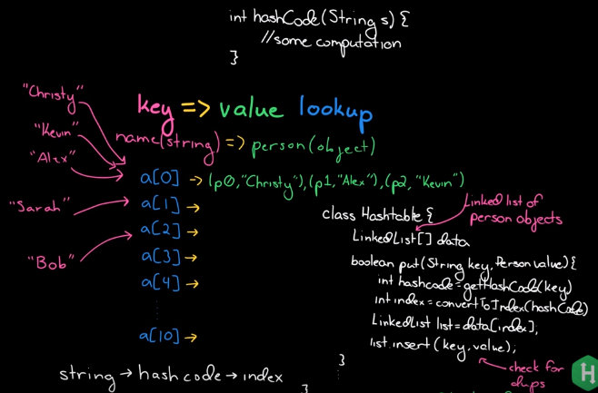

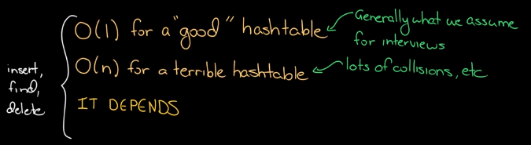

Conceptualize hash table as a bucket array.

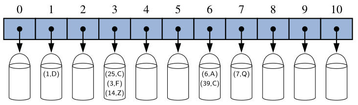

Advantages: 

- Insertion and search operations are very fast.
- Do not need to search through the array when finding a value.

Disadvantages: 

- Hard to order.

#### Hashing

Use hashing technique to generate an index where an element is to be inserted or is to be located from.

Hashing is a technique to convert a key into an index of an array. Steps:

1. The key is passed into **hash code function**, and get hash code. 
2. The hash code is passed into **compression function** and get the index of the bucket array. 
    - Maybe using `index = hashCode % N`, where `N` is commonly chosen as size of the bucket array.
    - If `sizeOfBucketArray` is a prime number, then the compression function
is good. If not, greater risk of causing collisions.
    - If choosing a non-prime number as hash table size N, certain patterns can occur. If N is a multiple of 3, then the hash values will be multiple of 3. If N is a multiple of 6, these issues occur for hash values having multiple of 2 as well as 3. To prevent this, the simplest way is to use a prime number as the hash table size. If you need a hash table size of around N, choose the largest prime <= N.
    
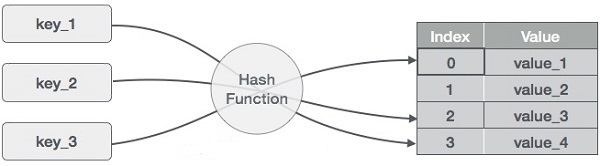

A good hash function: 

- sufficiently minimize collisions
- fast and easy to compute
- The probability any two different keys collide is 1/sizeOfBucketArray. 

#### Collision

1. There is key-value pair data.
2. Use a hash function with key as input parameter to get the the index of the array where to store data. Make sure the index is within bound of size of the array.
3. The index may be repeated, which is called collision. 

Ways to solve collision:

- Separate chaining 
   - Chaining with linked lists: store data with the same hash code in linked lists. So, the whole data structure will be array of linked lists.
     - **the most common** approach
     - worst lookup time O(n)
     - If the number of collisions is small, it is efficient.
     - :-1: The linked list may be very long. It will take time to find data with the same index.
     - :-1: If much data is stored in the linked list instead of bucket array, the remaining of the array will be wasted.
     - (When the number of entries in the linked list is 75% of bucket array size, double size the bucket array. Then re-allocate entries, which is costly.)
   - Chaining with balanced binary search trees: store collisions in a binary search tree.
     - rare approach
     - worst lookup time O(log n)
     - for extremely non-uniform distribution
     - 👍 Potentially using less space, since no longer allocate a large array.
     - 👍 Can iterate through the keys in order.
   - **In Java 8, if the number of collision in one bucket is less than 8, use linked list; otherwise Red-black tree.**
- Open addressing   
   - Linear probing: search the next empty location in the bucket array to store the data. Probe distance is 1 or another fixed value.
     - If the number of collisions is small, it is efficient.
     - 👎 Size of bucket array is limited.
     - 👎 Data may be stored one next to one another, which causes clustering.  
   - Quadratic probing: increase the probe distance quadratically.
     - Complicates removal operation.
     - Causes secondary clustering.
     - Not guaranteed to find an empty slot once the table becomes at least half full, or if N is not a prime number. 
   - Double hashing: use a second hash function to determine the probe distance.
     - N should be a prime.
     - Can avoid clustering.

Disadvantage of separate chaining: 

- Requires the use of an auxiliary data structure to hold entries.
- Not good if space is at a premium (e.g. writing a program for a small hand-
held device).

#### Load Factors

Load factor (λ) = n / N

n: number of data inserted into the bucket array. 

N: commonly use size of the bucket array. 

You should maintain λ < 0.9 for hash tables with separate chaining. < 0.5 for linear probing, and a bit higher for other open addressing schemes.

By default, Java’s implementation uses separate chaining with λ < 0.75.

Lower load factor indicates lower possibility of collision. 

#### Resize

**Rule of thumb**: once load factor >= 0.7, resize the bucket array to double size.

The new bucket array’s size is good to be a **prime number** approximately double the previous size.


#### Applications

- Phone directory: Name is the key and phone number is the value.
- Domain Name System (DNS): Domain name is the key and IP address is the value.
- Vote: Check if voters have voted already.
- Cache on web server. Cache web pages. URL is the key and web page is the value.

---

### Skip List

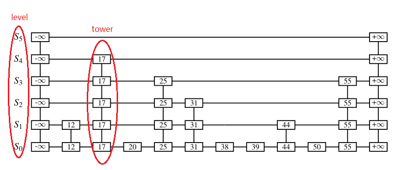

- Used to store key-value pair.
- Randomly decide to store duplicate elements on each level using `java.util.Random.nextBoolean()`, 1/2 possibility.
- Time complexity of search, insertion, removal: O(log n)

Optimization:

- For the horizontal axes, it is possible to keep the list singly linked.
- Do not need to store references to values at the levels of the skip list above the bottom level.
- Faster than AVL trees and other balanced
search trees.

---

### Graph

A pictorial representation of a set of objects where some pairs of objects are connected by links. Objects are represented by points termed as vertices, and the links that connect the vertices are called edges.

A graph is a pair of sets (V, E).

Vertices - represent them using an array.

Edges - represent them using a two-dimensional array.

#### Depth First Search (DFS)  

Traverse a graph in a depthward motion. Use stack to remember to get the next vertex to start a search, when a dead end occurs in any iteration.

The **simplest** algorithm for traversing a tree is the depth first traversal.

1. Visit the adjacent unvisited vertex. Mark it as visited. Display it. Push it in a stack.
2. If no adjacent vertex is found, pop up a vertex from the stack. (It will pop up all the vertices from the stack, which do not have adjacent vertices.)
3. Repeat Rule 1 and Rule 2 until the stack is empty.

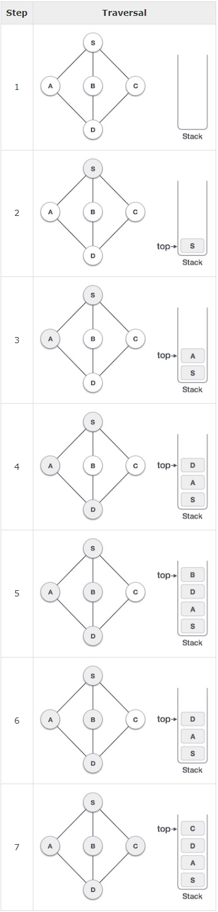

Applications:

- Produce the minimum spanning tree and all pair shortest path tree for an unweighted graph.
- Cycle detection in a graph (both undirected and directed).
- Path finding.
- Solving puzzles with only one solution, such as mazes. DFS can be adopted to find all solutions to a maze by only including nodes on the current path in the visited set.

#### Breadth First Search (BFS)  

Traverse a graph in a breadthward motion. Use a queue to remember to get the next vertex to start a search, when a dead end occurs in any iteration.

1. Visit the adjacent unvisited vertex. Mark it as visited. Display it. Insert it in a queue.
2. If no adjacent vertex is found, remove the first vertex from the queue.
3. Repeat Rule 1 and Rule 2 until the queue is empty.

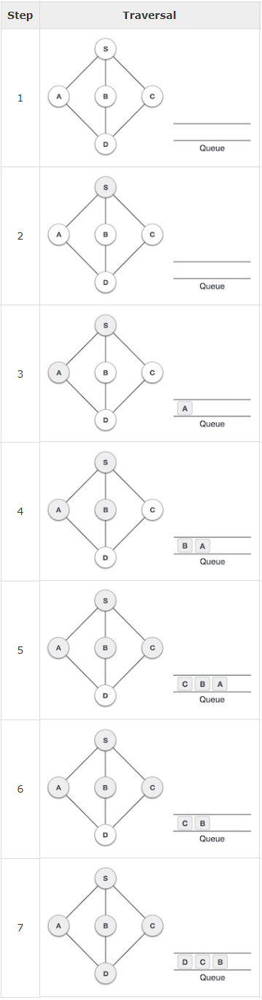

Applications:

- Peer to Peer networks: In Peer to Peer networks like BitTorrent, BFS is used to find all neighbor nodes.
- Crawlers in search engines: Crawlers build index using BFS. The idea is to start from source page and follow all links from source and keep doing same. DFS can also be used for crawlers, but the **advantage with BFS** is, depth or levels of the built tree can be limited.
- Social networking websites: In social networks, we can find people within a given distance "k" from a person using Breadth First Search till "k" levels.
- GPS navigation systems: BFS is used to find all neighboring locations.
- Broadcasting in network: In networks, a broadcasted packet follows BFS to reach all nodes.
- Garbage collection: BFS is used in copying garbage collection using Cheney’s algorithm. **BFS is preferred** over DFS because of better locality of reference.
- Cycle detection in undirected graph.
- Path finding.

---

### Tree

A tree is a minimally connected graph having no loops and circuits.


Three types of traversal:

- **In-order Traversal**: the left subtree is visited first, then the root and later the right sub-tree. **Prefer this one, as nodes can be printed in order for binary search tree.**


- **Pre-order Traversal**: the root node is visited first, then the left subtree and finally the right subtree.


- **Post-order Traversal**: first we traverse the left subtree, then the right subtree and finally the root node.


How to remember："pre", "in", "post" represent the sequence of visiting root.

- pre: root -> left -> right
- in: left -> root -> right
- post: left -> right -> root

#### Binary Tree

A binary tree has a special condition that each node can have **two children at maximum**.

#### Full Binary Tree

If the height is N, the number of nodes is 2^N -1, the number of nodes at the deepest level is 2^(N-1). 

Full binary tree is a particular case of complete binary tree.

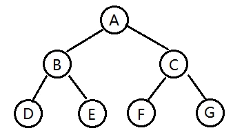

#### Binary Search Tree (BST)

- A node's left child must have a value less than its parent's value.
- A node's right child must have a value greater than its parent's value.
- **There must be no duplicate nodes.**
- Each node has a key and an associated value.
- Binary search tree is a special binary tree.


#### Self-Balancing Binary Search Tree

Why do we want trees to be balanced?

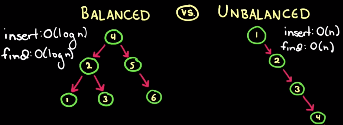

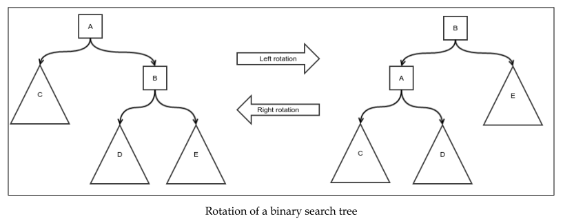

#### AVL Tree (Balanced Binary Search Tree)

- Height balancing binary search tree.
- Check the height of the left and the right sub-trees and assures that the difference (balance factor) is not more than 1. Otherwise, the tree is unbalanced.

Rotation techniques to balance the tree:

- Left rotation
- Right rotation
- Left-Right rotation
- Right-Left rotation


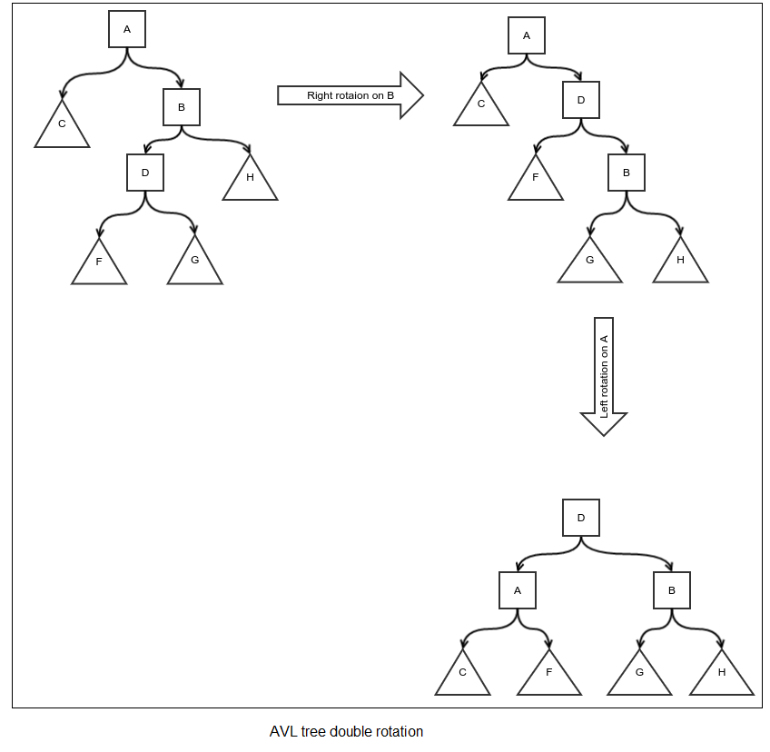

Rotation steps:

1. Define child, grandchild, and parent.
2. Detach the grandchild.
3. Detach the child.
4. Detach the current node.
5. Set the current node as the child of child node.
6. Set grandchild as the child of the current node.
7. Set child as the child of parent.

**Disadvantages**: AVL tree makes a lot of rotations. Since it is too quick to rotate, it may make very frequent rotation in opposite directions even when it would be unnecessary, had it been waiting for the future values to be inserted. 

This can be avoided using red-black tree which knows when to rotate a subtree.

#### Red-Black Tree

[漫画：什么是红黑树？](https://zhuanlan.zhihu.com/p/31805309)

5 Conditions: 

- Nodes are red or black.
- The root has to be black.
- All leaves are black nodes with null value. (NIL nodes)
- Both children of a red node are black.
- Every path from a given node to any of its descendant NIL nodes contains the same number of black nodes.
  
#### Spanning Tree

A spanning tree is a subset of Graph G, which has all the vertices covered with minimum possible number of edges.

A complete undirected graph can have maximum n^(n-2) number of spanning trees, where n is the number of nodes.  

- Removing one edge from the spanning tree will make the graph disconnected, i.e. the spanning tree is **minimally connected**.
- Adding one edge to the spanning tree will create a circuit or loop, i.e. the spanning tree is **maximally acyclic**.
- Used to find a minimum path to connect all nodes in a graph.

Common application of spanning trees:

- Civil Network Planning
- Computer Network Routing Protocol
- Cluster Analysis

##### Minimum Spanning Tree (MST)

In a weighted graph, a minimum spanning tree is a spanning tree that has minimum weight than all other spanning trees of the same graph. In real-world situations, this weight can be measured as distance, congestion, traffic load or any arbitrary value denoted to the edges.

Minimum Spanning Tree algorithms:

- Kruskal's Algorithm
- Prim's Algorithm

---

## Algorithms

### Tips 

- Do not need to use sorting to get the max or min in some values. Instead, use `Math.max()` or `Math.min()`.
- An integer division costs about 9 times as much as a multiplication and 25 times as much as an integer addition and logic operation.

### Basic Concepts

#### Algorithm Complexity

Two main factors decide the efficiency of algorithm:
- Time Factor: counting the number of key operations.
- Space Factor: counting the maximum memory space required by the algorithm.

#### Asymptotic Analysis

Refers to computing the running time of any operation in mathematical units of computation.

Asymptotic Notations:

- Omega Notation **Ω(n)** - measures the **best case** time complexity or the minimum amount of time.
- Big O Notation **Ο(n)** - measures the **worst case** time complexity or the maximum amount of time.
- Theta Notation **θ(n)** - **average case**, express both the lower bound and the upper bound of an algorithm's running time.

#### Big O Complexity Chart

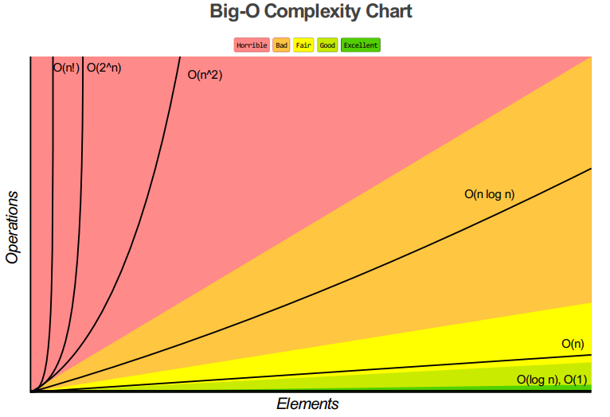

#### Big O Cheat Sheet


#### Classic Examples

- Finding all subsets of a set: O(2^n)
- Finding all permutation of a string: O(n!)
- Sorting using merge sort: O(n log n)

#### Approaches to Develop Algorithms

##### Greedy Algorithms

localized optimum solution

Most networking algorithms use the greedy approach:

- Travelling Salesman Problem
- Prim's Minimal Spanning Tree Algorithm
- Kruskal's Minimal Spanning Tree Algorithm
- Dijkstra's Minimal Spanning Tree Algorithm
- Graph - Map Coloring
- Graph - Vertex Cover
- Knapsack Problem
- Job Scheduling Problem

##### Divide and Conquer

The algorithms based on divide-and-conquer programming approach:

- Merge Sort
- Quick Sort
- Binary Search
- Strassen's Matrix Multiplication
- Closest pair (points)

##### Dynamic Programming

overall optimization

For problems which can be divided into **similar** sub-problems, so that their results can be re-used.

Use the output of a smaller sub-problem and then try to optimize a bigger sub-problem.

Use Memorization to remember the output of already solved sub-problems.

Problems solved using dynamic programming approach:

- Fibonacci number series
- Knapsack problem
- Tower of Hanoi
- All pair shortest path by Floyd-Warshall
- Shortest path by Dijkstra
- Project scheduling

---

### Bit Operations 

`<<`: left shift

`>>`: signed right shift

`>>>`: unsigned right shift, pad 0 for both positive and negative numbers.

Example: 

`00001010 << 2 = 00101000`

For signed right shift, 

- if the number is unsigned, pad 0 at the most left side. E.g., `00001010 >> 2 = 00000010`.
- if the number is signed and negative, pad 1 at the most left side. E.g., `10001010 >> 3 = 11110001`.

How to figure out whether the most right side is 1 or not: do xor between this number and 1. If the result is 1, yes; if 0, no.

For positive numbers, mathematically, `>> 1` is the same as `/ 2` and `<< 1` is the same as `* 2`, but with better performance. **Recommend** using this one in practice.

`(<number> & 1) == 1` can be used to determine whether a number is odd or not. (instead of using `% 2 == 1`)

---

### Expression Parsing

- Infix Notation - human readable
- Prefix (Polish) Notation - operator is ahead
- Postfix (Reverse-Polish) Notation - operator is after

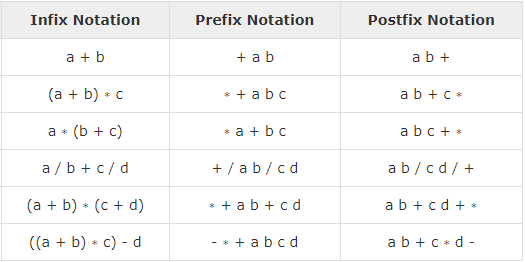

---

### Searching Algorithms

Options: 

- linear search
- binary search
- hash table search
- binary search tree search


#### Linear Search  

Find an item in a sequentially arranged data type. Compare expected data item with each of data items in list or array.

average - Ο(n)

worst - O(n^2)

Work better finding all matched values in an array.

#### Binary Search

**The array must be sorted in advance.**

1. `int lowIndex = 0; int highIndex = arr.length - 1;`
2. While lowIndex <= highIndex,
   1. Select the middle which splits the entire list into two parts. `int mid = (highIndex - lowIndex) >> 1 + lowIndex;`
   2. Compare the target value to the mid of the list: arr[mid].
   3. `if (arr[mid] == target) return mid;`
   4. If the middle > target, the target is in the left part. Otherwise, the target is in the right part.
3. If while loop ends and still not found the target, return -1.

```java
// commonly used, but bad
// because if the values low and high are big, may overflow
int mid = (low + high) / 2;

// better way
int mid = (high - low) / 2 + low;

// mathematically, >> 1 is the same as / 2, but better performance
// better way
int mid = ((high - low) >> 1) + low;
```

Time complexity: Ο(log n)

Work better finding one match if there is no duplicates in the array.

#### Inverted Index

[什么是倒排索引？](https://www.cnblogs.com/zlslch/p/6440114.html)

---

### Sorting Algorithms

In-place Sorting vs. Not-in-place Sorting

Stable vs. Not Stable Sorting

- Stable sorting sort repeated elements in the same order that they appear in the input.

Adaptive vs. Non-Adaptive Sorting

- Adaptive: if the source list has some element already sorted, it will try not to re-order them.
- Non-Adaptive Sorting: force every single element to be re-ordered, not taking into account the elements which are already sorted.

[十大经典排序算法](https://www.runoob.com/w3cnote/ten-sorting-algorithm.html)

[排序算法总结](https://www.runoob.com/w3cnote/sort-algorithm-summary.html)

[十种常见排序算法的思想、应用场景](https://blog.csdn.net/hairy_monsters/article/details/80154391)

#### Bubble Sort

A comparison-based algorithm in which each pair of adjacent elements is compared and elements are swapped if they are not in order.

N elements need N-1 loops.

O(n^2) time, O(1) space, stable

#### Selection Sort

Divide the list into two sub-lists: sorted and unsorted. Then it selects the minimum element from unsorted sub-list and places it into the sorted list. This iterates unless all the elements from unsorted sub-list are placed into sorted sub-list.

O(n^2) time, O(1) space, unstable, not adaptive

1. Mark a[0] as min。
2. a[0]跟a[1]比，if a[0] > a[1]，这时不要交换a[0]和a[1]。而是mark a[1] as min。
3. a[1]跟a[2]比，if a[1] > a[2]，mark a[2] as min。
4. 一趟loop完后，拿到min。这时将min和a[0]交换。再从a[1]开始重复这个过程。

In a word, 找min，一趟loop完后再做交换。

**More efficient than bubble sort.** Less swap.

#### Insertion Sort

Divide the list into two sub-lists: sorted and unsorted. Then it takes one element at a time and finds an appropriate location in sorted sub-list and insert it.

O(n^2) time, O(1) space, stable

1. a[2]跟a[1]比，if a[2] < a[1]，用a[1]的值覆盖掉a[2]。（这里并没有把a[2]的值交换给a[1]。）
2. a[2]跟a[0]比，if a[2] < a[0]，用a[0]的值覆盖掉a[1]。a[2]的值赋给a[0]。

插入排序对于大规模的乱序数组的时候效率是比较慢的。

#### Shell Sort

A variant of insertion sort. Divide the list into smaller sub-list based on some gap variables. Sort each sub-list using insertion sort.

是插入排序的一种更高效的改进版本。希尔排序为了加快插入的速度，让数据移动的时候可以实现跳跃移动，节省了一部分的时间开支。

O(n log n) best time, O(n^2) time, O(1) space, unstable

1. Initialize the value of interval h. (h = h * 3 + 1) (O(n^(3/2)) by Knuth, 1973: 1, 4, 13, 40, 121, ...) Use the biggest value

```java
int gap = 1;
while (gap < arr.length) {
  gap = gap * 3 + 1;
}
```

2. Divide the list into smaller sub-list of equal interval h.
3. Sort these sub-lists using insertion sort.
4. Reduce h, divide sub-lists into smaller one. Sort.
5. Repeat step 4 until h is 1. Final insertion sort.


#### Merge Sort

Divide and conquer approach. Keep on dividing the list into smaller sub-lists until all sub-lists have only one element. Then it merges them in a sorted way until all sub-lists are sorted.

O(n log n) time, O(n) space, stable

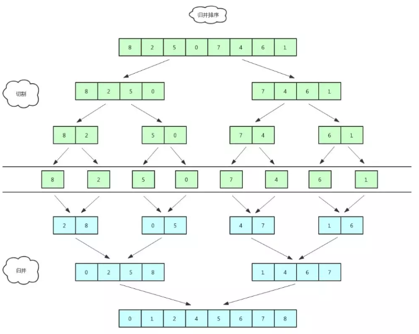

#### Quick Sort

Divide and conquer approach. Divide the list in smaller "partitions" using "pivot". The values which are smaller than the pivot are arranged in the left partition and greater values are arranged in the right partition. Each partition is recursively sorted using quick sort.

1. Randomly choose a value in the array as pivot.
2. Compare the a[0] and pivot, a[n] and pivot. If a[0] > pivot, a[n] < pivot, swap a[0] and a[n].
3. Compare a[1] and pivot, a[n-1] and pivot. If a[1] < pivot, a[n-1] < pivot, compare a[2] and pivot. If a[2] > pivot, swap a[2] and a[n-1].
4. When all elements <= pivot are at the left and all elements >= pivot are at the right (这里只是将array以pivot为基准分成大的小的两组，不一定是pivot左边的都小于pivot，右边的都大于pivot), split them as two sub-lists. Then do the above steps recursively until the sub-list cannot be split again.  

Pivot selection:

- If pick the last or first element as the pivot, susceptible to the **worst case O(n^2)**, most notably when the original sequence is **already sorted, reverse sorted, or nearly sorted**.
- In practice, **"median-of-three"** technique, use median of the front, middle, and tail of the sequence.

Hybrid approach:

- Quick sort has **good performance on large data sets**, but **high overhead on small data sets**. 
- When the size of a subsequence falls below some threshold (perhaps 50 elements), use **insertion sort**. 

O(n log n) time, extreme situation O(n^2) time, O(1) space, unstable

[Good explanation](https://www.youtube.com/watch?v=SLauY6PpjW4&list=PLX6IKgS15Ue02WDPRCmYKuZicQHit9kFt&t=0s&index=20)

#### Counting Sort

1. Traverse the array a. Find the max value. 
2. Create another array countArr whose size is (the max value in step 1) + 1.
3. Traverse the array a. 在countArr[a的元素值]中计数。
4. Traverse the array countArr. If the value of the element > 0, 将这个value对应的countArr下标存入array a （不用管array a中原来的值）。存入的个数为value of the element。If the value of the element == 0, 不用管。

Limitations: 

- Can only be used for sorting int. 
- Cannot be used when the gap between values  in the array is too large. For instance, [2,1,1000]. You do not want to create a countArr with 10001 size, right?
  

#### Bucket Sort

桶排序可以看成是计数排序的升级版。它通过映射函数将要排的数据分到多个有序的桶里，每个桶里的数据再单独排序，再把每个桶的数据依次取出，即可完成排序。

为了使桶排序更加高效，key points:

- 在额外空间充足的情况下，尽量增大桶的数量。(One practice is using the size of the array as the number of buckets.)
- 使用的映射函数能够将输入的 N 个数据均匀的分配到 K 个桶中。
- 对于桶中元素的排序，选择何种比较排序算法对于性能的影响至关重要。

Q: 什么时候排序最快？

A: 当输入的数据可以均匀的分配到每一个桶中。Ideally, each element is in one bucket. 

Q: 什么时候排序最慢？

A: 当输入的数据被分配到了同一个桶中。

1. Traverse the array. Find the min and max. 
2. Calculate the section which is the number range for each bucket. **`float section = (float) (max - min) / (size of the array - 1);`**.
3. Create a bucketList. `ArrayList<ArrayList<Integer>> bucketList = new ArrayList<>();`
4. Loop the size of the array, and create an ArrayList in each bucket.
5. Traverse the array. For each element, calculate the index of bucket where to insert into. And then insert the element into the bucket.

```java
for (int i = 0; i < arr.length; i++) {
  int index = (int) (arr[i] / section) - 1;
  if (index < 0) index = 0;
  bucketList.get(index).add(arr[i]);
}
```

6. Traverse the bucketList. Sort elements within each bucket. You can use `Collections.sort();`
7. Traverse the bucketList and furthermore each bucket. Overwrite the original array with each element in the bucket.

```java
int index = 0;
for (ArrayList<Integer> bucket : bucketList) {
  for (Integer element : bucket) {
    arr[index++] = element;
  }
}
```

O(n) best time, O(n^2) time, O(n) space 

#### Radix Sort 

基数排序是一种**非比较型**整数排序算法。

由于整数也可以表达字符串（比如名字或日期）和特定格式的浮点数，所以基数排序也不是只能使用于整数。

假设要对 100 万个手机号码进行排序，用基数排序比较好。

1. Create a bucketList. `ArrayList<ArrayList<Integer>> bucketList = new ArrayList<>();`
2. 桶的数目是确定的：10个。因为每位数可能的取值只有0~9。Loop 10, and create an ArrayList in each bucket.
3. Traverse the array. 对个位数应用基数排序。即将数组中的值放入以其个位数为下标的bucket中。
4. Traverse the bucketList. Overwrite the original array with each element in the bucket. **Clear each bucket.** (**NOTE**: Clear the bucket not the bucketList.)
5. Repeat step 3 and 4 but for 十位数. Then for 百位数、千位数... until 10 * 位数 > max value of the array. 

#### Sorting Algorithms Complexity Table

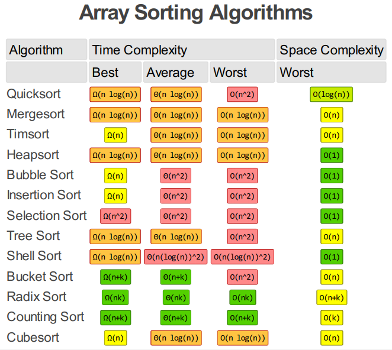

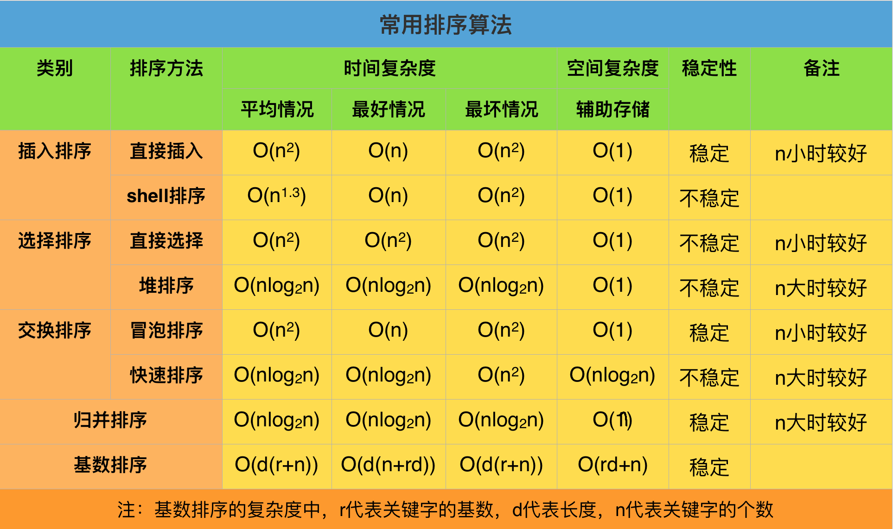

---

### Recursion

If something is repeated, you should think about applying recursion algorithm to it.

A recursive function is one which calls itself, directly or calls a function that in turn calls it.

Properties:

- Base criteria: where function stops calling itself recursively.
- Progressive approach: where function tries to meet the base criteria in each iteration.

Many programming languages implement recursion by means of stacks.


**Advantages**:

- It makes a program more readable.
- More efficient than iterations because of latest enhanced CPU systems.

**Disadvantages**:

- Space complexity of recursive function may go higher than that of a function with iteration, because the system needs to store activation record each time a recursive call is made.
- Time and space consumption: Every time the function is invoked, it needs to create space on stack to store parameters, returned address and temp variables; pushing and popping data also needs time.
- If time of recursion is big, performance will be low. There can also be stack overflow problem because stack size is limited.

#### Tower of Hanoi

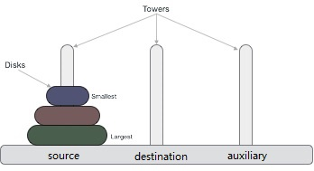

Tower of Hanoi puzzle with n disks can be solved in minimum
$$
2^n-1
$$
steps.

Algorithm ideas:

- Divide the stack of disks in two parts:
  - n^th disk
  - all other n-1 disks
- The ultimate aim is to move disk n^th from source to destination and then put all other n-1 disks onto it.

Steps:

1. Move n-1 disks from source to aux.
2. Move n^th disk from source to destination.
3. Move n-1 disks from aux to destination.

#### Fibonacci Series

1,1,2,3,5,8,13,21 ...

f(n) = f(n-1) + f(n-2)

```c
// this code is just used to demonstrate recursion algorithm
// should not be used in projects due to low performance
int fibonacci(int n) {
   if(n == 0) {
      return 0;
   } else if(n == 1) {
      return 1;
   } else {
      return (fibonacci(n-1) + fibonacci(n-2));
   }
}
```

#### Factorial (n!)

```c
int factorial(int n) {
   //base case
   if(n == 0) {
      return 1;
   } else {
      return n * factorial(n-1);
   }
}
```

---

### Pattern-matching Problem

#### Brute-force (BF) Algorithm

Main idea: It consists of two nested loops, with the outer loop indexing through all possible starting indices of the pattern in the text, and the inner loop indexing through each character of the pattern, comparing it to its potentially corresponding character in the text.

Time complexity: O(nm)

```java
// returns the lowest index at which substring pattern begins in the text (or else -1)
public static int findUsingBruteForce(char[] text, char[] pattern) {
  int textLen = text.length;
  int patternLen = pattern.length;

  // if the pattern is "", return 0
  if (patternLen == 0) {
    return 0;
  }

  // try every starting index within text
  for (int i = 0; i <= textLen - patternLen; i++) {
    int k = 0; // k is index into pattern
    while (k < patternLen && pattern[k] == text[k+i]) {
      k++;
    }
    if (k == patternLen) {
      return i;
    }
  }

  return -1;
}
```

The algorithm implementation used by Java `contains()` and `indexOf()` method is similar to brute-force.

#### Boyer-Moore (BM) Algorithm

Time-saving heuristics: 

- Looking-Glass Heuristic: When testing a possible placement of the pattern against the text, perform the comparisons against the pattern from right-to-left.
- Character-Jump Heuristic: If `text[i]` is not contained anywhere in the pattern, then shift the pattern completely past `text[i] = c`. Otherwise, shift the pattern until an occurrence of character `c` gets aligned with `text[i]`.

The efficiency of the Boyer-Moore algorithm relies on
quickly determining where a mismatched character occurs elsewhere in the pattern.

Define a function `last(c)` as: If `c` is in the pattern, `last(c)` is the index of the last (rightmost) occurrence of `c` in the pattern.

Time complexity: O(nm)

An example that achieves the worst case for Boyer-Moore: text is `aaaaaa...a`, pattern is `baaa...a`. 

```java
public static int findUsingBoyerMoore(char[] text, char[] pattern) {
  int textLen = text.length;
  int patternLen = pattern.length;

  // if the pattern is "", return 0
  if (patternLen == 0) return 0;

  Map<Character, Integer> last = new HashMap<>();

  for (char c : text) {
    last.put(c, -1);
  }

  for (int k = 0; k < patternLen; k++) {
    last.put(pattern, k);
  }

  int i = textLen - 1;
  int k = patternLen - 1;

  while (i < textLen) {
    if (text[i] == pattern[k]) {
      if (k == 0) { // entire pattern has been found
        return i;
      } 
      i--;
      k--;
    } else {
      // case analysis for jump step
      i += m - Math.min(k, last.get(text[i]) + 1);
      // restart at end of pattern
      k = patternLen - 1;
    }
  }

  return -1;
}
```

#### Knuth-Morris-Pratt (KMP) Algorithm

A major inefficiency of BF and BM algorithm: For a certain alignment of the pattern, if we find several matching characters but then detect a mismatch, we ignore all the information gained by the successful
comparisons after restarting with the next incremental placement of the pattern.

Time complexity: O(n + m)

---

## Appendices

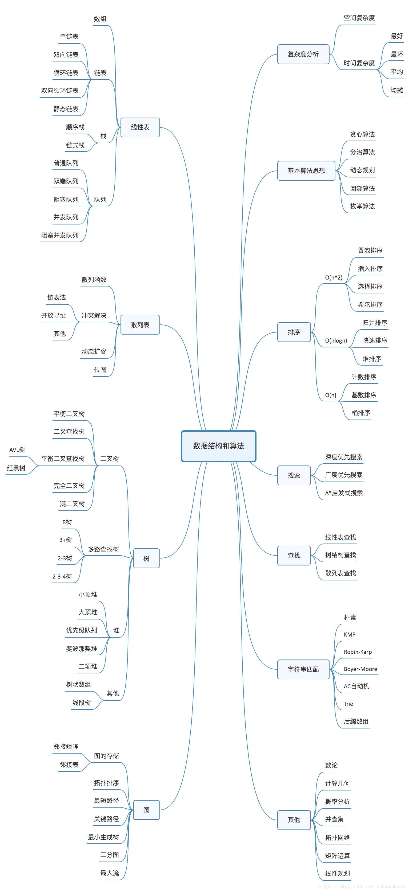