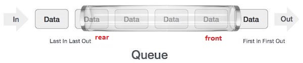

# Data Structures and Algorithms Note 

## Data Structures 

### Linked List

Types of linked list: 

- Simple Linked List 
- Doubly Linked List 
- Circular Linked List

When to Use a Linked List:

- You do not need random access to any specific elements.
- You need to do constant insertions and deletions.
- You are not sure how many items will be in the list.

#### Simple Linked List


- Advantages: insertion and deletion can be very quick.
  - insertion (prepend) - **O(1)**
  - insertion (append) - **O(n)**
- Disadvantages 
  - Slow to access an element. **O(n)**
  - Memory is a concern. Require data and pointers. 

#### Doubly Linked List 


#### Circular Linked List

##### Singly Circular Linked List


##### Doubly Circular Linked List


---

### Stack 

flexible size


Operations:

- push(): 
  - Firstly check if the stack is full. 
- pop(): 
  - Firstly check if the stack is empty. 
  - Return the top value. 
- peek(): get the top data element of the stack, without removing it.
  - `return stack[top]`
- isFull(): check if stack is full.
  - ```
    // array implementation 
    if (top == MAXSIZE - 1)
        return true;
    else
        return false;
    ```
- isEmpty(): check if stack is empty.
  - ```
    // array implementation 
    if (top == -1)
        return true;
    else
        return false;
    ```
    
---

### Queue

flexible size



Operations:

- enqueue():
  - Firstly check if the queue is full. 

- dequeue():
  - Firstly check if the queue is empty. 
  - Return the front value. 

- peek(): get the element at the front of the queue without removing it. 
  - `return queue[front]`

- isFull(): check if queue is full.
  - ```
    // array implementation 
    if (rear == MAXSIZE - 1)
        return true;
    else
        return false;
    ```

- isEmpty(): check if queue is empty.
  - ```
    // array implementation
    if (front < 0 || front > rear) 
      return true;
    else
      return false;
    ```

---

### Hash Table

- Use an array as a storage medium.
- Use hash technique to generate an index where an element is to be inserted or is to be located from.
- Insertion and search operations are very fast.


1. There are key-value pair data. 
2. Use hash function to get the hash code from the key of the data. Then convert the hash code to the index of the array where to store data. 
3. The hash code may be repeated, which is called collision. Ways to solve collision: 
   - Linear probing: search the next empty location in the array to store the data. 
   - Chaining: for data with the same hash code, store them in linked list. So, the whole data structure will be array of linked list. 


## Algorithms 

### Basic Concepts 

#### Algorithm Complexity 

Two main factors decide the efficiency of algorithm: 
- Time Factor: counting the number of key operations. 
- Space Factor: counting the maximum memory space required by the algorithm. 

#### Asymptotic Analysis 

Refers to computing the running time of any operation in mathematical units of computation. 

The time required by an algorithm falls under three types:

- Best Case - minimum time required for program execution.
- Average Case - average time required for program execution.
- Worst Case - maximum time required for program execution.

Asymptotic Notations:

- Omega Notation **Ω(n)** - measures the **best case** time complexity or the best amount of time. 
- Big O Notation **Ο(n)** - measures the **worst case** time complexity or the longest amount of time. 
- Theta Notation **θ(n)** - express both the lower bound and the upper bound of an algorithm's running time. 

#### Big O Complexity Chart


#### Big O Cheat Sheet


#### Greedy Algorithms

localized optimum solution

Most networking algorithms use the greedy approach:

- Travelling Salesman Problem
- Prim's Minimal Spanning Tree Algorithm
- Kruskal's Minimal Spanning Tree Algorithm
- Dijkstra's Minimal Spanning Tree Algorithm
- Graph - Map Coloring
- Graph - Vertex Cover
- Knapsack Problem
- Job Scheduling Problem

#### Divide and Conquer

The algorithms based on divide-and-conquer programming approach:

- Merge Sort
- Quick Sort
- Binary Search
- Strassen's Matrix Multiplication
- Closest pair (points)

#### Dynamic Programming

overall optimization

For problems which can be divided into **similar** sub-problems, so that their results can be re-used.

Use the output of a smaller sub-problem and then try to optimize a bigger sub-problem. 

Use Memorization to remember the output of already solved sub-problems.

Problems solved using dynamic programming approach:

- Fibonacci number series
- Knapsack problem
- Tower of Hanoi
- All pair shortest path by Floyd-Warshall
- Shortest path by Dijkstra
- Project scheduling

---

### Searching Algorithms 

#### Linear Search  

Ο(n) 

Work better finding all matched values in an array.

#### Binary Search 

Ο(log n)

Work better finding one match if there is no duplicates in the array. 

**The array must be sorted in advance.** 

---

### Sorting Algorithms

- In-place Sorting vs. Not-in-place Sorting
- Stable vs. Not Stable Sorting
- Adaptive vs. Non-Adaptive Sorting 
  - Adaptive: if the source list has some element already sorted, it will try not to re-order them.
  - Non-Adaptive Sorting: force every single element to be re-ordered, not taking into account the elements which are already sorted.

#### Insertion Sort 

1. a[2]跟a[1]比，if a[2] < a[1]，a[1]的值赋给a[2]。
2. a[2]跟a[0]比，if a[2] < a[0]，a[0]的值赋给a[1]。a[2]的值赋给a[0]。

把小的值向后覆盖掉大的值。最终把最小值赋给第一个值。

#### Selection Sort

1. Mark a[0] as min。
2. a[0]跟a[1]比，if a[0] > a[1]，这时不要交换a[0]和a[1]。而是mark a[1] as min。
3. a[1]跟a[2]比，if a[1] > a[2]，mark a[2] as min。
4. 一趟loop完后，拿到min。这时将min和a[0]交换。

找min，一趟loop完后再做交换。

#### Sorting Algorithms Complexity Table


