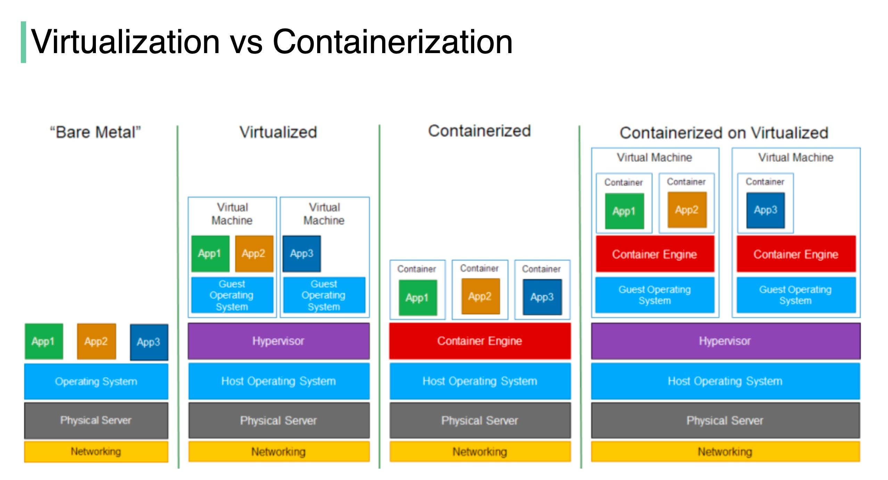

# Docker Note

## Basics

An **image** is a set of instructions to create the environment to deploy applications. 

**Docker** is a running instance of that image. 

When a Docker image is deployed, it becomes a container. 

Docker is process ID No.1 on the host operating system. 

A big secret with Docker is that no one uses Docker Swarm. Compared with Kubernetes clusters, you can spend hours going through Docker Swarm.

[Play with Docker](https://labs.play-with-docker.com/): A simple, interactive and fun playground to learn Docker.