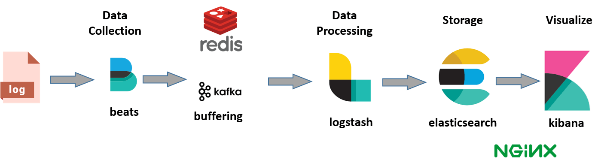

# Elastic Note 

- [Elastic Note](#elastic-note)
  - [ELK](#elk)
  - [Elasticsearch](#elasticsearch)
    - [Overview](#overview)
    - [Indexes and Documents](#indexes-and-documents)
    - [Scalability and Resilience](#scalability-and-resilience)
    - [Shards](#shards)
      - [Performance Considerations](#performance-considerations)
  - [Beats](#beats)
    - [Filebeat](#filebeat)
  - [Logstash](#logstash)

---

## ELK

ELK Stack: Elasticsearch, Logstash, and Kibana. 

ELK stack provides centralized logging in order to identify problems with servers or applications. It allows you to search all the logs in a single place.

- E stands for ElasticSearch: used for storing logs.
- L stands for LogStash: used for both shipping as well as processing and storing logs.
- K stands for Kibana: is a visualization tool (a web interface) which is hosted through Nginx or Apache.

While dealing with very large amounts of data, you may need Kafka, RabbitMQ for buffering and resilience. For security, Nginx can be used.

---

## Elasticsearch 

### Overview 

Elasticsearch is a NoSQL database. It is based on Lucene search engine, and it is built with RESTful APIS.

It also offers advanced queries to perform detail analysis and stores all the data centrally.

It is helpful for executing a quick search of the documents.

It allows you to store, search and analyze big volume of data. 

It has been adopted in search engine platforms for modern web and mobile applications. It is mostly used as the underlying engine to power applications that need search requirements.

Features:

- Written using Java.
- Used to index any kind of heterogeneous data.
- Has REST API web-interface with JSON output.
- Full-text Search.
- Near Real Time (NRT) search (within 1 second).
- Sharded, replicated searchable, JSON document store.
- Schema-less, REST & JSON based distributed document store.
- Provides horizontal scalability, reliability, and multi-tenant capability for real time use of indexing to make it faster search.

It uses a data structure called an inverted index that supports very fast full-text searches. An inverted index lists every unique word that appears in any document and identifies all of the documents each word occurs in.

### Indexes and Documents

An index can be thought of as an optimized collection of documents.

Each document is a collection of fields, which are the key-value pairs that contain your data. It is the basic unit of information which can be indexed. Every single Document is associated with a type and a unique id.

By default, Elasticsearch indexes all data in every field and each indexed field has a dedicated, optimized data structure.

The ability to use the per-field data structures to assemble and return search results is what makes Elasticsearch so fast.

### Scalability and Resilience

You can add servers (nodes) to a cluster to increase capacity and Elasticsearch automatically distributes your data and query load across all of the available nodes. Elasticsearch knows how to balance multi-node clusters to provide scale and high availability.

### Shards

An Elasticsearch index is really just a logical grouping of one or more physical shards, where each shard is actually a self-contained index.

As the cluster grows (or shrinks), Elasticsearch automatically migrates shards to rebalance the cluster.

Two types of shards: primaries and replicas. A replica shard is a copy of a primary shard. 

The number of primary shards in an index is fixed at the time that an index is created, but the number of replica shards can be changed at any time, without interrupting indexing or query operations.

#### Performance Considerations

The more shards, the more overhead there is simply in maintaining those indices.

The larger the shard size, the longer it takes to move shards around when Elasticsearch needs to rebalance a cluster.

Querying lots of small shards makes the processing per shard faster, but more queries means more overhead, so querying a smaller number of larger shards might be faster.

**In short, it depends.**

As a starting point:

- Aim to keep the average shard size between a few GB and a few tens of GB. For use cases with time-based data, it is common to see shards in the 20GB to 40GB range.
- Avoid the gazillion shards problem. The number of shards a node can hold is proportional to the available heap space. As a general rule, the number of shards per GB of heap space should be less than 20.

---

## Beats 

### Filebeat 

Lightweight data shipper

---

## Logstash 

Data shipper

ETL

Transform unstructured data to structured data. 

Logstash is an open source data collection engine with real-time pipelining capabilities.

Any type of event can be enriched and transformed with a broad array of input, filter, and output plugins, with many native codecs further simplifying the ingestion process.

Logstash welcomes data of all shapes and sizes.

Clean and transform your data during ingestion to gain near real-time insights immediately at index or output time.

