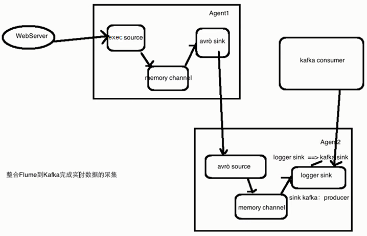

# Flume and Kafka Integration Note 

- Flume: 1.7.0 
- kafka: 2.11-0.9.0.0

---



---

## flumeKafkaIntegration/avro-memory-kafka.conf & flumeKafkaIntegration/exec-memory-avro.conf


Listen to a file (data.log) by using agent 1. Then send messages to agent 2. Then consume messages by Kafka.

File changes -> Flume -> Kafka

**Note:** start agent 2 firestly. Next, start agent 1.

How to use: 

1. Create avro-memory-kafka.conf. (agent 2)
2. Create exec-memory-avro.conf. (agent 1)
3. Start Zookeeper.
4. Start Kafka. 
5. In terminal 2, start agent 2 firstly. 

```
flume-ng agent \
--name avro-memory-kafka \
--conf $FLUME_HOME/conf \
--conf-file $FLUME_HOME/conf/flumeTut/flumeKafkaIntegration/avro-memory-kafka.conf \
-Dflume.root.logger=INFO,console
```

6. In terminal 1, start agent 1 secondly. 

```
flume-ng agent \
--name exec-memory-avro \
--conf $FLUME_HOME/conf \
--conf-file $FLUME_HOME/conf/flumeTut/flumeKafkaIntegration/exec-memory-avro.conf \
-Dflume.root.logger=INFO,console
```

7. In terminal 3, start a consumer. `bin/kafka-console-consumer.sh --zookeeper localhost:2181 --topic hello_topic`.
8. In terminal 4, add "hello" into data.log file. `echo hello >> data.log`. Then "hello" will be displayed in terminal 3. 