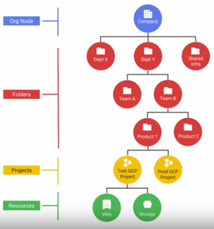
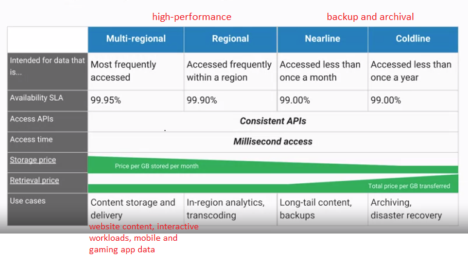
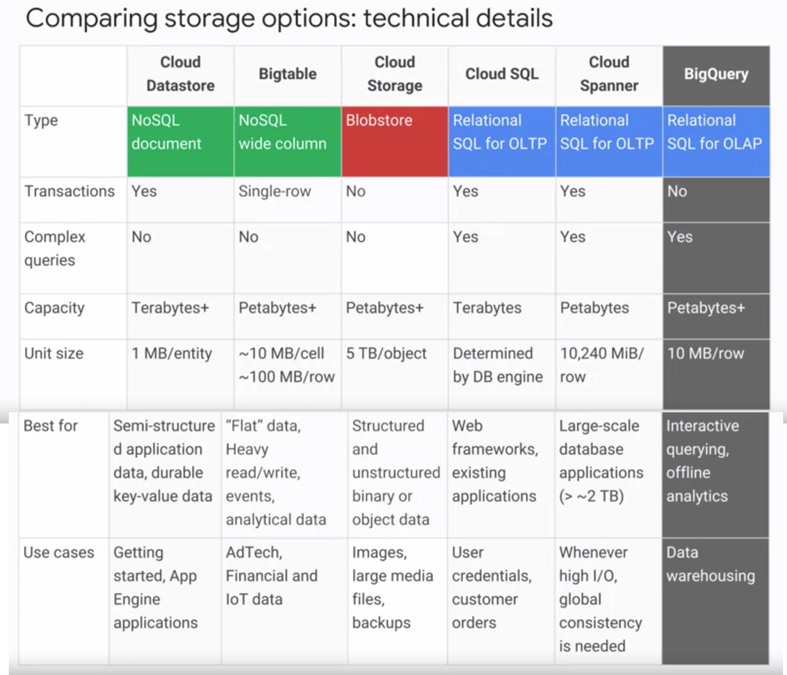
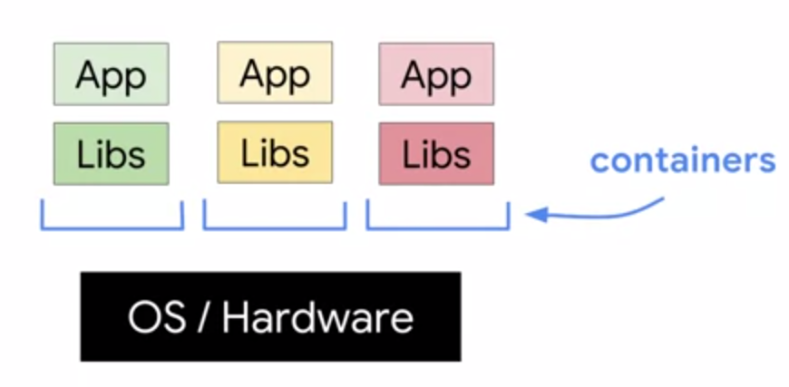
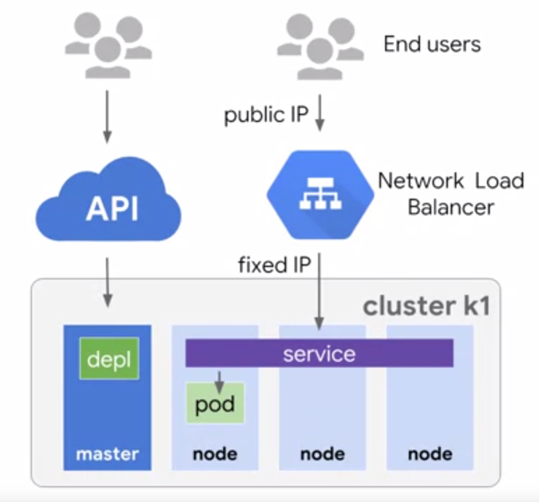
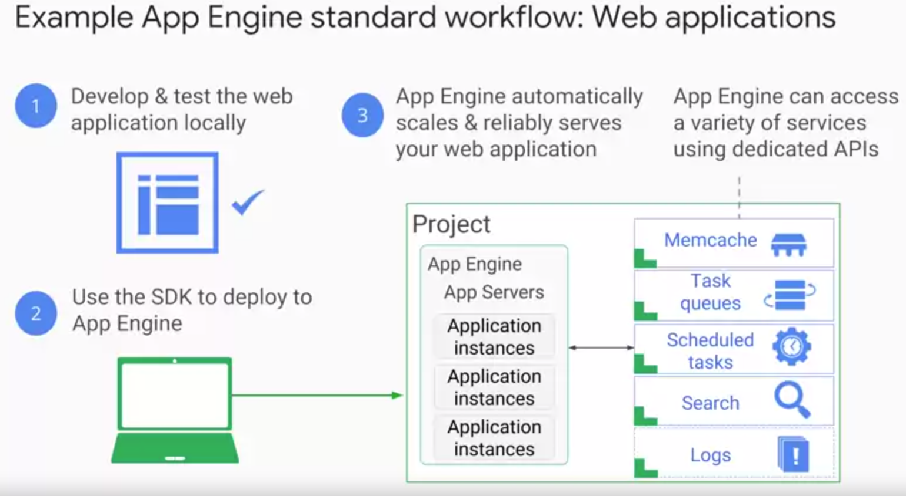
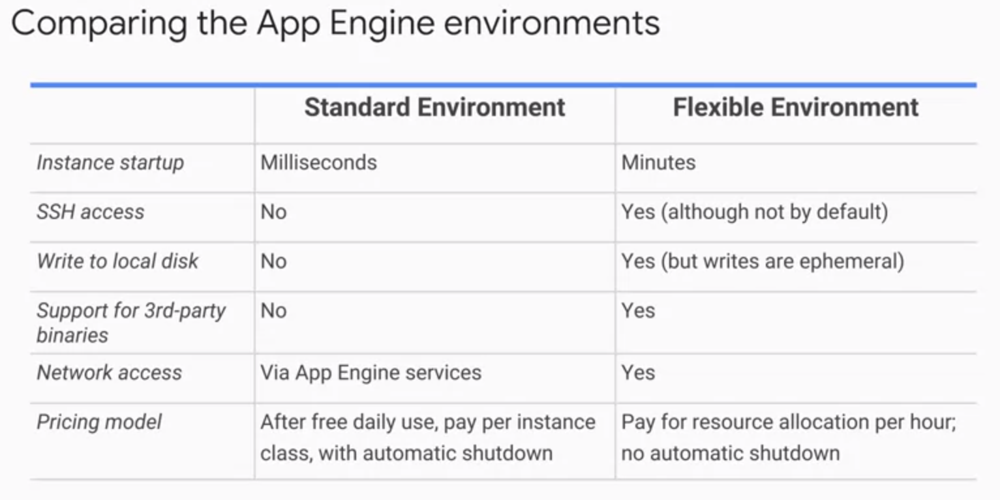

# GCP Note

- [GCP Note](#gcp-note)
  - [GCP Resource Hierarchy](#gcp-resource-hierarchy)
  - [Compute Engine](#compute-engine)
  - [GCP Storage](#gcp-storage)
    - [Cloud Storage](#cloud-storage)
      - [Four Classes](#four-classes)
    - [Cloud SQL](#cloud-sql)
    - [Cloud Spanner](#cloud-spanner)
    - [Big Table](#big-table)
    - [Cloud Data Store](#cloud-data-store)
    - [Comparison](#comparison)
  - [Kubernetes](#kubernetes)
    - [Containers](#containers)
    - [Kubernetes Pod](#kubernetes-pod)
    - [Kubernetes Cluster](#kubernetes-cluster)
    - [Architecture](#architecture)
  - [App Engine](#app-engine)
    - [Standard Environment & Flexible Environment](#standard-environment--flexible-environment)
  - [API Management](#api-management)
    - [Cloud Endpoints](#cloud-endpoints)
    - [Apigee Edge](#apigee-edge)
  - [Cloud Functions](#cloud-functions)
  - [Deployment Manager](#deployment-manager)
  - [Monitoring](#monitoring)
    - [Stackdriver](#stackdriver)
  - [Cloud Big Data Platform](#cloud-big-data-platform)
    - [Cloud Dataproc](#cloud-dataproc)
    - [Cloud Dataflow](#cloud-dataflow)
    - [BigQuery](#bigquery)
    - [Cloud Pub/Sub](#cloud-pubsub)
    - [Could Datalab](#could-datalab)
  - [Cloud Machine Learning Platform](#cloud-machine-learning-platform)
  - [BigQuery](#bigquery-1)
    - [Coding](#coding)
      - [In Cloud Shell](#in-cloud-shell)

---

[What is Google Cloud Platform (GCP)? – Introduction to GCP Services & GCP Account](https://www.edureka.co/blog/what-is-google-cloud-platform/)

[Apache Spark Tutorial with GCP - YouTube](https://www.youtube.com/playlist?list=PLlL9SaZVnVgi_OQf3uLjJKNVivBLLfavf)

---

## GCP Resource Hierarchy



Each resource belongs to exactly one project.

A policy is set on a resource, which contains a set of roles and role members. 

Resources inherit policies from parent. 

A less restrictive parent policy overrides a more restrictive resource policy. For example, parent policy has Right A and B, whereas child policy has Right A. Then parent policy take effect. But if parent policy has Right A whereas child policy has Right A and B, child policy take effect.

Organization nodes are optional, but if you want to create folders, having one is mandatory.

---

## Compute Engine

- offers managed VMs
- per second billing
- Use big VMs for memory- and compute-intensive applications.
- Use Autoscaling (a feature) for resilient, scalable applications.

Storage type:

- local SSD: Use this when your application needs high performance scratch space. But does not last past when VM terminates. 
- standard persistent disks: by default

---

## GCP Storage

### Cloud Storage

- object storage
- different with file storage, block storage
- Each object has an unique key in form of URL.
- The objects are immutable. (versioning) (You can turn on / off versioning.)
- Cloud Storage files are organized into buckets.

#### Four Classes



### Cloud SQL

- RDBMS
- TB of capacity

### Cloud Spanner

- horizontally scalable RDBMS
- PB of capacity
- offers transactional consistency at global scale

### Big Table

- NoSQL
- billions of rows X thousands of columns, PB data
- ideal for storing large amounts of data with very low latency
- high throughput of read and write
- access using HBase API

### Cloud Data Store

- horizontally scalable NoSQL DB
- supports transactions
- can be used for online app backend

### Comparison



---

## Kubernetes

IaaS

### Containers



Containers start much faster than virtual machines and use fewer resources, because each container does not have its own instance of the operating system.

### Kubernetes Pod

Kubernetes pod: smallest unit, a group of containers.

Containers in a pod are deployed together. They are started, stopped, and replicated as a group.

### Kubernetes Cluster

Kubernetes cluster: a group of machines where Kubernetes can schedule containers in pods. 

Kubernetes cluster nodes are Compute Engine VMs.

The resources used to build Kubernetes Engine clusters come from Compute Engine. 

### Architecture



---

## App Engine

PaaS

App Engine offers NoSQL databases, in-memory caching, load balancing, health checks, logging, and user authentication to applications running in it.

### Standard Environment & Flexible Environment

Specific versions of Java, Python, PHP, and Go are supported. 

If you use other languages, choose Flexible Env and then upload your own runtime to run code.

Sandbox constraints: 

- No writing to local files.
- All requests time out at 60s.
- Cannot install arbitrary third-party software.

If you do not want these constraints, choose Flexible Env.





---

## API Management

### Cloud Endpoints

It is used to create and maintain APIs.

### Apigee Edge

It is used to secure and monetize APIs.

---

## Cloud Functions

Single-purpose functions that respond to events without a server or runtime.

Written in JS running in Node.js env.

Once you put event-driven components of application in Cloud Functions, it will handle scaling them seamlessly, so you do not have to provision computer resources to handle these operations.

---

## Deployment Manager

Create a .yaml template describing your env and use Deployment Manager to create resources.

infrastructure as code

--- 

## Monitoring 

### Stackdriver 

- monitoring 
- logging
- trace
- error reporting 
- debugger
- profiler

---

## Cloud Big Data Platform

### Cloud Dataproc

- provides Spark, Hive, Pig
- billed on second

### Cloud Dataflow

- offers data pipelines
- real-time data
- ETL
- batch & streaming processing 

### BigQuery 

- fully managed data warehouse
- PB-scale
- write 100,000 rows per second
- 99.9% SLA
- separates storage and computation

### Cloud Pub/Sub

- supports many-to-many asynchronous messaging
- push (subscribers get notified when new messages arrive) / pull (check for new messages at intervals) subscriptions 
- "at least once" delivery at low latency, which means small chance some messages might be delivered more than once
- one million messages per second and beyond
- foundation for Dataflow streaming

### Could Datalab

- notebook (Python env)
- interactive tool for data exploration
- built on Jupyter
- runs in a Compute Engine VM

---

## Cloud Machine Learning Platform

- TensorFlow, TPU
- full managed Machine Learning service
- Machine Learning APIs
  - Cloud Vision API
  - Cloud Speech API
  - Cloud Natural Language API
  - Cloud Translate API
  - Cloud Video Intelligence API# GCP Note

---

## BigQuery 

A dataset is a group of resources, such as tables and views.

A dataset name can be up to 1,024 characters long, and consist of A-Z, a-z, 0-9, and the underscore, but it cannot start with a number or underscore, or have spaces.

### Coding 

#### In Cloud Shell

Describe a table with project name: 

```
bq show <project:public dataset.table>
```

e.g. 

```
bq show bigquery-public-data:samples.shakespeare
```

Describe a table without project name: 

```
bq show <dataset_name.table_name>
```
 
e.g. 

```
bq show babynames.names2010
```

Run a query: 

```
bq query "[SQL_STATEMENT]"
```

Escape any quotation marks inside the `[SQL_STATEMENT]` with a `\` mark, or use `'[SQL_STATEMENT]'` instead of `"`. For instance, 

```sql
bq query --use_legacy_sql=false \
'SELECT
   word,
   SUM(word_count) AS count
 FROM
   `bigquery-public-data`.samples.shakespeare
 WHERE
   word LIKE "%raisin%"
 GROUP BY
   word'
```

`--use_legacy_sql=false` makes standard SQL the default query syntax.

List any existing datasets in your project: 

```
bq ls
``` 

List any existing datasets in a specific project: 

```
bq ls <project_name>:
```

e.g. 

```
bq ls bigquery-public-data:
```

Create a new dataset: 

```
bq mk <dataset_name>
```

e.g. 

```
bq mk babynames
```

Add the a zip file to your project: 

```
curl -LO <file URL>
```

e.g. 

```
curl -LO http://www.ssa.gov/OACT/babynames/names.zip
```

Unzip a file: 

```
unzip <zip_file_name>
```

e.g. 

```
unzip names.zip
```

Create or update a table and load data: 

```
bq load <dataset_name.table_name source>
<column_name:column_type>
```

For instance, 

```
bq load babynames.names2010 yob2010.txt name:string,gender:string,count:integer
```

List tables or views in your dataset: 

```
bq ls <dataset_name>
```

e.g. 

```
bq ls babynames
```

Delete all tables in a dataset: 

```
bq rm -r <dataset_name>
```

e.g.

```
bq rm -r babynames
```
