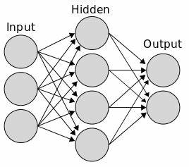
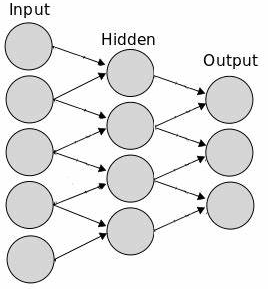
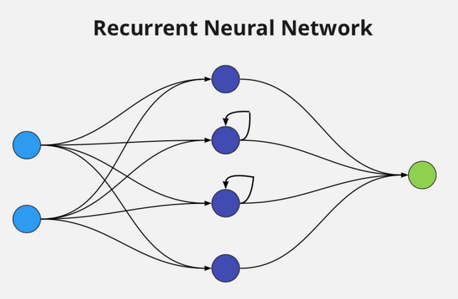
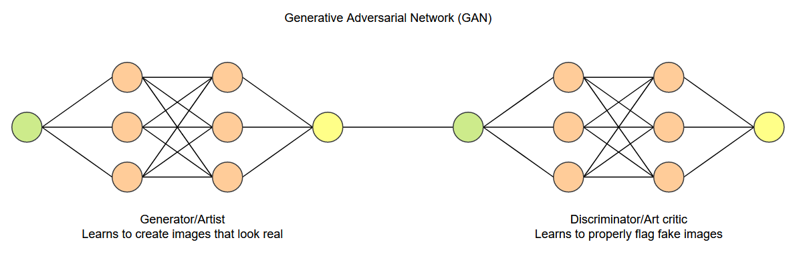
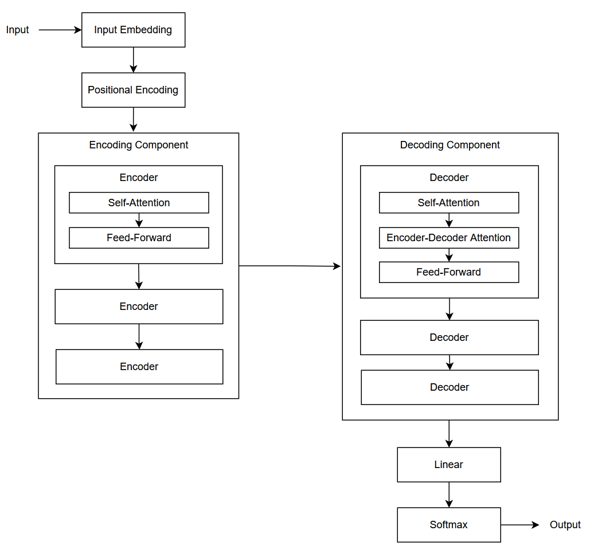
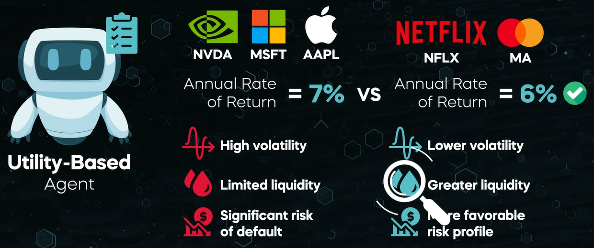
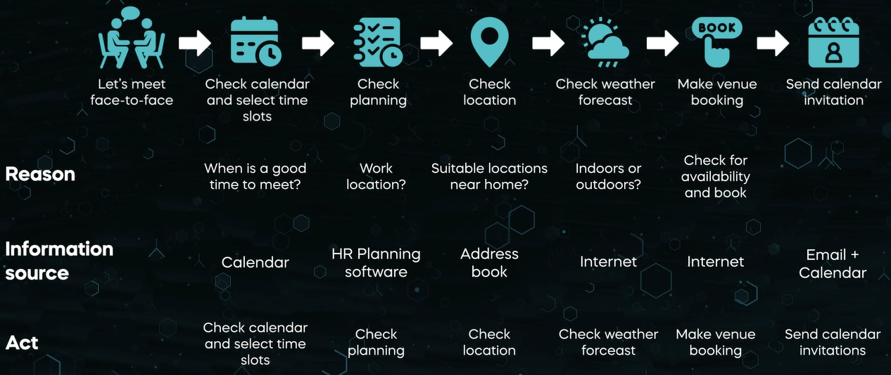
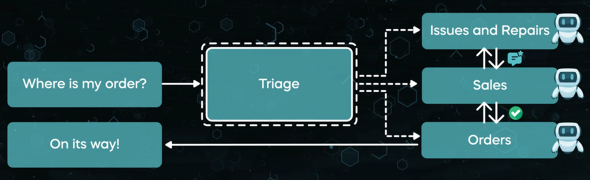
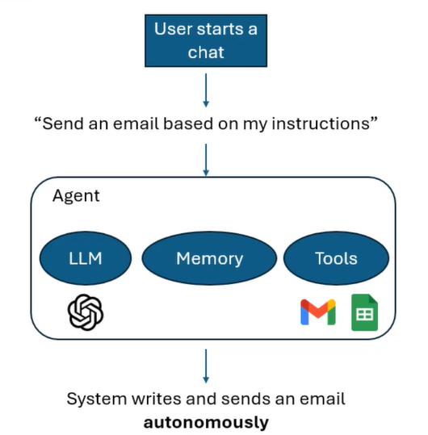
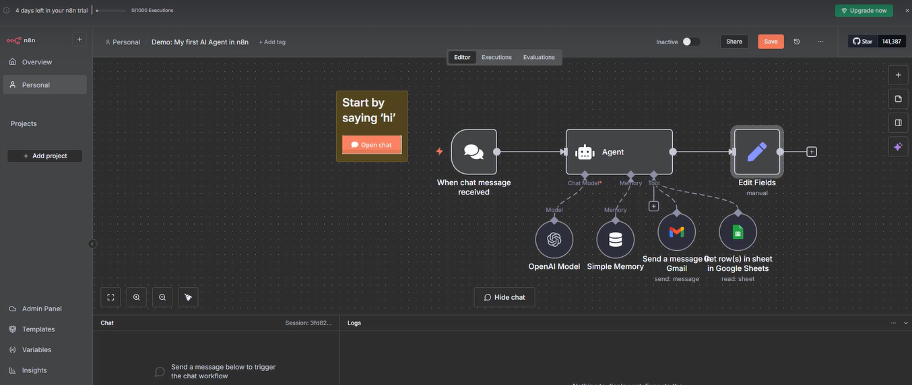

# Generative AI Note

- [Generative AI Note](#generative-ai-note)
  - [Basic Concepts](#basic-concepts)
    - [Use Cases](#use-cases)
  - [Large Language Model](#large-language-model)
    - [Applications](#applications)
    - [Challenges](#challenges)
    - [Future](#future)
  - [Neural Network](#neural-network)
  - [Transformer Architecture](#transformer-architecture)
    - [Attention Mechanism](#attention-mechanism)
  - [Prompt Engineering](#prompt-engineering)
    - [Prompt Templates](#prompt-templates)
    - [Tools](#tools)
    - [Prompt Design](#prompt-design)
      - [Chain-of-Thought Prompting](#chain-of-thought-prompting)
      - [`<|endofprompt|>`](#endofprompt)
      - [Use Forceful Language](#use-forceful-language)
      - [Identify Incorrect Information](#identify-incorrect-information)
      - [Separation Token](#separation-token)
    - [Tips and Tricks](#tips-and-tricks)
  - [AI Agents](#ai-agents)
    - [Key Components Involved in Building AI Agents](#key-components-involved-in-building-ai-agents)
    - [Types of AI Agents](#types-of-ai-agents)
      - [Key Characteristics of AI Agents](#key-characteristics-of-ai-agents)
      - [Types of Agents](#types-of-agents)
    - [Learning Abilities of AI Agents](#learning-abilities-of-ai-agents)
    - [AI Agent Architecture Patterns](#ai-agent-architecture-patterns)
      - [LLMs != AI Workflows != AI Agents](#llms--ai-workflows--ai-agents)
      - [Key Frameworks Used to Build AI Agents](#key-frameworks-used-to-build-ai-agents)
      - [Single-agents vs. Multi-agents](#single-agents-vs-multi-agents)
    - [Implementing AI Agents in Practice](#implementing-ai-agents-in-practice)
      - [Implementation Steps](#implementation-steps)
      - [Selecting a LLM](#selecting-a-llm)
      - [External Tools the AI Agent Can Use](#external-tools-the-ai-agent-can-use)
      - [Agent Instructions](#agent-instructions)
      - [Prompt Engineering Techniques](#prompt-engineering-techniques)
      - [Guardrails](#guardrails)
      - [Human Intervention](#human-intervention)
      - [Evaluating AI Agents](#evaluating-ai-agents)
    - [Building Agentic Automation with n8n](#building-agentic-automation-with-n8n)
    - [Infrastructure for AI Agents](#infrastructure-for-ai-agents)
  - [References](#references)

---

## Basic Concepts

Classification of AI based on type of tasks: 

- Discriminative: In the context of natural language processing, focus on classifying or predicting specific properties of the input text.
- Generative: In the context of natural language processing, focus on producing text that closely resembles human language.

Compared with traditional AI, most of which only identify and classify inputs, Generative AI can generate original content. Most importantly, the input and output of Generative AI language models is natural language. 

**Generative AI language models are only trained to predict the next word.**

GPT: Generative Pre-trained Transformer.

Reinforcement Learning from Human Feedback (RLHF)

Diffusion models

Zero-Shot Learning (ZSL): The ability to learn on the fly. Models can learn from information that is new to them without having to be retrained. 

Prompt: Natural language input that tells the AI model what to do.

AI hallucination: When AI systems generate content that appears to be real but was not actually produced by humans. A bad prompt can lead to the model making up stuff. 

### Use Cases
 
- Text generation 
- Image generation
- Video synthesis
- Language generation
- Music composition
- Concise information
- Speech
- Visual effects
- 3D assets
- Sound effects
- Custom product suggestion

---

## Large Language Model

Large Language Model (LLM): Trained on a large volume of human originated text to be able to predict the next token (word).

"Large" refers to massive neutral network and massive training data.

LLM examples: 

- GPT-4
- ChatGPT
- LLaMA
- Sparrow
- Bard  
- LaMDA

Text-to-image model examples: 

- DALL-E 2
- Stable Diffusion 
- Midjourney

Transfer learning: A technique in which a model is trained on one task, then repurposed to perform a different but related task.

Foundation model: A pre-trained model on which other special-purpose models are built. An example is GPT, which ChatGPT is built on.

For faster and more effective training on the target task, it is often preferable to fine tune a pre-trained general purpose model. 

Classification of LLM based on tuning approach: 

- Generic: Unsupervised learning on diverse text.
- Instruction-tuned 
- Dialogue-tuned or conversational
- Domain-specific

### Applications

- Content creation 
  - Articles, blogs, social media posts
  - Product descriptions
- Text summarization
- Language translation 
- Question-answering systems
  - Chatbots 
  - Virtual assistants
  - Customer support systems
  - Information retrieval systems
- Search engines
- Code generation, debugging, documentation, programming education 
- Sentiment analysis
  - Customer feedback analysis
  - Social media monitoring
  - Market research
  - Content moderation 
- Audio and video transcription 
- Fraud detection
- Cybersecurity
  - Malicious attack pattern recognition and alerting
  - Automated threat detection and response
- Education
  - Learner profile analysis, strength and weakness identification
  - Bespoke learning material and exercise generation
  - Real-time feedback
  - Concept clarification 
  - Knowledge discovery 
- Healthcare, medical diagnosis and treatment

### Challenges 

- Bias and prejudice
  - LLMs can reflect, and more importantly, amplify the biases present in training data.
  - Cultural, racial, gender, religious biases
  - Impact on hiring decision, medical care, financial outcomes 
  - Ethical guidelines:
    - How are LLMs trained and used?
    - Who decides what data LLMs should be exposed to? What is appropriate or inappropriate training data? 
    - Should LLMs reflect the society as-is, or promote a better future?
- Misinformation and disinformation
  - Fake news articles
  - Dealing with:
    - Develop content filtering and fact-checking mechanism.
    - Educate users about the limitation of LLMs.
    - Label or mark content generated by LLMs. Be transparent about the use of LLMs in content generation.
    - Promote media literacy and critical thinking skills among users.
- Interpretability and transparency
  - More and more difficult to understand how LLMs make decisions.
  - Dealing with:
    - Provide comprehensive documentation of the models, detailing the architecture, training data, and limitation.
    - Incorporate explainable AI techniques, such as attention maps, feature attribution, and saliency maps to visualize model decisions. 
    - Promote collaboration between AI and human experts to validate and interpret. 
- Environmental impact
  - LLMs require a significate amount of computational resources (-> energy consumption -> carbon emissions) to train.
  - Dealing with:
    - Use energy-efficient hardware.
    - Choose green data centers. 
    - Optimize training process including model architecture, data efficiency, parallelism, and early stopping.
    - Employ transfer learning by reusing pre-trained models.
    - Advocate for and support sustainable AI policies and regulations. 
    - Raise awareness within AI research and development community about the environmental impact of LLM training. 
- Privacy and copyright violation
  - Provenance, authorship
  - Leaking private data
  - Misattributing citations  
  - Plagiarizing copyrighted content
  - Users send sensitive data to third party.
  - Dealing with:
    - Curate and preprocess training data to remove sensitive or copyrighted content. 
    - Regularly audit and evaluate model outputs for privacy and copyright issues. 
    - Collaborate with content creators and rights holders to secure licenses for copyrighted material.
    - Educate users about responsible and ethical model usage.
- Generalization and robustness
  - Highly depending on training data
  - AI hallucination due to not enough training data, noisy or bad training data, or modeling not being given enough constraints. 
  - Dealing with:
    - Incorporate a wide variety of data sources and domains during training. 
    - Fine-tune LLMs on domain-specific or task-specific data to improve robustness.
    - Augment training data with variations, perturbations, or synthetic examples. 
    - Incorporate human feedback to correct model errors and biases, and enhance generalization. 

### Future

- Enhanced understanding context and nuances in human language
  - Idiomatic expressions 
  - Sarcasm
  - Cultural differences
- Multimodal capabilities
  - Images, generating image descriptions
  - Audio
  - Video, providing detailed video summaries
- Personalization
- Improved robustness
  - Reducing biases, improving fairness
- Increased efficiency without compromising on capability
  - Compressing models
  - More accessible for edge devices
  - Reducing carbon footprint
- Democratization of knowledge and skills
  - Providing access to high quality information and expertise to everyone
  - Understanding and generating content in local languages and dialects
  - Personal tutors
- Collaboration with humans
- Broader applications across industries

Effects:

- Transforming industries
- Enhancing user experiences
- Advancing our understanding of the world

---

## Neural Network

Activation function: Determines whether a neuron or node should be activated, or "fire", based on the weighted sum of its inputs.

Sigmoid function is often used for binary response problems.

Rectified linear unit function is the most commonly used.

Backpropagation: A neural network training method that adjusts weights to minimize the difference between predicted and actual outputs. Use an iterative cycle of epochs, each of which includes a forward phase and a backward phase.

- Forward phase: Calculate output value based on input values, weights and bias.
- Backward phase: Use a loss/error function to compare the output and the expected value, and then to adjust weights and bias by using an optimization algorithm, e.g. stochastic gradient descent. 

The complexity of the task that a neural network can learn is determined by the topology of the network. 

Perceptron: Single layered neural network. 

Deep learning models are essentially complex neural networks with multiple layers (more than one hidden layer).

Feed-forward Neural Network: The simplest deep learning architecture. Well-suited for problems, such as image classification or regression.



Convolutional Neural Network: A common deep learning architecture specialized for processing grid-like data, such as images and videos. Image recognition and computer vision.

- Convolutional layer: Allows the network to detect specific patterns in the data.
- Pooling layer: Reduces the complexity of the data by retaining the most important patterns and discarding the rest.



Recurrent Neural Network (RNN): Another common deep learning architecture, maintains memory of past inputs, suited for sequential data where the order of input matters, such as time series analysis, natural language processing, speech recognition, and video analysis.

- Vanishing gradient problem: Makes it challenging for RNNs to handle large sequences of texts, long paragraphs, or essays. More advanced variants to address this problem, such as long-short term memory (LSTM), and gated recurrent units (GRU).
- Hard to parallelize because input is process sequentially. To alleviate this challenge, new architecture - Transformer.



Generative Adversarial Network (GAN): During the learning process, both generator and discriminator improve their performance. Used for generating images, producing highly realistic synthetic audio, text, and video sample. It is underlying technology in most deepfakes.

- Generator/Artist learns to create images that look real. 
- Discriminator/Art critic learns to properly flag fake images.
  


---

## Transformer Architecture



Turning point in natural language processing. Self-attention mechanism enables parallel sequence processing, and improves model training time.

Encoder: Neural network that encodes input text as a vector representation that captures the contextual information of the input.

Decoder: Neural network that takes the encoded representation generated by an encoder and uses it to generate output text. Generate one token at a time based on previously generated text. 

Classification: 

- Encoder-Decoder transformer
- Encoder only transformer
- Decoder only transformer

### Attention Mechanism 

Attention is all you need. - paper by Google researchers, 2017

Self-attention: A mechanism that enables words to interact with each other (including itself) so they can figure out which other words they should pay more attention to during the encoding and decoding process. 

In a decoder, encoder-decoder attention layer helps the model align the words in the input sequence with words in the output sequence.

---

## Prompt Engineering 

[Learn Prompting](https://learnprompting.org/docs/intro)

Goal: Designing the optimal prompt.

Requirements: 

- Domain understanding. Knowledge of a particular area or field of expertise that enables AI systems to process data in a meaningful way. 
- Understanding of the AI model. Different models will respond differently to the same prompting. 

Basic elements of a prompt:

- Instructions
- Questions 
- Input data (optional)
- Examples (optional)

### Prompt Templates

Prompt template example: 

> Given the following information about [USER], write a 4 paragraph college essay: [USER_BLURB]

Programmatic approach (for at scale): 

```
for user, blurb in students.items(): 
  prompt = "Given the following information about {}, write a 4 paragraph college essay: {}".format(user, blurb)

  callGPT(prompt)
```
 
### Tools

- Scale Spellbook
- Humanloop
- Promptable
- Dust
- Vellum

### Prompt Design

Stochastic response: The model's output is always randomly determined, namely, different for the same prompt every time. 

Temperature: A parameter to tweak to reduce the creativity of a model. You should reduce to decrease model variability if you want to avoid randomness.  

#### Chain-of-Thought Prompting

Chain-of-Thought prompting: To encourage the AI model to be factual or correct by forcing it to follow a series of steps in its "reasoning".

Prompt example: 

> Write your question here? 
> 
> Use this format: 
> 
> Q: <repeat_question>
> 
> A: Let's think step by step. <give_reasoning> Therefore, the answer is <final_answer>. 

Mitigate hallucination by prompting to cite the right sources. For instance, 

> Write your question here? Answer only using reliable sources and cite those sources. 

#### `<|endofprompt|>`

GPT-based LLMs has a special message: `<|endofprompt|>`, which instructs the model to interpret what comes after this statement as a completion task.  

This enables you to explicitly separate some general instructions from the beginning of what you want the model to write. 

Prompt example: 

> Write a short story. <|endofprompt|> It was a beautiful winter day. 

Then the response will start with "It was a beautiful winter day ...".

#### Use Forceful Language

If the model respond with wrong information, you can use CAPITALS and exclamation marks in the prompt. 

#### Identify Incorrect Information

Prompt example: 

> Is there any factually incorrect information in this article? 
> 
> ...

#### Separation Token

Prompt example: 

> The text between \<begin> and \<end> is an opinion on ChatGPT. 
>
> \<begin>
> 
> ...
> 
> \<end>
> 
> Write a short article that disagrees with that opinion. 

### Tips and Tricks

LLMs like GPT only read forward. Giving the instruction before the example can improve the quality of outputs. 

Modern AI can speak almost any language. 

---

## AI Agents

### Key Components Involved in Building AI Agents

- Environment: The external world (digital or physical/real-world) that the AI agent perceives and interacts with.
- Sensors: How the agent collects data about its surroundings.
  - Examples: 
    - Scraping the web
    - Accessing APIs
    - Interpreting images from cameras
    - Capturing audio through microphones
    - Analyzing data from IoT devices
- Model: Helps the agent interpret its perceptions and guide its understanding. 
  - Examples:
    - Simple ML algorithms
    - Complex Neural Networks
    - LLMs
- Decision-making logic: Determines how the agent selects appropriate actions. 
  - Examples:
    - Structured rules
    - Algorithms 
  - Practical LLM implementations: A thin external logic layer is useful for extracting structured actions and ensuring the LLM's actions are safe and legal. 
- Actuators: The mechanisms through which the agent executes actions and affects its environment.
- Feedback mechanisms: Allow the agent to evaluate whether it has successfully achieved its intended goals.

### Types of AI Agents

#### Key Characteristics of AI Agents

- Profiles and persona 
  - Agent's background (e.g., marketer, software engineer)
  - Area of specialization (e.g., SEO specialist)
  - Communication style 
  - Tone of voice 
- Memory and knowledge 
- Reasoning
- Actions
- Learning capabilities 

Not all agent types must have all above five characteristics to qualify as agents. Having 4 or 5 is typical of more sophisticated agents.

#### Types of Agents

- Simple reflex agents: Fundamental tools that react directly based on immediate perception. 
  - Perceive the environment. 
  - No internal memory or sophisticated models. 
  - No internal reasoning. 
  - Do not learn or adapt. 
  - Follow pre-defined hard-coded rules.
  - Example: Thermostats. 
  - Not AI agents.
- Model-based reflex agents
  - Perceive the environment. 
  - Use memory to maintain an internal representation of the environment. 
  - Construct a model of the world around them which is usually static or updated through fixed rules rather than adaptive learning algorithms. 
  - Do not learn or adapt.
  - Example: Robot vacuum cleaners. 
  - A simple form of AI agents.
- Goal-based agents: Search for action sequences that achieve their goal and plan these actions.
  - Often overlook certain subtleties focusing exclusively on optimizing for goal completion. 
  - Example: Google Map.
- Utility-based agents: Consider multiple factors to evaluate utility. 
  - The decision logic is focused on utility evaluation. 
  - Aim to evaluate actions based on potential returns. 
  - Example: Find and invest in financial securities.
  
- Learning agents
  - Have the ability to learn.
  - Learning element enhances the model over time based on feedback.
  - Self-refining: Adapt and improve their capabilities over time.

### Learning Abilities of AI Agents

How AI Agents learn: 

- Learning from other agents, namely, agent-to-agent learning.
- Connecting to external sources of info, such as external data sets, web searches and APIs to external systems.
- Human feedback.

Human-in-the-Loop (HITL): Emphasizes the continuous involvement of human in the training, monitoring, and refinement of AI systems. 

- Pros: Highly valuable. 
- Cons: 
  - Time-consuming: takes a significant amount of time to learn from humans. 
  - Costly. 

Example: Customer support chatbot. 

1. Development stage:
     1. Human developers select and curate the training data. 
     2. Design the chatbot's algorithms and architecture. 
     3. Set ethical guidelines and constraints. 
     4. Define the chatbot's specific objectives, e.g., improving customer satisfaction.
        - Human developers identify and set measurable metrics such as customer satisfaction scores.
2. Deployment stage:
     1. Deploy the chatbot. 
     2. Integrate the chatbot into operational workflows. 
     3. Shape chatbot's behaviors through clear instructions and operational adjustments. 
         - Human developers actively update the chatbot's knowledge base with new company policies and business-specific practices. 
3. Production stage:
     1. Human developers continuously monitor chatbot performance. 
     2. Correct inaccuracies. 
     3. Refine responses through direct feedback from end users. 
     4. End users indirectly influence the chatbot by posing queries, reacting positively or negatively, signaling areas for improvement. 

### AI Agent Architecture Patterns

#### LLMs != AI Workflows != AI Agents

LLMs: 

- Respond only when prompted by users. They do not act on their own or take initiative.
- User -> prompt instructions -> LLMs -> output

AI workflows:

- Workflows are triggered when users initiate actions.
- Logic is designed by humans. The AI does what it is told to do.
- AI workflows are rigid. They follow pre-defined paths. 
- Example: 
    1. A translator app receives email.
    2. Sends email to LLM.
    3. Receives translated email.  
  - Do not automatically mean the LLM will act whenever a new email arrives. 

AI agents:

- Address the proactivity and flexibility limitations. 
- Do not need human intervention to start working. 
- They can figure out the best course of action on their own. 
- Example: 
    1. The AI agent connects to Internet, the user's calendar and email. 
    2. When there is a new email in the inbox, the AI agent independently reads and understands the message and context of the email. 
    3. Proactively checks calendar to find suitable times and locations.  
    4. Checks the weather forecast on the Internet to decide whether to propose outdoor or indoor venues for the meeting.
    5. Sends the response directly to the other party and share the final meeting details.
    6. If the user indicates that he/she does not like a particular venue, the AI agent will update its memory and will not propose it the next time it has to schedule a meeting. (Learn and adapt)

#### Key Frameworks Used to Build AI Agents 

- ReAct (Reasoning and acting): AI agents reason for the optimal course of action and then act accordingly. 
  1. Reason through each step. 
  2. Process the available info.
  3. Determine the optimal course of action. 
  4. Execute the operation. 
  - Could become sidetracked leading to unnecessary delays and distractions.  
  - Example:

- ReWOO (Reasoning WithOut Observation): Plan all necessary steps in advance. 
  - Plan the entire sequence of steps from start to finish before taking any action. 
  - Do not pause to gather new info during the execution phase. 
  - Will not adjust actions based on new info.
  - Stick strictly to the original plan and ignore distractions.  
  - Less flexible when dealing with minor changes to the original plan. 

#### Single-agents vs. Multi-agents

- Single-agent systems: 
  - Powerful. 
  - Each new tool integrated into the agent significantly expands its capabilities.
  - Simply the evaluation and maintenance of the system.  
- Multi-agent systems:
  - Increased complexity in terms of development. 
  - Need to orchestrate their tasks inside the overall project workflow.
  - Need to clarify tasks by separating responsibilities.  
  - Use tool-calling on the backend to: 
    - obtain up-to-date info
    - optimize workflows
    - create subtasks autonomously to achieve complex goals
  - Ways to organize the work of multiple agents: 
    - Manager structure 

    - Decentralized structure


It is **typically recommended** to start with a single agent and maximize its capabilities. Usually, a single agent with tools is enough. 

For complex workflows, if the single agent struggles with complicated instructions or repeatedly picks the wrong tools, it is a good idea to break tasks down further by adding more specialized agents. 

### Implementing AI Agents in Practice

#### Implementation Steps

1. Define clear objectives. Understand well what you want to achieve with AI agents.
2. Understand what data will be required. 
3. Choose a suitable agent structure - which type of agents to use. 
4. Provide access to the internal info to the agent.
5. Focus on UX. 
6. Deploy in production and monitor performance. 

#### Selecting a LLM

- Consider using a variety of models before deciding on the optimal one. 
- Not every use case requires the most advanced model. 
- A **best practice** is to develop the agent prototype with the most capable model and establish a performance baseline. Then, once the performance goals are achieved, you can experiment with other models and check if their output is sufficiently good compared to the baseline performance. 
- Balance factors like accuracy, speed, cost, and scalability. 

#### External Tools the AI Agent Can Use 

- Data tools: Help agents find and get the info they need. 
- Action tools: Allow agents to perform specific tasks and take actions. 

#### Agent Instructions

- Clear instructions reduces ambiguity resulting in higher quality output. 
- Craft the system prompt as effectively as possible. 
- **Best practices** for agent instructions from OpenAI: 
  - Use existing documents to create LLM-friendly routines. 
  - Prompt agents to break down tasks. 
  - Define clear actions, ensuring instructions to the agent are concise and unambiguous.
    - Example: 
      - Vague instruction: "Help the customers with their order issues."
      - Actionable and explicit instruction: "If a customer reports his/her order has not arrived, ask immediately for their order ID and check the delivery status. If delayed, offer to resend or provide a refund."
  - Make an effort to consider and capture edge cases. 

#### Prompt Engineering Techniques 

- Zero-shot prompting: Ask an LLM to perform a task without giving it any examples. The model relies on its pre-existing knowledge. 
- One-shot prompting: Provide instructions to the LLM along with one example. 
- Few-shot prompting: Provide instructions to the LLM along with a small number of examples (2~10). 

Anything beyond few-shot prompting is considered as fine-tuning - training the model extensively rather than replying solely on prompting. 

The effectiveness of AI agents depends heavily on the prompting strategy and fine-tuning. 

Chain-of-Thought (CoT): Ask AI models to explain their reasoning and list the intermediate steps used to arrive at a conclusion. 

- Agents perform better when they articulate their reasoning step, particularly in complex tasks. 
- Chain-of-thought reasoning increases transparency. 

#### Guardrails 

Challenges when deploying AI agents: 

- Info security 
- Brand alignment 
- Accuracy (hallucination)

Key heuristics **recommended** by OpenAI: 

1. Prioritize data privacy and content safety. 
2. Add new guardrails based on real-world edge cases and failures. 
3. Balance security with user experience, continuously refining guardrails as your agent evolves. 

#### Human Intervention 

Human's intuition and common sense can help identify the AI agents' failures, edge cases, and areas for improvement.  

Human intervention mechanism: Involving humans as soon as the agent is not certain if it is providing the best possible answer. 

#### Evaluating AI Agents

Evaluation criteria: 

- Accuracy 
- Speed 
- Coherence 
- Cost
- Safety
- UX (reveals issues that metrics alone often overlook)

Context is king. Examples: 

- Customer support agent: coherence and safety are the priority. 
- Autonomous trading agent: accuracy and speed are the priority.

Metrics alone will catch every issue. Real-world feedback and user experience are just as essential for creating an effective and trustworthy AI agent. 

### Building Agentic Automation with n8n

[n8n](https://n8n.io/) is an AI workflow automation platform. 

Four node types in n8n: 

- Triggers
- Action nodes
- Logic nodes
- AI agent nodes

Example of use case requirement: 



Solution: 



### Infrastructure for AI Agents 


---

## References

- LinkedIn Learning course: Prompt Engineering: How to Talk to the AIs
- LinkedIn Learning course: What Is Generative AI?
- LinkedIn Learning course: Generative AI: Introduction to Large Language Models
- Udemy course: Intro to AI Agents and Agentic AI


