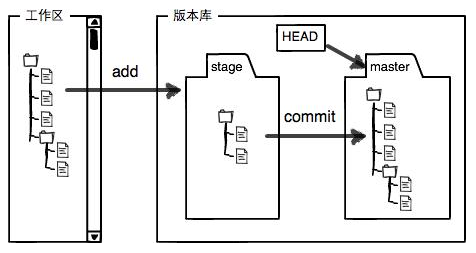

# Git Note

## Concepts



工作区： working directory
版本库： repo
stage, namely index

Git cannot track the change of binary files, such as images, videos, and Microsoft Word files.  

`HEAD` points to the current version of the repo. The previous versions are `HEAD^`, `HEAD^^`, ..., `HEAD~100`, ...

---

## Installation on Ubuntu

[Install Github on Ubuntu](https://linuxtechlab.com/how-to-install-github-on-ubuntu-step-by-step/)

---

## Command Line

1. Go to project directory. `git init`. Init the repo.
2. `git add .` Add "add" and "update" but not "delete" type of changes to stage.
3. `git add -A` or `git add -all` Add all kinds of changes to stage.
4. `git diff` Check changes of the code.
5. `git commit -m "<commit message>"`
6. `git remote add origin <remote repository URL>` Set the new remote.
7. `git remote -v` Check the remote URL.
8. `git push -u origin master` Push up to the remote repository.


- `gitk` built-in git GUI
- `git log` Check commit history and get "commit_id".
- `git reflog` Check commit history and get "commit_id" in a concise manner.
- `git reset --soft HEAD~` Only cancel the latest commit. Take the latest file from commit to index.
- `git reset --hard HEAD~` Roll back to the last version that has been committed to the repo.
- `git reset --hard <commit_id>` Roll back to the specific version in the repo.
- `git checkout -- <file_name>` Drop changes to the file in workspace.
- `git reset HEAD <file_name>` Take the file from stage back to workspace.

### Basic Usage

1. Install Git.
2. Configure Git.
    1. Open "git bash" terminal.
    2. Type:

    ```
    git config --global user.name "Your Name"
    git config --global user.email "email@example.com"
    ```

3. Initiate a repo. 

    ```
    mkdir <repo_name>
    cd <repo_name>
    git init
    ```

4. Create your project or add files in the working directory.
5. Add the file to stage. `git add <file_name>`.
6. Commit the file to repo. `git commit -m "Added <file_name>"`.
7. Modify the project in working directory. 
8. Check current status of the repo. `git status`.
9. Check detailed difference between working directory and repo. `git diff <file_name>`.
10. Add changes to stage and commit to repo. See step 5 and 6.
11. Check commit history (newest first). `git log`. Brief version `git log --pretty=oneline`.
12. Roll back to the last version of repo. `git reset --hard HEAD^`.
13. Roll back to a specific version of repo. `git reset --hard <commit_id>`. Full commit id is not necessary. The first several are enough. 
14. If you close the current terminal, you will need to use `git reflog` to get the commit id.
15. Drop changes to the file in the working directory and keep the working directory as same as stage or repo. （一键还原） `git checkout -- <file_name>`.
16. Unstage file changes that have been added to stage. `git reset HEAD <file_name>`. Then you can use step 15 to drop changes in working directory.
17. After removing a file in working directory, remove in stage and repo. 

    ```
    git rm <file_name>
    git commit -m "<message>"
    ```

### Remote Repo (GitHub)

**If you already have an existing local repo,**

1. Generate SSH key. Open "git bash" terminal. Type `ssh-keygen -t rsa -C "youremail@example.com"`. Then you will get "id_rsa" and "id_rsa.pub" file in ".ssh" directory. 
2. Log in GitHub -> Settings -> SSH keys -> New SSH key -> Fill title -> copy content of "id_rsa.pub" file to Key.
3. Create an empty repo on GitHub. The name should be the same as your existing local repo.
4. Link repos together. `git remote add origin git@github.com:<user_name>/<repo_name>.git`.
5. Push master branch of the local repo to remote repo origin branch. `git push -u origin master`. The first time with `-u`. Can omit it later.

**If you start a new project,** 

1. Create a new repo on GitHub.
2. Clone the remote repo to local machine. `git clone git@github.com:<user_name>/<repo_name>.git`.

Push other branches to remote origin repo. `git push origin <branch_name>`. Then there will be more than one branches on remote.

Clone dev branch from remote to local machine. `git checkout -b dev origin/dev`.

Compare a local branch with its corresponding remote branch:

1. `git branch -a`: list all branches including remote ones.
2. `git fetch`
3. `git diff <local_branch_name> <remote>/<remote_branch_name>`, e.g. `git diff master origin/master`: compare local master and remote master branch.

### Branch Management 

1. Create a new branch and switch to it. `git checkout -b <branch_name>`. Same as: 

    ```
    git branch <branch_name>
    git checkout <branch_name>
    ```

2. Check what the current branch is. `git branch`.
3. Develop. Add and commit.
4. Switch back to master branch. `git checkout master`.
5. Compare two branches: `git diff <branch_1_name> <branch_2_name>`. Only show file name without content, add `--name-only`.
6. Merge the new branch to master. `git merge <branch_name>`.
7. Delete the new branch. `git branch -d <branch_name_to_delete>`.
8. Check graphic and brief git log. `git log --graph --pretty=oneline --abbrev-commit`.

By default, Git uses "fast forward" mode to merge different branches. But you will lose branch info after deleting it in this way. You can forbid "fast forward" mode by `git merge --no-ff -m "<message>" <branch_name_to_merge>`.

Strategy: 

- Master branch should be stable. Only used for releasing.
- Dev branch is unstable which is used for development. When you are going to do release, merge the dev branch to master and then do release on master.
- Every team member uses his/her own branch to develop and merge to dev branch.

#### Bug Branch

When you are doing development and you have unstaged and uncommited changes, if there is sudden bug you need to fix, what should you do? 

1. When you are on your own development branch, use `git stash` to store your working directory temporarily because you cannot commit uncompleted job.
2. Switch to the branch where the issue is. `git checkout <branch_name>`.
3. Create a new branch for fixing the bug. `git checkout -b <bug_branch_name>`. You can use "issue-<issue_number>" as the bug branch name.
4. Fix the bug.
5. Add and commit changes.
6. Switch back to the branch where the issue is. 
7. Merge and bug branch and delete it.
8. Switch back to your own development branch.
9. Check stash. `git stash list`.
10. Restore stash. `git stash pop`.
11. Continue development and then add and commit.

#### Collaboration

When you pushing your local dev branch to remote origin/dev, if there is a conflict, which means you are behind the remote, you should pull the remote first, then fix conflict, then push again. Steps: 

1. If getting "no tracking information" message, you need to set up linkage between local dev branch and remote dev. `git branch --set-upstream-to=origin/dev dev`.
2. Pull the remote to local. `git pull`.
3. Fix conflict. Add and commit.
4. Push again. `git push origin dev`.

When you are going to merge your feature branch to develop branch, follow the below steps: 

1. Check out your feature branch.
2. `git pull origin develop` in terminal.
3. If there are conflicts, in Intellij IDEA, click "Version Control" tab at the bottom. 
4. Click "Resolve" -> "Merge" button.
5. Select what you want to accept. 
6. Commit.
7. Push.
8. Merge or pull request on GitHub.

#### Rebase

Rebase is used to reconstruct the branch commit history, making it look pretty. 

1. Push local to remote.
2. There is a conflict. Fail to push.
3. Pull remote to local.
4. Fix conflict.
5. Check commit history. `git log --graph --pretty=oneline --abbrev-commit`. Does not look pretty.
6. Rebase. `git rebase`.
7. Check commit history again. Looks good.
8. Push local to remote again.


### Tag

Each tag is bound with a commit. If this commit exists in multiple branches, you can see this tag in all of them.

1. Check out the branch that you want to tag.
2. Tag the HEAD. `git tag <tag_name>`, e.g. `git tag v1.0`.
3. Delete a local tag. `git tag -d v1.0`.
4. Push a tag to remote. `git push origin <tag_name>`.
5. Push all tags to remote. `git push origin --tags`.
6. Delete a remote tag. First use step 3 to delete locally. Then `git push origin :refs/tags/<tag_name>`.

- Tag with message. `git tag -a <tag_name> -m "<message>"`.
- Tag a specific commit. `git tag <tag_name> <commit_id>`.
- Check tags. `git tag`.
- Check tag info. `git show <tag_name>`.

---

## GitHub

If you participate an open source project, and you want to do contribution, steps:

1. Fork the project to your own repo.
2. Clone the project from your own repo. (**NOTE: not from the original repo.**)
3. Fix bugs or add new features.
4. Push to your own remote repo.
5. Raise a pull request to the original repo. Then wait for the project owner's reply (accept or not).

---

## Tips

Create .gitignore file in a folder on Windows: 

1. Right click in the folder -> Git Bash Here
2. In command line, type `touch .gitignore`. Then the file is create in the folder.

[A collection of useful .gitignore templates](https://github.com/github/gitignore)

---

## Useful Resources

- [git - the simple guide](http://rogerdudler.github.io/git-guide/)
- [Fork a repo](https://help.github.com/articles/fork-a-repo/)
- [Syncing a fork](https://help.github.com/articles/syncing-a-fork/)

