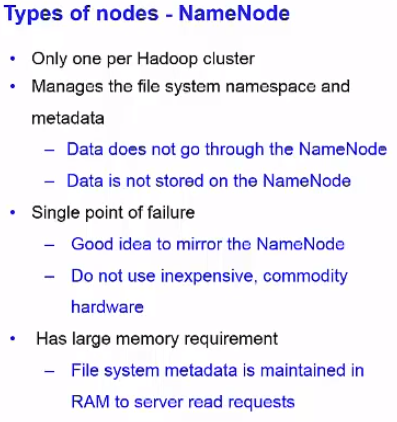
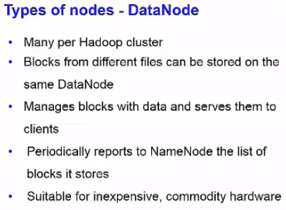

# Hadoop Note

## HDFS

### Original HDFS Design

- single NameNode
- multiple DataNodes
- manage storage - blocks of data
- serving read/write requests from clients
- block creation, deletion and replication

Changing blocksize and replication factor can improve performance.

Due to defect of MapReduce 1.0, top limit of number of nodes is 4000 in enterprise. There will be malfunction and breakdown if it is beyond the limit.

#### NameNode

#### DataNode

#### HDFS Architecture

#### HDFS Replication

---

### Yarn

#### MapReduce V1 -> Yarn

#### Yarn Architecture

There is a standby ResourceManager for availability.  

---

### HDFS Limitations

---

### HDFS Data Access

#### Read Data

#### Write Data

---

### HDFS Coding

Three shell style:

- `hadoop fs`: used for all kinds of file systems, such as local file system and HDFS file system.
- `hadoop dfs`: only used for HDFS file system.
- `hdfs dfs`: same as `hadoop dfs`, only used for HDFS file system.

#### HDFS Commands

- `hdfs dfs -put test.txt sampleDir`: Upload test.txt in the current directory to "sampleDir" folder on HDFS.
- `hdfs dfs -put test.txt`: Upload test.txt in the current directory to root directory on HDFS.
- `hdfs dfs -rm -R sampleDir/output`: Remove output files and directory itself using a recursive remove statement.
- `hdfs dfs mkdir /user/test`: Make "test" directory under "/user" directory.
- `hdfs dfs fsck /user/test/test.txt`: File system check.
- `hdfs dfsadmin –report`: HDFS administrator command.

- Arbitrarily create a 1GB dummy file sample.txt on the local file system: `dd if=/dev/urandom of=sample.txt bs=64M count=16`

---

## MapReduce

It is bad to have too many map tasks and a lot of small files.

Single reducer (Hadoop default)

### MapReduce Architecture

---

### MapReduce Workflow

- Number of split（分片）= number of map() function.
- Practically, 1 block of the file on HDFS is 1 split.
- 1 reducer per computer core (best parallelism)

---

### Shuffle

- The intermediate result of shuffle, which is files, will be saved on local disk rather than HDFS.

---

### Word Count

Hadoop shuffles, groups, and distributes

reduce() aggregates

---

### Combiner

If the workload of the reducer is too large, it would be good to set combiners between the mapper and the reducer (before shuffle).  

#### Combine VS Merge

- Combine: <a, 1>  +  <a, 1>  ->  <a, 2>
- Merge: <a, 1>  +  <a, 2>  ->  <a, <1, 2>>

---

### MapReduce Application Patterns

- Filtering patterns
  - Sampling
  - Top-N
- Summarization patterns
  - Counting
  - Min/Max
  - Statistics
  - Index
- Structural patterns
  - Combining data sets

---

### MapReduce Coding

- When we use Hadoop MapReduce to run the jar file, Hadoop does not like to have the .class files in the same directory with the jar file.
- If you want to run MapReduce jar file, **NOTE** that Hadoop expects that the output directory is empty (and it will create it, if necessary).

---

## Hadoop Applications

---

## Hadoop Versions

---

## Hadoop Cluster Deployment & Usage

---

## Hadoop Ecosystem

