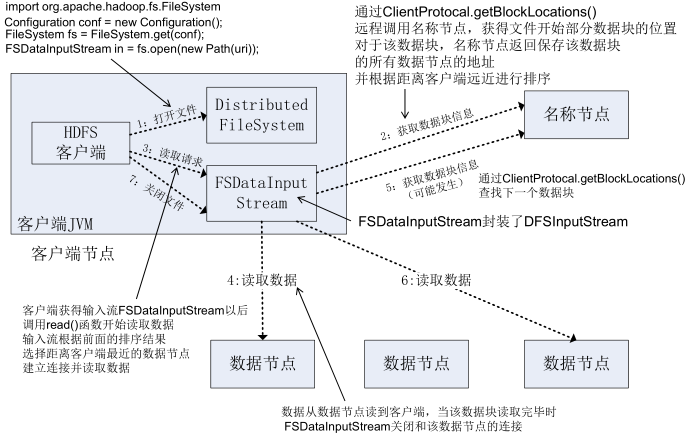
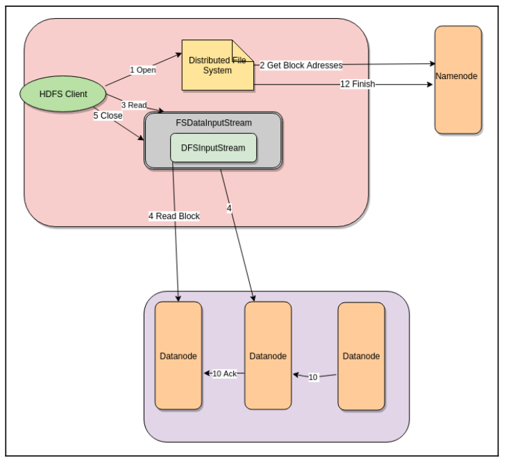

# Hadoop Note

## Hadoop Applications


---

## Hadoop 1.0

Two major components: 
- **JobTracker** is responsible for managing resources, scheduling jobs, monitoring each job, and restarting them on failure.  
- The **task trackers** are responsible for running tasks and sending progress report to JobTracker.

Limitations:

- Scalability: JobTracker spends the majority of its time managing the application's life cycle. The work overhead limits the scalability of Hadoop v1 to 4,000 nodes and 40,000 tasks.
- High availability: JobTracker is a single point of failure. Every few seconds, task trackers send the information about tasks to the JobTracker, which makes it difficult to implement high availability for the JobTracker because of the large number of changes in a very short span of time. 
- Memory utilization: Hadoop v1 required preconfigured task tracker slots for map and reduce tasks. The slot reserved for the map task cannot be used for the reduce task or the other way around.
- Non MapReduce jobs: Every job in Hadoop v1 required MapReduce for its completion because scheduling was only possible through the JobTracker. 

---

## HDFS

### Original HDFS Design

- Single NameNode
- Multiple DataNodes
- Manage storage - blocks of data
- Serving read/write requests from clients
- Block creation, deletion and replication

Changing blocksize and replication factor can improve performance.

Due to defect of MapReduce 1.0, top limit of number of nodes is 4000 in enterprise. There will be malfunction and breakdown if it is beyond the limit.

#### NameNode

- There is only one NameNode per Hadoop cluster.
- Manages the file system namespace and metadata.
  - Data does not go through and is not stored on NameNode.
- Single point of failure.
  - Good idea to mirror NameNode.
  - Do not use inexpensive, commodity hardware for NameNode. 
- Has large memory requirement.
  - File system metadata is maintained in RAM to server read requests.

#### DataNode

- There are many DataNodes per Hadoop cluster.
- Blocks from different files can be stored on the same DataNode.
- Manages blocks with data and serves them to clients.
- Periodically reports to NameNode the list of blocks it stores.
- Suitable for inexpensive, commodity hardware.

#### HDFS Architecture


#### HDFS Replication


---

### HDFS Limitations


---

### HDFS Data Access

#### Read Data





#### Write Data


---

### HDFS Coding

Three shell style:

- `hadoop fs`: used for all kinds of file systems, such as local file system and HDFS file system.
- `hadoop dfs`: only used for HDFS file system.
- `hdfs dfs`: same as `hadoop dfs`, only used for HDFS file system.

#### HDFS Commands

- `hdfs dfs -put test.txt sampleDir`: Upload test.txt in the current directory to "sampleDir" folder on HDFS.
- `hdfs dfs -put test.txt`: Upload test.txt in the current directory to root directory on HDFS.
- `hdfs dfs -rm -R sampleDir/output`: Remove output files and directory itself using a recursive remove statement.
- `hdfs dfs mkdir /user/test`: Make "test" directory under "/user" directory.
- `hdfs dfs fsck /user/test/test.txt`: File system check.
- `hdfs dfsadmin –report`: HDFS administrator command.


- Arbitrarily create a 1GB dummy file sample.txt on the local file system: `dd if=/dev/urandom of=sample.txt bs=64M count=16`

---

## Yarn

Introduced with Apache Hadoop 2.0.

### MapReduce V1 -> Yarn


### Architecture


Two major components: 

- **Resource Manager (RM)** is a master node that is responsible for managing resources in the cluster. 
  - **Scheduler**: allocates the required resources requested by the per application application master. Scheduler simply schedules the job. 
  - **Application Manager**: manages per application master and provides resources to launch application master for the application.
- **Node Manager**: a slave that runs on every worker node of a cluster and is responsible for launching and monitoring containers of jobs.

Application execution steps: 

1. The client submits the job to YARN, initiating RPC communication with RM. 
2. RM launches the application master for that particular job on one of the Node Manager Container.
3. The application master requests the required resources for application execution from the RM.
4. The RM sends the detailed information about the Resource Container to the application master.
5. The application master coordinates with the respective Node Manager to launch the container to execute the application task. 
6. The application master sends heartbeats at regular intervals to the RM and updates its resource usage.
7. The RM sends response to the application master.
8. The application master changes the plan of execution depending upon the response. 

### Resource Manager (RM)

#### RM High Availability

RM is the single point of failure in a YARN cluster. 


Components:

- RM state store: persists a RM state, then if RM fails, you can restart the RM from the last failure point based on the last state. 
  - file-based implementation
  - ZooKeeper-based implementation
    - Maintain an ACL (Access Control List) where only the active RM will have create-delete access and the other will only have read-admin access.
    - Leader elector is used to elect a new active RM.
- RM restart
  - After the RM is restarted, by default, it will restart all the application masters, kill all the running containers, and start them from a clean state, which increases the application completion time. So, you should preserve the **state of containers**, which avoids restarting the application masters and killing existing containers.
- Automatic failover: transfer control and old state to a **standby RM**.
- Failover fencing mechanism
  - Split brain situation: There can be **two or more** RMs in active/standby mode.
  - The failover fencing mechanism enables the active RM to restrict other RMs' operation. 
  - ZooKeeper-based state store only allows a single RM to write to it at a time.

Configuration in `YARN-site.xml`:

- Enabling high availability.
- Assign unique IDs to RM.
- Attaching unique RM hostname to IDs.
- Configuring RM web application.
- ZooKeeper address.

#### Yarn Schedulers

YARN provides a configurable scheduling policy that allow you to choose the correct scheduling strategy based on an application's need.  

Hortonworks uses capacity scheduler by default.


##### FIFO Scheduler 

1. YARN makes a queue of requests.
2. Add applications to the queue.
3. The first application in the queue will be allocated the required memory, then the second, third ...
4. In case memory is not available, wait.

FIFO is not suited for shared clusters as large applications will occupy all resources and queues will get longer.

##### Capacity Scheduler

- Multi tenancy: There can be many use cases on the same cluster. 
- Cost-effective: If there are no other applications submitted to the queue, then resources will be available for other applications.
- Reserved memory

Capacity scheduler makes sure that users get the guaranteed minimum amount of configured resources in the YARN cluster. Cluster resources are shared across multiple user groups.

A cluster is divided into partitions (known as queues) and each queue is assigned with a certain percentage of resources.

Capacity scheduler supports hierarchical queues to ensure resources are shared among the sub-queues of an organization before other queues are allowed to use free resources, thereby providing affinity for sharing free resources among applications of a given organization.

For instance, 

1. There is a queue A with 60% resource share and B with 40% resource share. 
2. Submit first job to queue A, the capacity scheduler will allocate all 100% of the available resources to queue A.
3. While the first job is running, another user submits a second job to queue B.
4. The capacity scheduler will kill a few tasks of first job and assign it to the second job to ensure that queue B gets its guaranteed minimum share from the cluster resources. (preemption)

Configuration:
- Configure the capacity scheduler in `YARN-site.xml` file.

    ```xml
    <property>
        <name>YARN.resourcemanager.scheduler.class</name>
        <value>org.apache.hadoop.YARN.server.resourcemanager.scheduler.capacity.CapacityScheduler</value>
    </property>
    ```

- Configure the queues properties and capacity value in the `scheduler.xml` file.

##### Fair Scheduler

- All applications get almost an equal amount of the available resources. 
- Prevents applications from resource starvation. 
- Makes sure that resources are not under utilized. 

1. The first application is submitted to YARN.
2. Fair scheduler assigns all the available resources to that application. 
3. The second application is submitted to the scheduler.
4. The scheduler will start allocating resources to the second application until both the applications have almost an equal amount of resources.

Configuration:

- If configured properly, the number of applications that can be run per user and per queue can be limited. 
- Configure the fair scheduler in `YARN-site.xml` file.

    ```xml
    <property>
        <name>YARN.resourcemanager.scheduler.class</name>
        <value>org.apache.hadoop.YARN.server.resourcemanager.scheduler.fair.FairScheduler</value>
    </property>

    <property>
        <name>YARN.scheduler.fair.allocation.file</name>
        <value>/opt/packt/Hadoop/etc/Hadoop/fair-scheduler.xml</value>
    </property>
    ```

- Configure the scheduler properties and queue weight value in the `fair-scheduler.xml` file.

### Node Manager 

Each worker node has one Node Manager.

The job of Node Managers: 

- Run and manage the life cycle of containers on worker nodes.
- Send heartbeats and node information at regular intervals to the RM.

Any Node Manager that does not send a heartbeat to the RM for **10 minutes** is considered dead and will not be used for running any container on it. You can set the interval through `YARN.am.liveness-monitor.expiry-interval-ms` in the YARN configuration.

### Application Master

The application master acts as a mediator between the RM and the Node Manager for resource requirements of its application. 

Similarly to Node Manager, the application master sends heartbeats to the RM. If no heartbeats for **10 mins**, considered as dead. Then the containers used by these dead application masters are then destroyed and the RM launches a new application master for the application on a new container. If still the application master fails, the RM repeats the process for **4 attempts** (by default) and then sends a failure message to the client.

### Node Labels

Each node can only have one label.

Machines with the same label name can be used for specific jobs.

Jobs that require more powerful machines can use the same node label during submission.

The basic idea of a node label is to create the partition of nodes so that each partition can be used for a specific use case. 

Two types of node labels:

- exclusive 
- non-exclusive

Configuration:

1. Enabling node label and setting node label path in `YARN-site.xml`.
2. Creating directory structure on HDFS.
3. Granting permission to YARN.
4. Creating node label.
5. Assigning node with node label.
6. Queue-node label association in `YARN-site.xml`.
7. Refreshing the queue.
8. Submitting job.

### YARN Timeline Server

The YARN Timeline server is responsible for retrieving current as well as historic information about applications including application info and framework info (such as the number of map and reduce tasks for MapReduce, the number of executors and cores for Spark).

In Hadoop 3.x, two major challenges in previous version are addressed:

- Scalability and reliability: This version uses a distributed writer and the primary storage for Timeline server is **HBASE** because of the advantage of **fast read and write** requests.  
- Flows and aggregation: A single application can consist of many sub applications. YARN aggregates the metrics from all sub applications and their attempts.

Configuration in `YARN-site.xml`: 

- Basic configuration
- Host configuration

Command to start the Timeline server: `YARN timelineserver`

### Opportunistic Containers 

The current container execution design has two primary limitations:

- **Heartbeat delay** happened among any container finishes its execution, RM, and application master launches new container.
- **Resource allocation and utilization**: The resources allocated to a container by the RM can be significantly higher than what is actually being utilized by the container.

In Hadoop 3.x, YARN introduces opportunist container. 
- Containers are allocated to nodes by the scheduler only when there is sufficient unallocated resources at a node. 
- Opportunist containers can be sent to a Node Manager even if there are no sufficient resources available. They will be queued until there are resources available for its execution.
- The opportunist container priority is lower than the guaranteed container, which means it can be killed when there is resources requested for guaranteed containers. 

Two ways in which opportunist containers are allocated to an application:

- Centralized (by default): The containers are allocated through a YARN RM. The RM collects the information about each node (such as the number of currently running guaranteed containers, opportunist containers, and queued opportunist containers) and determines the least busy node. 
- Distributed: The `AMRMProxyService` works as a proxy between the RM and the application master.

Configuration in `YARN-site.xml`.

### Docker containers in YARN

YARN has added support for Docker containerization.

Different versions of the same application can be run in parallel and they will be completely isolated from one another.

### Yarn Commands

Move one job to another queue on Yarn: `yarn application -movetiqueue <app_id> -queue <queue_name>` in terminal.

---

## MapReduce

It is bad to have too many map tasks and a lot of small files.

Single reducer (Hadoop default)

### MapReduce Architecture


---

### MapReduce Workflow


- Number of split（分片）= number of map() function.
- Practically, 1 block of the file on HDFS is 1 split.
- 1 reducer per computer core (best parallelism)


---

### Shuffle

- The intermediate result of shuffle, which is files, will be saved on local disk rather than HDFS.


---

### Word Count


Hadoop shuffles, groups, and distributes


reduce() aggregates


---

### Combiner

If the workload of the reducer is too large, it would be good to set combiners between the mapper and the reducer (before shuffle).  

#### Combine VS Merge

- Combine: <a, 1>  +  <a, 1>  ->  <a, 2>
- Merge: <a, 1>  +  <a, 2>  ->  <a, <1, 2>>

---

### MapReduce Application Patterns

- Filtering patterns
  - Sampling
  - Top-N
- Summarization patterns
  - Counting
  - Min/Max
  - Statistics
  - Index
- Structural patterns
  - Combining data sets

---

### MapReduce Coding

- When we use Hadoop MapReduce to run the jar file, Hadoop does not like to have the .class files in the same directory with the jar file.
- If you want to run MapReduce jar file, **NOTE** that Hadoop expects that the output directory is empty (and it will create it, if necessary).

---

## File Formats

In order to know when to use what, there are four parameters to be considered for each file format: 

- Row format VS column format (one of the most important factors)
  - Column-based format: better performance when performing analytic queries that require only a subset of columns; well-suited for sparse datasets where we may have lots of **empty values**.
- Schema evolution (or schema change): How will specific file formats handle the fields that are added, modified, or deleted? Use different versions of the schema while reading and writing the data, and the new field will use default value and the deleted file will be ignored during reading.
- Splittable VS non-splittable: split files into multiple chunks and send them across different machines for processing. 
  - XML or JSON record files are not splittable.
- Compression: encoding on frequently repeating data before it is stored on the disk or transmitted over the network. 
  - Column-based format: better compression rates than row-based data.
  - Compression and decompression result in compute costs.
  - You should choose better trade-offs between storage and compute performance.
  - **The selection of the compression format will be based on how the data will be used.** 
    - For archival purposes: the most compact compression.
    - For data used in processing jobs: splittable format.

### Types

#### Text

The **main use case of Hadoop** is the storage and analysis of web logs and server logs.

Cons: 

- Text files take in considerable space on Hadoop cluster.
- Overhead of type conversion associated with storing the data.

#### Sequence File

- **Row-based**
- Each record in a Sequence file contains record related metadata, followed by key and value bytes (key-value pair).
- Common use case: combine small files into a single large file in order to avoid Hadoop small file problem.
- **Container format file**, so supports **compression**: 
  - Record level: Value bytes are compressed.
  - Block level: Both keys and values are compressed.
    - Configure the size of block: `io.seqfile.compress.blocksize`

#### Avro

- **Container format file**
- Avro is developed to remove the language dependency of Hadoop writable.
- Data written in one language can be easily read and processed by other formats.
- Avro has an attached schema in another file.
- **Row-based**
- **Schema evolution**
- **Splittable** and **compression**

#### ORC (Optimized Row Columnar)

- ORC is designed for high performance when Hive is reading, writing, and processing data; to maximize storage and query efficiency.
- **Columnar** format, highly efficient for **compression** and storage.
- **Splittable** 
- Good option for **read-heavy** workloads.
- **Schema evolution**

Components: 

- Stripes of data: data building blocks.
- Footer file: includes descriptive statistics for each column.

Facebook uses ORC to save tens of petabytes in their data warehouse and demonstrated that ORC is **significantly faster than RC File or Parquet**.

#### Parquet

- Developed by Cloudera and Twitter.
- **Container format file**
- Optimized **columnar** 
- **Splittable** and highly **compressed**
- Commonly used with Apache Impala, which is designed for low latency and high concurrency queries on Hadoop.
- **Especially adept at analyzing wide datasets with many columns.** 
- **Schema evolution**
- Good choice for **read-heavy** workloads.

Components: 

- Column metadata is at the end of the file.
- For each **row group**, the data values are organized by column. 

---

## Data Compression 

compression format = coder-decoder (codec)

### Pros

- Less storage
- Reduce processing time: Adept when data size is big and much shuffling required across a distributed cluster.
- CPU and I/O trade-off: Decompression operation increases the overall job processing time when data size is significant.
- Block compression in Hadoop: **Not advisable** to compress one big file. Instead, use block compression for splittable file format. 

Splittable compression format: A single large file is stored as many data blocks distributed across many nodes in HDFS. If using splittable compression algorithms, data blocks can be decompressed in parallel.  

### Comparison

|Codec|Splittable|Degree of compression|Compression speed|
|--|--|--|--|
|Gzip|No|Medium|Medium|
|BZip2|Yes|High|Slow|
|Snappy|No|Medium|Fast|
|LZO|No, unless indexed|Medium|Fast|

### Choice 

Completely depends on:

- the objective of the use case 
- tools are being used for processing

If you use container file format, fast compression algorithms such as Snappy, LZ4, and so on should be used.  

**A compressed chunk size of files should be approximately equal to or less than the HDFS block**, which helps in achieving better read performance as a single mapper will be able to process more decompressed data.

There is **no point in applying compression over a file that is not splittable in nature.** 

### Types

#### Gzip

- Based on the DEFLATE algorithm.
- Higher compression ratio. Compression performance is more than **two times** that of Snappy in most cases.
- Good choice for **cold data**.

#### BZip2

- Based on the Burrows-Wheeler algorithm.
- Better compression performance than Snappy.
- Processing performance is significantly slower than Snappy.
- Good choice for **cold data**.

#### LZO (Lempel-Ziv-Oberhumer)

- The **modest compression ratio**
- **Fast speed** for compression and decompression
- **Non-splittable compression** unless creating an index to tell where to split the file.

#### Snappy

- Very high speeds and reasonable compression
- **Non-splittble**
- **Inherently splittable** and should be used with a container file format. (https://stackoverflow.com/questions/32382352/is-snappy-splittable-or-not-splittable)

---

## Serialization

The process of converting structured objects into a byte stream that will be transferred **over a network** (such as inter-process communication using RPCs) or will be written **to a persistent storage**. 

---

## Data Ingestion

### Types

#### Batch Ingestion 


Design considerations: 

- Batch size
  - Configuring the optimized batch size can increase the performance of ingestion. Larger batch size requires more memory to be allocated to the task containers.
- Parallelism: how many parallel connections the source system allows for the application.
- Incremental ingestion
  - The incremental ingest is only possible if the source system has some fields to identify when a record was created, updated, or deleted, such as `date_created`, `date_modified`, and so on.
- Schema changes
  - Using a schema evolution file format to deal with such scenarios.
- Access pattern, file format, and compression codec
  - Better performance is increase in speed by more than 60% based on the file format used with a specific compression codec.

#### Micro Batch Ingestion

Duration of intervals: short, such as 30 minutes, 1 hour, and so on.


Design considerations: 

- Data loss or duplicate data
  - **Always better** to deal with data loss first and remove duplicates once the data has landed on your storage system.
- Small file problem
  - The first step should be the merging of smaller files into bigger ones. 
- Ingestion throughput
  - **Always good** to configure and give fair amounts of resources for the micro data ingestion process in order to make throughput good enough to finish the ingestion process before the next micro ingestion batch triggers.
- History data
  - **Always a good practice** to maintain the history of ingested data. You can maintain the date partition at first stage of directory (e.g. staging cluster) and move very infrequently used data to some low-cost storage system. 

#### Real-time Ingestion

The systems used as a storage layer for real-time data: Kafka, AWS Kinesis, Apache Flume, and so on.

Flume deletes the data immediately after the downstream system consumes and acknowledges the data. 

In many use cases, Flume and Kafka are used together to maintain the data for some time.


Design considerations: 

- Avoid data loss
  - It may happen that you get a commit timeout from Kafka or another system, and you can always re-send the events to the target system. It is also important to write failed producer events to some other local filesystem to avoid data loss because of target system failure, and alert the users if the numbers are really high. 
- Retention period: The amount of time you want to keep the real-time events on these storage systems, e.g. Kafka.
  - If the data is not being used for real-time processing, you should offload it to some distributed file system, e.g. HDFS.
- Capturing bad events
  - Bad events such as a parsing exception, casting exception, or so on, must be captured in some bad event file. 
- Monitoring storage system
  - A monitoring and alerting system helps in avoiding any data loss because of disk space, system failure, or any other failure. 

---

## Data Processing

### Types

#### Batch Processing

Design consideration:

- **Maintaining history data with partition** so that all the intermediate stage data can be recreated using the same application logic over all data.
- On demand cluster: Cloud technology. 
- File format and compression
- Avoid shuffling of data
- Data quality
  - This is used to eliminate a record that does not make any sense in processing because it has column values that do not pass the data quality check. **Recommended** to run a data quality check so that if the data quality threshold is not met, do not run the batch.
- Effective use of resources
  - Analyze program and decide how many mappers or partitions we really need for the batch processing.

#### Micro Batch Processing

- Group stream events into a micro batch.
- Dependent on replayability of some stream sources. 

Design consideration:

- Avoid unreliable processing
  - Acknowledgement mechanism: Acknowledgement to a source stream system like Kafka should be sent after the successful processing of an event if you do nt want to lose data.
- Data duplication or duplicate processing of events
  - Think about a scenario where data is successfully processed and before sending an acknowledgement back to the source stream provider like Kafka, the application processing event went out of service. In such a case, when the application restarts, it will consume the data from the same offset, which will result in duplicate processing.
- Batch with size and time
  - You receive more events during peak hours of business whereas less events during non-peak hours of business. The size of event batches should be configured by both tuple size and time. This will ensure that even if a batch does not meet the condition of a configured batch size, it will go for processing if the waiting time has reached the timeout, and vise versa.
- Choosing right framework: Spark, Flink 

#### Real-time Processing

The target data store must have support for high-volume writes. 

Design consideration:

- Enable checkpointing: Maintain the metadata of the current state of the application, which helps in building fault tolerant applications. 
- Loosely coupled ingestion and processing
  - The system that is generating events in real time should **not** be directly integrated with the processing application. The event that was generated should be pushed to a distributed messaging system like Kafka, where data will be persisted from some time and can be replayed whenever required. 
- Multiple event producer
- Parallelism
  - In most cases, parallelism depends on how the stream source system, like Kafka, has been configured. Must carefully plan the amount of parallelism by considering event rate, cluster capacity, complexity of processing, and so on. 
- Target system capability
- Data duplication and data loss

### Common Design Pattern

#### Slowly Changing Dimension

Concept: Some or most part of the data changes at irregular intervals. 

- Type 1: Overwrites all the old data with new and updated records, **without** maintaining history of old data. 
- Type 2: Maintains the history of records with versions.

#### Duplicate Record 

Solution for Hive: Distinct query -> load result into a new table. 

#### Small Files

Solution for Hive: 

- If number of records are not huge, write the result of Hive query to one output file.
- Merge files at the end of each map task. 
  1. Set `hive.merge.mapfiles` to true.
  2. Set `hive.merge.size.per.task` to the desired per file size in bytes, or set `hive.merge.smallfiles.avgsize` to some desired threshhold value.
  3. Then Hive will run additional jobs to merge the files into a bigger one.
- Merge files at the end of each map reduce task. 
  1. Set `hive.merge.mapredfiles` to true.
  2. Same with the above. Set `hive.merge.size.per.task` or `hive.merge.smallfiles.avgsize`.
- Merge small files in a partition table using Hive query: `ALTER TABLE tablename [PARTITION partition_detail] CONCATENATE;`.

Solution for Spark:

- Reparation the RDD when writing the output to disk: Use `coalesce(numPartitions)` at the end of the Spark job.

### Real-time Lookup

Ways to do lookups when doing batch processing:

- In memory lookup
  - If the dataset used for lookup is a few MB, always **recommend** to use in memory lookup.
- REST API calls
  - If you do not have permission to access a dataset for lookup, making REST API calls is an option. 
- Redis or database lookup
  - If the lookup dataset is huge or it is getting updates every few minutes or seconds, **recommend** to have fast lookup by using Redis.

---

## Data Governance

The process of ensuring high quality, high availability, usability, integrity, and security of the data. 

It helps the organization identify who is responsible for the data, collaborate to set policies and decisions, analyze how the data is used and what it is for, understand how and where metrics and information are derived, and determines the impact of any change in data on the business.

Three data governance pillars: 

- Metadata management
- Data life cycle management 
- Data classification

All of the above are based on governance policies. 

### Metadata Management 

Features: 

- Capture metadata
  - Capture at the time of its creation.
  - Identify all the external and internal metadata sources that the business is trying to use for decision-making.
  - Tool: Apache Atlas
- Metadata storage
  - Central persistent storage removes the possibility of keeping duplicate data.
- Data lineage: shows the entire flow of data from the time of its creation. 
  - Visual representation
  - Dependencies of intermediate processes or steps
  - Column lineage of tables (advanced)
- Data security and access control
  - All the PII (Personally Identifiable Information), PHI (Protected Health Information), or PCI (Payment Card Industry) data should be protected using masking and encryption, must not be downloaded or sent across a network without ensuring security compliance consideration. 

### Data Life Cycle Management (DLM)

Managing data from the start of its creation, initial storage, until it is destroyed or archived, such as  

- putting the data into separate layers according to configured policies.
- automating data migration from one layer to another layer by certain criteria.

Consideration:

- Masking encryption
- When accessing sensitive data, all the user's activities should be monitored and controlled to prevent data leak.
- Configure policies to auto-delete obsolete data.

### Data Classification

Classify data based on defining the level of **sensitivity** and the **impact to the business** should that data be disclosed, altered, or destroyed without authorization, in order to ensure an effective level of **data protection**.

Prerequisites: 

- Define roles and responsibilities for classifying data.
- Define policies and procedures for data classification. 

Three categories: 

- Sensitive / Restricted data
  - Significant level of risk to the business
  - Violation of security laws of the country, domain, state, or specific organization
  - All PHI, PCI, and PII compliance data falls into this category.
- Internal data
  - Low impact on the business
  - Policies are defined internally by the organization. 
- Public data

Defining the data classification procedure:

1. Identify data owner.
   - The owner must define the authorized and unauthorized users, and classify the information asset and guide its control within the organization. 
2. Identify and analyze data vulnerabilities / risks.
   - Data control, data encryption, and the process to take if a security breach happened.
3. Define and apply control.
   - Authorized and unauthorized users
4. Maintaining audit logs.
   - Audit log should be able to capture all user or system activity, track what changes have been made to any system, who made the changes, and at what time. 
   - 
---

## Hadoop Variants


---

## Hadoop Cluster Deployment & Usage


---

## Hadoop Ecosystem

