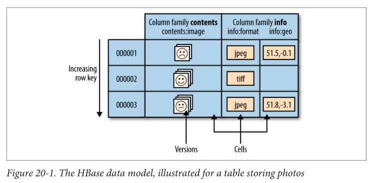
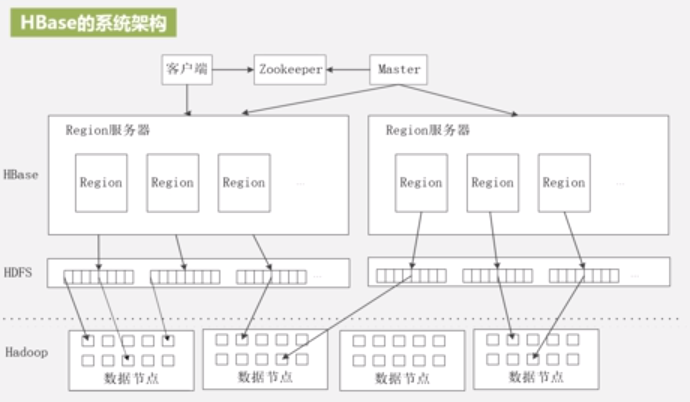
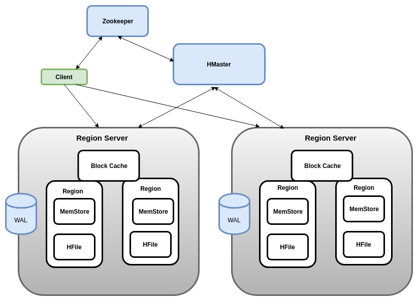
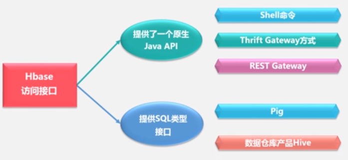
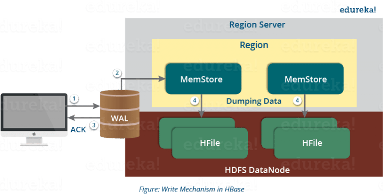

# HBase Note

HBase is a NoSQL database, a distributed, scalable, **column-oriented** database running on top of HDFS, which is modeled after Google's BigTable.

When to use: 

- HBase is used to host very large tables - **billions of rows * millions of columns**. You should have enough data. Otherwise, use RDBMS for a few thousand/million rows.
- Use HBase when you need **random, real-time read/write** access to your Big Data. 
- A great amount of data is stored redundantly for performant analysis.
- HBase is not relational. Does not support SQL. Use it if you do not need some RDBMS features (e.g. typed columns, secondary indexes, transactions, advanced query languages, etc.).
- When you have enough hardware. HDFS does not do well with anything less than 5 DataNodes plus a NameNode.

## Basics

### Data Model

#### Namespace

A logical grouping of tables analogous to a database in RDBMS, which indicates the division of business logic.

It is used for multi-tenancy related features:

- Quota Management: Restrict the amount of resources (i.e. regions, tables) a namespace can consume.
- Namespace Security Administration: Provide another level of security administration for tenants.
- Region server groups: A namespace/table can be pinned onto a subset of RegionServers thus guaranteeing a coarse level of isolation.

#### Cells

The timestamp is auto-assigned by HBase at the time of cell insertion.

A cell’s content is an uninterpreted **array of bytes**.

#### Rows

Rows are sorted by row key. The sort is byte-ordered.

Row keys are **byte arrays**, so anything can serve as a row key.

Row updates are atomic.

#### Columns

Format: `<column_family>:<qualifier>`

Column families must be specified up front as part of the table schema definition, but new column family members (qualifiers) can be added on demand.

All column family members are stored together on the filesystem.

Tuning and storage specifications are done at the column family level.

Column family attributes: 

- Whether the family content should be compressed on the filesystem.
- How many versions of a cell to keep by specifying `ColumnFamilyDescriptorBuilder.setMaxVersions(int versions)`. The default value is 1.

#### HBase VS RDBMS

For HBase,

- Distribution is intrinsic.
- Column-oriented： entries in a column are stored in contiguous locations on disks.
- Horizontally partitioned and replicated
- Cells are versioned. 
- Rows are sorted. 
- Columns can be added on the fly by the client as long as the column family they belong to preexists.
- **Does not support secondary indexes (indexing of other columns).**
- Commodity hardware
- Fault tolerance
- Strict consistency

For RDBMS, 

- Fixed-schema
- Row-oriented
- ACID properties
- Secondary indexes
- Complex queries
- Complex inner and outer joins
- Costly hardware

##### Column- VS Row-Oriented

Column-oriented: analytical application, high data compression ratio

Row-oriented: more transactional operations, low data compression ratio 

---

## Architecture

### Region

Tables are automatically partitioned horizontally by HBase into regions.

Initially, a table comprises a single region, but as the region grows it eventually crosses a configurable size threshold, at which point it splits at a row boundary into two new regions of approximately equal size. 

Regions are the units that get distributed over an HBase cluster. Each node hosts a subset of the table’s total regions.

A region has a default size of 256MB which can be configured. 

### HBase Master (HMaster)

lightly loaded

- Bootstrap a virgin install.
- Assign regions to registered regionservers.
- Provide an interface for creating, deleting and updating tables.
- The active HMaster sends heartbeats to the Zookeeper while the inactive HMaster listens for the notification send by active HMaster. If the active HMaster fails to send a heartbeat the session is deleted and the inactive HMaster becomes active.

### RegionServer

- Handle client read/write requests.
- Manage region splits.
- Communicate with HBase master.

A Region Server can serve approximately 1000 regions to the client.

### ZooKeeper

- Host vitals:
  - location of the `hbase:meta` catalog table
  - address of the current cluster master
- Assignment of regions is mediated via ZooKeeper, which hosts the assignment transaction state in and makes it recovery.
- Every Region Server along with HMaster Server sends continuous heartbeat at regular interval to Zookeeper and it checks which server is alive and available.
- Provide server failure notifications so that, recovery measures can be executed.

### HDFS

HBase persists data via the Hadoop filesystem API. 

By default, HBase writes to the local filesystem, which is used for experimenting with your initial HBase install, but not for production.

The first configuration made in an HBase cluster usually involves
pointing HBase at the HDFS cluster.

### Catalog Table

name of catalog table: `hbase:meta`

Maintains the current list, state, and locations of regions.

Entries in `hbase:meta` are keyed by region name.

Region name format: `table_name,region's_start_row,time_of_creation.MD5_hash_of_all_above.`

Example: `TestTable,xyz,1279729913622.1b6e176fb8d8aa88fd4ab6bc80247ece.`

### BlockCache 

Locations and user-space region start and stop rows are cached, so clients do not need to go back to the `hbase:meta` table to figure out hosting regions every time, until there is a failure.

### Write-Ahead Log (WAL)

(Prior to 2.0, the interface for WALs in HBase was named HLog. In 0.94, HLog was the name of the implementation of the WAL.)

Stores the new data that has not been persisted or committed to the permanent storage.

WAL is hosted on HDFS, so **fault tolerant**.

### MemStore

MemStore is the write cache.

Stores all the incoming data in sorted manner before committing it to the disk or permanent memory.

MemStore commits the data to HFile when the size of MemStore (`hbase.hregion.memstore.flush.size`) exceeds.

One MemStore for each column family in a region.

### HFile

Stores the actual cells on the disk. 

---

## Operations

**What makes HBase faster fir search while reading and writing? **

- The writes are placed sequentially on the disk. Therefore, the movement of the disk’s read-write head is very less.
- The HFile indexes are loaded in memory whenever an HFile is opened.
- Bloom Filter helps in searching key value pairs. It skips the file which does not contain the required rowkey. 
- Timestamp helps in searching a version of the file. It helps in skipping the data.

### New Client Connection

Steps:

1. Connect to ZooKeeper to learn the location of `hbase:meta`.
2. Look up hosting user-space region and its location in BlockCache. 
3. Interact directly with the hosting regionserver.

### Write Data

Steps:  

1. Append new data to a commit log (WAL).
2. Add to an in-memory "memstore".
3. Once the data is placed in MemStore, then the client receives the acknowledgment.
4. When a memstore is full, flush content to the filesystem (HFile).

### Read Data

Steps:

1. Region's memstore is consulted. If sufficient versions are found reading memstore alone, the query completes there. 
2. Otherwise, flush files are consulted in order, from newest to oldest. Result: found or not found.

### Compaction 

A background process compacts flush files once their number has exceeded a threshold, rewriting many files as one, in order to increase performance on read operations. 

Compactions can be resource-intensive to perform.

**Write amplification**: During compactions, input-output disks and network traffic might get congested. So, compaction is generally scheduled during low peak load timings.

#### Minor Compaction

Select a small number of small, adjacent StoreFiles and rewrite them as a single StoreFile (a facade of HFile).

The end result of a minor compaction is fewer, larger StoreFiles for a given Store.

#### Major Compaction

- Cleans out versions beyond the schema-configured maximum. 
- Removes deleted and expired cells.

The end result of a major compaction is a single StoreFile per Store.

In a default configuration, major compactions are scheduled automatically to run once in a 7-day period. This is sometimes inappropriate for systems in production.

#### Compaction & Deletions

When an explicit deletion occurs in HBase, the data is not actually deleted. 

Instead, a **tombstone marker** is written. The tombstone marker prevents the data from being returned with queries. 

During a major compaction, the data is actually deleted, and the tombstone marker is removed from the StoreFile. 

#### Compaction & Versions

If more versions than the specified maximum exist, the excess versions are filtered out and not written back to the compacted StoreFile.

---

## Failure Recovery

Whenever a Region Server fails, ZooKeeper notifies to the HMaster about the failure.

Then HMaster distributes and allocates the regions of crashed Region Server to many active Region Servers. To recover the data of the MemStore of the failed Region Server, the HMaster distributes the WAL to all the Region Servers.

Each Region Server re-executes the WAL to build the MemStore for that failed region’s column family.

---

## Coding

- `list`: List all created tables in the current DB.
- `create '<table_name>', '<column_family_name>'`
- `describe '<table_name>'`: Check basic info of the table.
- `scan '<table_name>'`: Check all data of a table.
- `put '<table_name>', '<row_key_value>', '<column_family_name>:<column_name>', '<cell_value>'`: Insert data.
- `get '<table_name>', '<row_key_value>'`: Check data of a row.
- `get '<table_name>', '<row_key_value>', '<column_family_name>:<column_name>`: Check data of a cell.
- `truncate '<table_name>'`: Delete data in the table.
- Delete a table: `disable '<table_name>'` and then `drop '<table_name>'`
- `count '<table_name>'`: Type this in shell is not distributed. So, **for large tables the MapReduce program is preferable.**

Take "student" table as an example:

| id | name     | gender | age |
| :--| :--------| :------| :---|
| 1  | Zhangsan | F      | 23  |
| 2  | Lisi     | M      | 24  |

1. `create 'student', 'info'`
2. `put 'student', '1', 'info:name', 'Zhangsan'`
3. `put 'student', '1', 'info:gender', 'F'`
4. `put 'student', '1', 'info:age', '23'`
5. `put 'student', '2', 'info:name', 'Lisi'`
6. `put 'student', '2', 'info:gender', 'M'`
7. `put 'student', '2', 'info:age', '24'`

---

## Integration with Spark

1 HBase Connection - 1 Spark Executor

Spark Executors can be on the same nodes as the Region Servers or on different nodes.

[Hortonworks Spark-on-HBase: DataFrame based HBase connector](https://hortonworks.com/blog/spark-hbase-dataframe-based-hbase-connector/)

[Cloudera Spark2使用HBase-Spark访问HBase](https://cloud.tencent.com/developer/article/1399924)