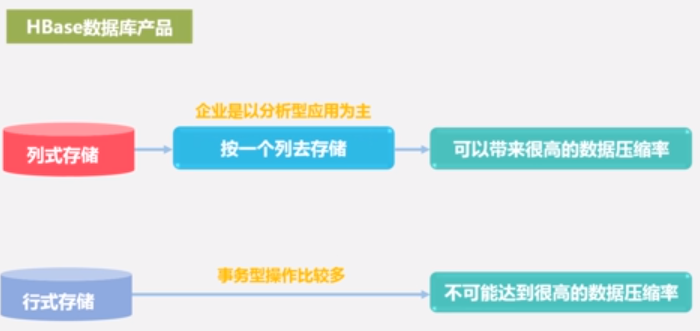

# HBase Note

## Basics

- Scalable data store
- Is NoSQL
- Runs on top of HDFS
- Compression
- In-memory operations:
  - MemStore
  - BlockCache
- Pursues efficiency of analysis. A great amount of data is stored redundantly.

---

## Architecture

---

## Coding

- `list`: List all created tables in the current DB.
- `create '<table_name>', '<column_family_name>'`
- `describe '<table_name>'`: Check basic info of the table.
- `scan '<table_name>'`: Check all data of a table.
- `put '<table_name>', '<row_key_value>', '<column_family_name>:<column_name>', '<cell_value>'`: Insert data.
- `get '<table_name>', '<row_key_value>'`: Check data of a row.
- `get '<table_name>', '<row_key_value>', '<column_family_name>:<column_name>`: Check data of a cell.
- `truncate '<table_name>'`: Delete data in the table.
- Delete a table: `disable '<table_name>'` and then `drop '<table_name>'`

Take "student" table as an example:

| id | name     | gender | age |
| :--| :--------| :------| :---|
| 1  | Zhangsan | F      | 23  |
| 2  | Lisi     | M      | 24  |

1. `create 'student', 'info'`
2. `put 'student', '1', 'info:name', 'Zhangsan'`
3. `put 'student', '1', 'info:gender', 'F'`
4. `put 'student', '1', 'info:age', '23'`
5. `put 'student', '2', 'info:name', 'Lisi'`
6. `put 'student', '2', 'info:gender', 'M'`
7. `put 'student', '2', 'info:age', '24'`
