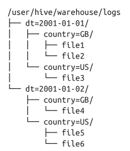
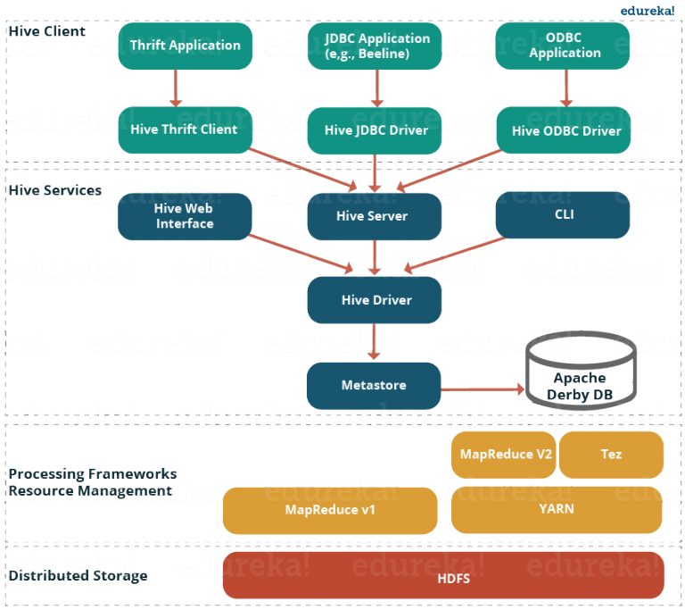
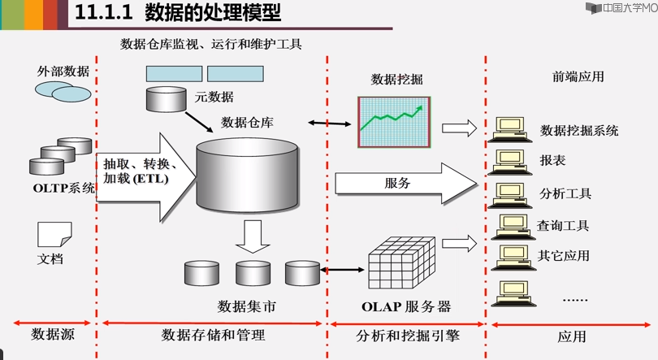
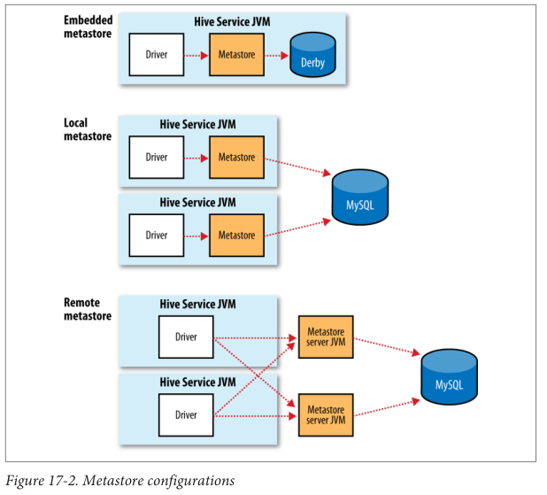
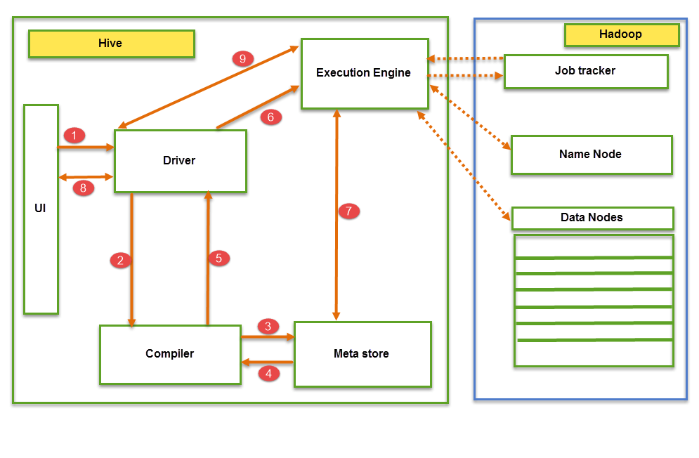

# Hive Note

## Basics

- Hive is a **data warehousing** component based on Hadoop, which performs reading, writing and managing large data sets in a distributed environment using SQL-like interface: HiveQL.
- Enables users to do ad-hoc querying, summarization and data analysis and data mining easily that does not require real time processing.
- Hive internally gets converted into **MapReduce** programs.
- You can couple Hive with other tools to use it in many other domains. For example,
  - Tableau along with Apache Hive can be used for Data Visualization.
  - Apache Tez integration with Hive will provide you real time processing capabilities.
- Stores data in HDFS by default. Also supports Amazon S3.

---

### Data Units

#### Databases

Used to enforce security for a user or group of users.

**Namespaces** are used to avoid naming conflicts for tables, views, partitions, columns, and so on.

#### Partitions

- Each Table can have one or more partition keys which determines how the data is stored.
- Each unique value of the partition keys defines a partition of the Table.
- Partitions allow the user to efficiently identify the rows that satisfy a specified criteria. You can run the query only on the relevant partition of the table, thereby speeding up the analysis.

**NOTE** that the value of the partition key does not mean it contains all or only relevant data. It is the user's job to guarantee the relationship between partition name and data content.

Example: 

```sql
CREATE TABLE logs (time_stamp BIGINT, line STRING)
PARTITIONED BY (dt STRING, country STRING);


SHOW PARTITIONS logs;
```

At the filesystem level, partitions are simply nested subdirectories of the table directory. Directory structure of "logs" table:



The partition values are specified explicitly when loading data into a partitioned table. Partition columns are virtual columns, they are not part of the data itself but are derived on load.

Example: 

```sql
LOAD DATA LOCAL INPATH 'input/hive/partitions/file1'
INTO TABLE logs
PARTITION (dt='2001-01-01', country='GB');
```

Partitions are not divided by the value of the data, but specified by the user. In the above example, there could be no value of "dt" and "country" in the data.

#### Buckets / Clusters

Data in each partition may be subdivided further into Buckets based on the value of a hash function of some column of the Table.

For example the page_views table may be bucketed by userid, which is one of the columns, other than the partitions columns, of the page_view table. 

Advantages: 

- enable more efficient queries.
    - a join of two tables that are bucketed on the same columns, map-side join
- make sampling more efficient.

Bucketing is used to avoid data skew.

Example:

```sql
CREATE TABLE bucketed_users (id INT, name STRING)
CLUSTERED BY (id) INTO 4 BUCKETS;
```

If the bucket is sorted by one or more columns, more efficient map-side joins. 

```sql
CREATE TABLE bucketed_users (id INT, name STRING)
CLUSTERED BY (id) SORTED BY (id ASC) INTO 4 BUCKETS;
```

It is **advisable to get Hive to perform the bucketing**, because Hive does not check that the buckets in the datafiles on disk are consistent with the buckets in the table definition. 

Populate the bucketed table:

1. Set `hive.enforce.bucketing` property to `true`. Then Hive knows to create the number of buckets declared in the table definition. 
2. `INSERT OVERWRITE TABLE bucketed_users SELECT * FROM users;`

Each bucket is just a file in the table (or partition) directory.

The number of buckets in MapReduce output files is the same as reduce tasks.

Example of sampling:

```sql
-- sample 1/4
SELECT * FROM bucketed_users TABLESAMPLE(BUCKET 1 OUT OF 4 ON id);
```

Bucket numbering is 1-based.

---

### Data Types 

#### String Types

- STRING: sequence of characters in a specified character set.
- VARCHAR: sequence of characters in a specified character set with a maximum length.
- CHAR: sequence of characters in a specified character set with a defined length.

Implicit conversion of STRING to DOUBLE is allowed.

---

### Storage Formats

#### Row Format

Row format: how rows, and the fields in a particular row, are stored. Defined by a SerDe.

- deserializer: querying a table
- serializer: `INSERT` or `CREATE TABLE ... AS SELECT ...`

#### File Format

File format: the container format for fields in a row.

Hive supports 4 file formats: 

- TEXTFILE (plain-text file, simplest one)
- SEQUENCEFILE
- ORC 
- RCFILE 

---

### Managed Tables & External Tables

[Differences between managed tables & external tables:](http://www.aboutyun.com/thread-7458-1-1.html)

- When importing data to an external table, data is not moved under its data warehouse directory, which means data in the external table is not managed by Hive. This is different with managed table.
- Deleting:
  - When deleting managed tables, Hive will delete both metadata and data.
  - When deleting external tables, Hive only deletes metadata. Data is retained.

Which one to use?

- Not many differences in general. So, it depends on personal preference.
- Practical experience: If all processes involve Hive, create managed tables. Otherwise, use external tables.

How to check a table is managed or external: `desc formatted <table_name>`. See "table type" in output.

---

### Traditional DB VS Hive

Traditional database: 

- Schema on write: data is checked against the schema when it is written into the database.
- Query time performance faster because the database can index columns and perform compression on the data.

Hive: 

- Schema on read only: does not verify the data when it is loaded.
- Very fast initial load, since the data does not have to be read, parsed, and serialized to disk in the database’s internal format. 

---

### Locking

Hive supports for table- and partition-level locking using ZooKeeper.

For instance, it prevents one process from dropping a table while another is reading from it.  

By default, locks are not enabled.

---

### Indexes

Two types: 

#### Compact Indexes

- Store the HDFS block numbers of each value, rather than each file offset.
- Do not take up much disk space.

#### Bitmap Indexes

Appropriate for low-cardinality columns (such as gender or country).

---

## Architecture





---

### Metastore

- Stores metadata for each of the tables such as their schema and location.
- The metadata helps the driver to keep track of the data. 
- A backup server regularly replicates the data which can be retrieved in case of data loss.



#### Embedded Metastore Configuration

By default, the metastore service runs in the same JVM as the Hive service and contains an embedded Derby database instance backed by the local disk.

However, only one embedded Derby database can access the database files on disk at any one time,
which means you can have only one Hive session open at a time that accesses the same metastore.

#### Local Metastore Configuration

Use a standalone database to support multiple sessions and multiple users.

Metastore service still runs in the same process as the Hive service but connects to a database running in a separate process.

MySQL is a popular choice for the standalone metastore.

#### Remote Metastore Configuration

One or more metastore servers run in separate processes to the Hive service.

Better manageability and security because the database tier can be completely firewalled off, and the clients no longer need the database credentials.

---

### Job Execution Flow



1. Executing Query from the UI (User Interface).
2. The driver is interacting with Compiler for getting the plan. (Here plan refers to query execution, process and its related metadata information gathering.)
3. The compiler creates the plan for a job to be executed. Compiler communicating with Meta store for getting metadata request.
4. Meta store sends metadata information back to compiler.
5. Compiler communicating with Driver with the proposed plan to execute the query.
6. Driver Sending execution plans to Execution engine.
7. Execution Engine (EE) acts as a bridge between Hive and Hadoop to process the query. For DFS operations.
    - EE should first contacts Name Node and then to Data nodes to get the values stored in tables.
    - EE is going to fetch desired records from Data Nodes. The actual data of tables resides in data node only. While from Name Node it only fetches the metadata information for the query.
    - It collects actual data from data nodes related to mentioned query.
    - Execution Engine (EE) communicates bi-directionally with Meta store present in Hive to perform DDL (Data Definition Language) operations. Here DDL operations like CREATE, DROP and ALTERING tables and databases are done. Meta store will store information about database name, table names and column names only. It will fetch data related to query mentioned.
    - Execution Engine (EE) in turn communicates with Hadoop daemons such as Name node, Data nodes, and job tracker to execute the query on top of Hadoop file system.
8. Fetching results from driver.
9. Sending results to Execution engine. Once the results fetched from data nodes to the EE, it will send results back to driver and to UI (front end).

---

### Mode of Hive

Hive can operate in two modes depending on the size of data nodes in Hadoop.

By default, Map Reduce mode.

Set to local mode: `SET mapred.job.tracker=local;`

#### Local Mode

When to use:

- If the Hadoop installed under pseudo mode with having one data node.
- If the data size is smaller in term of limited to single local machine.

Processing will be very fast on smaller data sets present in the local machine.


#### Map Reduce Mode

When to use:

- If Hadoop is having multiple data nodes and data is distributed across different node.
- It will perform on large amount of data sets and query going to execute in parallel way.

Processing of large data sets with better performance can be achieved through this mode.

---

## Limitations

- As Hadoop is intended for long sequential scans and Hive is based on Hadoop, you would expect queries to have a very high latency. (Response time: several minutes)
- Hive is **read-based** and therefore **not appropriate for transaction processing** that typically involves a high percentage of write operations.
- Not designed for OLTP. Only used for OLAP.
- Supports overwriting or apprehending data, but not updates and deletes (below version 0.13). Supports update and delete since version 0.14.
- Index is less used in Hive, which is different with traditional DB.

---

## Coding

All Hive keywords, table names and column names are case-insensitive.

- `show databases;`
- `show tables;`
- `show tables 'prefix.*';`: List tables with prefix 'prefix'. (Java regular expression syntax)
- `show create table <table_name>;`: Show statement that creates the table.
- `desc <table_name>;`: Show simple structure of the table.
- `desc extended <table_name>;`: Show columns and all other properties of table.
- `desc formatted <table_name>;`: Show formatted detailed info about the table.
- `alter table <old_table_name> rename to <new_table_name>;`
- `alter table <old_table_name> replace columns (<column_name> <column_type>, ...);`: Replace all the existing columns.
- `alter table <old_table_name> add columns (<new_col_name> <new_col_type>);`
- `drop table <table_name>;`
- `alter table <table_name> drop partition (ds='2019-05-10');`: Drop a partition.
- `! <command>`: In Hive shell, execute Linux commands. For instance, `! ls`.
- Need alias when order by count. Otherwise, error "Not yet supported place for UDAF 'count'". For instance, `select count(*) as cnt, brand_id from user_log where action='2' group by brand_id order by cnt desc;`.

### Load Data

There are multiple ways to load data into Hive tables. 

If there is already legacy data in HDFS, steps: 

1. Copy a data file into the specified location using HDFS `put` or `copy` commands.
2. Create an external table pointing to this location with all relevant row format info. 
3. Transform or load data and insert into Hive tables.

Example:

```sql
CREATE EXTERNAL TABLE page_view_stg(viewTime INT, userid BIGINT,
                page_url STRING, referrer_url STRING,
                ip STRING COMMENT 'IP Address of the User',
                country STRING COMMENT 'country of origination')
COMMENT 'This is the staging page view table'
ROW FORMAT DELIMITED FIELDS TERMINATED BY '44' LINES TERMINATED BY '12'
STORED AS TEXTFILE
LOCATION '/user/data/staging/page_view';
 
hadoop dfs -put /tmp/pv_2008-06-08.txt /user/data/staging/page_view
 
FROM page_view_stg pvs
INSERT OVERWRITE TABLE page_view PARTITION(dt='2008-06-08', country='US')
SELECT pvs.viewTime, pvs.userid, pvs.page_url, pvs.referrer_url, null, null, pvs.ip
WHERE pvs.country = 'US';
```

If loading data from a file in the local files system directly into a Hive table where the input data format is the same as the table format, you can do it like the following: 

Example:

`LOAD DATA LOCAL INPATH '/tmp/pv_2008-06-08_us.txt' INTO TABLE page_view PARTITION(date='2008-06-08', country='US')`

