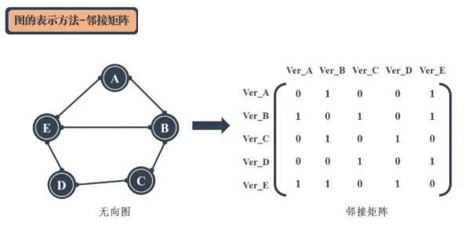
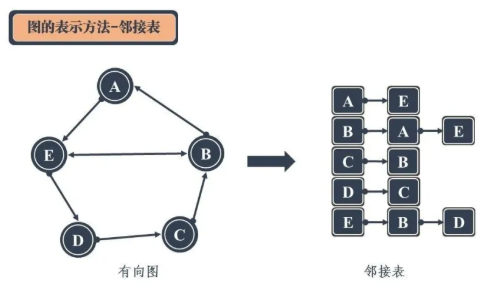
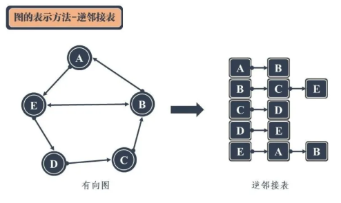
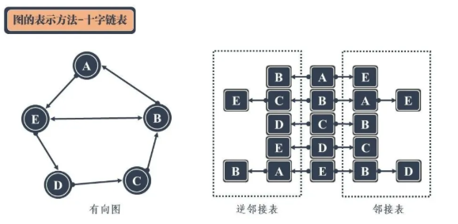
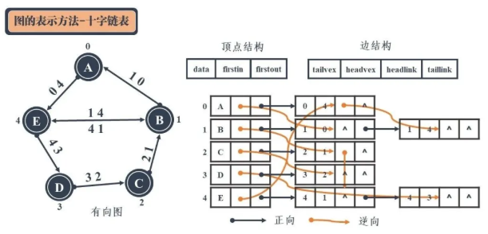

# Data Structures & Algorithms Interview Preparation

- [Data Structures & Algorithms Interview Preparation](#data-structures--algorithms-interview-preparation)
  - [Data Structures](#data-structures)
    - [Array](#array)
    - [String](#string)
    - [Queue](#queue)
      - [BFS](#bfs)
    - [Stacks](#stacks)
      - [DFS](#dfs)
    - [Hash Table](#hash-table)
    - [Trees](#trees)
      - [Max Depth of Trees](#max-depth-of-trees)
    - [Heaps](#heaps)
    - [Graphs](#graphs)
      - [邻接矩阵](#邻接矩阵)
      - [邻接表](#邻接表)
      - [逆邻接表](#逆邻接表)
      - [十字链表](#十字链表)
  - [Experience](#experience)
  - [Q & A](#q--a)
    - [Linked List](#linked-list)
    - [Stack](#stack)
    - [Hash Table](#hash-table-1)

---

## Data Structures

[图解！24 张图彻底弄懂九大常见数据结构！](https://mp.weixin.qq.com/s/SRs4XPp7o4sn-PpCh9OgDA)

### Array 

列表中没有索引，这是数组与列表最大的不同点。

数组中的元素在内存中是连续存储的，且每个元素占用相同大小的内存。

### String 

我们可以用 “==” 来比较两个字符串吗？

这取决于下面这个问题的答案：我们使用的语言是否支持运算符重载？

- 如果答案是 yes （例如 C++、Python）。我们可以使用 `==` 来比较两个字符串；
- 如果答案是 no （例如 Java），我们可能无法使用 `==` 来比较两个字符串。当我们使用 `==` 时，它实际上会比较这两个对象是否是同一个对象。

对于 Java来说，由于字符串是不可变的，

- 如果你确实希望你的字符串是可变的，则可以使用 `toCharArray` 将其转换为字符数组。
- 如果你经常必须连接字符串，最好使用一些其他的数据结构，如 `StringBuilder`。

### Queue

#### BFS

广度优先搜索（BFS）的一个常见应用是找出从根结点到目标结点的最短路径。

如果在第 k 轮中将结点 X 添加到队列中，则根结点与 X 之间的最短路径的长度恰好是 k。也就是说，**第一次找到目标结点时，你已经处于最短路径中。**

BFS template: 

```java
/**
 * Return the length of the shortest path between root and target node.
 */
int BFS(Node root, Node target) {
    Queue<Node> queue;  // store all nodes which are waiting to be processed
    Set<Node> used;     // store all the used nodes
    int step = 0;       // number of steps neeeded from root to current node
    // initialize
    add root to queue;
    add root to used;
    // BFS
    while (queue is not empty) {
        step = step + 1;
        // iterate the nodes which are already in the queue
        int size = queue.size();
        for (int i = 0; i < size; ++i) {
            Node cur = the first node in queue;
            return step if cur is target;
            for (Node next : the neighbors of cur) {
                if (next is not in used) {
                    add next to queue;
                    add next to used;
                }
            }
            remove the first node from queue;
        }
    }
    return -1;          // there is no path from root to target
}
```

上面的Set 用来确保你永远不会访问一个结点两次。有两种情况你不需要使用Set：

- 你完全确定没有循环，例如，在树遍历中。
- 你确实希望多次将结点添加到队列中。

### Stacks

#### DFS

**第一次找到目标的路径并不一定是最短的路径。**

递归template:

```java
/*
 * Return true if there is a path from cur to target.
 */
 boolean DFS(Node cur, Node target, Set<Node> visited) {
     if (cur == target) return true;

     for (Node next : the neighbors of cur) {
         if (next is not in visited) {
             add next to visited; 
             return if DFS(next, target, visited);
         }
     }

     return false;
 }
```

当我们递归地实现 DFS 时，似乎不需要使用任何栈。但实际上，我们使用的是由系统提供的隐式栈，也称为调用栈（Call Stack）。栈的大小正好是 DFS 的深度。因此，在最坏的情况下，维护系统栈需要 O(h)，其中 h 是 DFS 的最大深度。在计算空间复杂度时，永远不要忘记考虑系统栈。

- Pros: easy to implement. 
- Cons: If the recursion is too deep, OOM. Then consider using BFS or 用loop和显示栈实现DFS。

### Hash Table

Two types:

- HashSet是集合数据结构的实现之一，用于存储非重复值。
- HashMap是映射数据结构的实现之一，用于存储(key, value)键值对。

哈希函数是哈希表中最重要的组件。

理想情况下，完美的哈希函数将是键和桶之间的一对一映射。然而，在大多数情况下，哈希函数并不完美，它需要在桶的数量和桶的容量之间进行权衡。

如果在同一个桶中有太多的值，这些值将被保留在一个高度平衡的二叉树搜索树中。

### Trees

树里的每一个节点有一个值和一个包含所有子节点的列表。从图的观点来看，树也可视为一个拥有N 个节点和N-1 条边的一个有向无环图。

当你删除树中的节点时，删除过程将按照后序遍历的顺序进行。 也就是说，当你删除一个节点时，你将首先删除它的左节点和它的右边的节点，然后再删除节点本身。

后序在数学表达中被广泛使用。编写程序来解析后缀表示法更为容易。如果你想对这棵树进行后序遍历，使用栈来处理表达式会变得更加容易。每遇到一个操作符，就可以从栈中弹出栈顶的两个元素，计算并将结果返回到栈中。

递归是解决树的相关问题最有效和最常用的方法之一。

二叉树(Binary Tree)：每个结点最多有两个子树的树结构。

完全二叉树(Complete Binary Tree)：除了最后一层结点，其它层的结点数都达到了最大值；同时最后一层的结点都是按照从左到右依次排布。

满二叉树(Full Binary Tree)：除了最后一层，其它层的结点都有两个子结点。

平衡树(Balance Tree)：任意节点的子树的高度差都小于等于1。

平衡二叉树/平衡二叉搜索树/平衡二叉排序树(Balanced Binary Tree / Balanced Binary Search Tree / AVL Tree)： 一个二叉树每个节点的左右两个子树的高度差的绝对值小于等于1，并且左右两个子树都是一棵平衡二叉树。左子树上所有结点的值 < 根结点的值 < 右子树上所有结点的值。

平衡二叉树的产生是为了解决二叉搜索树在插入时发生线性排列的现象（变为链表）。

当平衡树不平衡时，需要调整：

- 左旋：将该结点的左孩子变为该结点的父结点的右孩子，再将该结点的父结点变为该结点的左孩子。 
- 右旋：将该结点的右孩子变为该结点的父结点的左孩子，再将该结点的父结点变为该结点的右孩子。

高度平衡带来的好处是能够提供更高的搜索效率O(log N)。但是由于需要维持这份高度平衡，需要经过多次旋转实现复衡。这导致AVL Tree的插入和删除效率并不高。**这时红黑树出场。**

红黑树通过将结点进行红黑着色，使得原本高度平衡的树结构被稍微打乱，平衡程度降低。红黑树不追求完全平衡，只要求达到部分平衡。这是一种折中的方案，大大提高了结点删除和插入的效率。

红黑树中，新插入的节点要是红色。

不需要做任何变色或者旋转的情况：新插入的节点父节点是黑色。

红黑树应用examples: 

- TreeMap and TreeSet的底层实现。
- In Java 8, if the number of collision in one bucket is more than 8, Red-black is used instead of linked list.

红黑树 VS AVL Tree: 

| |  红黑树  | AVL Tree  |
| ---- |  ----  | ----  |
| 相同点 | 都是Balanced Binary Search Tree。  | 都是Balanced Binary Search Tree。 |
| 查找效率 | Generally, O(log N); 最坏情况差于AVL。  | O(log N) |
| 插入效率 | 需要旋转和变色操作。最多2次旋转。变色O(log N)。 | 最多1次旋转，O(log N)。 |
| 删除效率 | 最多3次旋转。 | 最多O(log N)。 |
| 优劣势 | 读取效率 < AVL，维护性 > AVL | 读取效率高，维护性差。 |
| 应用场景 | 查找、插入、删除次数差不多时。 | 查找次数远大于插入、删除时。 |

#### Max Depth of Trees

- “自底向上” 的解决方案 - 后序遍历 / 递归DFS:

```java
public int getMaxDepth(Node node) {
    if (node == null) return 0; 

    int leftDepth = getMaxDepth(node.leftNode);
    int rightDepth = getMaxDepth(node.rightNode);

    return Math.max(leftDepth, rightDepth) + 1; 
}
```

O(N) time, O(heightOfTree) space.

- “自顶向下” 的解决方案 - 前序遍历
- BFS: 我们需要将队列里的所有节点都拿出来进行拓展，这样能保证每次拓展完的时候队列里存放的是当前层的所有节点。

```java
public int getMaxDepth(Node node) {
    if (node == null) return 0;

    Queue<Node> queue = new LinkedList<>();
    queue.offer(node);

    int depth = 0;

    while (!queue.isEmpty) {
        for (int i = 0; i < queue.size(); i++) {
            Node cur = queue.poll();

            if (cur.leftNode != null) {
                queue.offer(cur.leftNode);
            }
            if (cur.rightNode != null) {
                queue.offer(cur.rightNode);
            }
        }
        depth++;
    }
    return depth;
}
```

O(N) time, O(N) space.

### Heaps

可以直接用数组来表示一个堆。

### Graphs

#### 邻接矩阵

目前常用的图存储方式为邻接矩阵。

无向图的邻接矩阵是一个对称矩阵。有向图的邻接矩阵则不是。




邻接矩阵使用二维数组实现。若图中顶点数过多，会导致二维数组的大小剧增，从而占用大量的内存空间。

根据实际情况中，图中的顶点并不是任意两个顶点间都会相连，存储的邻接矩阵实际上会存在大量的0。虽然可以通过稀疏表示等方式对稀疏性高的矩阵进行关键信息的存储，但是却增加了图存储的复杂性。**这时邻接表出场。**

#### 邻接表

图的每一个顶点都是一个链表的头节点，其后连接着该顶点能够**直接达到的相邻顶点**。存储的顺序可以按照顶点的编号顺序进行。



对于有向图而言，图中有效信息除了从顶点“指出去” （出度）的信息，还包括从别的顶点“指进来”（入度）的信息。

在对有向图进行表示时，邻接表只能求出图的出度，而无法求出入度。**这时需要加一个逆邻接表。**

#### 逆邻接表

图的顶点链接着能够到达该顶点的相邻顶点。



邻接表 + 逆邻接表 用于表示一个有向图结构。

邻接表和逆邻接表实际上有一部分数据时重合的，可以合二为一，从而得到十字链表。

#### 十字链表



邻接表和逆邻接表的链表节点中重复出现的顶点并没有得到重复利用。因此，上图的表示方式还可以进行进一步优化：扩展的顶点结构和边结构来。



---

## Experience

[我是如何学习数据结构与算法的？](http://www.sohu.com/a/272031279_478315)

链表和树(二叉堆)，但这是最基本的，刷题之前要掌握的，对于数据结构，我列举下一些比较重要的：

1、链表（如单向链表、双向链表）。

2、树（如二叉树、平衡树、红黑树）。(二叉树和二叉搜索树是最常用的树)

3、图（如最短路径的几种算法）。

4、队列、栈、矩阵。

**对于这些，自己一定要动手实现一遍。**

---

## Q & A

### Linked List

Q: Detect cycle in a linked list.

A: Take two pointers - a fast pointer which moves forward two steps once and a slow pointer which moves forward one step once. Initially they are at the beginning node. If there is cycle in the linked list, these two pointers must meet somewhere.

### Stack

Q: 设计最小栈。能在常数时间内检索到最小元素的栈。

A1: Use 单链表。

1. Create Node class.

```java
private static class Node {
    int val;
    int min;
    Node next;

    public Node(int val, int min) {
        this(val, min, null);
    }

    public Node(int val, int min, Node next) {
        this.val = val;
        this.min = min;
        this.next = next;
    }
}
```

2. In push(), check if head is null. If yes, `head = new Node(value, value, null)`. If no, 新结点指向head并成为新的head。 `head = new Node(value, Math.min(value, head.min), head)`
3. In pop(), `head = head.next`.

O(1) time, O(N) space.

A2: Use Stack<Node>. Java 内置Stack，自定义Node class.

```java
private static class Node {
    int val;
    int min;
}
```

A3: 用辅助Stack专门存min value。和主stack同时做push和pop操作。Push时，存入min value。


### Hash Table

Q: 给定一个整数数组，查找数组是否包含任何重复项。

A: Use HashSet. 

1. Traverse the array.
2. Check if the element already exists in the HashSet. 
3. If yes, return true. If no, insert the element into the HashSet. 
4. If the traversal ends, return false.

Q: 给定一个整数数组，返回两个数字的索引，使它们相加得到特定目标。(Two sum)

A: Use HashMap.

1. Traverse the array.
2. Use target value to minus the element value, and get complement value. 
3. Check if the complement value already exists as a key in the HashMap. 
4. If yes, add these two indexes in an array list. 
5. Put (element value, its index) in the HashMap.
6. Return the array list when the traversal ends.

Q: 给定一个字符串，找到它的第一个不重复的字符，并返回它的索引。如果不存在，则返回 -1。

A: Use HashMap. Traverse the string twice.

1. Traverse the string. Put (character, count of appearance) into the HashMap. 
2. Traverse the string the second time. Use each character as the key and get value from the HashMap. 
3. If the value is 1, return the index of this character.
4. If the traversal ends, return -1.

Q: 相同字母异序词（字母异位词）分组(Group Anagrams)

A1: Use HashMap. 用排序数组作key。 

1. Traverse the array of strings. 
2. Convert each string to a char array. Then sort. Then convert back to string, which will be used as the key in HashMap.
3. Check if the key exists in the HashMap. 
4. If yes, get the value of the key, which is an ArrayList. Then add the original string into the ArrayList. 
5. If no, put (key, new ArrayList()) in the HashMap. Then repeat step 4.
6. Return `new ArrayList(values of the HashMap)`.

N: Number of strings in the array.
K: Length of the longest string in the array. 

O(NK log K) time, O(NK) space.

A2: Use HashMap. 用计数作key。 

1. Create an array of int to store the count of characters in each string. The size of the array is 26.
2. Traverse the array of strings.
3. Convert each string to a char array.
4. Traverse the char array. `count[c - 'a']++;`
5. Create a StringBuilder. Loop 26 times, append "#" and the element of the count array to the StringBuilder. 
6. Then convert the StringBuilder to String, which will be used as the key in HashMap.
7. Check if the key exists in the HashMap. 
8. If yes, get the value of the key, which is an ArrayList. Then add the original string into the ArrayList. 
9. If no, put (key, new ArrayList()) in the HashMap. Then repeat step 6.
10. Return `new ArrayList(values of the HashMap)`.

N: Number of strings in the array.
K: Length of the longest string in the array. 

O(NK) time, O(NK) space.

