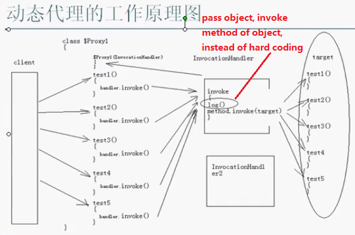

# Java Advanced Note

## StringBuilder & StringBuffer

StringBuilder and StringBuffer (older) essentially do the same thing.

StringBuilder (introduced in JDK 1.5)

- More efficient
- Not synchronized
- Cannot be used for multithreading

StringBuffer

- Synchronized
- Multithreading

**Generally we use StringBuilder** as long as we do not need multithreading.

## Variable Arguments (VarArgs)

introduced in JDK 1.5

```java
public static int add(int x, int ...args) { // ...args refers to variable parameter, namely potential multiple number of parameters

    int sum = x;
    for (int i : args) { // args is regarded as an array
        sum += i;
    }
    return sum;
}
```

---

## Autoboxing & Unboxing

```java
Integer x = 1;
Integer y = 1;
System.out.println(x == y); // true, only for x and y between -128 and 127

Integer x = 200;
Integer y = 200;
System.out.println(x == y); // false
```

---

## Enum

introduced in JDK 1.5

```java
public static void main(String[] args) {

    Weekday weekday1 = Weekday.SUN;
    System.out.println(weekday1); // output is SUN

    System.out.println(Weekday.values().length); // Weekday.values() returns Weekday[]
}

public enum Weekday {
    MON,
    TUE,
    WED,
    THUR,
    FRI,
    SAT,
    SUN; // must be on top in the enum
}
```

### Enum with Abstract Methods

```java
public enum TrafficLight {
    RED(30) { // child class
        public TrafficLight nextLight() {
            return GREEN;
        }
    },
    GREEN(45) {
        public TrafficLight nextLight() {
            return YELLOW;
        }
    },
    YELLOW(5) {
        public TrafficLight nextLight() {
            return RED;
        }
    };

    public abstract TrafficLight nextLight();

    private int time;

    private TrafficLight(int time) {
        this.time = time;
    }
}
```

If there is only one member in the enum, this can be used as an implementation of singleton pattern.

---

## Reflection（反射）

Why to use reflection:

- Used in the scenario that the name of class is unknown.
- Increase the flexibility of program.
- Used to implement framework.

Reflection will decrease the performance of program.

如何得到字节码对应的实例对象：

- `<Class_name>.class`, e.g. `Date.class`
- `<object>.getClass()`, e.g. `new Date().getClass()`
- `Class.forName("full_class_name")`, e.g. `Class.forName("java.lang.String")`

```java
String str = "abc";
Class cls1 = str.getClass();
Class cls2 = String.class;
Class cls3 = Class.forName("java.lang.String");

System.out.println(cls1 == cls2);  // true
System.out.println(cls2 == cls3);  // true

System.out.println(cls1.isPrimitive());  // false
System.out.println(int.class.isPrimitive());  // true
System.out.println(int.class == Integer.class);  // false
System.out.println(int.class == Integer.TYPE);  // true
System.out.println(int[].class.isPrimitive());  // false
System.out.println(int[].class.isArray());  // true
```

### Constructor 类

```java
// create an object by using Constructor Class with reflection
Constructor constructor1 = String.class.getConstructor(StringBuffer.class);
String str1 = (String)constructor1.newInstance(new StringBuffer("abc"));
System.out.println(str1.charAt(2));  // output should be "c"

// or you could use Generic, then you do not need to use cast
// Constructor<String> constructor1 = String.class.getConstructor(StringBuffer.class);
// String str1 = constructor1.newInstance(new StringBuffer("abc"));


// if you only use non-param constructor, do not need to create a constructor, but use internal default constructor instead
String str2 = (String)Class.forName("java.lang.String").newInstance();
```

### Field 类

```java
public class Main() {
    public static void main(String[] args) {
        ReflectionPoint point1 = new ReflectionPoint(3, 5);

        Field fieldY = point1.getClass().getField("Y");
        System.out.println(fieldY.get(point1));  // output should be 5

        Field fieldX = point1.getClass().getField("X");
        System.out.println(fieldX.get(point1));  // exception, as X is private, so getField() method can only access public field

        Field fieldX = point1.getClass().getDeclaredField("X");  // can access field X here
        System.out.println(fieldX.get(point1));  // but cannot get the value of field X, as X is private

        // in order to get field X value of point1
        fieldX.setAccessible(true);
        System.out.println(fieldX.get(point1));  // output should be 3


        // for all String type fields, change "a" to "b" of its value
        changeAtoB(point1);
        System.out.println(point1);  // output should be "bpple, bbnbnb"
    }

    public static void changeAtoB(Object obj) {
        Field[] fields = obj.getClass().getFields();
        for (Field field : fields) {
            if (field.getType == String.class) {
                String oldValue = (String)field.get(obj);
                String newValue = oldValue.replace("a", "b");
                field.set(obj, newValue);
            }
        }
    }
}

public class ReflectionPoint() {
    private int x;
    public int y;
    public String s1 = "apple";
    public String s2 = "banana";

    public ReflectionPoint(int x, int y) {
        super();
        this.x = x;
        this.y = y;
    }

    @Override
    public String toString() {
        return s1 + ", " + s2;
    }
}
```

### Method 类

```java
public static void main(String[] args) {
    String str1 = "abc";
    // in general
    // str1.charAt(1);
    // using reflection
    Method methodCharAt = String.class.getMethod("charAt", int.class);
    System.out.println(methodCharAt.invoke(str1, 1));  // output should be "b"
}
```

If the 1st parameter of `invoke()` is `null`, then the method is a static method.

### Array 类

```java
public static void main(String[] args) {
	String[] s = new String[]{"a", "b", "c"};
    printObject(s);
    // output should be
    // a
    // b
    // c
}

public static void printObject(Object obj) {
    Class cls = obj.getClass();
    // if the type of obj is Array, iterate it and print all elements
    if (cls.isArray()) {
        int len = Array.getLength(obj);
        for (int i = 0; i < len; i++) {
            System.out.println(Array.get(obj, i));
        }
    } else {
        System.out.println(obj);
    }
}
```

### Manage Config File

Create config.properties file.  Write `className=java.util.ArrayList` in it.

```java
public class Main() {
    public static void main(String[] args) {
        // do not do this - relative path - in real projects
        // InputStream inputStream = new FileInputStream("config.properties");  

		InputStream inputStream = Main.class.getClassLoader().getResourceAsStream("<project_relative_path>/config.properties");
        // alternative way
        // InputStream inputStream = Main.class.getResourceAsStream("<Main.class_relative_path> or <project_absolute_path>/config.properties");
        Properties props = new Properties();
        props.load(inputStream);
        props.close();

        String className = props.getProperty("className");
        Collection coll = (Collection)Class.forName(className).newInstance();

        coll.add(1);
        coll.add(2);
        System.out.println(coll.size());  // output should be 2
    }
}
```

### Introspection & JavaBean

Get and set properties:

```java
public class Main() {
    public static void main(String[] args) {
        ReflectPoint pt1 = new ReflectPoint(3, 5);

        String propertyName = "x";

        PropertyDescriptor pd = new PropertyDescriptor(propertyName, pt1.getClass());

        Method methodGetX = pd.getReadMethod();
        Object retVal = methodGetX.invoke(pt1);
        System.out.println(retVal);  // output should be 3

        Method methodSetX = pd.getWriteMethod();
        methodSetX.invoke(pt1, 7);
        System.out.println(pt1.getX());  // output should be 7      
    }
}

// JavaBean
public class ReflectPoint() {
    private int x;
    private int y;
    private Date birthday = new Date();

    public ReflectPoint(int x, int y) {
        super();
        this.x = x;
        this.y = y;
    }

    public int getX() {
        return x;
    }

    public void setX(int x) {
        this.x = x;
    }

    public int getY() {
        return y;
    }

    public void setY(int y) {
        this.y = y;
    }

    public int getBirthday() {
        return birthday;
    }

    public void setBirthday(Date birthday) {
        this.birthday = birthday;
    }
}
```

### BeanUtils & JavaBean

Use BeanUtils tool package to get and set properties of JavaBean.

Need to import BeanUtils .jar package.

Advantages of using BeanUtils:

- You can set type of all parameters as String.
- You are able to access properties of Java Bean in a cascade way.

If the type of property is not correct when using BeanUtils to transfer, you can use PropertyUtils.

```java
public static void main(String[] args) {
	// continue with the above example
    System.out.println(BeanUtils.getProperty(pt1, "x").getClass().getName());  // output should be java.lang.String
    // when using BeanUtils, type of parameters is regarded as String

    BeanUtils.setProperty(pt1, "x", "9");  // note: type of "9" is String
    System.out.println(pt1.getX());  // output should be 9


    BeanUtils.setProperty(pt1, "birthday.time", "111");
    System.out.println(BeanUtils.getProperty(pt1, "birthday.time"));  // output should be 111


    // when using PropertyUtils, type of parameters is regarded as its original type
    PropertyUtils.setProperty(pt1, "x", 10);  // note: type of 10 is not String
    System.out.println(PropertyUtils.getProperty(pt1, "x").getClass().getName());  // output should be java.lang.Integer    
}

```

---

## Annotation

introduced in JDK 1.5

Using an annotation is essentially invoking a class.


```java
@AnnotationDemo(color = "red", arrayAttr= {4,5}, annotationAttr=@MetaAnnotationDemo("I am the new value attr."))
public class AnnotationDemoApp {

	public static void main(String[] args) {
		if (AnnotationDemoApp.class.isAnnotationPresent(AnnotationDemo.class)) {
			AnnotationDemo AnnoDemo = (AnnotationDemo)AnnotationDemoApp.class.getAnnotation(AnnotationDemo.class);
			System.out.println(AnnoDemo);  // output should be @DemoAnnotation()
			System.out.println(AnnoDemo.color());  // output should be "red"
			System.out.println(AnnoDemo.value());  // output should be "aaa"
			System.out.println(AnnoDemo.arrayAttr().length);  // output should be 2
			System.out.println(AnnoDemo.annotationAttr().value());  // output should be "I am the new value attr."
		}
	}
}


import java.lang.annotation.ElementType;
import java.lang.annotation.Retention;
import java.lang.annotation.RetentionPolicy;
import java.lang.annotation.Target;

@Retention(RetentionPolicy.RUNTIME)
@Target({ElementType.METHOD, ElementType.TYPE})
public @interface AnnotationDemo {
	String color();  // attribute of annotation, then you are able to set attribute when applying the annotation
	String value() default "aaa";
	int[] arrayAttr() default {1,2,3};
	MetaAnnotationDemo annotationAttr() default @MetaAnnotationDemo("I am the value attr of MetaAnnotationDemo.");
}


public @interface MetaAnnotationDemo {
	String value();
}
```

### Build-in Annotations

@SuppressWarnings("deprecation")

- Write out of functions.

- Use it when you are using deprecated methods but you do not want to be warned about it.

@Deprecated

- Write out of functions.

- Use it when you do not want others to use the method anymore but you do not want to influence the previous program.

### Meta Annotation

@Retention() - determine retention of the annotation.

- @Retention(RetentionPolicy.RUNTIME)
- @Retention(RetentionPolicy.SOURCE)
- @Retention(RetentionPolicy.CLASS)

@Target() - determine where the annotation can be applied.

- @Target(ElementType.METHOD) - can only be used for methods.
- @Target(ElementType.TYPE) - can only be used for types (classes, interfaces, enums).

---

## Generic

introduced in JDK 1.5

- 去类型化：Generic exerts the effect while compiling process. Thus, after compile, there is no generic in runtime.

- 可以通过reflection得到带有泛型的参数的类型。（高难度知识点）

### Wildcard: `<?>`

`<?>`: represents any type of collection.

`<? extends *>`: represents the type of collection extends * type.

- E.g. `List<? extends Number> list = new ArrayList<Integer>();`

`<? super *>`: represents the type of collection is the super class of * type.

- E.g. `List<? super Integer> list = new ArrayList<Number>();`

```java
// a function that can print any type of collection
public static void printCollection(Collection<?> collection) {
    // collection.add("aaa");  // error
    // collection = new HashSet<Date>();  // no error

    System.out.println(collection.size());
    for (Object obj : collection) {
        System.out.println(obj);
    }
}
```

### Customized Generic

`<T>` represents customized type.

- It can only be object or reference type but cannot be basic type.
- You may find `<E>` in some places. It is the same as `<T>`.

#### Generic Methods

```java
// a function that can swap two elements in a customized type array
public static <T> void swap(T[] arr, int i, int j) {  // <T> here is the declaration of T
    T tmp = arr[i];
    arr[i] = arr[j];
    arr[j] = tmp;
}


// a function that can convert object type input to any other type output
public static <T> T autoConvert(Object obj) {
    return (T)obj;
}


// a function that can fill an array with the same element which can be any type  
public static <T> void fillArray(T[] arr, Object obj) {
    for (int i = 0; i < arr.length; i++) {
        arr[i] = obj;
    }
}


// a function that can print any type of collection
public static <T> void printCollection(Collection<T> collection, T obj2) {
    // collection.add(obj2);  // no error

    System.out.println(collection.size());
    for (Object obj : collection) {
        System.out.println(obj);
    }
}
```

#### Generic Classes

```java
// a DAO that can be used for any type of data
public class GenericDao<T> {  // declare <T> at class level
    public void add(T t) {

    }

    public T findById(int id) {
        return null;
    }

    public void delete(T t) {

    }

    public void delete(int id) {

    }

    public void update(T t) {

    }

    public Set<T> findByConditions(String condition) {
        return null;
    }

    // for static methods, you need to declare <T> at method level, you cannot rely on <T> at class level
    public static <T> void update(T t) {

    }
}
```

---

## Class Loader

Source code is complied to binary class files, which are loaded by class loaders.

There are many class loaders in JVM.

Three system default class loaders:

- BootStrap: The first class loader. (Special. It is not a class.)
- ExtClassLoader
  - Ext refers to extend.
- AppClassLoader

```java
public class ClassLoaderDemo {

	public static void main(String[] args) {
		System.out.println(ClassLoaderDemo.class.getClassLoader().getClass().getName());  // sun.misc.Launcher$AppClassLoader
		System.out.println(System.class.getClassLoader());  // null
	}
}
```

### Delegation Mechanism


When loading a class, the current class loader will delegate to parent class loader until BootStrap before searching the class file.

For instance, AppClassLoader will delegate to ExtClassLoader, then delegate to BootStrap. If BootStrap find the class file, load it. If not, BootStrap will ask ExtClassLoader to find and try to load it. Then AppClassLoader. If AppClassLoader cannot find the class file, throw exception.

It will only be delegated to AppClassLoader as it was launched by AppClassLoader. So, it will not be delegated to MyClassLoader further.

### Customized Class Loader

When you create a class loader yourself, override `findClass()` rather than `loadClass()`.

**Classes with package name cannot invoke classes without package name.**

---

## Proxy & AOP

[Spring AOP & Proxy](https://mp.weixin.qq.com/s/LKtwCL95nnL1btZHVCf96g)

### Proxy


Client program called Target class originally. Now create a Proxy class and let Client program call this class.

Methods in Proxy class have the same name as methods in Target class.

If using factory pattern and config file to do management, you are able to decide to apply Target class or Proxy class in the config file. For example, you can apply Proxy class when you need the log function.

### AOP


### Dynamic Proxy Class

If you create proxy function for every interface in the system, it will be too troublesome. It is better to use dynamic proxy class which can be generated by JVM in runtime.

Two approaches of dynamic proxy:

- JDK: A dynamic proxy class must implement one or more interface.
- CGLIB: If you want to apply dynamic proxy class for a class which does not have interface, you can use CGLIB library. CGLIB will dynamically create a subclass of the target class which can be used as proxy.

When doing extra processes in proxy class, you can do specific process for different methods by judging the method name.

#### JDK Dynamic Proxy



```java
import java.lang.reflect.Constructor;
import java.lang.reflect.InvocationHandler;
import java.lang.reflect.Method;
import java.lang.reflect.Proxy;
import java.util.ArrayList;
import java.util.Collection;

public class ProxyDemo {

	public static void main(String[] args) throws Exception {
		/*
		 * create a dynamic proxy class
		 * check its method list
		 */
		Class proxyCls = Proxy.getProxyClass(Collection.class.getClassLoader(), Collection.class);
		System.out.println(proxyCls.getName());

		System.out.println("------ begin constructor list ------");
		Constructor[] constructors = proxyCls.getConstructors();
		for (Constructor constructor : constructors) {
			String name = constructor.getName();
			StringBuilder sBuilder = new StringBuilder(name);
			sBuilder.append("(");

			Class[] paramClses = constructor.getParameterTypes();
			for (Class paramCls : paramClses) {
				sBuilder.append(paramCls.getName()).append(",");
			}
			if (paramClses != null && paramClses.length != 0) {
				sBuilder.deleteCharAt(sBuilder.length() - 1);  // delete the last ","
			}

			sBuilder.append(")");
			System.out.println(sBuilder.toString());
		}


		System.out.println("------ begin method list ------");
		Method[] methods = proxyCls.getMethods();
		for (Method method : methods) {
			String name = method.getName();
			StringBuilder sBuilder = new StringBuilder(name);
			sBuilder.append("(");

			Class[] paramClses = method.getParameterTypes();
			for (Class paramCls : paramClses) {
				sBuilder.append(paramCls.getName()).append(",");
			}
			if (paramClses != null && paramClses.length != 0) {
				sBuilder.deleteCharAt(sBuilder.length() - 1);  // delete the last ","
			}

			sBuilder.append(")");
			System.out.println(sBuilder.toString());
		}


		/*
		 * create instances of proxy class
		 */
		System.out.println("------ begin creating instances of proxy class ------");
		Constructor constructor = proxyCls.getConstructor(InvocationHandler.class);
		class MyInvocationHandler1 implements InvocationHandler {

			@Override
			public Object invoke(Object proxy, Method method, Object[] args) throws Throwable {
				return null;
			}
		}

		Collection proxy1 = (Collection) constructor.newInstance(new MyInvocationHandler1());
		System.out.println(proxy1.toString());  // null
		proxy1.clear();  // no exception as this method return void
		//proxy1.size();  // NullPointerException as this method has return value


		/*
		 * create instances of proxy class using anonymous inner class
		 */
		Collection proxy2 = (Collection) constructor.newInstance(new InvocationHandler() {
			@Override
			public Object invoke(Object proxy, Method method, Object[] args) throws Throwable {
				return null;
			}
		});


		/*
		 * or use a simpler way to create the instance of Proxy from Proxy directly
		 * hard code invoke() method
		 */
		Collection proxy3 = (Collection) Proxy.newProxyInstance(
				Collection.class.getClassLoader(),
				new Class[] {Collection.class},
				new InvocationHandler() {
					ArrayList target = new ArrayList();

					@Override
					public Object invoke(Object proxy, Method method, Object[] args) throws Throwable {
						long beginTime = System.currentTimeMillis();
						Object retVal = method.invoke(target, args);
						long endTime = System.currentTimeMillis();
						System.out.println(method.getName() + " running duration: " + (endTime - beginTime));
						return retVal;
					}
				});


		/*
		 * do not hard code invoke() method
		 * when you want to create a proxy, just pass a target and an advice
		 */
		ArrayList target = new ArrayList();
		Collection proxy4 = (Collection) getProxy(target, new MyAdvice());

		proxy4.add("aaa");  // this method will further call the above invoke() method
		proxy4.add("bbb");
		/*
		 * output should be:
		 * ------ beforeMethod() ------
		 * ------ afterMethod() ------
		 * add method: running duration: 0
		 */
		proxy4.add("ccc");
		System.out.println(proxy4.size());  // 3

	}

	private static Object getProxy(Object target, AdviceInterface advice) {
		Object proxy0 = Proxy.newProxyInstance(
				target.getClass().getClassLoader(),
				target.getClass().getInterfaces(),
				new InvocationHandler() {

					@Override
					public Object invoke(Object proxy, Method method, Object[] args) throws Throwable {
						advice.beforeMethod(method);
						Object retVal = method.invoke(target, args);
						advice.afterMethod(method);
						return retVal;
					}
				});
		return proxy0;
	}
}


import java.lang.reflect.Method;

public interface AdviceInterface {

	void beforeMethod(Method method);
	void afterMethod(Method method);
}


import java.lang.reflect.Method;

public class MyAdvice implements AdviceInterface {

	long beginTime;

	@Override
	public void beforeMethod(Method method) {
		System.out.println("------ beforeMethod() ------");
		beginTime = System.currentTimeMillis();
	}

	@Override
	public void afterMethod(Method method) {
		System.out.println("------ afterMethod() ------");
		long endTime = System.currentTimeMillis();
		System.out.println(method.getName() + " method: running duration: " + (endTime - beginTime));
	}
}
```

#### CGLIB Dynamic Proxy

- CGLIB adopts bytecode technology to create a subclass for target class.
- You cannot do proxy for `final` class as it cannot be extended.
- Through overriding `intercept()` method, do extra processes for methods of target class.

```java
public class CglibProxyHandler implements MethodInterceptor {

    private Object target;

    public Object getProxyInstance(final Object target) {
        this.target = target;
        // Enhancer类是CGLIB中的一个字节码增强器，它可以方便的对你想要处理的类进行扩展
        Enhancer enhancer = new Enhancer();
        enhancer.setSuperclass(this.target.getClass());
        enhancer.setCallback(this);
        return enhancer.create();
    }

    @Override
    public Object intercept(Object object, Method method, Object[] args,
            MethodProxy methodProxy) throws Throwable {

        System.out.println("pre method");
        Object result = methodProxy.invokeSuper(object, args);
        System.out.println("psot method");
        return result;
    }
}


public class Client {

    public static void main(String[] args) {
        Star realStar = new RealStar();
        Star proxy = (Star) new CglibProxyHandler().getProxyInstance(realStar);

        proxy.sing();
    }
}
```

#### JDK VS CGLIB

- CGLIB proxy object: high performance, long creation time, suitable for singleton object that is not create frequently
- JDK proxy object: low performance, short creation time

### Spring AOP

Using JDK or CGLIB dynamic proxy depends on:

- `config.isOptimize()`: False by default.
- `config.isProxyTargetClass()`: False by default.
- `hasNoUserSuppliedProxyInterfaces(config)`: If target object has an interface, use JDK proxy. Otherwise, use CGLIB.
