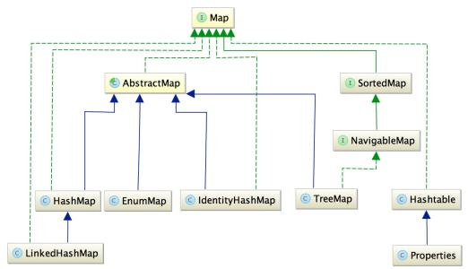
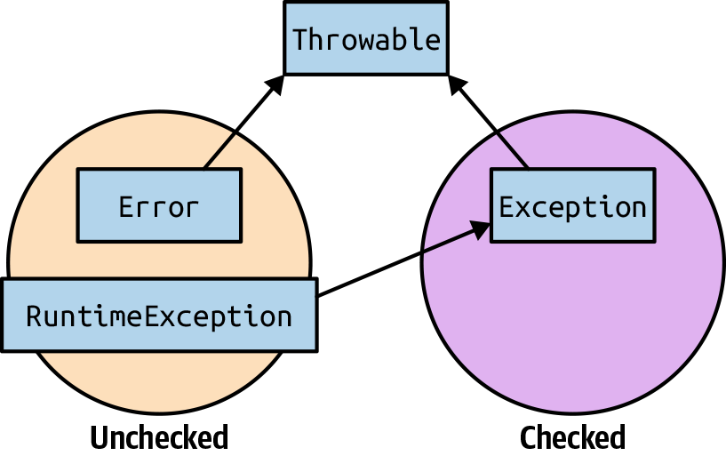
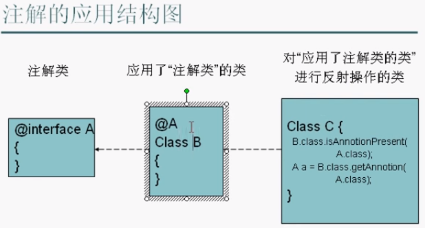
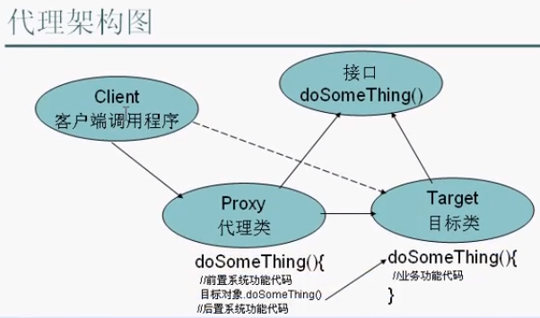
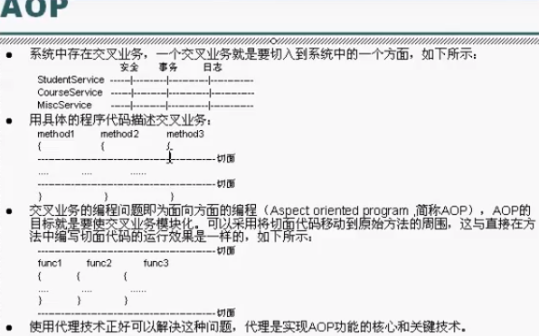
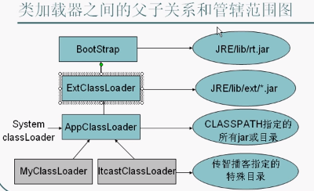
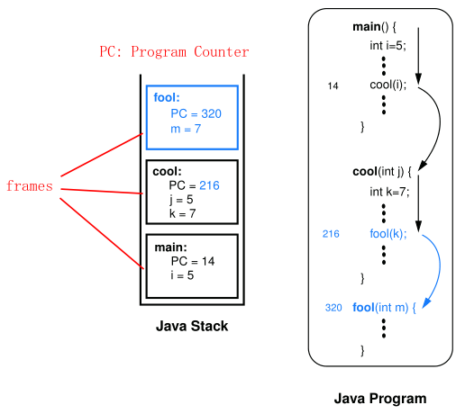
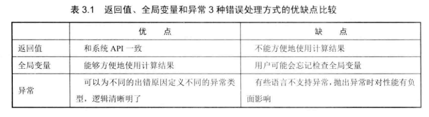

# Java Note

- [Java Note](#java-note)
  - [Modifier](#modifier)
  - [Code Execution Order](#code-execution-order)
  - [Interfaces](#interfaces)
    - [Interface Naming Conventions](#interface-naming-conventions)
    - [Functional Interfaces](#functional-interfaces)
  - [Collections](#collections)
  - [StringBuilder & StringBuffer](#stringbuilder--stringbuffer)
  - [Variable Arguments (VarArgs)](#variable-arguments-varargs)
  - [Autoboxing & Unboxing](#autoboxing--unboxing)
  - [Enum](#enum)
    - [Enum with Abstract Methods](#enum-with-abstract-methods)
  - [Exception Handling](#exception-handling)
    - [Deciding Between Unchecked and Checked](#deciding-between-unchecked-and-checked)
  - [Reflection](#reflection)
    - [Constructor Class](#constructor-class)
    - [Field Class](#field-class)
    - [Method Class](#method-class)
    - [Array Class](#array-class)
    - [Manage Config File](#manage-config-file)
    - [Introspection & JavaBean](#introspection--javabean)
    - [BeanUtils & JavaBean](#beanutils--javabean)
  - [Annotation](#annotation)
    - [Build-in Annotations](#build-in-annotations)
    - [Meta Annotation](#meta-annotation)
  - [Generic](#generic)
    - [Wildcard: `<?>`](#wildcard-)
    - [Customized Generic](#customized-generic)
      - [Generic Methods](#generic-methods)
      - [Generic Classes](#generic-classes)
      - [Generic Array](#generic-array)
  - [Class](#class)
  - [Object Class](#object-class)
    - [native](#native)
    - [clone()](#clone)
      - [Shallow Copy](#shallow-copy)
      - [Deep Copy](#deep-copy)
      - [new method VS clone()](#new-method-vs-clone)
    - [equals()](#equals)
    - [hashCode()](#hashcode)
    - [wait(), notify(), notifAll()](#wait-notify-notifall)
    - [finalize()](#finalize)
  - [Proxy & AOP](#proxy--aop)
    - [Proxy](#proxy)
    - [AOP](#aop)
    - [Dynamic Proxy Class](#dynamic-proxy-class)
      - [JDK Dynamic Proxy](#jdk-dynamic-proxy)
      - [CGLIB Dynamic Proxy](#cglib-dynamic-proxy)
      - [JDK VS CGLIB](#jdk-vs-cglib)
    - [Spring AOP](#spring-aop)
  - [JVM (Java Virtual Machine)](#jvm-java-virtual-machine)
    - [Class Loader](#class-loader)
      - [Delegation Mechanism](#delegation-mechanism)
      - [Customized Class Loader](#customized-class-loader)
    - [JMM (Java Memory Model)](#jmm-java-memory-model)
    - [Java Memory Allocation](#java-memory-allocation)
      - [Java Method Stack / Java Stack](#java-method-stack--java-stack)
    - [Memory Heap](#memory-heap)
      - [Memory Allocation Algorithms](#memory-allocation-algorithms)
  - [GC (Garbage Collection)](#gc-garbage-collection)
    - [The Mark-Sweep Algorithm](#the-mark-sweep-algorithm)
      - [Mark Phase](#mark-phase)
      - [Sweep Phase](#sweep-phase)
  - [Tips](#tips)
    - [Big Number Problem](#big-number-problem)
    - [Char](#char)
    - [Compare Double Type](#compare-double-type)
    - [Error Handling Options](#error-handling-options)
  - [Interview](#interview)

---

## Modifier

protected: 

- Used for fields or methods.
- Can be accessed in the same package or subclass in different packages.

“不同包中的子类可以访问”，是指当两个类不在同一个包中的时候，继承自父类的子类内部且主调（调用者）为子类的引用时才能访问父类用protected修饰的成员（属性或方法）。

---

## Code Execution Order

Code execution order in class after JVM loading:

1. super static block - execute only once
2. child static block - execute only once
3. super non-static block - when instantiating
4. super constructor
5. child non-static block - when instantiating
6. child constructor

Non-static block is used to organize common code in multiple constructors. 

There are 5 stages when loading a class file into JVM - load, verify, prepare, resolve, and initialize. Static block is executed during initialization stage in the class loader subsystem.  

---

## Interfaces

Interfaces can have properties, but they must be `public static final`.  

**It is common to provide both an interface and an abstract class.**

### Interface Naming Conventions

- Interface should be a good object name.
- **DO NOT** start with "I", e.g. `IList`.

### Functional Interfaces

An interface that only contains a single abstract method is called a functional interface since Java 8. You can annotate it using the `@FunctionalInterface` annotation to make the intent of the interface clearer.

---

## Collections

[How to Learn Java Collections – A Complete Guide](https://www.geeksforgeeks.org/how-to-learn-java-collections-a-complete-guide/)

[Collections in Java](https://www.geeksforgeeks.org/collections-in-java-2/)

[两万字长文读懂 Java 集合！](https://blog.csdn.net/csdnnews/article/details/107888522)




---

## StringBuilder & StringBuffer

StringBuilder and StringBuffer (older) essentially do the same thing.

StringBuilder (introduced in JDK 1.5)

- More efficient
- Not synchronized
- Cannot be used for multithreading

StringBuffer

- Synchronized
- Multithreading

**Generally we use StringBuilder** as long as we do not need multithreading.

---

## Variable Arguments (VarArgs)

introduced in JDK 1.5

```java
public static int add(int x, int ...args) { // ...args refers to variable parameter, namely potential multiple number of parameters

    int sum = x;
    for (int i : args) { // args is regarded as an array
        sum += i;
    }
    return sum;
}
```

---

## Autoboxing & Unboxing

```java
Integer x = 1;
Integer y = 1;
System.out.println(x == y); // true, only for x and y between -128 and 127

Integer x = 200;
Integer y = 200;
System.out.println(x == y); // false
```

---

## Enum

introduced in JDK 1.5

```java
public static void main(String[] args) {

    Weekday weekday1 = Weekday.SUN;
    System.out.println(weekday1); // output is SUN

    System.out.println(Weekday.values().length); // Weekday.values() returns Weekday[]
}

public enum Weekday {
    MON,
    TUE,
    WED,
    THUR,
    FRI,
    SAT,
    SUN; // must be on top in the enum
}
```

### Enum with Abstract Methods

```java
public enum TrafficLight {
    RED(30) { // child class
        public TrafficLight nextLight() {
            return GREEN;
        }
    },
    GREEN(45) {
        public TrafficLight nextLight() {
            return YELLOW;
        }
    },
    YELLOW(5) {
        public TrafficLight nextLight() {
            return RED;
        }
    };

    public abstract TrafficLight nextLight();

    private int time;

    private TrafficLight(int time) {
        this.time = time;
    }
}
```

If there is only one member in the enum, this can be used as an implementation of singleton pattern.

---

## Exception Handling

Two kinds of exceptions in Java: 

- Checked exceptions: These are errors that you are expected to be able to recover from. You have to declare a method with a list of checked exceptions it can throw, or provide a suitable try/catch block.
- Unchecked exceptions: These are errors that can be thrown at any time during the program execution. You should not expect to catch and recover from them. 



### Deciding Between Unchecked and Checked

Use unchecked exceptions for: 

- Errors due to business logic validation (e.g., wrong format or arithmetic), as they would add a lot of try/catch clutter in your code. 
- System errors (e.g., disk ran out of space), as there is nothing the client can do.

**Recommendation**: Use unchecked exceptions and only use checked exceptions sparingly to avoid significant try/catch clutter in the code.

---

## Reflection

Why to use reflection:

- Used in the scenario that the name of class is unknown.
- Increase the flexibility of program.
- Used to implement framework.

Reflection will decrease the performance of program.

How to get the instance of Class type:

- `<Class_name>.class`, e.g. `Date.class`
- `<object>.getClass()`, e.g. `new Date().getClass()`
- `Class.forName("full_class_name")`, e.g. `Class.forName("java.lang.String")`

```java
String str = "abc";
Class cls1 = str.getClass();
Class cls2 = String.class;
Class cls3 = Class.forName("java.lang.String");

System.out.println(cls1 == cls2);  // true
System.out.println(cls2 == cls3);  // true

System.out.println(cls1.isPrimitive());  // false

System.out.println(int.class.isPrimitive());  // true
System.out.println(int.class == Integer.class);  // false
System.out.println(int.class == Integer.TYPE);  // true
System.out.println(int[].class.isPrimitive());  // false
System.out.println(int[].class.isArray());  // true
```

### Constructor Class

```java
// create an object by using Constructor Class with reflection
Constructor constructor1 = String.class.getConstructor(StringBuffer.class);
String str1 = (String)constructor1.newInstance(new StringBuffer("abc"));
System.out.println(str1.charAt(2));  // output should be "c"

// or you could use Generic, then you do not need to use cast
// Constructor<String> constructor1 = String.class.getConstructor(StringBuffer.class);
// String str1 = constructor1.newInstance(new StringBuffer("abc"));


// if you only use non-param constructor, do not need to create a constructor, but use internal default constructor instead
String str2 = (String)Class.forName("java.lang.String").newInstance();
```

### Field Class

```java
public class ReflectionPoint() {
    private int x;
    public int y;
    public String s1 = "apple";
    public String s2 = "banana";

    public ReflectionPoint(int x, int y) {
        super();
        this.x = x;
        this.y = y;
    }

    @Override
    public String toString() {
        return s1 + ", " + s2;
    }
}

public class Main() {
    public static void main(String[] args) {
        ReflectionPoint point1 = new ReflectionPoint(3, 5);

        Field fieldY = point1.getClass().getField("Y");
        System.out.println(fieldY.get(point1));  // output should be 5

        Field fieldX = point1.getClass().getField("X");
        System.out.println(fieldX.get(point1));  // exception, as X is private, so getField() method can only access public field

        Field fieldX = point1.getClass().getDeclaredField("X");  // can access field X here
        System.out.println(fieldX.get(point1));  // but cannot get the value of field X, as X is private

        // in order to get field X value of point1
        fieldX.setAccessible(true);
        System.out.println(fieldX.get(point1));  // output should be 3


        // for all String type fields, change "a" to "b" of its value
        changeAtoB(point1);
        System.out.println(point1);  // output should be "bpple, bbnbnb"
    }

    public static void changeAtoB(Object obj) {
        Field[] fields = obj.getClass().getFields();
        for (Field field : fields) {
            if (field.getType == String.class) {
                String oldValue = (String)field.get(obj);
                String newValue = oldValue.replace("a", "b");
                field.set(obj, newValue);
            }
        }
    }
}
```

### Method Class

- `public Method[] getDeclaredMethods()`: Get public, protected, default, private methods, but not including extended ones.
- `public Method[] getMethods()`: Get public methods including extended public ones.
- `public Method getMethod(String name, Class<?> ... paramTypes)`: Get a specific method. `name`: the name of the method. `paramTypes`: class type of parameters of the method.

```java
public static void main(String[] args) {
    String str1 = "abc";
    // in general
    // str1.charAt(1);
    // using reflection
    Method methodCharAt = String.class.getMethod("charAt", int.class);  // "chatAt" is the name of the method; "int.class" is the class type of parameter of the method
    System.out.println(methodCharAt.invoke(str1, 1));  // output should be "b"
}
```

If the 1st parameter of `invoke()` is `null`, then the method is a static method.

### Array Class

```java
public static void main(String[] args) {
	String[] s = new String[]{"a", "b", "c"};
    printObject(s);
    // output should be
    // a
    // b
    // c
}

public static void printObject(Object obj) {
    Class cls = obj.getClass();
    // if the type of obj is Array, iterate it and print all elements
    if (cls.isArray()) {
        int len = Array.getLength(obj);
        for (int i = 0; i < len; i++) {
            System.out.println(Array.get(obj, i));
        }
    } else {
        System.out.println(obj);
    }
}
```

---

### Manage Config File

Create config.properties file.  Write `className=java.util.ArrayList` in it.

```java
public class Main() {
    public static void main(String[] args) {
        // do not do this - relative path - in real projects
        // InputStream inputStream = new FileInputStream("config.properties");  

		InputStream inputStream = Main.class.getClassLoader().getResourceAsStream("<project_relative_path>/config.properties");
        // alternative way
        // InputStream inputStream = Main.class.getResourceAsStream("<Main.class_relative_path> or <project_absolute_path>/config.properties");
        Properties props = new Properties();
        props.load(inputStream);
        props.close();

        String className = props.getProperty("className");
        Collection coll = (Collection)Class.forName(className).newInstance();

        coll.add(1);
        coll.add(2);
        System.out.println(coll.size());  // output should be 2
    }
}
```

---

### Introspection & JavaBean

Get and set properties:

```java
public class Main() {
    public static void main(String[] args) {
        ReflectPoint pt1 = new ReflectPoint(3, 5);

        String propertyName = "x";

        PropertyDescriptor pd = new PropertyDescriptor(propertyName, pt1.getClass());

        Method methodGetX = pd.getReadMethod();
        Object retVal = methodGetX.invoke(pt1);
        System.out.println(retVal);  // output should be 3

        Method methodSetX = pd.getWriteMethod();
        methodSetX.invoke(pt1, 7);
        System.out.println(pt1.getX());  // output should be 7      
    }
}

// JavaBean
public class ReflectPoint() {
    private int x;
    private int y;
    private Date birthday = new Date();

    public ReflectPoint(int x, int y) {
        super();
        this.x = x;
        this.y = y;
    }

    public int getX() {
        return x;
    }

    public void setX(int x) {
        this.x = x;
    }

    public int getY() {
        return y;
    }

    public void setY(int y) {
        this.y = y;
    }

    public int getBirthday() {
        return birthday;
    }

    public void setBirthday(Date birthday) {
        this.birthday = birthday;
    }
}
```

---

### BeanUtils & JavaBean

Use BeanUtils tool package to get and set properties of JavaBean.

Need to import BeanUtils .jar package.

Advantages of using BeanUtils:

- You can set type of all parameters as String.
- You are able to access properties of Java Bean in a cascade way.

If the type of property is not correct when using BeanUtils to transfer, you can use PropertyUtils.

```java
public static void main(String[] args) {
	// continue with the above example
    System.out.println(BeanUtils.getProperty(pt1, "x").getClass().getName());  // output should be java.lang.String
    // when using BeanUtils, type of parameters is regarded as String

    BeanUtils.setProperty(pt1, "x", "9");  // note: type of "9" is String
    System.out.println(pt1.getX());  // output should be 9


    BeanUtils.setProperty(pt1, "birthday.time", "111");
    System.out.println(BeanUtils.getProperty(pt1, "birthday.time"));  // output should be 111


    // when using PropertyUtils, type of parameters is regarded as its original type
    PropertyUtils.setProperty(pt1, "x", 10);  // note: type of 10 is not String
    System.out.println(PropertyUtils.getProperty(pt1, "x").getClass().getName());  // output should be java.lang.Integer    
}

```

---

## Annotation

introduced in JDK 1.5

Using an annotation is essentially invoking a class.



```java
@AnnotationDemo(color = "red", arrayAttr= {4,5}, annotationAttr=@MetaAnnotationDemo("I am the new value attr."))
public class AnnotationDemoApp {

	public static void main(String[] args) {
		if (AnnotationDemoApp.class.isAnnotationPresent(AnnotationDemo.class)) {
			AnnotationDemo AnnoDemo = (AnnotationDemo)AnnotationDemoApp.class.getAnnotation(AnnotationDemo.class);
			System.out.println(AnnoDemo);  // output should be @DemoAnnotation()
			System.out.println(AnnoDemo.color());  // output should be "red"
			System.out.println(AnnoDemo.value());  // output should be "aaa"
			System.out.println(AnnoDemo.arrayAttr().length);  // output should be 2
			System.out.println(AnnoDemo.annotationAttr().value());  // output should be "I am the new value attr."
		}
	}
}


import java.lang.annotation.ElementType;
import java.lang.annotation.Retention;
import java.lang.annotation.RetentionPolicy;
import java.lang.annotation.Target;

@Retention(RetentionPolicy.RUNTIME)
@Target({ElementType.METHOD, ElementType.TYPE})
public @interface AnnotationDemo {
	String color();  // attribute of annotation, then you are able to set attribute when applying the annotation
	String value() default "aaa";
	int[] arrayAttr() default {1,2,3};
	MetaAnnotationDemo annotationAttr() default @MetaAnnotationDemo("I am the value attr of MetaAnnotationDemo.");
}


public @interface MetaAnnotationDemo {
	String value();
}
```

---

### Build-in Annotations

@SuppressWarnings("deprecation")

- Write out of functions.

- Use it when you are using deprecated methods but you do not want to be warned about it.

@Deprecated

- Write out of functions.

- Use it when you do not want others to use the method anymore but you do not want to influence the previous program.

---

### Meta Annotation

@Retention() - determine retention of the annotation.

- @Retention(RetentionPolicy.RUNTIME)
- @Retention(RetentionPolicy.SOURCE)
- @Retention(RetentionPolicy.CLASS)

@Target() - determine where the annotation can be applied.

- @Target(ElementType.METHOD) - can only be used for methods.
- @Target(ElementType.TYPE) - can only be used for types (classes, interfaces, enums).

---

## Generic

introduced in JDK 1.5

- 去类型化：Generic exerts the effect while compiling process. Thus, after compile, there is no generic in runtime.
- 可以通过reflection得到带有泛型的参数的类型。（高难度知识点）
- 基本的指导原则：无论何时，如果你能做到，你就该尽量使用泛型方法。

### Wildcard: `<?>`

`<?>`: represents any type of collection.

`<? extends *>`: represents the type of collection extends * type.

- E.g. `List<? extends Number> list = new ArrayList<Integer>();`

`<? super *>`: represents the type of collection is the super class of * type.

- E.g. `List<? super Integer> list = new ArrayList<Number>();`

```java
// a function that can print any type of collection
public static void printCollection(Collection<?> collection) {
    // collection.add("aaa");  // error
    // collection = new HashSet<Date>();  // no error

    System.out.println(collection.size());
    for (Object obj : collection) {
        System.out.println(obj);
    }
}
```

---

### Customized Generic

`<T>` represents customized type.

- It can only be object or reference type but cannot be basic type.
- You may find `<E>` in some places. It is the same as `<T>`.
- 泛型类，是在实例化类的时候指明泛型的具体类型，所以static method不能访问类上定义的泛型；泛型方法，是在调用方法的时候指明泛型的具体类型。

#### Generic Methods

Only the methods with `<T>` can be regarded as generic methods. 其实这个`<T>`只是一个标记。说明这个method中用到了泛型`<T>`。

```java
// a function that can swap two elements in a customized type array
public static <T> void swap(T[] arr, int i, int j) {  // <T> here is the declaration of T
    T tmp = arr[i];
    arr[i] = arr[j];
    arr[j] = tmp;
}


// a function that can convert object type input to any other type output
public static <T> T autoConvert(Object obj) {
    return (T)obj;
}


// a function that can fill an array with the same element which can be any type  
public static <T> void fillArray(T[] arr, Object obj) {
    for (int i = 0; i < arr.length; i++) {
        arr[i] = obj;
    }
}


// a function that can print any type of collection
public static <T> void printCollection(Collection<T> collection, T obj2) {
    // collection.add(obj2);  // no error

    System.out.println(collection.size());
    for (Object obj : collection) {
        System.out.println(obj);
    }
}
```

```java
public class genericMethodDemo {
    @Test
    public void test() {
        test1();
        test2(new Integer(2));
        test3(new int[3],new Object());

        // print result:
	// null
	// 2
	// [I@3d8c7aca
	// java.lang.Object@5ebec15
    }
    
    public <T> void test1() {
        T t = null;
        System.out.println(t);
    }
    
    public <T> T test2(T t) {
        System.out.println(t);
        return t;
    }

    public <T, E> void test3(T t, E e) {
        System.out.println(t);
        System.out.println(e);
    }
}
```

```java
public class genericMethodWithVarArgsDemo {
    @Test
    public void test() {
        print("dasdas","dasdas", "aa");
	print2("dasd",1,"dasd",2.0,false);
    }

    // specific type var args
    public void print(String ... args) {
        for(String t : args){
            System.out.println(t);
        }
    }
    // generic type var args
    public <T> void print2(T... args) {
        for(T t : args){
            System.out.println(t);
        }
    }
        // print result of print2() method:
    //dasd
    //1
    //dasd
    //2.0
    //false
}
```

#### Generic Classes

```java
// a DAO that can be used for any type of data
public class GenericDao<T> {  // declare <T> at class level
    public void add(T t) {

    }

    public T findById(int id) {
        return null;
    }

    public void delete(T t) {

    }

    public void delete(int id) {

    }

    public void update(T t) {

    }

    public Set<T> findByConditions(String condition) {
        return null;
    }

    // for static methods, you need to declare <T> at method level, you cannot rely on <T> at class level
    // because generic is declared when instantiating
    public static <T> void update(T t) {

    }
}
```

#### Generic Array

You cannot create an array with a specific generic type. 

```java
// not allowed, complie error
List<String>[] ls = new ArrayList<String>[10];  

// allowed, no error
List<?>[] ls = new ArrayList<?>[10];  
// or
List<String>[] ls = new ArrayList[10];
```

---

## Class

- When running Java program, Java runtime system does Run-Time Type Identification (RTTI) for all objects all the time. 
- Class type classes are used to provide class info of the object in runtime.
- Objects of Class type classes cannot be generated by `new` method. It can only be created by JVM or through `defineClass()` method of class loader, because there is no public constructor in this kind of class. 
- All Java classes have a corresponding Class object. 
 
How to get an object of Class type class:

```java
public class Demo{}

// 1st way
Class obj = Class.forName("Demo");

// 2nd way
Demo demo = new Demo();
Class obj = demo.getClass();
//Class superClassObj = demo.getSuperClass();

// 3rd way
Class obj = Demo.class;
```

**NOTE**: here it means we are going to get the reference of this object after it is generated in heap by JVM or `defineClass()` method of class loader.

How to use an object of Class type class to create an instance of the target class:

```java
// 1st way
Class obj = Class.forName("Demo");
// note here: Object type
Object DemoInstance = obj.newInstance();

// 2nd way
Class obj = Demo.class;
// note here: Demo type
Demo DemoInstance = obj.newInstance();
```

---

## Object Class

java.lang.Object是一个Java类，但并不是java.lang.Class的一个实例。

### native

`private static native void registerNatives();`

In Java, if a function is declared with `native`, it indicates that this function is not implemented in Java but C/C++ at operation system level, and is compiled to .dll file, and then invoked by Java. 

---

### clone()

`protected native Object clone() throws CloneNotSupportedException;`

- If you want to use this method, you must implement `Cloneable` interface. Otherwise, throw CloneNotSupportedException. 
- `Cloneable` interface purely represents an interface. There is no method in it.
- When you call `clone()` method, the default is shallow copy. If you want to use deep copy, you must override `clone()` method.

#### Shallow Copy

- If you clone object A and get object a, they will be exactly the same. Any change to A **will not** be reflected to a.
- If object A contains another object B, B **will not** be copied to object a, but the reference of B will be copied to object a.
 
浅拷贝是按位拷贝对象，它会创建一个新对象，这个对象有着原始对象属性值的一份精确拷贝。如果属性是基本类型，拷贝的就是基本类型的值；如果属性是内存地址（引用类型），拷贝的就是内存地址。因此如果其中一个对象改变了这个地址，就会影响到另一个对象。

#### Deep Copy
 
深拷贝会拷贝所有的属性,并拷贝属性指向的动态分配的内存。所以对象和它所引用的对象会被一起拷贝。深拷贝相比于浅拷贝速度较慢并且开销较大。 

#### new method VS clone()

new操作符的本意是分配内存。程序执行到new操作符时， 首先去看new操作符后面的类型，因为知道了类型，才能知道要分配多大的内存空间。分配完内存之后，再调用constructor，填充对象的各个field，这一步叫做对象的初始化。constructor返回后，一个对象创建完毕，可以把它的引用（地址）发布到外部，在外部就可以使用这个引用操纵这个对象。

clone()在第一步是和new相似的，都是分配内存，调用clone方法时，分配的内存和源对象（即调用clone方法的对象）相同，然后再使用源对象中对应的各个field，填充新对象的field。填充完成之后，clone方法返回，一个新的相同的对象被创建，同样可以把这个新对象的引用发布到外部。

---

### equals()

In Object class:

```java
public boolean equals(Object obj) {  
     return (this == obj);  
}  
```

`==`表示的是变量值完全相同：

- 对于基础类型，地址中存储的是值。值相同，才是相同。
- 引用类型则存储指向实际对象的地址。地址相同，才是相同。

**A convention in Java: if you override `equals()` method, you must override `hashCode()` method.**

When overriding `equals()` method, we want it to compare the content of the objects rather than the reference address of the objects.

---

### hashCode()

- If two objects are equal (according to `equals()` method), the results of their `hashCode()` must be the same.
- If two objects are not equal, the results of their `hashCode()` **may be** the same.
- If the results of two objects' `hashCode()` are the same, these two objects are not guaranteed to be the same.

Benefit of `hashCode()` method: enhance the performance of hash table.

对象的hashCode()返回的不是对象所在的物理内存地址。甚至也不一定是对象的逻辑地址。

---

### wait(), notify(), notifAll()

- `wait()` and `notify()` can only be used in synchronized block.
- `wait()`方法调用后当前线程将立即阻塞，且释放其所持有的同步代码块中的锁，直到被唤醒或超时或打断后且重新获取到锁后才能继续执行。
- `notify()` and `notifyAll()`方法调用后，其所在线程不会立即释放所持有的锁，直到其所在同步代码块中的代码执行完毕，此时释放锁。因此，如果其同步代码块后还有代码，其执行则依赖于JVM的线程调度。

---

### finalize()

`protected void finalize() throws Throwable { }`

- `finalize()` method is used to free up resources. 
- It will be invoked before the object is collected by GC.
- It is not actively called by us (although we are able to do that).

---

## Proxy & AOP

[Spring AOP & Proxy](https://mp.weixin.qq.com/s/LKtwCL95nnL1btZHVCf96g)

### Proxy



Client program called Target class originally. Now create a Proxy class and let Client program call this class.

Methods in Proxy class have the same name as methods in Target class.

If using factory pattern and config file to do management, you are able to decide to apply Target class or Proxy class in the config file. For example, you can apply Proxy class when you need the log function.

---

### AOP



---

### Dynamic Proxy Class

If you create proxy function for every interface in the system, it will be too troublesome. It is better to use dynamic proxy class which can be generated by JVM in runtime.

Two approaches of dynamic proxy:

- JDK: A dynamic proxy class must implement one or more interface.
- CGLIB: If you want to apply dynamic proxy class for a class which does not have interface, you can use CGLIB library. CGLIB will dynamically create a subclass of the target class which can be used as proxy.

When doing extra processes in proxy class, you can do specific process for different methods by judging the method name.

#### JDK Dynamic Proxy


```java
import java.lang.reflect.Constructor;
import java.lang.reflect.InvocationHandler;
import java.lang.reflect.Method;
import java.lang.reflect.Proxy;
import java.util.ArrayList;
import java.util.Collection;

public class ProxyDemo {

	public static void main(String[] args) throws Exception {
		/*
		 * create a dynamic proxy class
		 * check its method list
		 */
		Class proxyCls = Proxy.getProxyClass(Collection.class.getClassLoader(), Collection.class);
		System.out.println(proxyCls.getName());

		System.out.println("------ begin constructor list ------");
		Constructor[] constructors = proxyCls.getConstructors();
		for (Constructor constructor : constructors) {
			String name = constructor.getName();
			StringBuilder sBuilder = new StringBuilder(name);
			sBuilder.append("(");

			Class[] paramClses = constructor.getParameterTypes();
			for (Class paramCls : paramClses) {
				sBuilder.append(paramCls.getName()).append(",");
			}
			if (paramClses != null && paramClses.length != 0) {
				sBuilder.deleteCharAt(sBuilder.length() - 1);  // delete the last ","
			}

			sBuilder.append(")");
			System.out.println(sBuilder.toString());
		}


		System.out.println("------ begin method list ------");
		Method[] methods = proxyCls.getMethods();
		for (Method method : methods) {
			String name = method.getName();
			StringBuilder sBuilder = new StringBuilder(name);
			sBuilder.append("(");

			Class[] paramClses = method.getParameterTypes();
			for (Class paramCls : paramClses) {
				sBuilder.append(paramCls.getName()).append(",");
			}
			if (paramClses != null && paramClses.length != 0) {
				sBuilder.deleteCharAt(sBuilder.length() - 1);  // delete the last ","
			}

			sBuilder.append(")");
			System.out.println(sBuilder.toString());
		}


		/*
		 * create instances of proxy class
		 */
		System.out.println("------ begin creating instances of proxy class ------");
		Constructor constructor = proxyCls.getConstructor(InvocationHandler.class);
		class MyInvocationHandler1 implements InvocationHandler {

			@Override
			public Object invoke(Object proxy, Method method, Object[] args) throws Throwable {
				return null;
			}
		}

		Collection proxy1 = (Collection) constructor.newInstance(new MyInvocationHandler1());
		System.out.println(proxy1.toString());  // null
		proxy1.clear();  // no exception as this method return void
		//proxy1.size();  // NullPointerException as this method has return value


		/*
		 * create instances of proxy class using anonymous inner class
		 */
		Collection proxy2 = (Collection) constructor.newInstance(new InvocationHandler() {
			@Override
			public Object invoke(Object proxy, Method method, Object[] args) throws Throwable {
				return null;
			}
		});


		/*
		 * or use a simpler way to create the instance of Proxy from Proxy directly
		 * hard code invoke() method
		 */
		Collection proxy3 = (Collection) Proxy.newProxyInstance(
				Collection.class.getClassLoader(),
				new Class[] {Collection.class},
				new InvocationHandler() {
					ArrayList target = new ArrayList();

					@Override
					public Object invoke(Object proxy, Method method, Object[] args) throws Throwable {
						long beginTime = System.currentTimeMillis();
						Object retVal = method.invoke(target, args);
						long endTime = System.currentTimeMillis();
						System.out.println(method.getName() + " running duration: " + (endTime - beginTime));
						return retVal;
					}
				});


		/*
		 * do not hard code invoke() method
		 * when you want to create a proxy, just pass a target and an advice
		 */
		ArrayList target = new ArrayList();
		Collection proxy4 = (Collection) getProxy(target, new MyAdvice());

		proxy4.add("aaa");  // this method will further call the above invoke() method
		proxy4.add("bbb");
		/*
		 * output should be:
		 * ------ beforeMethod() ------
		 * ------ afterMethod() ------
		 * add method: running duration: 0
		 */
		proxy4.add("ccc");
		System.out.println(proxy4.size());  // 3

	}

	private static Object getProxy(Object target, AdviceInterface advice) {
		Object proxy0 = Proxy.newProxyInstance(
				target.getClass().getClassLoader(),
				target.getClass().getInterfaces(),
				new InvocationHandler() {

					@Override
					public Object invoke(Object proxy, Method method, Object[] args) throws Throwable {
						advice.beforeMethod(method);
						Object retVal = method.invoke(target, args);
						advice.afterMethod(method);
						return retVal;
					}
				});
		return proxy0;
	}
}


import java.lang.reflect.Method;

public interface AdviceInterface {

	void beforeMethod(Method method);
	void afterMethod(Method method);
}


import java.lang.reflect.Method;

public class MyAdvice implements AdviceInterface {

	long beginTime;

	@Override
	public void beforeMethod(Method method) {
		System.out.println("------ beforeMethod() ------");
		beginTime = System.currentTimeMillis();
	}

	@Override
	public void afterMethod(Method method) {
		System.out.println("------ afterMethod() ------");
		long endTime = System.currentTimeMillis();
		System.out.println(method.getName() + " method: running duration: " + (endTime - beginTime));
	}
}
```

#### CGLIB Dynamic Proxy

- CGLIB adopts bytecode technology to create a subclass for target class.
- You cannot do proxy for `final` class as it cannot be extended.
- Through overriding `intercept()` method, do extra processes for methods of target class.

```java
public class CglibProxyHandler implements MethodInterceptor {

    private Object target;

    public Object getProxyInstance(final Object target) {
        this.target = target;
        // Enhancer类是CGLIB中的一个字节码增强器，它可以方便的对你想要处理的类进行扩展
        Enhancer enhancer = new Enhancer();
        enhancer.setSuperclass(this.target.getClass());
        enhancer.setCallback(this);
        return enhancer.create();
    }

    @Override
    public Object intercept(Object object, Method method, Object[] args,
            MethodProxy methodProxy) throws Throwable {

        System.out.println("pre method");
        Object result = methodProxy.invokeSuper(object, args);
        System.out.println("psot method");
        return result;
    }
}


public class Client {

    public static void main(String[] args) {
        Star realStar = new RealStar();
        Star proxy = (Star) new CglibProxyHandler().getProxyInstance(realStar);

        proxy.sing();
    }
}
```

#### JDK VS CGLIB

- CGLIB proxy object: high performance, long creation time, suitable for singleton object that is not create frequently
- JDK proxy object: low performance, short creation time

---

### Spring AOP

Using JDK or CGLIB dynamic proxy depends on:

- `config.isOptimize()`: False by default.
- `config.isProxyTargetClass()`: False by default.
- `hasNoUserSuppliedProxyInterfaces(config)`: If target object has an interface, use JDK proxy. Otherwise, use CGLIB.

---

## JVM (Java Virtual Machine)


[JVM Tutorial - Java Virtual Machine Architecture Explained for Beginners](https://www.freecodecamp.org/news/jvm-tutorial-java-virtual-machine-architecture-explained-for-beginners/)

[The JVM Architecture Explained](https://dzone.com/articles/jvm-architecture-explained)

### Class Loader

Source code is complied to binary class files, which are loaded by class loaders.

There are many class loaders in JVM.

Three system default class loaders:

- BootStrap: The first class loader. (Special. It is not a class.)
- ExtClassLoader
  - Ext refers to extend.
- AppClassLoader

```java
public class ClassLoaderDemo {

	public static void main(String[] args) {
		System.out.println(ClassLoaderDemo.class.getClassLoader().getClass().getName());  // sun.misc.Launcher$AppClassLoader
		System.out.println(System.class.getClassLoader());  // null
	}
}
```

#### Delegation Mechanism



When loading a class, the current class loader will delegate to parent class loader until BootStrap before searching the class file.

For instance, AppClassLoader will delegate to ExtClassLoader, then delegate to BootStrap. If BootStrap finds the class file, it will load it. If not, BootStrap will ask ExtClassLoader to find and try to load it. Then AppClassLoader. If AppClassLoader cannot find the class file, throw exception.

It will only be delegated to AppClassLoader as it was launched by AppClassLoader. So, it will not be delegated to MyClassLoader further.

#### Customized Class Loader

When you create a class loader yourself, override `findClass()` rather than `loadClass()`.

**Classes with package name cannot invoke classes without package name.**

### JMM (Java Memory Model)

[Java内存模型详解](https://blog.csdn.net/weixin_40096176/article/details/80497137)

[全面理解Java内存模型](https://blog.csdn.net/suifeng3051/article/details/52611310)

### Java Memory Allocation

[Java内存分配详解(堆内存、栈内存、常量池)](https://blog.csdn.net/jian_sheng_tan/article/details/78323327)

`java.lang.StackOverFlowError` from JVM: no space available in stack. 

- `-Xss`: set java thread stack size

`java.lang.OutOfMemoryError` from JVM: no space available in heap.

- `-Xms`: set initial Java heap size. The default size is 2097152 (2MB). 
- `-Xmx`: set maximum Java heap size. The default size is 64M. The maximum heap limit is about 2GB.


#### Java Method Stack / Java Stack



**The memory for local variables and instance variables are allocated in stack memory.**

Program counter: A special variable kept by JVM to maintain the address of the statement the JVM is currently executing in the program.

When a new method (running method) is invoked, a frame for this method is pushed
onto the stack. When it terminates, its frame is popped from the stack and the JVM
resumes the processing of the previously suspended method.

The JVM uses a stack to evaluate arithmetic expressions in Java.

### Memory Heap

**The memory for objects and arrays are allocated in memory heap.**

Free list: The method to keep contiguous "holes" of available free memory in a linked list.

Fragmentation: The separation of unused memory into separate holes.

- **Internal fragmentation** occurs when a portion of an allocated memory block is unused. For example, a program may request an array of size 1000, but only use the first 100 cells of this array. **A runtime environment cannot do much to reduce internal fragmentation.**
- **External fragmentation** occurs when there is a significant amount of unused memory between several contiguous blocks of allocated memory. **The runtime environment should allocate memory in a way to try to reduce external fragmentation.**

#### Memory Allocation Algorithms

- :thumbsdown: The best-fit algorithm
- :thumbsdown: The first-fit algorithm
- :thumbsdown: The next-fit algorithm
- :thumbsup: The worst-fit algorithm searches the free list to find the largest hole of available memory. (Faster is the list is maintained as a priority queue.)

Comparison:

- The best-fit algorithm tends to produce the worst external fragmentation, since the leftover parts of the chosen holes tend to be small.
- The first-fit algorithm is fast, but it tends to produce a lot of external fragmentation at the front of the free list, which slows down future searches.
- The next-fit algorithm spreads fragmentation more evenly throughout the memory heap, thus keeping search times low. This spreading also makes it more difficult to allocate large blocks.
- The worst-fit algorithm attempts to avoid this problem
by keeping contiguous sections of free memory as large as possible.

---

## GC (Garbage Collection)

[What is Java Garbage Collection? How It Works, Best Practices](https://dzone.com/articles/java-garbage-collection-best-practices-tutorials-and-more)

[Garbage Collection in Java](https://www.geeksforgeeks.org/garbage-collection-java/)

[Java Garbage Collection Basics](https://www.oracle.com/webfolder/technetwork/tutorials/obe/java/gc01/index.html)

[五分钟了解JAVA垃圾回收](https://baijiahao.baidu.com/s?id=1610753983428990724&wfr=spider&for=pc)

[垃圾回收策略和算法，看这篇就够了](https://mp.weixin.qq.com/s/Anj6PRc9UPiWGDnpKahxUQ)

### The Mark-Sweep Algorithm

There are several different algorithms for garbage collection, but one of **the most used** is the mark-sweep algorithm.

#### Mark Phase 

Associate a "mark" bit with each object that identifies whether that object is live. 

Steps: 

1. When the GC happens, suspend all other activities.
2. Clear the mark bits of all the objects currently allocated in the memory heap. (Clear all marks.)
3. Trace through the Java stacks of the currently running threads and we mark all the root objects in these stacks as "live".
4. Mark other objects that are reachable from the root objects as "live".

During this phase, perform a directed depth-first search (DFS), which should be performed **in-place** rather than recursively as we must not use extra space.

After this phase, some objects on the memory heap are marked as "live" while others not.

#### Sweep Phase 

Steps: 

1. Scan through the memory heap and reclaim any space that is being used for an object that has not been marked.
2. Optionally coalesce all the allocated space in the memory heap into a single block, thereby eliminating external fragmentation.
3. Resume running the suspended program.

The mark-sweep GC algorithm will reclaim unused space in **time proportional** to the number of live objects and their references plus the size of the memory heap.

---

## Tips

### Big Number Problem

If a number is too big, even bigger than long type, use a string or an array to store it.

### Char

The value of any char equals the ASCII of the result of this char minus '0'. 

Example:

The value of '4' is 4, which equals the ASCII of `('4' - '0')`.

### Compare Double Type

You cannot use `d1 == d2` to compare two double type values because of precision problem. Instead, set an acceptable error and use `Math.abs(d1 - d2) < error` to determine if d1 and d2 are equal or not.

### Error Handling Options



---

## Interview 

[300 Core Java Interview Questions](https://www.javatpoint.com/corejava-interview-questions)