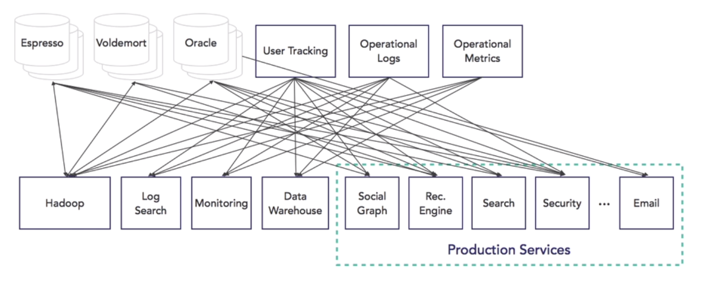
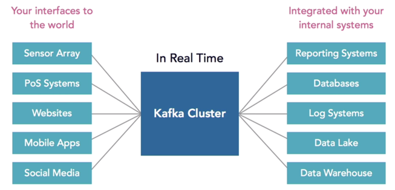
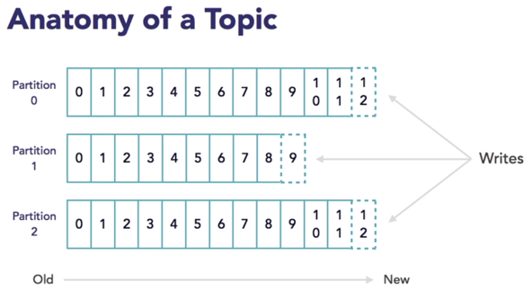
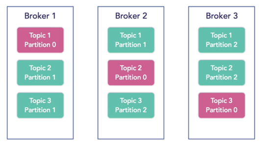
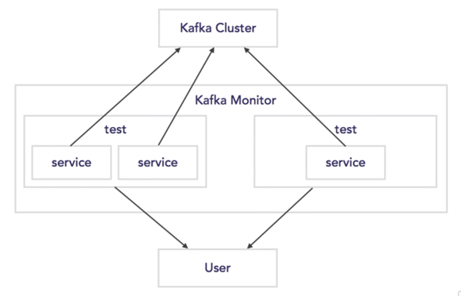

# Kafka Note

## Application Scenarios

- messaging system
- web analytics - clickstream
- operational monitoring - e.g. manufacturing facility, sensor data
- log collection
- stream processing - e.g. alerting abnormal usage when using credit card

---

## Architecture

Typical connection way without Kafka:  

Using Kafka as a hub:

---

## Basics

### Log

- Log: The source of the truth.
- When systems make changes, it creates events or changes. A log is like a never ending stream of thses changes to a specific category or entity.
  - Changes:
    - update to customer info
    - new orders
    - page views
    - scanning products
- When one system update the log, other systems can read from that log to sync themselves.

### Topic

- Kafka splits a topic into partitions. 
- Each partition is an ordered immutable sequence of messages.
- Each message is assigned a unique sequential identifier called offset. 
- Kafka retains all messages for a configurable period of time. 
- Kafka's performance is effectively constant with respect to data size. 

- Lead partition: handle writing data to the topic.
  - Will be written firstly.
- Other slave partitions: handle reading data from the topic.
  - Will be written after lead partition.
- Different topics can have different configurations of the amount of partitions.
- If all the consumers subscribing to a topic belong to the same consumer group, each message is delivered to only one consumer. 

### Broker

A single broker can handle several hundred megabytes of reads and writes per second from thousands of applications.

If Broker 3 goes down,

- the lead partition of Topic 3 will move over to Broker 1.
- Broker 1 is little bit overloaded because it is handling writes for both Topic 1 and 3.
- Broker 2 will also adjust its partition of Topic 3.  

Multiple brokers: split topics across brokers into partitions. (replication for fault tolerance)

---

## Hardware Recommendations

It is not common to have Kafka running actively across multiple data centers due to latency and throughput issues.  

Hardware recommendations for machines running Kafka.

Machine

- medium-sized

Memory

- 64 GB RAM - decent choice
- 32 GB RAM - recommend

CPU

- 24 cores per machine

Disk

- multiple log directories
- each directory is mounted on a separate drive
- fast

Network

- 1~10 GB ethernet

---

## Kafka Monitor

Use Kafka Monitor to run long-running tests to monitor the Kafka cluster.

---

## Kafka Audit

Verify all the messages are being handled properly, and make sure that they are being delivered and processed and everything is in sync, and you are not losing messages or data.

Options:

- Kafka Audit (Roll your own)
- Chaperone (Uber)
- Confluent Control Center

---

## Installation (kafka_2.11-0.9.0.0.tgz)

### Config ZooKeeper

Kafka uses ZooKeeper so start ZooKeeper firstly.

1. Under `zookeeper/conf`, create zoo.cfg file based on zoo_sample.cfg.
2. In zoo.cfg file, modify `dataDir=/tmp/zookeeper` to `dataDir=/usr/local/zookeeper/tmp`, as the former directory will be clear every time when the server starts.
3. Start ZooKeeper. Under `zookeeper/bin`, command line: `zkServer.sh start`.

### Config Kafka

1. Under `kafka_2.11-0.9.0.0/config`, in server.properties file, uncomment `host.name=localhost`, modify `log.dirs=/tmp/kafka-logs` to `log.dirs=/usr/local/kafka_2.11-0.9.0.0/tmp`, as the former directory will be clear every time when the server starts.
2. Start Kafka. Under `kafka_2.11-0.9.0.0`, command line: `bin/kafka-server-start.sh config/server.properties`.

---

## How to Use Single Node Single Broker

Useful config ($KAFKA_HOME/config/server.properties):

- broker.id=0
- listeners
- host.name
- log.dirs
- zookeeper.connect

Steps:

1. Create a topic: In terminal A, `bin/kafka-topics.sh --create --zookeeper localhost:2181 --replication-factor 1 --partitions 1 --topic hello_topic`.
2. Check the topic: `bin/kafka-topics.sh --list --zookeeper localhost:2181`. Then "hello_topic" will be displayed.
3. Produce messages: In terminal B, `bin/kafka-console-producer.sh --broker-list localhost:9092 --topic hello_topic`.
4. Consume messages: In terminal C, `bin/kafka-console-consumer.sh --zookeeper localhost:2181 --topic hello_topic --from-beginning`. **Note here:** `--from beginning` means consuming messages including all already sent in terminal B. Use it if you want all messages from the beginning; otherwise do not use it.
5. Type something in terminal B, they will be displayed in terminal C.

> Check all topics info: `bin/kafka-topics.sh --describe --zookeeper localhost:2181`.

> Check a specific topic (here it is hello_topic) info: `bin/kafka-topics.sh --describe --zookeeper localhost:2181 --topic hello_topic`.

> Add partitions: `bin/kafka-topics.sh --alter --zookeeper localhost:2181 --partitions <number_of_partitions> --topic hello_topic`.

> Delete a topic:
> Topic deletion is disabled by default.
> To enable: `delete.topic.enable=true`.
> `bin/kafka-topics.sh --delete --zookeeper localhost:2181 --topic hello_topic`.

---

## How to Use Single Node Multiple Brokers

Refer to Kafka website (http://kafka.apache.org/quickstart#quickstart_multibroker).
