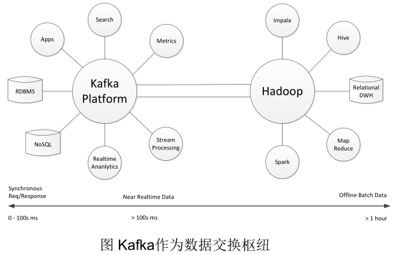
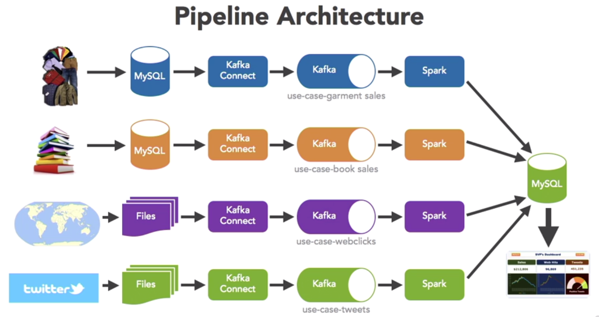
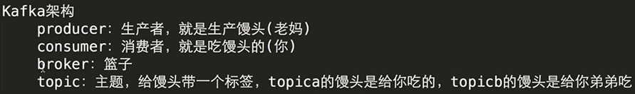
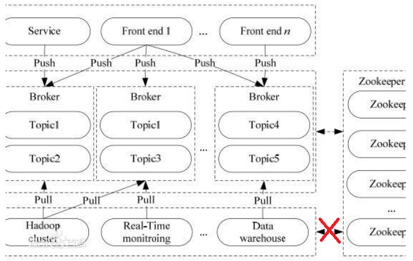

# Kafka Note

## Kafka Architecture 

---

## Installation (kafka_2.11-0.9.0.0.tgz)

### Config ZooKeeper

Kafka uses ZooKeeper so start ZooKeeper firstly. 

1. Under `zookeeper/conf`, create zoo.cfg file based on zoo_sample.cfg. 
2. In zoo.cfg file, modify `dataDir=/tmp/zookeeper` to `dataDir=/usr/local/zookeeper/tmp`, as the former directory will be clear every time when the server starts. 
3. Start ZooKeeper. Under `zookeeper/bin`, command line: `zkServer.sh start`.

### Config Kafka

1. Under `kafka_2.11-0.9.0.0/config`, in server.properties file, uncomment `host.name=localhost`, modify `log.dirs=/tmp/kafka-logs` to `log.dirs=/usr/local/kafka_2.11-0.9.0.0/tmp`, as the former directory will be clear every time when the server starts.
2. Start Kafka. Under `kafka_2.11-0.9.0.0`, command line: `bin/kafka-server-start.sh config/server.properties`.

---

## How to use single node single broker

Useful config ($KAFKA_HOME/config/server.properties):

- broker.id=0
- listeners
- host.name
- log.dirs
- zookeeper.connect 

Steps: 

1. Create a topic: In terminal A, `bin/kafka-topics.sh --create --zookeeper localhost:2181 --replication-factor 1 --partitions 1 --topic hello_topic`. 
2. Check the topic: `bin/kafka-topics.sh --list --zookeeper localhost:2181`. Then "hello_topic" will be displayed. 
3. Produce messages: In terminal B, `bin/kafka-console-producer.sh --broker-list localhost:9092 --topic hello_topic`. 
4. Consume messages: In terminal C, `bin/kafka-console-consumer.sh --zookeeper localhost:2181 --topic hello_topic --from-beginning`. **Note here:** `--from beginning` means consuming messages including all already sent in terminal B. Use it if you want all messages from the beginning; otherwise do not use it. 
5. Type something in terminal B, they will be displayed in terminal C. 

> Check all topics info: `bin/kafka-topics.sh --describe --zookeeper localhost:2181`.

> Check a specific topic (here it is hello_topic) info: `bin/kafka-topics.sh --describe --zookeeper localhost:2181 --topic hello_topic`.

---

## How to use single node multiple brokers

Refer to Kafka website (http://kafka.apache.org/quickstart#quickstart_multibroker). 

---
