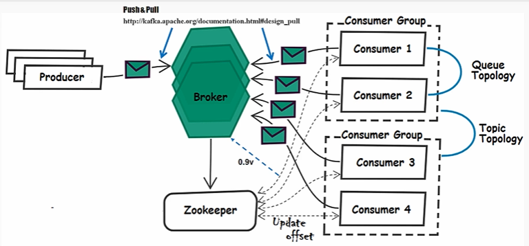
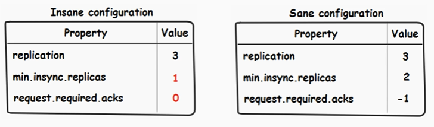
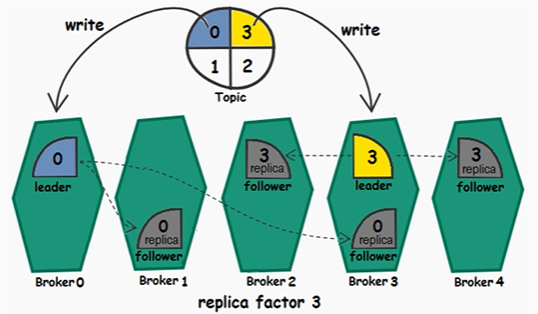

# Kafka Note

- [Kafka Note](#kafka-note)
  - [Messaging Systems](#messaging-systems)
    - [Design Patterns](#design-patterns)
  - [Kafka Architecture](#kafka-architecture)
    - [ZooKeeper Ensemble](#zookeeper-ensemble)
  - [Overview](#overview)
    - [Application Scenarios](#application-scenarios)
    - [Three Types of Kafka Clusters](#three-types-of-kafka-clusters)
    - [Message Delivery Semantics](#message-delivery-semantics)
    - [Kafka Context Overview](#kafka-context-overview)
    - [Other Considerations](#other-considerations)
  - [Commit Log](#commit-log)
  - [Topic, Partition & Message](#topic-partition--message)
    - [Messages](#messages)
    - [Partitions](#partitions)
    - [Topics](#topics)
  - [Broker](#broker)
  - [Producers](#producers)
    - [How Producers Write to Brokers](#how-producers-write-to-brokers)
    - [Java Client Producer](#java-client-producer)
    - [Producer Configuration](#producer-configuration)
      - [`acks` / Durability](#acks--durability)
      - [`compression.type`](#compressiontype)
      - [Custom Serializer](#custom-serializer)
      - [Custom Partitioner](#custom-partitioner)
    - [Synchronous Wait](#synchronous-wait)
    - [Example Producer Code](#example-producer-code)
      - [Health Trending Producer](#health-trending-producer)
      - [Alert Producer](#alert-producer)
    - [Client and Broker Versions](#client-and-broker-versions)
  - [Consumers](#consumers)
    - [How Consumers Read from Brokers](#how-consumers-read-from-brokers)
    - [Offsets](#offsets)
    - [Consumer Groups](#consumer-groups)
      - [Group Coordinator](#group-coordinator)
    - [Consumer Failure](#consumer-failure)
    - [If More Consumers than Partitions](#if-more-consumers-than-partitions)
    - [Consumer Rebalance](#consumer-rebalance)
    - [Java Client Consumer](#java-client-consumer)
    - [Consumer Configuration](#consumer-configuration)
    - [Stop a Consumer](#stop-a-consumer)
  - [Replication](#replication)
  - [Write & Read](#write--read)
  - [Various Source Code Packages](#various-source-code-packages)
    - [Kafka Streams](#kafka-streams)
    - [Kafka Connect](#kafka-connect)
    - [AdminClient](#adminclient)
  - [Kafka vs Flume](#kafka-vs-flume)
  - [Hardware Recommendations](#hardware-recommendations)
  - [Kafka Monitor](#kafka-monitor)
  - [Kafka Audit](#kafka-audit)
  - [Installation (kafka_2.11-0.9.0.0.tgz)](#installation-kafka_211-0900tgz)
    - [Config ZooKeeper](#config-zookeeper)
    - [Config Kafka](#config-kafka)
  - [How to Use Single Node Single Broker](#how-to-use-single-node-single-broker)
  - [How to Use Single Node Multiple Brokers](#how-to-use-single-node-multiple-brokers)

---

## Messaging Systems 

### Design Patterns 

- Point to point messaging (Queue destination/semantics/topology)
- Pub/Sub messaging (Topic destination/semantics/topology)

Kafka supports both.

---

## Kafka Architecture

Typical connection way without Kafka:  


Using Kafka as a hub:





### ZooKeeper Ensemble

ZooKeeper helps maintain consensus in the cluster.

The reliance on ZooKeeper has been lessened with later client versions. In recent client versions (Kafka version 0.9+), the only real interactions with ZooKeeper are brokers. Consumer clients no longer store offsets in ZooKeeper, but inside a Kafka internal topic instead by default. (Consumer clients do not have to store their offsets in either or these locations.)

ZooKeeper should have been running before you started your brokers. 

---

## Overview

Apache Kafka is publish-subscribe, high-throughput, distributed messaging system. 

Kafka scales very well in a horizontal way without compromising speed and efficiency.

Kafka is distributed, partitioned, replicated, and commit-log-based.

Small messages are not a problem for Kafka. The default message size is about 1 MB. It is configurable. 

Kafka's performance is effectively constant with respect to data size.

Kafka can process millions of messages quickly because it relies on the page cache instead of JVM heap. As a result, the brokers help avoid some of the issues that large heaps can hold, ie. long or frequent garbage collection pauses.

Whether data is coming from a database or a log event, my preference is to get the data into Kafka first. The data will be available in the purest form that you can achieve. Kafka does not really care about the content of the data or do any validation by default.

Two directives or purposes of Kafka: 

- Not block the producers (in order to deal with the back pressure). (the ability to capture messages even if the consuming service is down)
- Isolate producers and consumers. 

Three main capabilities: 

- Provide the ability to **publish/subscribe** to records like a **message queue**.
- Store records with **fault-tolerance**.
- Process **streams** as they occur.

Special features that make Kafka standout from other message brokers: 

- replayable messages 
- multiple consumers features

### Application Scenarios

- messaging system
- website activity tracking - clickstream
- operational monitoring / IoT data processing - e.g. manufacturing facility, sensor data.
- log collection / aggregation
- stream processing - e.g. alerting abnormal usage when using credit card.

When Kafka might **NOT** be the right fit: 

- When you only need a once monthly or even once yearly summary of aggregate data.
- When you do not need an on-demand view, quick answer, or even the ability to reprocess data.
- Especially when data is manageable to process at once as a batch.
- When your main access pattern for data is mostly random lookup of data.
- When you need exact ordering of messages in Kafka for the entire topic.
- With larger messages, you start to see memory pressure increase.

### Three Types of Kafka Clusters

- Single node – single broker
- Single node – multiple broker
- Multiple node – multiple broker

### Message Delivery Semantics

Three ways to deliver messages:

- At least once (**by default**): The messages are never lost. 
  - If a message from a producer has a failure or is not acknowledged, the producer will resend the message.
  - The broker will see two messages (or only one if there was a true failure).
  - Consumers will get as many messages as the broker received. They might have to deduplicate messages.
- At most once: The messages may be lost.
  - If a message from a producer has a failure or is not acknowledged, the producer will **not** resend the message.
  - The broker will see one message at most (or zero if there was a true failure).
  - Consumers will see the messages that the broker received. If there was a failure, the consumer would never see that message.
  - Q: Why would someone be OK with losing a message? A: **Keeping the system performing and not waiting on acknowledgements might outweigh any gain from lost data.**
- Exactly once (introduced in 0.11 release): The message is delivered exactly once. There is zero loss of any message.
  - If a message from a producer has a failure or is not acknowledged, the producer will resend the message.
  - The broker will only allow one message.
  - Consumers will only see the message once.

### Kafka Context Overview


### Other Considerations

The answer to the questions below will impact various parts of implementation (configuration options): 

- Message loss: Is it okay to lose any messages in the system?
- Grouping: Does your data need to be grouped in any way? Are the events correlated with other events that are coming in?
- Ordering: Do you need data delivered in an exact order? What if a message gets delivered in an order other than when it actually occurred?
- Last value only: Do you only want the last value of a specific value? Or is history of that value important? Do you really care about the history of how your data values evolved over time? 
- Independent consumer: How many consumers are we going to have? Will they all be independent of each other or will they need to maintain some sort of order when reading the messages?

Kafka allows you to change key behaviors just by changing some configuration values.

---

## Commit Log

Commit log: the source of the truth.

As each new message comes in, it is added to the end of the log. The log is immutable and can only be appended to the end.

Users will use offsets to know where they are in that log.

Commit logs are retained by period of time or size configuration properties. In various companies, after the data in the Kafka commit logs hits a configurable size or time retention period (default is 7 days), the data is often moved into a permanent store like S3 or HDFS. 

When systems make changes, it creates events or changes. A log is like a never ending stream of these changes to a specific category or entity.

Change examples:
  - update to customer info
  - new orders
  - page views
  - scanning products

When one system updates the log, other systems can read from that log to sync themselves.

The message log can be compacted in two ways:

- coarse-grained: log compacted by time
- fine-grained: log compacted by message

---

## Topic, Partition & Message


Kafka splits a topic into partitions.

### Messages 

- Messages (= records) are byte arrays of data with String, JSON, and Avro being the most common.
- Each message is stored as a key-value pair. Each message consists of a key, a value and a timestamp. The key is not required.
- Each message is assigned a unique sequential identifier called **offset**. 
- Messages with the same key arrive at the same partition.
- Messages are replicated across the cluster and persisted to disk.
- Kafka retains all messages for a configurable period of time.

### Partitions

Partition: How many parts you want the topic to be split into.

Each partition is an ordered immutable sequence of messages.

The partition is further broken up into **segment files** (the actual files) written on the disk drive.

A single partition only exists on one broker and will not be split between brokers.

One of the partition copies (replicas) will be the leader. Producers and consumers will only read or write from or to the leader.

Message ordering is only guaranteed within a partition for a topic, NOT between different partitions in a topic.

### Topics 


Different topics can have different configurations of the amount of partitions.

There is configuration to enable or disable auto-creation of topics. However, you are free to manually create yourself.

You can use one topic as the starting point to
populate another topic. 

- Create a topic: `bin/kafka-topics.sh --zookeeper localhost: 2181 --create --topic helloworld --partitions 3 --replication-factor 3`
- List topics: `bin/kafka-topics.sh --zookeeper localhost:2181 --list`
- Describe a topic: `bin/kafka-topics.sh --zookeeper localhost:2181 --describe --topic helloworld`


---

## Broker

A single broker can handle several hundred megabytes of reads and writes per second from thousands of applications.

Each server acts as a leader for some of its partitions and a follower for others, so load is well balanced within the cluster.


If Broker 3 goes down,

- The lead partition of Topic 3 will move over to Broker 1.
- Broker 1 is little bit overloaded because it is handling writes for both Topic 1 and 3.
- Broker 2 will also adjust its partition of Topic 3.  


Multiple brokers: split topics across brokers into partitions. (replication for fault tolerance)

---

## Producers

There are no default producers.

A producer is also a way to send messages inside Kafka itself. For example, if you are reading data from a specific topic and wanted to send it to a different topic, you would also use a producer.

Start a console producer: `bin/kafka-console-producer.sh --broker-list localhost:9092 -- topic helloworld`

### How Producers Write to Brokers


Once the producer is connected to the cluster, it can then obtain metadata. The senders job includes fetching metadata about the cluster itself, which helps the producer find the information about which actual broker is written to (since producers only write to the leader of the partition).

The record accumulators job is to "accumulate" the messages into batches, which improves throughput and allow for a higher compression ratio than one messages at a time if compression for the messages is used. (If each and every message was sent one at a time, a slow down likely could be seen in regards to how fast your messages are being processed.)

**NOTE**: If one message in the batch fails, then the entire batch fails for that partition. For this problem, there is already the built-in retry logic.

If ordering of the messages is important,

```java
props.put("acks", "all");  // setting to "all" provides the best situation for making sure your producer’s messages arrive in the order
props.put("retries", "3");  // set the retries to a non-zero number
props.put("max.in.flight.requests.per.connection", "5");  // set the value <= 5
```

Alternatively, set with the one configuration property `enable.idempotence`.

Do not have to worry about that one producer getting in the way of another producer’s data. Data will not be overwritten, but handled by the log itself and appended on the brokers log.

Producers can decide in which partition each message goes by: 

- round-robin mechanism 
- semantic partitioning based on a key in the message

### Java Client Producer

Pre-requisite: add the following dependency in pom.xml if using Maven.

```xml
<dependency>
  <groupId>org.apache.kafka</groupId>
    <artifactId>kafka-clients</artifactId>
  <version>0.11.0.0</version>
</dependency>
```

Producers are thread-safe.

```java
/**
 * an example of a simple producer
 */

Properties props = new Properties();

// a list of message brokers
// best practice: include more than one server in case one of the servers is down or in maintenance
// this list does not have to be every server you have though, as after it connects, it will be able to find out information about the rest of the cluster brokers and will not depend on that list
props.put("bootstrap.servers", "localhost:9092,localhost:9093");  

// we provide a class that will be able to serialize the data as it moves into Kafka
// keys and values do not have to use the same serializer
props.put("key.serializer", "org.apache.kafka.common.serialization.StringSerializer");
props.put("value.serializer", "org.apache.kafka.common.serialization.StringSerializer");

// producers are thread-safe
Producer<String, String> producer = new KafkaProducer<>(props);  

ProducerRecord producerRecord = new ProducerRecord<String, String>
("helloworld", null, "hello world again!");  // (topic, key, value)

producer.send(producerRecord);

producer.close();
```

### Producer Configuration

#### `acks` / Durability

It controls how many acknowledgments the producer needs to receive from the leader before it returns a complete request.

Your message will not be seen by consumers until it is considered to be committed. However, this status is NOT related to the `acks` setting.

Set to `0`: 

- Lowest latency
- Cost of durability 
- Retries are not attempted. 
- Not a big deal in the situation where data loss is acceptable, e.g. web page click tracing.

Set to `1`:

- Guarantee that at least the leader has received the message. 
- The followers might not have copied the message before a failure brings down the leader.

Set to `all` or `-1`:

- The leader will wait on all of the in-sync replicas (ISRs) to acknowledge they have gotten the message. 
- Best for durability
- Not the quickest
- Suitable for the situation where data loss is not acceptable.  



#### `compression.type`

If the size of data being sent is a concern, compression might be a feature you want to look into. Some types: snappy, gzip, lz4.

Do not forget that CPU and memory are needed for this work. And that tradeoff might not make sense in every use case.

Compression is done at the batch level.

The size and rate of your data decide if it is necessary to use compression. Situations that do not need compression: 

- small messages
- low traffic or events, do not have many messages

#### Custom Serializer

For plain text messages, use `StringSerializer`.

For Avro, use `io.confluent.kafka.serializers.KafkaAvroSerializer`.

You can serialize key and values with different serializers on the same message.

Example:

```java
/**
 * custom class
 */
public class Alert {
  private int alertId;
  private String stageId;
  private String alertLevel;
  private String alertMessage;

  public Alert(int alertId, String stageId, String alertLevel, String alertMessage) {
    this.alertId = alertId;
    this.stageId = stageId;
    this.alertLevel = alertLevel;
    this.alertMessage = alertMessage;
  }

  // getters
  // ...


  // setters
  // ...
}
```

```java
/**
 * custom Serializer class
 */
public class AlertKeySerde implements Serializer<Alert>, Deserializer<Alert> {

  public byte[] serialize(String topic, Alert value) {
    if (value == null) {
      return null;
    }

    try {
      return value.getStageId().getBytes("UTF8");
    } catch (UnsupportedEncodingException e) {
      throw new RuntimeException(e);
    }
  }

  public void close() {
  // nothing needed
  }

  public void configure(Map<String, ?> configs, boolean isKey) {
  // nothing needed
  }

  public Alert deserialize(String topic, byte[] value) {
  //We will leave this part for later
    return null;
  }
}
```

#### Custom Partitioner 

Kafka uses hash partitioning. `key.hashCode() % numberOfPartitions`

If there are specific keys that you might want to avoid all being hashed to the same partition due to the volume you expect, the client can write custom partitioner class to control what partition it writes to, which load-balances the data over the partitions. 

For example, if two customers produce 75% of your traffic, it might be a good idea to
split those two customers into different partitions in order to avoid filling your storage space on specific partitions only.

Example: 

```java
import org.apache.kafka.clients.producer.Partitioner;
import org.apache.kafka.common.Cluster;
import org.apache.kafka.common.PartitionInfo;
import java.util.*;

/**
 * custom Partitioner class
 *
 * place alerts with the different levels in different partitions
 * make "CRITICAL" events assigned to a specific partition
 */
public class AlertLevelPartitioner implements Partitioner {
  public int partition(final String topic,    
                      final Object objectKey, 
                      final byte[] keyBytes, 
                      final Object value, 
                      final byte[] valueBytes, 
                      final Cluster cluster) {

    final List<PartitionInfo> partitionInfoList = cluster.availablePartitionsForTopic(topic); 
    final int partitionSize = partitionInfoList.size();
    final criticalPartition = partitionSize - 1;
    final partitionCount = partitionSize - 1;

    final String key = ((String) objectKey);

    if (key.contains("CRITICAL")) {
      return criticalPartition;
    } else {
      return Math.abs(key.hashCode()) % partitionCount;
    }
  }

  public void close() {
    // nothing needed
  }

  public void configure(Map<String, ?> configs) {
    // nothing needed
  }
}
```

```java
/**
 * use custom partitioner class in producer
 */

Properties props = new Properties();

props.put("partitioner.class", "com.yourpackagename.partitioner.AlertLevelPartitioner");
```

### Synchronous Wait

In some cases, you might want to wait for the response to complete in a synchronous way after sending messages. 

```java
RecordMetadata result = producer.send(producerRecord).get();  // get() method is how to wait for the result to come back before moving on

System.out.printf("offset = %d, topic = %s,
timestamp = %Tc %n", result.offset(), result.topic(), result.timestamp());
```

### Example Producer Code

#### Health Trending Producer

- Track sensor health status over time. 
- Care about the info about one sensor at a time. 
- Use sensor id as key to group sensor events. 

```java
Properties props = new Properties();

props.put("bootstrap.servers", "localhost:9092,localhost:9093");
// serialize custom Alert object into a key
props.put("key.serializer", "com.yourpackagename.serde.AlertKeySerde");  
props.put("value.serializer", "org.apache.kafka.common.serialization.StringSerializer");

Producer<Alert, String> producer = new KafkaProducer<>(props);

Alert alert = new Alert(0, "Stage 0", "CRITICAL", "Stage 0 stopped");

ProducerRecord<Alert, String> producerRecord = new ProducerRecord<>("healthtrendtopic", alert, alert.getAlertMessage());

producer.send(producerRecord);
```

#### Alert Producer

- Have any alerts quickly processed. 
- Use sensor id as key to group sensor events.
- Look at only the last event for that sensor id. 
- Do not care about the history of the status checks.
- Partition alerts in order to have access to the critical alerts specifically.

```java
Properties props = new Properties()l

props.put("bootstrap.servers", "localhost:9092,localhost:9093");
// serialize custom Alert object into a key
props.put("key.serializer", "com.yourpackagename.serde.AlertKeySerde");
props.put("value.serializer", "org.apache.kafka.common.serialization.StringSerializer");
props.put("partitioner.class", "com.yourpackagename.partitioner.AlertLevelPartitioner");

Producer<Alert, String> producer = new KafkaProducer<>(props);

Alert alert = new Alert(1, "Stage 1", "CRITICAL", "Stage 1 stopped");

ProducerRecord<Alert, String> producerRecord = new ProducerRecord<>("alerttopic", alert, alert.getAlertMessage());

// use callback to handle successful completion or failure of an asynchronous send call
producer.send(producerRecord, new AlertCallback());
```

```java
public class AlertCallback implements Callback {
  public void onCompletion(RecordMetadata metadata, Exception exception) {
    if (exception != null) {
      System.out.printf("Error sending message: "+ "offset = %d, topic = %s, timestamp = %Tc %n", metadata.offset(), metadata.topic(), metadata.timestamp());
    }
  }
}
```

### Client and Broker Versions

Kafka and clients versions do not always have to match. For instance, Kafka version is 1.0 and Java producer client version is 0.10 (dependency version in pom). However, there could be some cost due to the version mismatch.

---

## Consumers

**One consumer can read from one or more partitions.**

Multiple consumers can read from the same or different topics.

Consumers are not listener to the brokers, but polling data from brokers. Consumers themselves control the rate of consumption.

Consumers control where to start reading data:

- from the beginning.
- from a location after the last read your client had previous committed.
- from the present and ignoring any
earlier messages.

Start a console consumer: `bin/kafka-console-consumer.sh --bootstrap-server localhost:9092 --topic helloworld --from-beginning`

### How Consumers Read from Brokers

Find the leader partition by means of the topic. Then find the index-based offset.

Consumers only read from the consumer’s leader partition. Replicas are used in the case of failure but are not actively serving consumer fetch requests.


Q: How do consumers figure out what partition to connect to, and where the leader exists for that partition?

A: **For each consumer group, one of the brokers takes on the role of a *group coordinator*.** The client will talk
to this coordinator in order to get an assignment of which details it needs to consume.

**The number of partitions determines the amount of parallel consumers you can have.** 

- Many partitions might increase end-to-end latency. If milliseconds count in your application, you might not be able to wait until a partition is replicated between brokers. 
- If you do not have a 1-to-1 mapping of a partition to a consumer, the more partitions a consumer consumes will likely have more memory needs overall.

### Offsets

Offsets are index position in the commit log that the consumer sends to the broker to let it know what messages it wants to consume from where.

The default offset is latest.

Offsets are always increasing for each partition. Even if that message is removed at a later point, the offset number will not be used again.

Offset value is a `long` data type.

### Consumer Groups

When starting a new consumer group, there will be no stored offsets.

If a consumer joins an existing group that already stored offsets, this consumer will resume where it left off reading from any previous runs.

It is often the case that you will have many consumers reading from the same topic. Each consumer that uses the same `group.id` as another consumer will be considered to be working together to consume the partitions and offsets of the topic as one logical application.

The key to letting your consumer clients work together is a unique combination of the following: group, topic, and partition number.

**As a general rule, one partition is consumed by only one consumer for any given consumer group.**


Multiple consumers can read the same message if they belong to different groups.

Consumers from the same group read messages in the manner of queue topology.

Consumers within a group can consume more partitions than their number. 


#### Group Coordinator

The group coordinator works with the consumer clients to keep track of where that specific group has read from the topic.

The group coordinator play a role: 

- in assigning which consumers read which partitions at the beginning of the group startup.
- when consumers are added or fail and exit the group.

### Consumer Failure

When a consumer fails or leaves a group, the partitions that need to be read are re-assigned. An existing consumer will take the place of reading a partition that was being read with the consumer that dropped out of the group.


One way a consumer can drop out of a group is by failure to send a heartbeat to the GroupCoordinator. Failure to send these heartbeats can happen in a couple of ways: 

- Stop the consumer client by either termination of the process or failure due to a fatal exception.
- If taking longer time than the setting of `max.poll.interval.ms` to process messages.

### If More Consumers than Partitions

If there are more consumers in a group than the number of partitions, then some consumers will be idle. 

This makes sense in some instances, e.g. you might want to make sure that a similar rate of consumption will occur if a consumer dies unexpectedly. In other words, you want to make sure a consumer is ready to handle a partition in case of a failure.

### Consumer Rebalance

**NOTE**: During a rebalance, consumption is paused. **Adding and losing consumer from a group are all key details to watch** and make sure that your leaders are not being rebalanced
across clients and repeatedly causing pauses in your consumption.

Ways to keep informed of consumer rebalances: 

- Look at log files.
- Print offset metadata from consumer clients. 
- Implement the interface `ConsumerRebalanceListener`.

```java
/*
 * manual partition assign
 */

public class MaintainOffsetsOnRebalance implements ConsumerRebalanceListener {

  // ...

  public void onPartitionsRevoked(Collection<TopicPartition> partitions) {
    for (TopicPartition partition: partitions) {
      // store your offsets to your own storage instead of letting Kafka take care of it by default to its internal topics
      saveOffsetInStorage(consumer.position(partition)); 
    }
  }

  public void onPartitionsAssigned(Collection<TopicPartition> partitions) {
    for (TopicPartition partition: partitions) {
      consumer.seek(partition, readOffsetFromStorage(partition));
    }
  }
}
```

All consumer processes will call the `onPartitionsRevoked` methods before calling any `onPartitionsAssigned` code. You cannot usually be sure that your client would handle the same partitions after the rebalance that they did before. 

### Java Client Consumer

Make sure you terminate the program after you done reading messages.

Java consumer client is **NOT** thread-safe. You can get a `ConcurrentModificationException` if you have many threads going at once. One consumer per thread.

```java
/**
 * an example of a simple consumer
 */

Properties props = new Properties();

// properties are set the same way as producers
props.put("bootstrap.servers", "localhost:9092,localhost:9093");
props.put("group.id", "helloconsumer");  // group multiple consumers
props.put("enable.auto.commit", "true");
props.put("auto.commit.interval.ms", "1000");
// make sure the deserializers for key and value match the serializers in producer 
props.put("key.deserializer", "org.apache.kafka.common.serialization.StringDeserializer");
props.put("value.deserializer", "org.apache.kafka.common.serialization.StringDeserializer");

KafkaConsumer<String, String> consumer = new KafkaConsumer<>(props);

// can subscribe to more than one topic at a time
consumer.subscribe(Arrays.asList("helloworld"));

while (true) {
  // no messages, one message, or many messages could all come back with a single poll
  ConsumerRecords<String, String> records = consumer.poll(100);  // 100 milliseconds: amount of time we are willing to wait if data is not available
  for (ConsumerRecord<String, String> record : records)
    System.out.printf("offset = %d, key = %s, value = %s%n", record.offset(), record.key(), record.value());
}
```

### Consumer Configuration 

- `client.id`: An id used for being able to identify a client.
- `fetch.min.bytes`: How many bytes your consumer should wait for until a timeout happens.
- `heartbeat.interval.ms`: The time between when the consumer pings the group coordinator.
- `max.partition.fetch.bytes`: The max amount of data the server will return. This is a per-partition value.
- `session.timeout.ms`: How long until a consumer not contacting a broker will be removed from the group as a failure.
- `max.poll.interval.ms`: (introduced as
part of Kafka 0.10.1) How long it takes for messages processing. If you take longer time than this setting to process messages, the consumer will be considered dead and drop out of the group.

Make sure `session.timeout.ms` > `heartbeat.interval.ms` in order to make sure that your consumer is letting other consumers know you are likely still processing the messages.

### Stop a Consumer 

One common use case of stopping a consumer is adding calling `close()` in consumer client code. This will stop the client properly and inform the broker.

The group coordinator should be sent notification about membership of the group being changed due to the client leaving. If the coordinator does not receive a heartbeat within a specific time, then the coordinator considers the client as dead and reassigns the partitions to the existing consumer clients. This heartbeat timeout is set by using the property `session.timeout.ms`.

```java
public class KafkaConsumerThread implements Runnable {
  private final AtomicBoolean stopping = new AtomicBoolean(false); 

  // construct props
  // ...

  private final KafkaConsumer<String, String> consumer = new KafkaConsumer<>(props); 

  public void run() {
    try {
      consumer.subscribe(Arrays.asList("webclickstopic"));
      while (!stopping.get()) {
        ConsumerRecords<String, String> records = consumer.poll(100);

        // process records
        // ...
      }
    } catch (WakeupException e) {
      if (!stopping.get()) throw e;
    } finally {
      consumer.close();
    }
  }

  // this method can be called from a different thread in order to stop the client in the proper way
  public void shutdown() {
    stopping.set(true);
    consumer.wakeup();
  }
}
```

---

## Replication 

Only when all followers sync the message, it can be sent to consumers.

When a follower rejoins after a downtime, it can re-sync messages.



A common fault tolerance technique consists in designing the system with a tolerance up to a predefined number of simultaneous failures, in which case we say that the system is k-fault tolerant, where k represents the number of simultaneous failures. **For a broker replication factor n, Kafka can tolerate up to n-1 broker failures without losing any committed messages.**

---

## Write & Read

Linear read and writes is where Kafka shines.

**The leader handles all read and write requests** for the partition while the followers passively replicate the leader. 

Only committed messages are ever given out to the consumer. 

For producers, they have the option of either waiting for the message to be committed or not, depending on their preference for tradeoff between latency and durability.

One application reading a message off of the message brokers does not remove it from other applications that might want to consume it as well. Developer mistakes, application logic mistakes, and even dependent
application failures have a chance to be corrected with our topics not removing the data once read one time.

---

## Various Source Code Packages

### Kafka Streams 

Streams API was released in 2016.

lightweight library

Features: 

- local state with fault-tolerance
- one-at-a-time message processing
- exactly once delivery 

Streams API can be thought of an abstraction layer that sits on top of producers and consumers. 

It provides a higher level view of working with data as an unbounded stream.

It was made to make sure that creating streaming applications was as easy as possible and even provides a domain-specific language (DSL).

One of the sweet spots for Streams is
that no separate processing cluster is needed.

### Kafka Connect

This framework was created to make integration with other systems easier. It is already part of Kafka that really can make it simple to use pieces (connectors) that have already been built to start your streaming journey.

The purpose of Connect is to help move data in or out of Kafka without having to deal with writing our own producers and clients.

In many ways, it can be thought to help replace other tools such as Camus, Apache Gobblin, and Apache Flume. Using a direct comparison to Flume features are not the intention or sole goals of Connect.

Connectors: 

- Source connectors: import data from a source into Kafka.
- Sink connectors: export data out of Kafka into a different system.

Kafka Connect is great for making quick and simple data pipeline that tie together a common system.

If you use a database today and want to kick the tires on streaming data, one of the easiest on-ramps is to start with Kafka Connect.

Start standalone Connect for a file source: `bin/connect-standalone.sh config/connect-standalone.properties config/connect-file-source.properties`. Leave it running. 

Start standalone Connect for a file source and sink: `bin/connect-standalone.sh config/connect-standalone.properties config/connect-file-source.properties config/connect-file-sink.properties`

When to use Connect vs Kafka Clients? If you are not familiar enough with the upstream or downstream application, use a pre-built connector. 

Connect also has a REST API and provides options to build your own connector.

### AdminClient

With version 0.11.0, Kafka introduced the AdminClient API.

It is used to perform administrative actions.

---

## Kafka vs Flume

Kafka is designed for messages to be consumed by several applications.

Flume is designed to stream messages to a sink such as HDFS or HBase.

[Flume and Kafka Integration](https://github.com/lizhanmit/learning-notes/blob/master/flume-kafka-integration-note/flume-kafka-integration-note.md)

---

## Hardware Recommendations

It is **not** common to have Kafka running actively across multiple data centers due to latency and throughput issues.  

Hardware recommendations for machines running Kafka.

Machine

- medium-sized

Memory

- 64 GB RAM - decent choice
- 32 GB RAM - recommend

CPU

- 24 cores per machine

Disk

- multiple log directories
- each directory is mounted on a separate drive
- fast

Network

- 1~10 GB ethernet

---

## Kafka Monitor

Use Kafka Monitor to run **long-running tests** to monitor the Kafka cluster.


---

## Kafka Audit

Verify all the messages are being handled properly, and make sure that they are being delivered and processed and everything is in sync, and you are not losing messages or data.

Options:

- Kafka Audit (Roll your own)
- Chaperone (Uber)
- Confluent Control Center

---

## Installation (kafka_2.11-0.9.0.0.tgz)

### Config ZooKeeper

Kafka uses ZooKeeper so start ZooKeeper firstly.

1. Under `zookeeper/conf`, create zoo.cfg file based on zoo_sample.cfg.
2. In zoo.cfg file, modify `dataDir=/tmp/zookeeper` to `dataDir=/usr/local/zookeeper/tmp`, as the former directory will be clear every time when the server starts.
3. Start ZooKeeper. Under `zookeeper/bin`, command line: `zkServer.sh start`.

### Config Kafka

1. Under `kafka_2.11-0.9.0.0/config`, in server.properties file, uncomment `host.name=localhost`, modify `log.dirs=/tmp/kafka-logs` to `log.dirs=/usr/local/kafka_2.11-0.9.0.0/tmp`, as the former directory will be clear every time when the server starts.
2. Start Kafka. Under `kafka_2.11-0.9.0.0`, command line: `bin/kafka-server-start.sh config/server.properties`.

---

## How to Use Single Node Single Broker

Useful config ($KAFKA_HOME/config/server.properties):

- broker.id=0
- listeners
- host.name
- log.dirs
- zookeeper.connect

Steps:

1. Create a topic: In terminal A, `bin/kafka-topics.sh --create --zookeeper localhost:2181 --replication-factor 1 --partitions 1 --topic hello_topic`.
2. Check the topic: `bin/kafka-topics.sh --list --zookeeper localhost:2181`. Then "hello_topic" will be displayed.
3. Produce messages: In terminal B, `bin/kafka-console-producer.sh --broker-list localhost:9092 --topic hello_topic`.
4. Consume messages: In terminal C, `bin/kafka-console-consumer.sh --zookeeper localhost:2181 --topic hello_topic --from-beginning`. **Note here:** `--from beginning` means consuming messages including all already sent in terminal B. Use it if you want all messages from the beginning; otherwise do not use it.
5. Type something in terminal B, they will be displayed in terminal C.

> Check all topics info: `bin/kafka-topics.sh --describe --zookeeper localhost:2181`.

> Check a specific topic (here it is hello_topic) info: `bin/kafka-topics.sh --describe --zookeeper localhost:2181 --topic hello_topic`.

> Add partitions: `bin/kafka-topics.sh --alter --zookeeper localhost:2181 --partitions <number_of_partitions> --topic hello_topic`.

> Delete a topic:
> Topic deletion is disabled by default.
> To enable: `delete.topic.enable=true`.
> 
> `bin/kafka-topics.sh --delete --zookeeper localhost:2181 --topic hello_topic`.

---

## How to Use Single Node Multiple Brokers

Refer to Kafka website (http://kafka.apache.org/quickstart#quickstart_multibroker).
