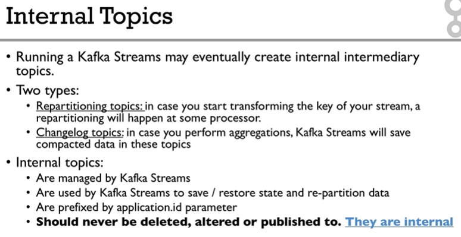
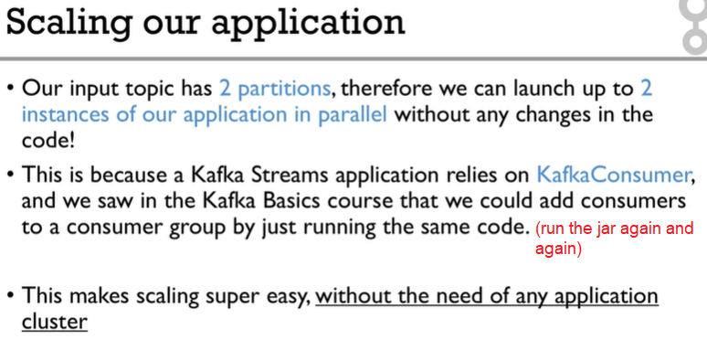
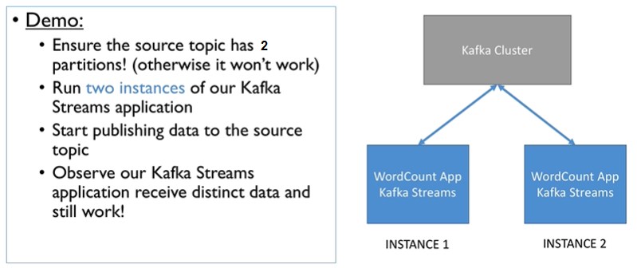
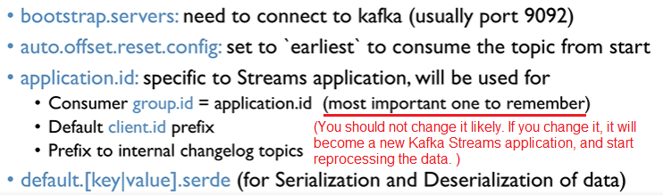
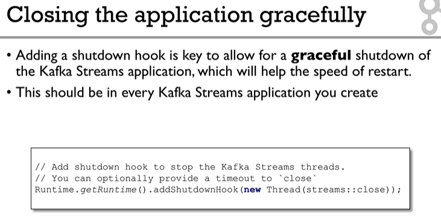
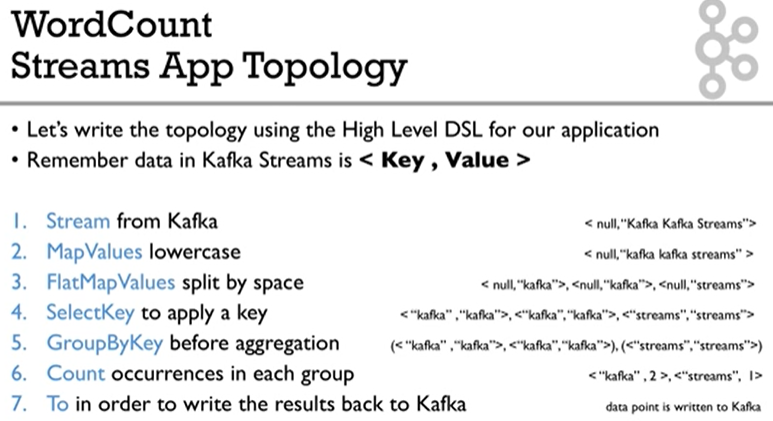

# Kafka Streams Note

(Based on video tutorial: [Apache Kafka Series - Kafka Streams for Data Processing](https://learning.oreilly.com/videos/apache-kafka-series/9781789343496/) )

- [Kafka Streams Note](#kafka-streams-note)
  - [Overview](#overview)
  - [Architecture](#architecture)
  - [Concepts](#concepts)
    - [Terminology](#terminology)
    - [High Level DSL VS. Low Level API](#high-level-dsl-vs-low-level-api)
    - [Internal Topics](#internal-topics)
    - [Scaling Applications](#scaling-applications)
  - [Coding](#coding)
    - [Console Code](#console-code)
    - [Kafka Streams App Properties](#kafka-streams-app-properties)
    - [Close App Gracefully](#close-app-gracefully)
  - [Use Cases](#use-cases)
    - [Word Count](#word-count)

---

## Overview


- Real streaming. 
- No cluster required. 
- Scales easily by just adding Java processes (no re-configuration required).
- Exactly once semantics (VS. at least once for Spark).
- Kafka-to-Kafka.

---

## Architecture


---

## Concepts

### Terminology


### High Level DSL VS. Low Level API


### Internal Topics



### Scaling Applications 





**NOTE**: The maximum parallelism is the number of input partitions in the topic.

---

## Coding

**NOTE**: You need to create all the topics before running Kafka Streams application. Otherwise, you will encounter some weird behaviors.

Pre-requisite: Download kafka_2.11-0.11.0.1 from official website. 

### Console Code

```shell
# 1. open a shell, zookeeper is at localhost:2181
bin/zookeeper-server-start.sh config/zookeeper.properties

# 2. open another shell, kafka is at localhost:9092
bin/kafka-server-start.sh config/server.properties

# 3. open another shell, create input topic 
bin/kafka-topics.sh --create --zookeeper localhost:2181 --replication-factor 1 --partitions 1 --topic streams-plaintext-input 

# 4. create output topic 
bin/kafka-topics.sh --create --zookeeper localhost:2181 --replication-factor 1 --partitions 1 --topic streams-wordcount-output 

# 5. start a kafka producer
bin/kafka-console-producer.sh --broker-list localhost:9092 --topic streams-plaintext-input 

# 6. enter as sample input data
kafka streams udemy
kafka data processing
kafka streams course
# exit by Ctrl + C

# 7. start a kafka consumer on the input topic to verify the data has been written above
bin/kafka-console-consumer.sh --bootstrap-server localhost:9092 --topic streams-plaintext-input --from-beginning
# exit by Ctrl + C

# 8. start a kafka consumer on the output topic
bin/kafka-console-consumer.sh --bootstrap-server localhost:9092 --topic streams-wordcount-output --from-beginning --formatter kafka.tools.DefaultMessageFormatter --property print.key=true --property print.value=true --property key.deserialization=org.apache.kafka.common.serialization.StringDeserializer --property value.deserialization=org.apache.kafka.common.serialization.LongDeserializer

# 9. open another shell, start the kafka streams application, then you should be able to see result in the above output topic consumer console
bin/kafka-run-class.sh org.apache.kafka.streams.examples.wordcount.WordCountDemo
# exit by Ctrl + C

# exit kafka consumer by Ctrl + C
```

### Kafka Streams App Properties 



### Close App Gracefully



---

## Use Cases

### Word Count



```shell
# 1. start zookeeper service

# 2. start kafka service

# 3. create input topic with two partitions
bin/kafka-topics.sh --create --zookeeper localhost:2181 --replication-factor 1 --partitions 2 --topic word-count-input

# 4. create output topic with two partitions
bin/kafka-topics.sh --create --zookeeper localhost:2181 --replication-factor 1 --partitions 2 --topic word-count-output

# 5. start a kafka consumer on the output topic
bin/kafka-console-consumer.sh --bootstrap-server localhost:9092 --topic word-count-output --from-beginning --formatter kafka.tools.DefaultMessageFormatter --property print.key=true --property print.value=true --property key.deserialization=org.apache.kafka.common.serialization.StringDeserializer --property value.deserialization=org.apache.kafka.common.serialization.LongDeserializer

# 6. start the kafka streams application in Intellij IDEA

# 7. start a kafka producer, and enter some data, then you should be able to see result in the above output topic consumer console
bin/kafka-console-producer.sh --broker-list localhost:9092 --topic word-count-input
```
