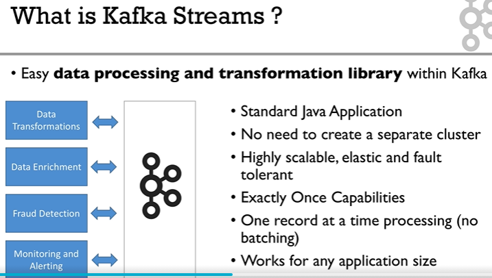

# Kafka Streams Note

(Based on video tutorial: [Apache Kafka Series - Kafka Streams for Data Processing](https://learning.oreilly.com/videos/apache-kafka-series/9781789343496/) )

- [Kafka Streams Note](#kafka-streams-note)
  - [Overview](#overview)
  - [Architecture](#architecture)
  - [Basics](#basics)
  - [Coding](#coding)

---

## Overview



- Real streaming. 
- No cluster required. 
- Scales easily by just adding Java processes (no re-configuration required).
- Exactly once semantics (VS. at least once for Spark).
- Kafka-to-Kafka.

---

## Architecture


---

## Basics


---

## Coding

Prerequisite: Download kafka_2.11-0.11.0.1 from official website. 

```shell
# open a shell, zookeeper is at localhost:2181
bin/zookeeper-server-start.sh config/zookeeper.properties

# open another shell, kafka is at localhost:9092
bin/kafka-server-start.sh config/server.properties

# open another shell, create input topic 
bin/kafka-topics.sh --create --zookeeper localhost:2181 --replication-factor 1 --partitions 1 --topic streams-plaintext-input 

# create output topic 
bin/kafka-topics.sh --create --zookeeper localhost:2181 --replication-factor 1 --partitions 1 --topic streams-wordcount-output 

# start a kafka producer
bin/kafka-console-producer.sh --broker-list localhost:9092 --topic streams-plaintext-input 

# enter as sample input data
kafka streams udemy
kafka data processing
kafka streams course
# exit by Ctrl + C

# start a kafka consumer on the input topic to verify the data has been written above
bin/kafka-console-consumer.sh --bootstrap-server localhost:9092 --topic streams-plaintext-input --from-beginning
# exit by Ctrl + C

# start a kafka consumer on the output topic
bin/kafka-console-consumer.sh --bootstrap-server localhost:9092 --topic streams-wordcount-output --from-beginning --formatter kafka.tools.DefaultMessageFormatter --property print.key=true --property print.value=true --property key.deserialization=org.apache.kafka.common.serialization.StringDeserializer --property value.deserialization=org.apache.kafka.common.serialization.LongDeserializer

# open another shell, start the kafka streams application 
bin/kafka-run-class.sh org.apache.kafka.streams.examples.wordcount.WordCountDemo
# exit by Ctrl + C

# exit kafka consumer by Ctrl + C
```
