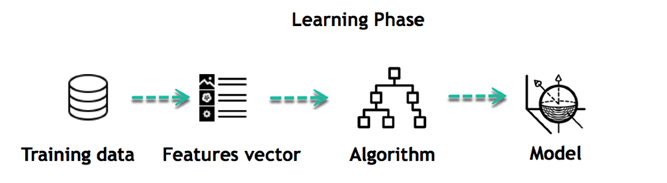
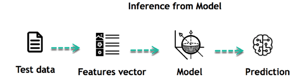
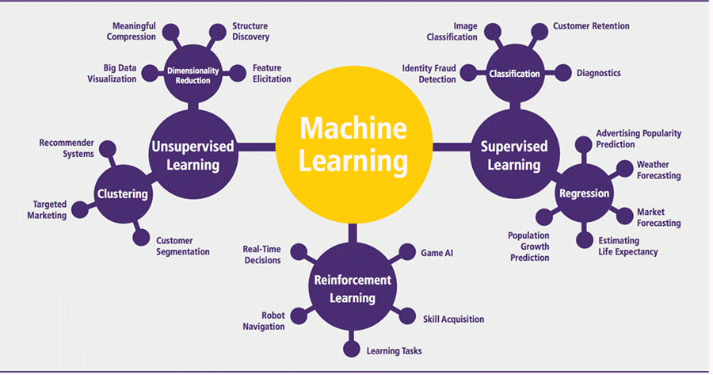

# Machine Learning Note

[Introduction to machine learning](https://developer.ibm.com/learningpaths/get-started-artificial-intelligence/ai-basics/introduction-to-machine-learning/)

[A Machine Learning Tutorial With Examples: An Introduction to ML Theory and Its Applications](https://www.toptal.com/machine-learning/machine-learning-theory-an-introductory-primer)

- [Machine Learning Note](#machine-learning-note)
  - [Math English](#math-english)
  - [Basics](#basics)
    - [How does ML Work?](#how-does-ml-work)
    - [ML Algorithms](#ml-algorithms)
    - [Challenges and Limitations of ML](#challenges-and-limitations-of-ml)
    - [Deep Learning](#deep-learning)
  - [Linear Regression](#linear-regression)
  - [Classification](#classification)
    - [Naive Bayes Classifier](#naive-bayes-classifier)
  - [Clustering](#clustering)
  - [Coding](#coding)
    - [General Processes](#general-processes)

---

## Math English 

- derivative 导数
- determinant 行列式
- multivariate linear regression 多元线性回归
- pivot 支点
- slope 斜率
- systems of equation 方程组
- translate 平移
- y-intercept y 截距

---

## Basics

### How does ML Work?

The core objective of machine learning is the learning and inference.

First of all, the machine learns through the discovery of patterns.

The list of attributes used to solve a problem is called a **feature vector**. You can think of a feature vector as a subset of data that is used to tackle a problem.





The life of Machine Learning programs: 

1. Define a question.
2. Collect data.
3. Visualize data.
4. Train algorithm.
5. Test the algorithm.
6. Collect feedback.
7. Refine the algorithm.
8. Loop 4-7 until the results are satisfying.
9. Use the model to make a prediction.

### ML Algorithms

[Machine Learning Algorithms and Where They are Used?](https://www.guru99.com/machine-learning-tutorial.html#4)



### Challenges and Limitations of ML

Primary challenges: 

- lack of data 
- lack of diversity in the dataset

It is rare that an algorithm can extract information when there are no or few variations. 

It is recommended to have at least 20 observations per group to help the machine learn. 

### Deep Learning

Vectors are useful in deep learning mainly because of one particular operation: the **dot product**. The dot product of two vectors tells you how similar they are in terms of direction. If the result is 0, then the vector are not similar. If the result is something other than 0, then they are similar. The greater, the more similar.

The main vectors inside a neural network are the weights and bias vectors. 

Loosely, what you want your neural network to do is to check if an input is similar to other inputs it has already seen.

If you add more layers but keep using only linear operations, then adding more layers would have no effect.

What you want is to find an operation that makes the middle layers sometimes correlate with an input and sometimes not correlate. You can achieve this behavior by using nonlinear functions. These nonlinear functions are called **activation functions**.

In the process of training the neural network, you need to assess the error and then adjust the weights accordingly. To adjust the weights, you will use the **gradient descent** and **backpropagation** algorithms. 

Gradient descent is applied to find the direction and the rate to update the network parameters.

The function used to measure the error is called the **cost function**, or **loss function**.  Mean Squared Error (MSE) is an example of cost function.

To know which direction you should go to reduce the error, you will use the **derivative**. A derivative explains exactly how a pattern will change. Another word for the derivative is **gradient**. If the result of the derivative is a positive number, then you predicted too high, and you need to decrease the weights. If a negative number, then you predicted too low, and you need to increase the weights. Increase or decrease by adding or subtracting the derivative result of the weights vector.

However, there are some cases where the derivative result is too high. To cope with that, you update the weights with a fraction of the derivative result, which is called the **learning rate**. How do you know what is the best learning rate value? By making a guess and experimenting with it. Traditional default learning rate values are 0.1, 0.01, and 0.001. Use learning rate to multiply the derivative as the real derivative.

Considering the cost function is function composition, to take the derivative of the error concerning the parameters, you will need to use the **chain rule** from calculus - take the partial derivatives of each function, evaluate them, and multiply all the partial derivatives. This algorithm is called **backpropagation**.

**Stochastic gradient descent** is a technique in which, at every iteration, the model makes a prediction based on a randomly selected piece/row of training data, calculates the error, and updates the parameters.

---

## Linear Regression 

- Never a bad place to start. 
- Can even think about linear regression as a form of Exploratory Data Analysis (EDA). 
- Even against some non-linear data it performs ok (can be the first guess). 

Biggest takeaways from classic linear regression: 

- Use cross-fold validation techniques. 
- Judge performance using metrics like RMSE (Root Mean Square Error) vs R-Squared and P-Value. 

There is no guarantee that cross-validation will improve the accuracy of the model. But it might. 

---

## Classification 

One of the classifiers that is commonly used in spam filters is Naive Bayes classifier.

### Naive Bayes Classifier

The probability of a label given some observed features. 

---

## Clustering

---

## Coding

### General Processes

Take linear regression as an example.

```python
# 1. Find N/A
df.shape

df.isnull().values.any()

# if the result of the above is True
df = df.dropna()
df.isnull().values.any()  # result should be False

# see how many rows were dropped
df.shape

# 2. Clean
df.rename(index=str, columns={"Height(inches)": "Height", "Weight(pounds)": "Weight"}, inplace=True)

df.head()

# 3. Exploratory Data Analysis (EDA)
df.describe()

# 4. Model
from sklearn import linear_model
from sklearn.model_selection import train_test_split

## 4.1 Create Features
var = df['Weight'].values
var.shape()

y = df['Weight'].values # Target
y = y.reshape(-1, 1)
X = df['Height'].values # Feature(s)
X = X.reshape(-1, 1)

## 4.2 Split Data
X_train, X_test, y_train, y_test = train_test_split(X, y, test_size=0.2)

## 4.3 Fit the Model
lm = linear_model.LinearRegression()
model = lm.fit(X_train, y_train)
predictions = lm.predict(X_test)

# 5. Plot Predications
from matplotlib import pyplot as plt

plt.scatter(y_test, predictions) 
plt.xlabel("Actual Weight")
plt.ylable("Predicted Weight")

# 6. Print Accuracy of Linear Regression Model
model.score(X_test, y_test)

# 7. Use Cross-validation 
from sklearn.model_selection import cross_val_score, cross_val_predict
from sklearn import metrics

scores = cross_val_score(model, X, y, cv=6)
scores

## 7.1 Plot Cross-validation Predictions 
predictions = cross_val_predict(model, X, y, cv=6)
plt.scatter(y, predictions)

## 7.2 Print Accuracy 
accuracy = metrics.r2_score(y, predictions)
accuracy
```


