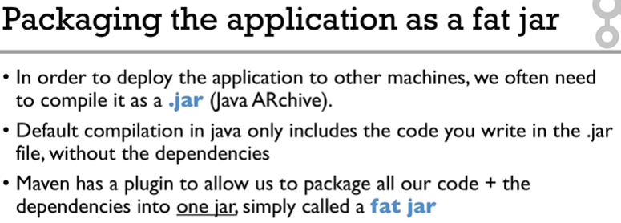

# Maven Note

- [Maven Note](#maven-note)
  - [Maven Commands](#maven-commands)
  - [Package Applications](#package-applications)

---

## Maven Commands 

`mvn clean`: Cleans up any previously generated artifacts from a prior build.

`mvn compile`: Compiles the source code of the project (by default in a generated `target` folder).

`mvn test`: Tests the compiled source code.

`mvn package`: Packages the compiled code in a suitable format such as JAR.

`mvn release`: After executing this command, the version in pom.xml will be incremented. 

To skip maven test, add `-Dmaven.test.skip=true`, e.g. `mvn clean deploy -Dmaven.test.skip=true`.

---

## Package Applications



Steps: 

1. Add maven plugin config in pom.xml.

```xml
<!--package as one fat jar-->
<plugin>
    <groupId>org.apache.maven.plugins</groupId>
    <artifactId>maven-assembly-plugin</artifactId>
    <version>3.1.0</version>
    <configuration>
        <descriptorRefs>
            <descriptorRef>jar-with-dependencies</descriptorRef>
        </descriptorRefs>
        <archive>
            <manifest>
                <addClasspath>true</addClasspath>
                <mainClass>com.yourpackage.YourMainClass</mainClass>
            </manifest>
        </archive>
    </configuration>
    <executions>
        <execution>
            <id>assemble-all</id>
            <phase>package</phase>
            <goals>
                <goal>single</goal>
            </goals>
        </execution>
    </executions>
</plugin>
```

2. Execute `mvn clean package`.
3. You may want to run your Java application by executing `java -jar target/<fat_jar_name>.jar`.