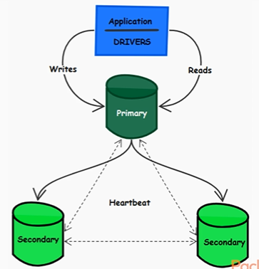
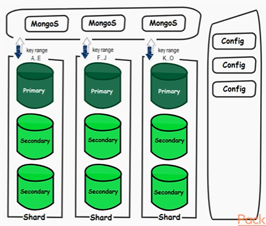

# MongoDB Note

- [MongoDB Note](#mongodb-note)
  - [Overview](#overview)
  - [Concepts](#concepts)
    - [Capped Collection](#capped-collection)
    - [Replica Sets](#replica-sets)
    - [Sharding](#sharding)

---

## Overview

MongoDB is NoSQL, open-source high-performance document oriented database.

- Built for speed
- Schema-less (flexible data model)
- High-throughput
- Horizontally scalable
- Powerful indexing (primary, secondary, index intersection)
- High availability and fault tolerance via replication  

MongoDB does well: 

- Good RDBMS replacement for web app (not transactional)
- Good fit for real-time analytics
- High-speed logging and caching
- Semi-structured data management
- High scalability, mixed datasets and massive concurrency
- Mobile applications and IoT
- No downtime is tolerated

MongoDB is **NOT** a good choice: 

- High transactional applications
- Requiring complex SQL
- Search engine
- Data warehouse

---

## Concepts

MongoDB | RDBMS
------  | ------
collection | table 
document | row/record
field | column
reference | foreign key
shard | partition

There is a primary key `_id` for each document.

Documents are stored in BSON format (binary form of JSON).

MongoDB supports embedded or references relationships.

### Capped Collection

- It is a fixed-size collection acting as a ring buffer data structure (size is specified in bytes). 
- Preserves the insertion order and does not allow updates. 
- When it reaches the size limit, old documents are automatically removed. 
- This feature is useful in a streaming pipeline where you need to keep only a certain amount of data in database, while the rest can be discarded as being old or obsolete.

### Replica Sets

### Sharding

