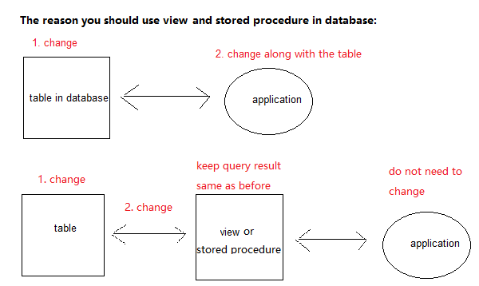
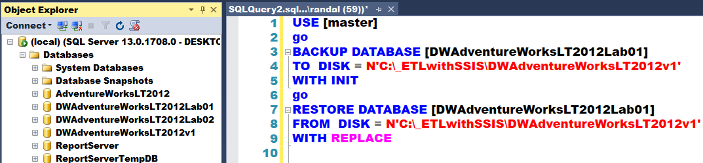

# MySQL Note

- [MySQL Note](#mysql-note)
  - [Programming](#programming)
    - [Basics](#basics)
      - [Show](#show)
      - [Create](#create)
      - [Alter](#alter)
      - [Drop](#drop)
      - [Insert Into](#insert-into)
      - [Select ... From](#select--from)
        - [Limit & Offset](#limit--offset)
        - [Join](#join)
        - [Order By](#order-by)
        - [Case ... When ... Then ... Else](#case--when--then--else)
      - [Update ... Set](#update--set)
      - [Delete From](#delete-from)
      - [Select Into](#select-into)
    - [Build-in Functions](#build-in-functions)
      - [Regexp](#regexp)
      - [Right(str, len)](#rightstr-len)
      - [Concat()](#concat)
    - [Transactions](#transactions)
    - [Stored Procedures](#stored-procedures)
    - [Variables](#variables)
    - [Index](#index)
    - [Handle Duplicates](#handle-duplicates)
      - [Prevent Duplicates](#prevent-duplicates)
      - [Insert Duplicates](#insert-duplicates)
      - [Remove Duplicates](#remove-duplicates)
  - [SQL Knowledge Refresher](#sql-knowledge-refresher)
    - [Normalization](#normalization)
    - [N'](#n)
    - [nVarchar vs. varchar](#nvarchar-vs-varchar)
    - [Select Rows with Null Values](#select-rows-with-null-values)
    - [CREATE TABLE IF NOT EXISTS](#create-table-if-not-exists)
    - [IF OBJECT_ID('...') IS NOT NULL](#if-object_id-is-not-null)
    - [Views](#views)
    - [Stored Procedures](#stored-procedures-1)
    - [MS SQL Server Build-in Functions](#ms-sql-server-build-in-functions)
    - [Differences between Stored Procedures and Functions](#differences-between-stored-procedures-and-functions)
    - [Backing-up or Restoring a Database with SQL Code](#backing-up-or-restoring-a-database-with-sql-code)
    - [SQL Programming](#sql-programming)

---

## Programming

### Basics 

Check if MySQL server is running or not: `ps -ef | grep mysqld`

Start MySQL service: `service mysql start  `

Start MySQL shell: `mysql -u root -p `

**Use database**: `use <database_name>;`

**Get table structure**: `desc <table_name>;` or `show columns from <table_name>; `

Know how this table was created: `show create table <table_name>;`

#### Show

```mysql
show database; 

show tables; 
```

#### Create

```mysql
-- Create a database.
create database <database_name>; 

-- Create a table.
create table employee if not exists (
   empId INT NOT NULL AUTO_INCREMENT, -- if you want to start from 100, write '... AUTO_INCREMENT = 100'
   empName VARCHAR(50) NOT NULL,
   salary DECIMAL NOT NULL,
   deptId INT NOT NULL,
   PRIMARY KEY (empId)
) ENGINE=InnoDB;
```

#### Alter

```mysql
-- Add a new column. 
alter table employee add sex varchar(10);
-- Add a new column at the first. 
alter table employee add rowId int first; 
-- Add a new column after a specific column. 
alter table employee add sex varchar(10) after empName; 


-- Drop a column.
alter table employee drop rowId;


-- Modify data type of the column. 
alter table employee modify <column_name> <new_data_type>;
-- Modify column name (may as well as data type, null / not null, default value). 
alter table employee change <column_name> <new_column_name> <new_data_type> [null / not null] [default 100]; 
-- Set default value of a column. 
alter table employee alter <column_name> set default <value>; 
-- Drop default value of a column. 
alter table employee alter <column_name> drop default; 


-- Rename a table. 
alter table employee rename to emp;
```

If you want to reposition a column, drop it first then add it. 

#### Drop

```mysql
drop database <database_name>;

drop table <table_name>;
```

#### Insert Into

```mysql
insert into employee (empId, empName, salary, deptId) values (1, 'Zhang', 100, 3);
```

#### Select ... From 

##### Limit & Offset

```mysql
-- Return 10 rows from the 3rd row (excluding 3rd). 
-- Note: keep the order of 'limit' and 'offset'.
select * from employee limit 10 offset 3; 
-- same as 
select * from employee limit 3, 10; 
```

##### Join 

```mysql
-- Join two tables.
select * from employee e join department d on e.deptId = d.deptId;
-- same as (for inner join or self join)
select * from employee e, department d where e.deptId = d.deptId;
```

##### Order By

```mysql
-- Order by empName in ascending order, salary in descending order. 
select * from employee order by empName asc, salary desc; 
-- Order by empName and salary in descending order. 
select * from employee order by empName desc, salary desc; 
```

##### Case ... When ... Then ... Else

```mysql
SELECT OrderID, Quantity,
CASE
    WHEN Quantity > 30 THEN "The quantity is greater than 30"
    WHEN Quantity = 30 THEN "The quantity is 30"
    ELSE "The quantity is something else"
END
FROM OrderDetails;


DELIMITER $$
 
CREATE PROCEDURE GetCustomerShipping(
 in  p_customerNumber int(11), 
 out p_shiping        varchar(50))
BEGIN
    DECLARE customerCountry varchar(50);
 
    SELECT country INTO customerCountry
         FROM customers
         WHERE customerNumber = p_customerNumber;
 
    CASE customerCountry
         WHEN  'USA' THEN
            SET p_shiping = '2-day Shipping';
         WHEN 'Canada' THEN
            SET p_shiping = '3-day Shipping';
         ELSE
            SET p_shiping = '5-day Shipping';
    END CASE;
 
END$$
DELIMITER ;
```

#### Update ... Set

```mysql
update employee set salary = 600 where empName='Li';
```

#### Delete From

```mysql
delete from employee where empId = 1;
```

#### Select Into 

```mysql 
-- Copy data from one table into a new table. 
SELECT <column 1>, <column 2>
INTO <new_table_name> 
FROM <old_table_name>
WHERE condition;
```
---

### Build-in Functions 

#### Regexp

```mysql
-- REGEXP 
-- empName containing 'an'.
select * from employee where empName regexp 'an';
-- same as 
select * from employee where empName like '%an%';
-- starting with 'an': '^an'
-- ending with 'an': 'an$'
-- any single character: . 
-- 0 or more characters: *
-- 1 or more characters: + 

-- empName starting with vowels (a,e,i,o,u).
select * from employee where empName regexp '^[aeiou]';
-- empName having with vowels (a,e,i,o,u) at both their first and last characters.
select * from employee where empName regexp '^[aeiou]' and empName regexp '[aeiou]$';
-- empName not starting with vowels (a,e,i,o,u).
select * from employee where empName not regexp '^[aeiou]';
```

#### Right(str, len) 

```mysql
-- Select last 5 characters of columnname. 
SELECT RIGHT(columnname, 5) as yourvalue FROM tablename
-- same as substring 
SELECT substring(columnname, -5) as yourvalue FROM tablename
```

#### Concat()

```mysql
SELECT CONCAT('w3resource','.','com');
```

---

### Transactions

If you plan to use transactions in your MySQL programming, then you need to create your tables in a special way. There are many types of tables, which support transactions, but the **most popular** one is **InnoDB**. 

```mysql
create table employee(
   empId INT NOT NULL AUTO_INCREMENT,
   empName VARCHAR(50) NOT NULL,
   salary DECIMAL NOT NULL,
   deptId INT NOT NULL,
   PRIMARY KEY (empId)
) TYPE = InnoDB;
```

By default, MySQL runs with **autocommit** mode enabled. This means that as soon as you execute a statement that updates (modifies) a table, MySQL stores the update on disk to make it permanent. The change cannot be rolled back. To disable autocommit mode, use the START TRANSACTION statement. 

```mysql
-- start a new transaction
start transaction;
 
-- get latest order number
select @orderNumber := max(orderNUmber) 
from orders;
-- set new order number
set @orderNumber = @orderNumber  + 1;
 
-- insert a new order for customer 145
insert into orders(orderNumber,
                   orderDate,
                   requiredDate,
                   shippedDate,
                   status,
                   customerNumber)
values(@orderNumber,
       now(),
       date_add(now(), INTERVAL 5 DAY),
       date_add(now(), INTERVAL 2 DAY),
       'In Process',
        145);
-- insert 2 order line items
insert into orderdetails(orderNumber,
                         productCode,
                         quantityOrdered,
                         priceEach,
                         orderLineNumber)
values(@orderNumber,'S18_1749', 30, '136', 1),
      (@orderNumber,'S18_2248', 50, '55.09', 2); 
-- commit changes    
commit;   
```

---

### Stored Procedures

**Create a stored procedure**: 

```mysql
 DELIMITER //
 CREATE PROCEDURE GetAllProducts()
   BEGIN
   	SELECT * FROM products;
   END //
 DELIMITER ;
```

The `DELIMITER` statement changes the standard delimiter which is semicolon ( `;` ) to another (`//` in this case). Then the stored procedure will be passed to the server as a whole. The last command ( `DELIMITER;` ) changes the delimiter back to the semicolon (`;`).  

**Call a stored procedure**: `CALL <stored_procedure_name>(); `

---

### Variables

```mysql
-- Set a variable. 
SET @var_name = value; 
-- same as
SELECT @var_name := value;


-- Assign the query result to a variable. 
SET @var_name = (SELECT COUNT(*) FROM mytable);
-- same as 
SELECT COUNT(*) FROM mytable INTO @var_name;
```

---

### Index

```mysql
-- Create a unique index, which means that two rows cannot have the same index value.
-- Omit the UNIQUE keyword to create a simple index, which allows duplicate values in a table.
create unique index empName_index on employee (empName); 

-- Add an index. 
alter table employee add index empName_index (empName);

-- Display index. 
-- The vertical-format output (specified by \G).
show index from <table_name>\G;
```

---

### Handle Duplicates

#### Prevent Duplicates 

```mysql
-- Use UNIQUE. 
CREATE TABLE person_tbl (
   first_name CHAR(20) NOT NULL,
   last_name CHAR(20) NOT NULL,
   sex CHAR(10)
   UNIQUE (last_name, first_name)
);
```

#### Insert Duplicates 

```mysql
-- Use REPLACE rather than INSERT.
-- If the record is new, it is inserted just as with INSERT. If it is a duplicate, the new record replaces the old one.
REPLACE INTO person_tbl (last_name, first_name) VALUES( 'Ajay', 'Kumar');

-- Use INSERT IGNORE rather than INSERT.
-- If the record is new, it is inserted just as with INSERT. If it is a duplicate, the new record will be discarded.
INSERT IGNORE INTO person_tbl (last_name, first_name) VALUES( 'Ajay', 'Kumar');
```

#### Remove Duplicates 

If you have duplicate records in a table and you want to remove all the duplicate records from that table, 

Solution 1: using table replacement.

```mysql 
-- 1. Create a temp table with unduplicated data from the original table. 
CREATE TABLE tmp SELECT last_name, first_name, sex
	FROM person_tbl;
	GROUP BY (last_name, first_name);
-- 2. Drop the original table.
DROP TABLE person_tbl;
-- 3. Rename the temp table to the name of original table.
ALTER TABLE tmp RENAME TO person_tbl;
```

Solution 2: add an INDEX or a PRIMARY KEY to the original table.

```mysql
-- The IGNORE keyword tells MySQL to discard duplicates silently without generating an error.
ALTER IGNORE TABLE person_tbl ADD PRIMARY KEY (last_name, first_name);
```

---

## SQL Knowledge Refresher 

Making data types and character lengths more consistent can assist other developers using this code.

### Normalization 

Database normalization is the process of removing repeated information. 

---

### N'

It declares the string as nVarchar data type, rather than varchar. (NCHAR, NVARCHAR or NTEXT value)

```mssql
EXEC HumanResources.uspGetEmployeesTest2 @LastName = N'Ackerman', @FirstName = N'Pilar'
;  
GO 
```

------

### nVarchar vs. varchar

|              | *nVarchar*                             | *varchar*                 |
| ------------ | -------------------------------------- | ------------------------- |
| Data Type    | Store UNICODE data, multilingual data. | Store ASCII data.         |
| Memory Usage | Use 2 bytes per character.             | Use 1 byte per character. |

Newer databases use nVarchar instead of varchar.

---

### Select Rows with Null Values 

```mssql
SELECT column_names
FROM table_name
WHERE column_name IS NULL;

SELECT column_names
FROM table_name
WHERE column_name IS NOT NULL;
```

---

### CREATE TABLE IF NOT EXISTS

```mysql
-- mysql code
CREATE TABLE IF NOT EXISTS table_name
(
  task_id INT(11) NOT NULL AUTO_INCREMENT,
  subject VARCHAR(45) DEFAULT NULL,
  start_date DATE DEFAULT NULL,
  end_date DATE DEFAULT NULL,
  description VARCHAR(200) DEFAULT NULL,
  PRIMARY KEY (task_id)
) ENGINE=InnoDB;
```

---

### IF OBJECT_ID('...') IS NOT NULL

```mssql
IF OBJECT_ID ( 'HumanResources.uspGetEmployees', 'P' ) IS NOT NULL   
    DROP PROCEDURE HumanResources.uspGetEmployees;  
GO  
CREATE PROCEDURE HumanResources.uspGetEmployees   
    @LastName nvarchar(50),   
    @FirstName nvarchar(50)   
AS   

    SET NOCOUNT ON;  
    SELECT FirstName, LastName, JobTitle, Department  
    FROM HumanResources.vEmployeeDepartment  
    WHERE FirstName = @FirstName AND LastName = @LastName;  
GO
```

---

### Views

SQL Views are essentially a named select statement stored in a database. 

```mssql
-- Listing 1-6. Creating an ETL View
Use TempDB;
go
CREATE VIEW vETLSelectSourceDataForDimTitles
AS
 SELECT 
   [TitleId] = [title_id] 
 , [TitleName] = CAST([title] as nVarchar(100)) 
 , [TitleType] = CASE CAST([type] as nVarchar(100)) 
    When 'business' Then 'Business'
    When 'mod_cook' Then 'Modern Cooking'						     
    When 'popular_comp' Then 'Popular Computing'					 
    When 'psychology' Then 'Psychology'						 
    When 'trad_cook' Then 'Traditional Cooking'	
    When 'UNDECIDED' Then 'Undecided'							     
   End
FROM [pubs].[dbo].[titles];
go

-- Listing 1-7. Using the View
SELECT 
  [TitleId]
, [TitleName]
, [TitleType]
FROM vETLSelectSourceDataForDimTitles;
go
```

---

### Stored Procedures

```mssql
-- Listing 1-10. Creating an ETL Procedure
CREATE PROCEDURE pETLInsDataToDimTitles
AS
 DELETE FROM [TempDB].[dbo].[DimTitles];
 INSERT INTO [TempDB].[dbo].[DimTitles]
 SELECT 
   [TitleId]
 , [TitleName]
 , [TitleType]
 FROM vETLSelectSourceDataForDimTitles;
go
EXECUTE pETLInsDataToDimTitles;
go
SELECT * FROM [TempDB].[dbo].[DimTitles]
go
```

---

Why you should use views and stored procedures? 



---

### MS SQL Server Build-in Functions

<https://www.w3schools.com/sql/sql_ref_sqlserver.asp>

---

### Differences between Stored Procedures and Functions

- Stored Procedures are pre-compile objects which are compiled for first time and its compiled format is saved which executes (compiled code) whenever it is called. But Function is compiled and executed every time when it is called.  
- Function must return a value but in Stored Procedure it is optional (Procedure can return zero or null values).
- Functions can have only input parameters for it whereas Procedures can have input/output parameters.
- Functions can be called from Procedure whereas Procedures cannot be called from Function.
- Procedure allows SELECT as well as DML(INSERT/UPDATE/DELETE) statement in it whereas Function allows only SELECT statement in it.
- Procedures can not be utilized in a SELECT statement whereas Function can be embedded in a SELECT statement.
- Stored Procedures cannot be used in the SQL statements anywhere in the WHERE/HAVING/SELECT section whereas Function can be.
- Functions that return tables can be treated as another rowset. This can be used in JOINs with other tables.
- Inline Function can be thought of as views that take parameters and can be used in JOINs and other Rowset operations.
- Exception can be handled by try-catch block in a Procedure whereas try-catch block cannot be used in a Function.
- We can go for Transaction Management in Procedure whereas we cannot go in Function.

---

### Backing-up or Restoring a Database with SQL Code



---

### SQL Programming

Employee table: 

| rowId | empNo | empName | sex  | dob  | salary | deptId |
| ----- | ----- | ------- | ---- | ---- | ------ | ------ |
|       |       |         |      |      |        |        |

```sql
-- Return employee record with max salary. 
select * from employee where salary = (select max(salary) from employee)

-- Find the second highest salary of Employee. 
select max(salary) from Employee where salary not in (select max(salary) from Employee); 

-- Find max salary from each department.  
select deptId, max(salary) as maxSalary from Employee group by deptId; 

-- Find the number of employees according to gender whose dob is between __ to __. 
select sex, count(*) as numOfEmp from Employee where dob between '2018-02-01'and '2018-07-01'group by sex; 

-- Find name of employees whose name starts with 'M'.
select empName from Employee where empName like 'M%' 

-- Find all employee records containing the word "Mike".
select empName from Employee where Upper(empName) like 'MIKE';

-- Find duplicate rows in a database. Then delete them.
select rowId from Employee a where rowId = (select max(rowId) from Employee b where a.empNo = b.empNo); 

delete from Employee where rowId not in (select rowId from Employee a where rowId = (select max(rowId) from Employee b where a.empNo = b.empNo)); 

-- Display the current date. 
select GETDATE(); 
select CONVERT(date, GETDATE()); 
select year(GETDATE()); 

-- Check if date is in the given format or not.
select ISDATE('07/30/2018') AS "MM/DD/YY"; 

-- Find the year from date. 
select year(GETDATE()) as Year; 
```

Employee and Department table:

```sql
-- Return employee name, highest salary and department name. 
select e.empName, e.salary, d.deptName from Employee e inner join Department d on (e.deptId = d.deptId) where salary in (select max(salary) from employee)

-- Return employee name, highest salary and department name for each department. 
select e.empName, e.salary, d.deptName from Employee e inner join Department d on (e.deptId = d.deptId) where salary in (select max(salary) from employee group by deptId)
```

Create a new, empty table using the schema of another.  

```sql
SELECT * INTO newtable 
FROM oldtable 
WHERE 1 = 0; -- As this is false, data from oldtable will not be inserted into newtable. Only schema will be transferred.
```

**Having Clause**

The HAVING clause was added to SQL because the WHERE keyword could not be used with aggregate functions. 

```sql
SELECT COUNT(CustomerID), Country
FROM Customers
GROUP BY Country
HAVING COUNT(CustomerID) > 5
ORDER BY COUNT(CustomerID) DESC;
```

