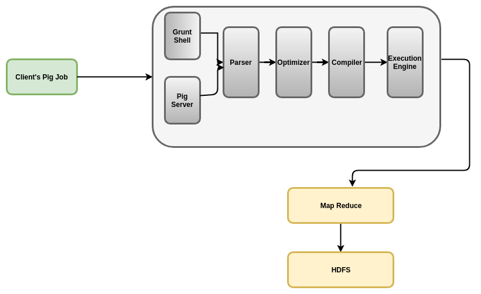

# Pig Note

## Concept 

Pig was invented for the purpose of helping SQL skilled people to write MapReduce jobs in an SQL-like language.

- an abstraction over MapReduce
- used to process large datasets

Components: 



- Parser: parses Pig scripts and generates DAG which represents the logic plan.
- Optimizer: rule-based. Does not use a cost-based optimizer. Finally, the optimized logical plan is converted into a MapReduce plan.
  - Logical layer (logical optimization): mostly aims to reduce the amount of data in the shuffle phase or the temporary files generated between consecutive MapReduce jobs.
    - PushUpFilter
    - PushDownForEachFlatten
    - ColumnPruner
    - MapKeyPruner
    - LimitOptimizer
  - MapReduce layer: aims to optimize the MapReduce job properties such as the number of MapReduce jobs in the pipeline, selecting Combiner, and so on.
- Compiler: compiles the optimized logical plan into a series of MapReduce jobs.
- Execution Engine: default engine is map reduce. Now can use Tez and Spark as execution engines for job execution, which is faster.

---

## Running 

Check version: `pig -version`

Different ways to run and execute Pig programs:

- Grunt Shell: interactive shell, similar to Spark shell. 
- Embedded mode: Apache Pig provides `PigServer` class to run Pig from Java programs.
- Script: similar to Spark script. `pig testscript.pig`. This technique is the most widely used.

---

## Pig Latin

- SQL-like syntax
- similar to writing a query plan 
- provides you the ability to define a schema for the dataset loaded in the Pig script. 
- For data schema, the default column names are `$0`, `$1` ...
- lazy evaluation

Syntax: 

- Each statement needs to be terminated by a semicolon - `;`.
- The statement can be split into multiple lines without any additional syntax or symbol.

Until and unless all the statements in the script are added to the execution plan, no execution will happen.

### UDF

Pig provides you an ability to write UDFs in different languages. Java is widely used.

Need to register the custom UDF or put the UDF in an Pig class path before using it.

---

## Pig with Hive

Apache Pig provides an API to integrate Apache Hive using the Hive metastore called HCatalog.

Execute Pig script in command: `pig -useHCatalog employeeprocess.pig`

If you do not use the `-useHCatalog` option then Pig will go through an exception of not recognizing `HCatLoader` or `HCatStorer`.

### Read / Load from Hive

Example: 

```pig
-- "dev" is the database
-- "employee" is the table

employeeRecords = LOAD 'dev.employee' USING org.Apache.HCatalog.pig.HCatLoader(); 
```

### Write / Store to Hive

Example: 

```pig
STORE fileteredEmployeeStats INTO 'default.employeeStats' USING org.Apache.HCatalog.pig.HCatStorer();
```  

---

## Best Practices

- Filter out records that do not make any sense in the data.
- **Always avoid** too many small files because it may result in too many MapReduce jobs. Run a compaction job that will convert these small files into a single or multiple large file. 
- **Always** define schema and column types explicitly while loading data, which reduces processing time up to **20%** and in some cases up to **two times**. If you do not specify the type declaration, Pig automatically assigns default datatypes for columns, which may take extra memory space and reduce performance. 
- In most cases, compression has resulted in better performance. `pig.tmpfilecompression` function should be turned on, which helps in saving space but increases read time when used for further processing by downstream systems.