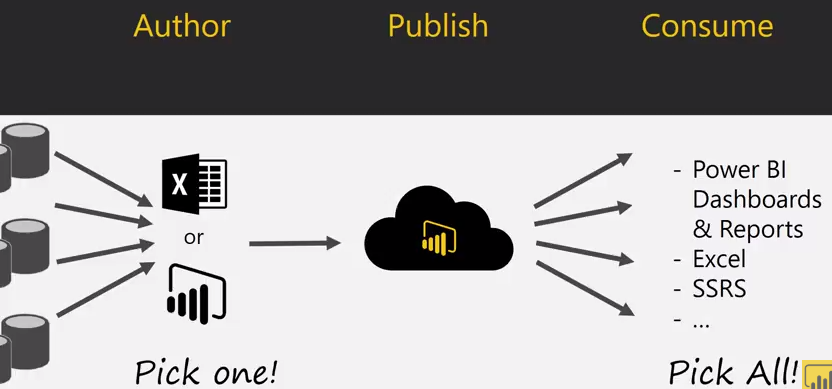

# Power BI Note

## Power BI Workflow

---

## Measures vs. Calculated Columns

measures != calculated columns 

**calculated columns:** TotalSalesAmount = Sales[SalesAmount] + Sales[TaxAmt]

**measures:** Total Sales = SUM(Sales[SalesAmount]) + SUM(Sales[TaxAmt])

When you add a calculated column, the size of the file will increase, whereas measures not. 

For numeric calculation, you should use measures instead of calculated columns. 

- implicit measures: just drag a column. (When you consume in Excel for example, you will get  problems.)
- explicit measures: you define them. (**Use this one**)

--- 

## Slicer vs. Filter 

- slicer: users can interact with options easily. 
- filter: options will be not very discoverable and harder to find. 
