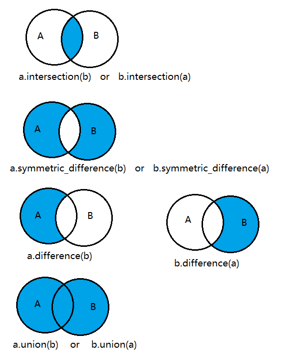

# Python 3 Note

## Install Python3.6 on Linux 

Steps: 

1. In terminal, install the pre-requisites. 
```shell   
sudo apt-get update

sudo apt-get install build-essential libpq-dev libssl-dev openssl libffi-dev zlib1g-dev

sudo apt-get install python3-pip python3-dev
```

2. Use PPA (Personal Package Archives) to install Python3.6. 

```shell
sudo add-apt-repository ppa:jonathonf/python-3.6

sudo apt-get update

sudo apt-get install python3.6
```

3. Verify Python3 version. `python3.6 -V`
4. Make Python3.6 as the default when type `python3`. 

```shell
sudo update-alternatives --install /usr/bin/python3 python3 /usr/bin/python3.<old_version>

sudo update-alternatives --install /usr/bin/python3 python3 /usr/bin/python3.6.<new_version>

sudo update-alternatives --config python3
```

5. Verify Python3 version. `python3 -V`
6. Install virtual environment. `sudo apt-get install python3.6-venv`
7. Verify virtual environment.

```shell
mkdir test_py_venv

cd test_py_venv

python3 -m venv my_venv

source my_venv/bin/activate 

# Now you should be in your virtual environment.

# exit the virtual environment
deactivate
```
8. Upgrade pip3. `pip3 install --upgrade pip`

---

## String Formatting

- Any object which is not a string can be formatted using the %s operator.

```python
# two or more argument specifiers
name = "John"
age = 23
print("%s is %d years old." % (name, age))
# or 
print("{} is {} years old.".format(name, age))
```

---

## String 

```python
# get the last 5 characters of a string
my_string[-5:]

# reverse a string 
my_string[::-1]

# check if a string starts with a specific substring
if my_string.startswith(sub_string):

# check if a string ends with a specific substring
if my_string.endswith(sub_string):
```

---

## List 

- Can contain any type of variable. 

```python
my_list = []

my_list = [1,2,3]
my_list.append(4)  # [1,2,3,4]
my_list.extend([5,6])  # [1,2,3,4.5,6]


print(my_list)  # output: [1,2,3]

# iterate the list
for x in my_list:
    print(x)
    
# join two lists 
list_3 = list_1 + list_2 

# repeat a list 3 times
my_list * 3

# get length of the list 
len(my_list)

# count the number of a specific element in a list 
my_list.count(my_element)

# check if a specific element is in a list
if my_element in my_list:
    
# sort the list 
sorted(name_of_list)

# zip()
x = [1, 1, 1]
y = [2, 2, 2]
list(zip(x, y))  # [(1, 2), (1, 2), (1, 2)]
[x + y for x, y in zip(x, y)]  # [3, 3, 3]

# transfer a list containing only characters to a string 
''.join(['a', 'b', 'c'])  # 'abc'
```

---

## List Comprehensions

- Create a new list based on another list, in a single, readable line.

```python
# calculate the length of each word in the words list
sentence = "the quick brown fox jumps over the lazy dog"
words = sentence.split()
word_lengths = []
for word in words:
      if word != "the":
          word_lengths.append(len(word))
        
# use list comprehensions 
word_lengths = [len(word) for word in words if word != 'the']
```

---

## Set



```python
# transfer a list to a set 
a = set(["Jake", "John", "Eric"])
b = set(["John", "Jill"])

# get the intersection between two sets
# for the above example, the result should be {'John'}
a.intersection(b)
# the same as 
b.intersection(a)


# get elements in either a or b but not both
a.symmetric_difference(b)
# the same as 
b.symmetric_difference(a)


# difference 
# get elements only in a but not in b 
a.difference(b)
# get elements only in b but not in a 
b.difference(a)


# union 
a.union(b)
# the same as 
b.union(a)
```

---

## Dictionary

```python
# get the value of an element 
dict_name["element_key"]

# iterate over dictionaries
for name in phonebook:
    print("Phone number of %s is %d" %(name, phonebook[name]))
# or 
for name, number in phonebook.items():
    print("Phone number of %s is %d" % (name, number))

# remove an element 
del phonebook["John"]
# the same as 
phonebook.pop("John")
```

---

## Input Validation 

### isinstance(value, data_type)

```python
if isinstance(myfloat, float) and myfloat == 10.0:
    print("Float: %f" % myfloat)
if isinstance(myint, int) and myint == 20:
    print("Integer: %d" % myint)
```
### is

The "is" operator checks if two variables are the same instance. 

```python
x = [1,2,3]
y = [1,2,3]
z = x
print(x == y) # Prints out True
print(x is y) # Prints out False
print(x is z) # Prints out True
```

---

## Loop

### while ... else / for ... else 

The "else" clause is a part of the loop. When the loop condition of "for" or "while" statement fails then code part in "else" is executed. If **break** statement is executed inside for loop then the "else" part is skipped. 

---

## Generator 

- Use `yield` statement to put items into a generator. Then you can iterate the generator to access each item. 

```python
import random

# lottery() is a generator function, the type of the return value is generator
def lottery():
    # returns 6 numbers between 1 and 40
    for i in range(6):
        yield random.randint(1, 40)

    # returns a 7th number between 1 and 15
    yield random.randint(1,15)

for random_number in lottery():
       print("And the next number is... %d!" %(random_number))
```

---

## Uncertain Function Arguments

- If the number of arguments is uncertain, use `*args_name` as the argument of the function. Then you can pass various parameters when you call the function. 

```python
def foo(first, second, third, *the_rest):
    print("First: %s" %(first))
    print("Second: %s" %(second))
    print("Third: %s" %(third))
    print("And all the rest... %s" %(list(the_rest)))

# call the function
foo(1,2,3,4,5)
```

- You can define a special arguments using `**args_name` which allows you to specify parameters with keyword when you call the function. 

```python
def bar(first, second, third, **options):
    if options["action"] == "sum":
        print("The sum is: %d" %(first + second + third))

    if options["number"] == "first":
        return first

result = bar(1, 2, 3, action = "sum", number = "first")
```

---

## Regex

`^` - start of the string.

`.` - any non-newline character.

`*` - repeat 0 or more times. `ab*` will match 'a', 'ab', or 'a' followed by any number of 'b's.

`?` - un-greedy, repeat 0 or 1 time. `ab?` will match either 'a' or 'ab'.

```python
import re
```

---

## Exception Handling

```python
try: 
    pass
except error_name:
    pass
```

---

## JSON

```python
import json 

# transfer a json string to an object data structure 
json.loads(json_string) 

# transfer an object data structure to a json string 
json_string = json.dumps([1, 2, 3, "a", "b", "c"])
```

---

## Serialization

```python
import pickle

# deserialize
pickle.loads(pickled_string)

# serialize
pickled_string = pickle.dumps([1, 2, 3, "a", "b", "c"])
```

---

## Partial Functions

- Derive a function with x parameters to a function with fewer parameters and fixed values set for the more limited function.

```python
from functools import partial

def multiply(x,y):
    return x * y

# create a new function that multiplies by 2
# the 2 will replace x
# y will equal 4 when p_func(4) is called
# result will be 8
p_func = partial(multiply,2)
print(p_func(4))
```

---

## Closures 

- A Closure is a function object that remembers values in enclosing scopes even if they are not present in memory.

- Closures can avoid use of global variables and provides some form of data hiding.

```python
def multiplier_of(n):
    def multiplier(number):
        return number*n
    return multiplier

multiplywith5 = multiplier_of(5)
print(multiplywith5(9))
```

---

## Decorators

- Decorators allow you to make simple modifications to callable objects like functions, methods, or classes.
- By using decorators, you can reuse a function and do some modifications based on it instead of modifying the original function. Or you can apply a function to other functions, such as do logging, input validation and output formatting. 
- decorator 本身是一个函数，应用到另一个函数上。这个函数被当作参数传到decorator中。

```python
# define the decorator 
def type_check(correct_type):
    def check(old_function):
        def new_function(arg):
            if (isinstance(arg, correct_type)):
                return old_function(arg)
            else:
                print("Bad Type")
        return new_function
    return check

# use the decorator
@type_check(int)
def times2(num):
    return num*2

print(times2(2))
times2('Not A Number')

# use the decorator
@type_check(str)
def first_letter(word):
    return word[0]

print(first_letter('Hello World'))
first_letter(['Not', 'A', 'String'])
```

---

## OOP

### Private Attributes 

When defining a private attribute in a class, the convention is add `__` in front of the attribute name. `__<priavte_attr_name>`.

### Class Variables 

All instances of a class share the same class variable `<class_name>.<variable_name>`. 

### Class Methods 

Class methods can be used to create alternative constructors. 

They should be invoked by using class name `<class_name>.<class_method_name>()`.

**When to use**: 

- When you want to access the class rather than the instance, define this method as a class method.

When defining a class method, you need to add `@classmethod` decorator at the top of the method, and the first argument of the method is `cls`.

### Static Methods 

**When to use**: 

- If you do not need to access the instance or class in a method, define this method as a static method. 

When defining a static method, you need to add `@staticmethod` decorator at the top of the method, and do not need to pass `self` or `cls` as argument.

They should be invoked by using class name `<class_name>.<static_method_name>()`.

### Inheritance

```python
class ElectricCar(Car):
    def __init__(self, number_of_wheels, seating_capacity, maximum_velocity):
        Car.__init__(self, number_of_wheels, seating_capacity, maximum_velocity)
        
    #  or (better)
    def __init__(self, number_of_wheels, seating_capacity, maximum_velocity):
        super().__init__(number_of_wheels, seating_capacity, maximum_velocity)
```

### Magic Methods 

`__<magic_method_name>__` reads as "dunder <magic_method_name>". 

#### `__repr(self)__`

Like `toString()` method in Java. 

Best practice: override this method with statement that is used to create this object. 

#### `__str(self)__`

Similar to `__repr(self)__`. But it is meant to be more readable for end users. 

When using `print(<object>)`, if both `__repr(self)__` and `__str(self)__` are overridden, `str(self)` will be invoked. 

Generally, we only override `__repr(self)__`.

### Decorators

#### `@property` 

Use `@property` at the top of a method to make it can be used as a property / attribute of the class when being invoked.  

```python
class Employee:

    # class variable
    raise_amount = 1.04

    # constructor
    def __init__(self, first_name, last_name, pay):
        self.first_name = first_name
        self.last_name = last_name
        self.pay = pay
        self.email = self.first_name.lower() + '.' + self.last_name.lower() + '@company.com'

    # regular method
    def full_name(self):
        return '{} {}'.format(self.first_name, self.last_name)

    # class method
    @classmethod
    def from_string(cls, emp_str):
        first_name, last_name, pay = emp_str.split('-')
        return cls(first_name, last_name, pay)

    # static method
    @staticmethod
    def is_workday(day):
        if day.weekday() == 5 or day.weekday() == 6:
            return False
        return True

    def __repr__(self):
        return 'Employee({}, {}, {})'.format(self.first_name, self.last_name, self.pay)

    def __str__(self):
        return '{} - {}'.format(self.full_name(), self.email)

class Developer(Employee):

    raise_amount = 1.10

    def __init__(self, first_name, last_name, pay, prog_lang):
        super().__init__(first_name, last_name, pay)
        self.prog_lang = prog_lang


class Manager(Employee):
    def __init__(self, first_name, last_name, pay, employees=None):
        super().__init__(first_name, last_name, pay)
        if employees is None:
            self.employees = []
        else:
            self.employees = employees

    def add_emp(self, emp):
        if emp not in self.employees:
            self.employees.append(emp)

    def remove_emp(self, emp):
        if emp in self.employees:
            self.employees.remove(emp)

    def print_emps(self):
        for emp in self.employees:
            print('--> ', emp.full_name())


# main function
if __name__ == '__main__':
    emp_1 = Employee('San', 'Zhang', 10000)
    print(emp_1.email)
    print(emp_1.full_name())
    print(emp_1.raise_amount)  # 1.04
    print(Employee.raise_amount)  # 1.04
    emp_1.raise_amount = 1.05  # this line only modifies "raise_amount" of the instance emp_1, it will not influence the value of the class variable
    print(emp_1.raise_amount)  # 1.05
    print(Employee.raise_amount)  # 1.04, not be modified

    print('------')
    emp_str_1 = 'Si-Li-20000'
    new_emp_1 = Employee.from_string(emp_str_1)  # class method should be invoked by using class name
    print(new_emp_1.email)

    print('------')
    import datetime
    my_date1 = datetime.date(2018, 10, 28)
    print(Employee.is_workday(my_date1))  # static method should be invoked by using class name
    my_date2 = datetime.date(2018, 10, 29)
    print(Employee.is_workday(my_date2))

    print('------')
    dev_1 = Developer('Wu', 'Wang', 30000, 'Python')
    print(dev_1.prog_lang)
    dev_2 = Developer('Liu', 'Zhao', 40000, 'Java')

    print('------')
    mgr_1 = Manager('Qi', 'Zhou', 100000, [dev_1])
    print(mgr_1.email)
    print(mgr_1.raise_amount)
    mgr_1.print_emps()
    mgr_1.add_emp(dev_2)
    mgr_1.print_emps()

    print(isinstance(mgr_1, Employee))
    print(issubclass(Manager, Employee))

    print('------ magic methods ------')
    print(repr(emp_1))
    print(str(emp_1))
    print(emp_1)  # will invoke __str()__ method here if both __repr()__ and __str()__ are overridden
```

---

## Modules and Packages

```python
# extending module load path
PYTHONPATH=/foo python game.py
# the same as 
sys.path.append("/foo")

# look for which functions are implemented in each module by using the "dir" function, it will return a list of function names
dir(name_of_module)

#  read about the function more using the "help" function
help(name_of_module.name_of_function)
```

---

## NumPy

- ndarray
- Given two lists, use NumPy to do element-wise calculations. 
- Do not need to iterate the list. You can operate all elements based on array.

```python
# import module
import numpy as np

# transfer a list to a numpy array 
array_name = np.array(list_name)

# subsetting 
# get elements that are greater than 10 
subset_array_name = array_name[array_name > 10]
```

---

## Pandas 

- DataFrame 
- Store and manipulate tabular data in rows of observations and columns of variables.

```python
# import module 
import pandas as pd

country_dict = {"country": ["Brazil", "Russia", "India", "China", "South Africa"],
       "capital": ["Brasilia", "Moscow", "New Dehli", "Beijing", "Pretoria"],
       "area": [8.516, 17.10, 3.286, 9.597, 1.221],
       "population": [200.4, 143.5, 1252, 1357, 52.98] }
# transfer a dictionary to a data frame
country_data_frame = pd.DataFrame(country_dict)

# change default numerial index to customized index 
country_data_frame.index = ["BR", "RU", "IN", "CH", "SA"]


# transfer a .csv file to a data frame 
data_frame_name = pd.read_csv('file_name.csv')

# get the observation of a specific row based on index
data_frame_name.iloc[index_number]

# get the observation of a specific row based on label
data_frame_name.loc['label_value']
```

