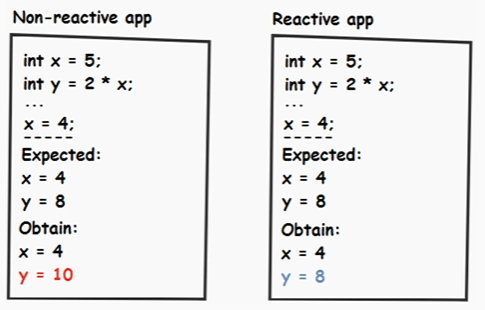

# Reactive Programming Note

- [Reactive Programming Note](#reactive-programming-note)
  - [Overview](#overview)
    - [Reactive Manifesto](#reactive-manifesto)
    - [Non-Reactive V.S. Reactive App](#non-reactive-vs-reactive-app)
  - [Reactive Streams Specification](#reactive-streams-specification)
  - [Reactor Library (Mono & Flux)](#reactor-library-mono--flux)
  - [Spring WebFlux](#spring-webflux)

---

## Overview

Reactive programming is another paradigm compared with object-oriented programming (OOP).

Differences from OOP: 

- Imposes a different way of approaching and thinking to problems.
- Has no idea of mutable state. 
- Only cares about the order in which the things need to happen. OOP focuses on the order in which the computer does things.
- Reacts to events instead of relying on a call stack as OOP. 
- Good fit for asynchronous and non-blocking backpressure contexts. 

### Reactive Manifesto 

- React to events: event/message-driven.
- React to load: scalable or elastic.
- React to failure: resilient.
- React to users: responsive in timely fashion.

### Non-Reactive V.S. Reactive App

---

## Reactive Streams Specification

- Adopted in Spring and Java 9.
- Defines a standard for asynchronous stream processing with non-blocking backpressure. 
- Acts in the context of pub/sub model. 
- Allows the subscriber to control how fast or slow the publisher will produce data by following statements: 
  - Subscriber requests data from publisher. 
  - Subscriber starts receiving data only when it is ready to process data.
  - Subscriber controls the amount of in-flight data. 
- Utilizes Reactor library.

---

## Reactor Library (Mono & Flux)

- Based on Reactive Streams specification.
- All operators support non-blocking backpressure.

---

## Spring WebFlux

- Introduced in Spring 5 as a complete non-blocking API.
- Spring WebFlux requires Reactor as a core dependency.