# Spark Note

## Spark Core

### Architecture  

A Job includes multiple RDDs.

A RDD can be broken into multiple Stages.

A Stages get broken into multiple Tasks that are distributed to nodes on the cluster and then executed.

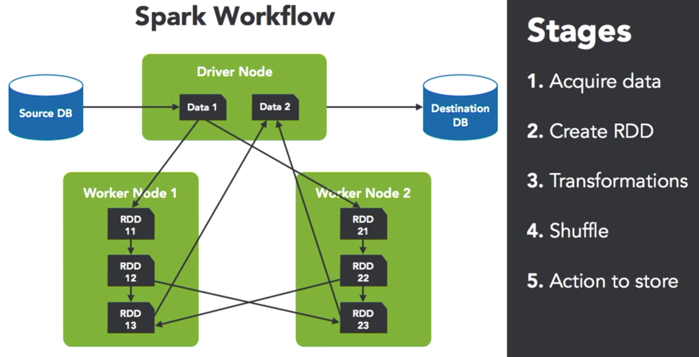

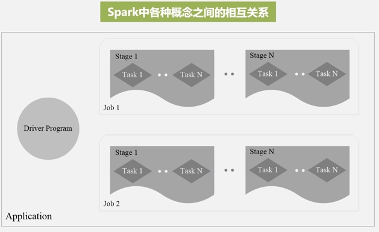


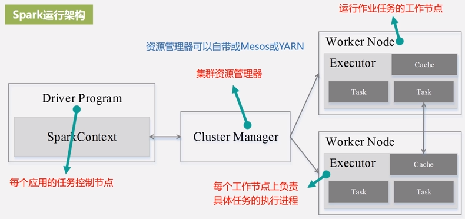

There is a **BlockManager** storage module in **Executor**, which uses both RAM and disk as storage devices in order to reduce IO overhead effectively.

When executing an application, Driver will apply resources from Cluster Manager, start up Executors, send program code and files to Executors, and then execute Tasks on Executors.

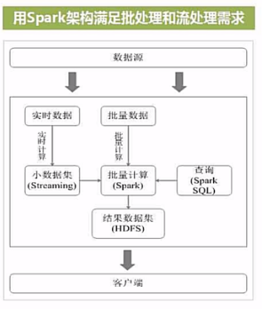

---

### Cluster Resource Manager

- Standalone
- Yarn
- Mesos
- Kubernetes

Spark build-in cluster resource manager (standalone) is not easy to use. **DO NOT** use it generally.

Mesos integrates with Spark better than Yarn.

You can use Mesos and Yarn at the same time. Mesos is for **coarse-grained** management allocating resource to Docker, and then Yarn is for **fine-grained** management.

---

### RDD

- A RDD (Resilient Distributed Dataset) is essentially a **read-only** partition record set.
- Each RDD can be divided into multiple partitions. Each partition is a dataset fragment. Each partition can be stored on different nodes in the cluster. (parallel computing)

#### Partitioning

##### Partitioning Rule

- The number of partitions should be equal to the number or its integer multiple of CPU cores in the cluster as possible.
- Each partition is generally between 100 - 200 MB.

##### Default Partition Number

Configure default partition number through set the parameter `spark.default.parallelism`.

- Local model: Number of CPU of local machine. If `local[N]` has been set, default partition number is N.
- Mesos: 8.
- Standalone or Yarn: Max value between number of CPU cores in the cluster and 2.

##### Manually Configure Partition

RDD partitioning is automatic but can be done manually through programming.

- When creating a RDD using `textFile()` or `parallelize()` methods, specify it. For example, `sc.textFile(<path>, <partitionNum>)`.
  - By default, Spark creates one partition for each block of the file (blocks being 128MB by default in HDFS).
  - You cannot have fewer partitions than blocks.
- When getting a new RDD by transformation, invoke `repartition(<partitionNum>)` method. For example, `rdd2 = rdd1.repartition(4)`. 4 partitions.
  - Check number of partitions: `rdd2.partitions.size`.

##### Stage Division & Dependencies

- Narrow dependencies: The relationship between RDDs is 1 : 1 or many : 1.
- Wide dependencies: The relationship between RDDs is 1 : many or many : many.

Create a new stage when it comes across wide dependencies.

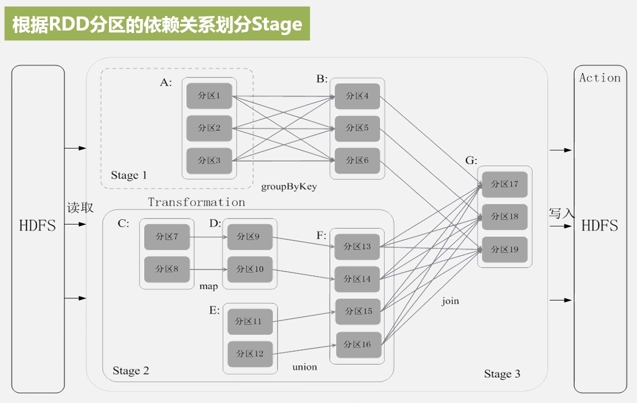

Optimize for dependencies:  

- Do as many narrow dependencies together before hitting a wide dependency.  
- Try to group wide dependency transformations together, possibly inside a single function and do it once.  

#### RDD Running Process


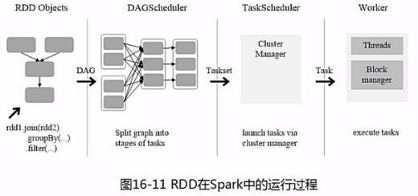

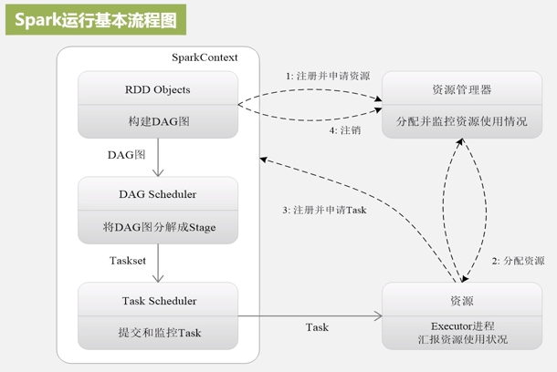

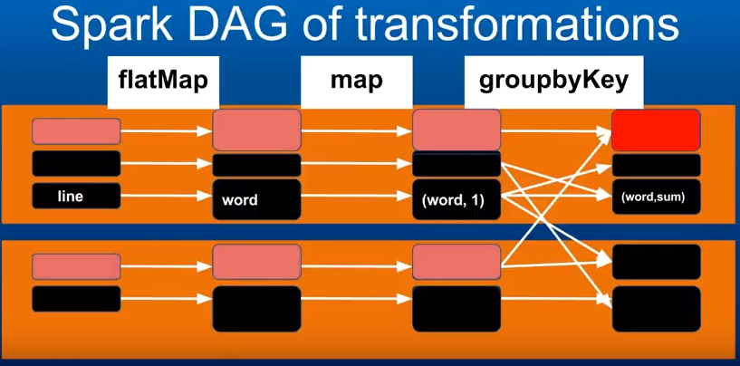

#### Printing Elements of an RDD

It is common to print out the elements of an RDD using `<rdd_var>.foreach(println)` or `<rdd_var>.map(println)`.

- On a single machine, OK.
- In cluster mode, the methods called by executors will print output on executors rather than the driver.

To print all elements on the driver, you may use collect all RDDs to the driver firstly and then print: `<rdd_var>.collect().foreach(println)`.

- This will cause the driver to run out of memory.
- Thus, only print a few elements for testing: `<rdd_var>.take(<number_of_elements>).foreach(println)`.

---

### Dataset

After Spark 2.0, RDDs are replaced by Datasets. The RDD interface is still supported.

Datasets are similar to RDDs but are **strongly typed** that mapped to relational schema.

Processing or transmitting over the network:

- RDD: using Java serialization or Kryo.
- Dataset: using a specialized Encoder to serialize the objects.
  - This Encoder is highly optimized and generates bytecode at run time for serialization and deserialization.

Two ways to create a Dataset:

- from Hadoop InputFormats (such as HDFS files).
- by transforming other Datasets.

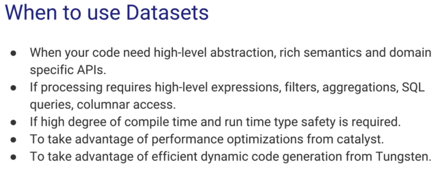

---

### Shared Variables

#### Broadcast Variables

- Use `SparkContext.broadcast(<var>)` to create a broadcast variable from a normal variable, which is cached on each machine.
- The broadcast variable is like a wrapper of its corresponding normal variable.
- The broadcasted data is cached in serialized form and deserialized before running each task.
- After the broadcast variable is created, it should be used instead of the original normal variable in any functions run on the cluster.
- All functions in the cluster can access the broadcast variable, thereby you do not need to repeatedly send the original normal variable to all nodes.
- After creating the broadcast variable, the original normal variable cannot be modified (is **read-only**). Consequently, the broadcast variable on all nodes are the same.
- **When to use**: when a very large variable need to be used repeatedly.

For instance,

1. Create: `val broadcastVar = sc.broadcast(Array(1,2,3))`

2. Get value: `broadcastVar.value`

#### Accumulators

- Used for counter and sum functions.
- Create: `<accum_var> = SparkContext.longAccumulator()` or `<accum_var> = SparkContext.doubleAccumulator()`
- Use: `<accum_var>.add(<number>)`
- These accumulators are available on Slave nodes, but **Slave nodes cannot read them**.
- Master node is the only one that can read and compute the aggregate of all updates. `<accum_var>.value`
- Spark natively supports accumulators of numeric types, and programmers can add support for new types.

For instance,

1. Create: `val nErrors=sc.accumulator(0.0)`

2. Load file: `val logs = sc.textFile("/Users/akuntamukkala/temp/output.
   log")`

3. Count number of "error": `logs.filter(_.contains(“error”)).foreach(x => nErrors += 1)`

4. Get value: `nErrors.value`

##### Accumulator Update

- For action operations, accumulator updates in each task will only be applied once even if the task restarts.
- For transformation operation, each task’s update may be applied more than once if tasks or job stages are re-executed.

---

### Caching / Persisting

- By default, each transformed RDD may be recomputed each time you run an action on it.
- Cache or persist datasets in memory on nodes.
- Future actions are faster (often by more than 10x).
- `<rdd_var>.cache()` for default storage level - `MEMORY_ONLY`.
- Or `<rdd_var>.persist()` with a specified StorageLevel parameter.
- Spark removes cached data automatically in a least-recently-used (LRU) fashion.
- Or use `<rdd_var>.unpersist()` if you want manually.

When to cache data:

- When doing data validation and cleaning.
- When querying a small “hot” dataset.
- Cache for iterative algorithm like PageRank.
- Generally, **DO NOT** use for input data as input data is too large.

#### Storage Level

- `MEMORY_ONLY` is the 1st choice.
- `MEMORY_ONLY_SER` is the 2nd choice. (Java and Scala)
- **DO NOT** use disk unless computing datasets are expensive, or amount of the data is large. Recomputing a partition may be as fast as reading it from disk.

---

### Shuffle

- Shuffle moves data across worker nodes, which is costly.
- It involves disk I/O, data serialization, and network I/O.
- It generates a large number of intermediate files on disk.

- Use minimal shuffle as possible and do them in late stages for better performance.  
- **DO NOT** use `groupByKey() + reduce()` if you can use `reduceByKey()`.
  - `groupByKey()` does not receive functions as parameter. When invoking it, Spark will move all key-value pairs, which will result in big overhead and transmission delay.

No shuffle transformations:  

- map
- filter  
- flatMap
- mapPartitions  
- ...

Shuffle transformations:  

- distinct  
- groupByKey  
- reduceByKey
- join  
- countByValue
- ...

---

### Lazy Evaluation

Taking advantage of lazy evaluation:  

- Do as many transformations as possible before hitting an action.  
- Avoid debugging statements with shuffle, e.g. printing counts.  

---

### API

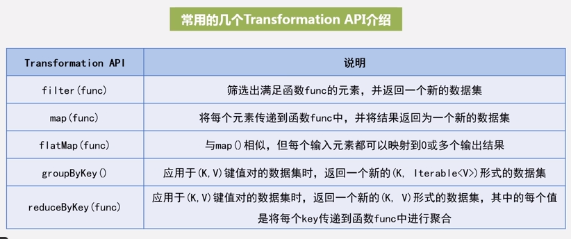

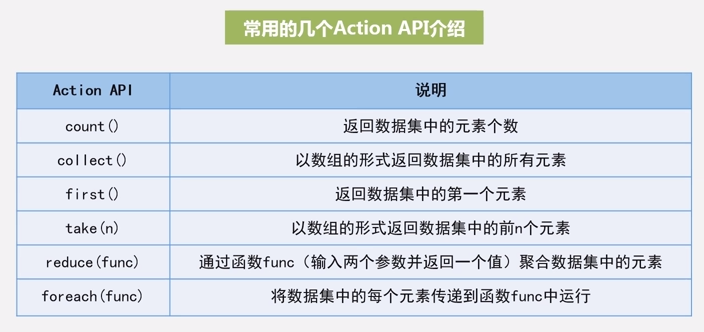

The difference between `foreach()` and `map()`:

- `foreach()`: return void or no return value.
- `map()`: return dataset object.

---

### Spark Core Coding

- Get keys of RDD: `<rdd_var>.keys`
- Get values of RDD: `<rdd_var>.values`
- Sort RDD by key: `<rdd_var>.sortByKey()`
  - Ascending is default.
  - Descending: `<rdd_var>.sortByKey(false)`
- Sort RDD: `<rdd_var>.sortBy(<sort_accordance>)`
  - E.g. according to the second element of tuple in descending: `<rdd_var>.sortBy(_._2, false)`
- Only do mapping for RDD values: `<rdd_var>.mapValues(<func>)`
  - E.g. add 1 for values only: `<rdd_var>.mapValues(_ + 1)`
- Join two RDDs with the same key: `<rdd_var1>.join(<rdd_var2>)`
  - E.g. `(k, v1).join(k, v2)` Then you will get `(k, (v1, v2))`.
- Create a new key for RDD: `<rdd_var>.keyBy(<func>)`
  - E.g. `<rdd_var>.keyBy(<tuple> => <tuple._1>)`

---

## Spark SQL

- Use RDD to process text file.
- Use Spark SQL to process structured data.

### DataFrame  

- A DataFrame is a kind of distributed dataset on basis of RDD.
- **A DataFrame is a distributed set of `Row` objects or `Dataset[Row]`.**
- Each `Row` object represents a row of record, which provides detailed schema info.
- `Row` is an untyped JVM object.
- Through DataFrame, Spark SQL is able to know column name and type of the dataset.
- Can be created from:
  - structured data files
  - Hive tables
  - external databases
  - existing RDDs

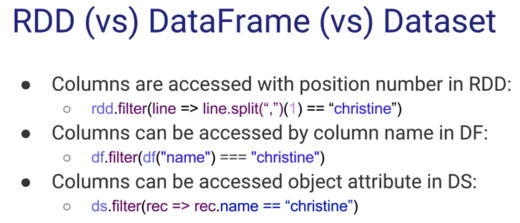

### SparkSession

From Spark 2.0, `SparkSession` interface was introduced to realize all functions of `SQLContext` and `HiveContext`.

Using `SparkSession`, you can

- load data from different data source and transfer to DataFrame.
- transfer DataFrame to table in `SQLContext`.
- use SQL statements to operate data.

### RDD -> DataFrame

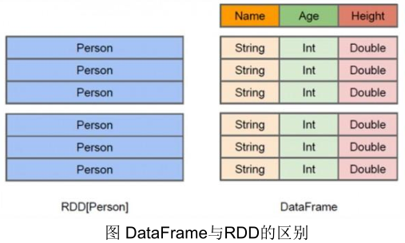

Two ways to convert RDD to DataFrame:

- Use Reflection to infer the schema of the RDD that contains specific type data.
  - Firstly define a case class. Then Spark will convert it to DataFrame implicitly.
  - This way is suitable for the RDD whose data type is known.
  - More concise code.
  - Currently (Spark 2.4), Spark SQL does not support converting JavaBeans to DataFrames that contain Map field(s).
- Use programming interface to construct a schema and apply it to an existing RDD.
  - Construct Datasets when the columns and their types are not known until runtime.
  - More verbose.
  - Steps:
    1. Create an RDD of `Rows` from the original RDD;
    2. Create the schema represented by a `StructType` matching the structure of Rows in the RDD created in Step 1.
    3. Apply the schema to the RDD of `Rows` via `createDataFrame()` method provided by `SparkSession`.

### Spark SQL & Hive

It is compulsory to add Hive support for Spark in order to accessing Hive using Spark.

Pre-compile version Spark from official site generally does not contain Hive support. You need to compile the source code.

### Aggregations

[SparkSQL 中group by、grouping sets、rollup和cube方法详解](https://www.jianshu.com/p/45cf609f5a61)

---

## Structured Streaming

Built on the Spark SQL engine.

- Micro-batch processing: 100 milliseconds latencies, **exactly-once** guarantees.
- Continuous processing: 1 millisecond latencies, **at-least-once** guarantees. (since Spark 2.3)

Treats a live data stream as an unbounded input table that is being continuously appended.


Event-time: The time embedded in the data itself.

### Watermarking

- It lets the engine automatically track the current event time in the data and attempt to clean up old state accordingly.

- You can define the watermark of a query by specifying the event time column and the threshold on how late the data is expected to be in terms of event time.
- For example, `words.withWatermark("timestamp", "10 minutes").groupBy(window($"timestamp", "10 minutes", "5 minutes"), $"word").count()`.  Late data within 10 mins will be aggregated, but data later than 10 mins will start getting dropped. But it is not guaranteed to be dropped; it may or may not get aggregated.

Conditions for watermarking to clean aggregation state:

- Output mode must be **Append** or **Update**.
- The aggregation must have either the event-time column, or a "window" on the event-time column.
- `withWatermark()` method must be called on the same column as the timestamp column used in the aggregate. For example, `df.withWatermark("time", "1 min").groupBy("time2").count()` is invalid.

---

### Join Operations

Stream-stream Joins

- Introduced in Spark 2.3.
- For both the input streams, we buffer past input as streaming state, so that we can match every future input with past input and accordingly generate joined results.
- Similar to streaming aggregations, we automatically handle late, out-of-order data and can limit the state using watermarks.
- [Inner Joins with optional Watermarking](https://spark.apache.org/docs/latest/structured-streaming-programming-guide.html#inner-joins-with-optional-watermarking)
- [Outer Joins with Watermarking](https://spark.apache.org/docs/latest/structured-streaming-programming-guide.html#outer-joins-with-watermarking)
- If any of the two input streams being joined does not receive data for a while, the outer (both cases, left or right) output may get delayed.

As of Spark 2.3,

- you can use joins only when the query is in Append output mode.
- you cannot use other non-map-like operations before joins.

---

### Streaming Deduplication

You can deduplicate records in data streams using a unique identifier in the events.

```scala
val streamingDf = spark.readStream. ...  // columns: guid, eventTime, ...

// Without watermark using guid column
streamingDf.dropDuplicates("guid")

// With watermark using guid and eventTime columns
streamingDf
  .withWatermark("eventTime", "10 seconds")
  .dropDuplicates("guid", "eventTime")
```

---

## Spark Streaming

Spark streaming is not real stream computing. It is second level.

If you want millisecond level, use stream computing framework, e.g. Storm.  


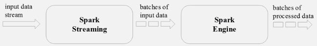

### Coding Steps

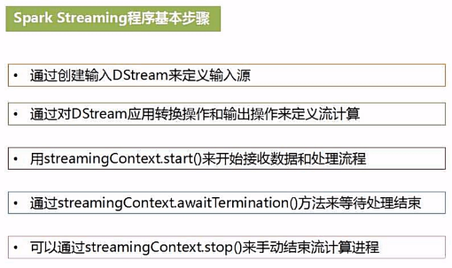

---

## Spark ML

### ML Workflow

Estimator receives an input DataFrame via `.fit()` method, and then generate a Transformer.

- Estimator: algorithm
- Transformer: model

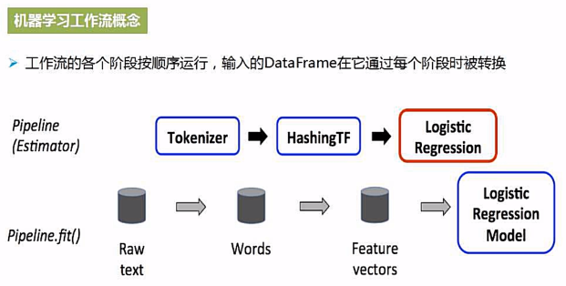

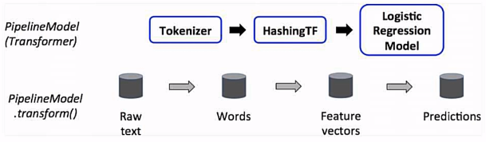

- Red frame: estimator
- Blue frame: transformer

1. Create a new pipeline to fit trainingData, and then generate a pipelineModel.
2. Use this model to transform testData, and then get DataFrame with prediction.

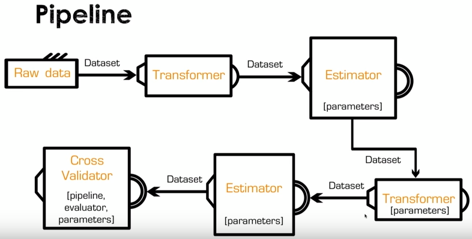

---

### Feature Transformation

Feature transformation: transformation of label and index.

`StringIndexer`

- Construction order of the index is the frequency of label.
- When encoding labels, give priority to those with higher frequency.
- The index of the label with highest frequency is 0.

---

## System Scaling

### Scale Kafka Connect  

- Configure `tasks.max` to number of tables/files.  
- Create different instances for different tables/files.  
- Increase frequency of polling.  
- Use Kafka Connect in cluster mode.  

### Scale Kafka Broker  

- Create multiple partitions for each topic.  
- Increase nodes in the cluster.  

### Scale Spark Streaming  

- Have a single instance of the drive program with separate threads for each stream in the driver.  
- Create separate driver instances for each stream.
- Spark cluster – add nodes.  

### Scale MySQL

- Keep table size small, thereby keeping the entire table in memory, which makes updates and querying very quick.
- Use distributed databases with a lot of nodes that are good for frequent updates – e.g. Cassandra.   

---

## Spark Ecosystem

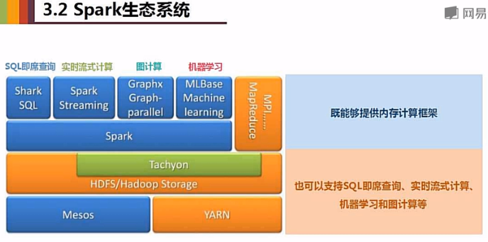

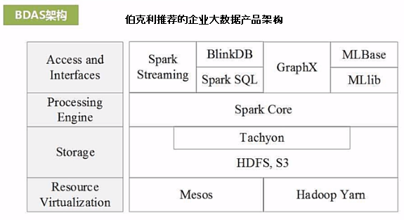

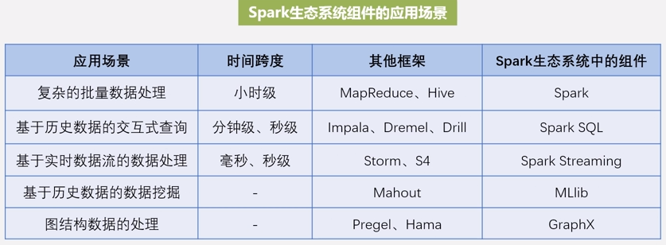

---

## Features & Versions

- Write Ahead Logs (WAL): introduced in Spark Streaming 1.2.
- Direct approach of Spark Streaming and Kafka integration: introduced in Spark 1.3.
- `SparkSession` interface: introduced in Spark 2.0.
- Dataset: introduced in Spark 1.6.
  - After Spark 2.0, RDDs are replaced by Dataset, which is strongly-typed like an RDD. The RDD interface is still supported.
- Continuous Processing: introduced in Spark 2.3.
- Watermarking: introduced in Spark 2.1. Allows the user to specify the threshold of late data, and allows the engine to accordingly clean up old state.

---

## Glossary

- **Avro**: Avro format is great for **row oriented data**. The schema is stored in another file.
- **Parquet**: It is a very efficient format. Generally, you take .csv or .json files. Then do ETL. Then write down to parquet files for future analysis. Parquet is great for **column oriented data**. The schema is in the file.  

---

## Useful Resources

- [A Tale of Three Apache Spark APIs: RDDs vs DataFrames and Datasets](https://databricks.com/blog/2016/07/14/a-tale-of-three-apache-spark-apis-rdds-dataframes-and-datasets.html)
