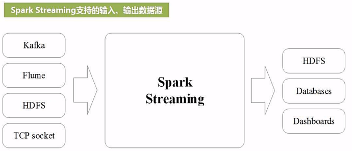
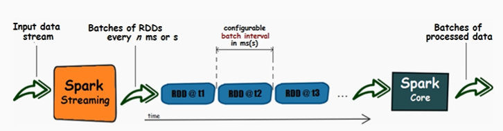
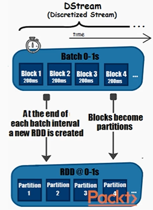
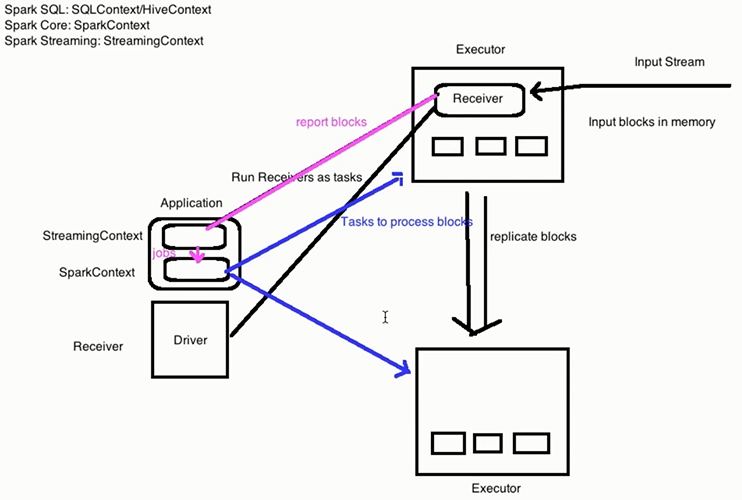
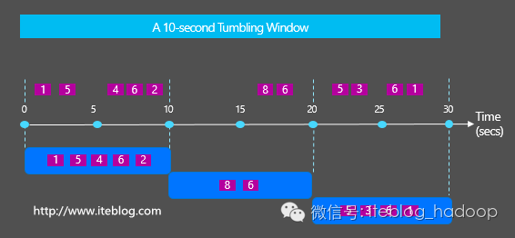
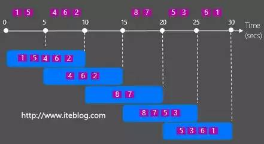

# Spark Streaming Note

## DStream API

If you want millisecond level, use stream computing framework, e.g. Storm.  





### DStream API Coding Steps


---

### DStream API Working Principle 





---

### Limitations

- Based purely on Java/Python objects and functions. Limits the engine’s opportunity to perform optimizations.
- Purely based on processing time. To handle event-time operations, applications need to implement them on their own. **DStream API does not support event-time processing.**
- **No way to handle late data.**
- Only operates in a micro-batch fashion, making it difficult to support alternative execution modes.

---

## Continuous VS Micro-Batch Processing

Continuous processing:

- The processing happens on each individual record.
- :thumbsup: Offers the lowest possible latency.
- :thumbsdown: Lower maximum throughput.
- :thumbsdown: Has a fixed topology of operators that cannot be moved at runtime without stopping the whole system, which can introduce load balancing issues.

Micro-Batch processing:

- :thumbsup: High throughput per node, so needs fewer nodes.
- :thumbsup: Uses dynamic load balancing techniques to handle changing workloads. 
- :thumbsdown: Higher latency. 

Which one to use: consider about latency and total cost of operation. 

---

## DStream VS Structured Streaming

- DStream: Micro-batch processing, not real stream computing. It is second level.
- Structured Streaming: Continuous processing.

Compared with DStreams API, Structured Streaming performs better due to: 

- code generation
- Catalyst optimizer

---

## Structured Streaming

Built on the Spark SQL engine.

The **best thing** about Structured Streaming is that you can take the same operations that you use in batch and run them on a stream of data with very few code changes. You simply write a normal DataFrame (or SQL) computation and launch it on a stream. You do not need to maintain a separate streaming version of their batch code.

Mechanism: Treats a live data stream as an unbounded input table that is being continuously appended. The job then periodically checks for new input data, process it, updates some internal state located in a state store if needed, and updates its result.


- Micro-Batch processing： 100 milliseconds latencies, **exactly-once** guarantees. (by default)
- Continuous processing: 1 millisecond latencies, **at-least-once** guarantees. (since Spark 2.3)

Structured Streaming does not let you perform schema inference without explicitly enabling it. Set the configuration `spark.sql.streaming.schemaInference` to true.

When coding, must include `.awaitTermination()` to prevent the driver
process from exiting while the query is active. Otherwise, your stream will not be
able to run.

You can see a list of active streams through `spark.streams.active`.

- Spark assigns each stream a UUID, which can be used in conjunction with the above list of streams to get a specific active stream.

---

### Output Modes

- append: default.
- update: only the rows that are different from the previous write are written out to the sink. 
    - If the query doesn’t contain aggregations, this is equivalent to append mode.
- complet: rewrite the full output.
    - The map operation does not allow complete mode.
    - Complete mode is not supported as it is infeasible to keep all unaggregated
data in the Result Table.

---

### Triggers

By default, Structured Streaming will output data as soon as the previous trigger completes processing.

#### Processing Time Trigger

Specify a duration using a string. Then data will be output periodically. 

If a trigger time is missed because the previous processing has not yet completed, then Spark will wait until the next trigger point.

Example:

```scala
import org.apache.spark.sql.streaming.Trigger

streamingDF.writeStream
	.trigger(Trigger.ProcessingTime("100 seconds"))
	.format("console")
	.outputMode("complete")
	.start()
```

#### Once Trigger

Used to run the streaming job once. (e.g., import new data into a summary table just occasionally.)

Example:

```scala
import org.apache.spark.sql.streaming.Trigger

streamingDF.writeStream
	.trigger(Trigger.Once())
	.format("console")
	.outputMode("complete")
	.start()
```

---

### Event-Time Processing

Event-time: The time embedded in the data itself. Or the time at which it actually occurred.

Spark Streaming system views the input data as a table, the event time is just another field in that table,

DStream API does not support event-time processing.

Event data can be late or out of order.

#### Tumbling Windows

- Operate on the data received since the last trigger.
- Each, and only one event can fall into one window.



There will be a "window" column in the result table, which is a "struct" type with "start" and "end" field.

#### Sliding Windows



---

### Stateful Processing

Stateful processing is used when you need to use or update intermediate information (state) over longer periods of time.

When performing a stateful operation, Spark stores the intermediate information in a state store, namely, checkpoint directory.

#### Arbitrary / Custom Stateful Processing

**Fine-grained** control over:

- what state should be stored
- how it is updated
- when it should be removed
- explicitly or via a time-out

You manage the state based on user-defined concepts.

`mapGroupsWithState`: generate at most a single row for each group. Namely, do map for group. 

`flatMapGroupsWithState`: generate one or more rows for each group. Namely, do flatMap for group.

**Time-outs** specify how long you should wait before timing-out some intermediate state, which can be configured on a per-group basis.

**Count-based windows**: based on a number of events regardless of state and event times. For example, we may want to compute a value for every 500
events received, regardless of when they are received.

---

### Watermarking

You **must** specify watermark in order to age-out old data and state in the stream and not overwhelm the system over a long period of time. If you do not specify how late you think you will see data, then Spark will maintain that data in memory forever.

Watermarks allow you to specify how late streaming systems expect to see data in event time, namely, how long they need to remember old data.

Watermarks can also be used to control when to output a result for a particular event time window (e.g., waiting until the watermark for it has passed).

- You can define the watermark of a query by specifying the event time column and the threshold on how late the data is expected to be in terms of event time.
- For example, `words.withWatermark("timestamp", "10 minutes").groupBy(window($"timestamp", "10 minutes", "5 minutes"), $"word").count()`.  Late data within 10 mins will be aggregated, but data later than 10 mins will start getting dropped. **But it is not guaranteed to be dropped; it may or may not get aggregated.**

Conditions for watermarking to clean aggregation state:

- Output mode must be **Append** or **Update**.
- The aggregation must have either the event-time column, or a "window" on the event-time column.
- `withWatermark()` method must be called on the same column as the timestamp column used in the aggregate. For example, `df.withWatermark("time", "1 min").groupBy("time2").count()` is invalid.

---

### Join Operations

Stream-stream Joins

- Introduced in Spark 2.3.
- For both the input streams, we buffer past input as streaming state, so that we can match every future input with past input and accordingly generate joined results.
- Similar to streaming aggregations, we automatically handle late, out-of-order data and can limit the state using watermarks.
- [Inner Joins with optional Watermarking](https://spark.apache.org/docs/latest/structured-streaming-programming-guide.html#inner-joins-with-optional-watermarking)
- [Outer Joins with Watermarking](https://spark.apache.org/docs/latest/structured-streaming-programming-guide.html#outer-joins-with-watermarking)
- If any of the two input streams being joined does not receive data for a while, the outer (both cases, left or right) output may get delayed.

As of Spark 2.3,

- can use joins only when the query is in Append output mode.
- cannot use other non-map-like operations before joins.
- cannot use mapGroupsWithState and flatMapGroupsWithState in Update mode before joins.

---

### Streaming Deduplication

You can deduplicate records in data streams using a unique identifier in the events.

```scala
val streamingDf = spark.readStream. ...  // columns: guid, eventTime, ...

// Without watermark using guid column
streamingDf.dropDuplicates("guid")

// With watermark using guid and eventTime columns
streamingDf
  .withWatermark("eventTime", "10 seconds")
  .dropDuplicates("guid", "eventTime")
```

---

### Checkpointing

**Most important thing.**

Used for failure recovery. 

Spark Streaming allows you to recover an application by just restarting it.

You **must** configure the application to use checkpointing and write-ahead logs, namely, configuring a query to write to a checkpoint
location on a reliable file system (e.g. HDFS or S3).

All streaming application relevant progress information and the current intermediate state values are saved to the checkpoint location.

**Must** specify checkpoint location **before** starting application.

Example: 

```scala
val query = streamingDF.writeStream
	.option("checkpointLocation", "<locationDirectory>")
	.queryName("<queryName>")
	.format("memory")
	.outputMode("complete")
	.start()
```

---

### Updating Application

#### Updating Streaming Application Code

Small adjustments like adding a new column or changing a UDF are not breaking changes and do not require a new checkpoint directory.

If you update your streaming application to add a new aggregation key or fundamentally change the query itself, you must start from scratch with a new (empty) directory as your checkpoint location.

Changing `spark.sql.shuffle.partitions` is not supported while a stream is currently running. This requires restarting the actual stream.

#### Updating Spark Version

The checkpoint format is designed to be forward-compatible (e.g. moving from Spark 2.2.0 to 2.2.1 to 2.2.2).

It may be broken due to critical bug fixes that will be documented in release notes.

---

## How to use spark-submit to run spark application script （for real projects）

Take processing socket text as an example.

Steps: 

1. In terminal A, run a Netcat server `nc -lk 9999`.
2. In terminal B, run spark script.

```
spark-submit --master local[2] \
--class org.apache.spark.examples.streaming.NetworkWordCount\
--name NetworkWordCount \
/usr/local/spark/examples/jars/spark-examples_2.11-2.3.0.jar localhost 9999
```

3. In terminal A, type `a a a b b c`.
4. In terminal B, you will see 

```
(a,3)
(b,2)
(c,1)
``` 

---

## How to use spark-shell to run spark application script （for testing）

Take processing socket text as an example. 

Steps: 

1. In terminal A, run a Netcat server `nc -lk 9999`.
2. In terminal B, `spark-shell --master local[2]`.
3. In terminal B, run spark script.

```scala
import org.apache.spark.streaming._
val ssc = new StreamingContext(sc, Seconds(1)) 
val lines = ssc.socketTextStream("localhost", 9999)
val words = lines.flatMap(_.split(" "))
val wordCounts = words.map(x => (x, 1)).reduceByKey(_ + _)
wordCounts.print()
ssc.start()
ssc.awaitTermination()
```

4. In terminal A, type `a a a b b c`.
5. In terminal B, you will see 

```
(a,3)
(b,2)
(c,1)
``` 