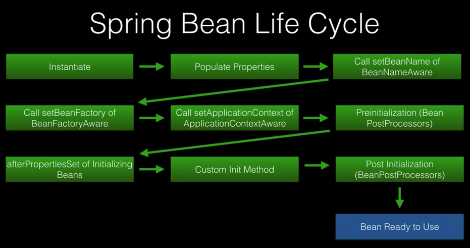
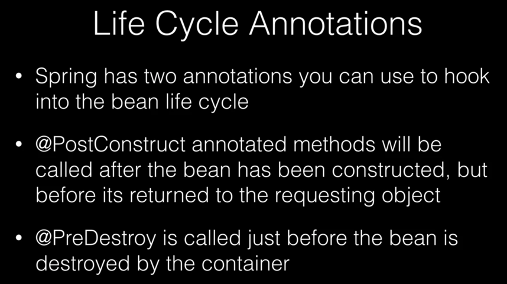
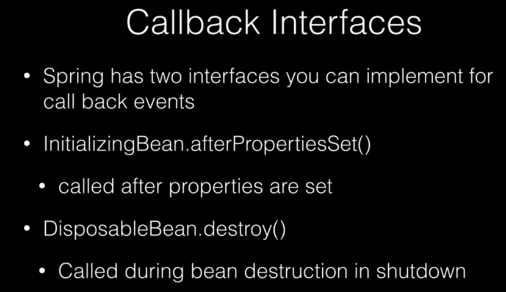
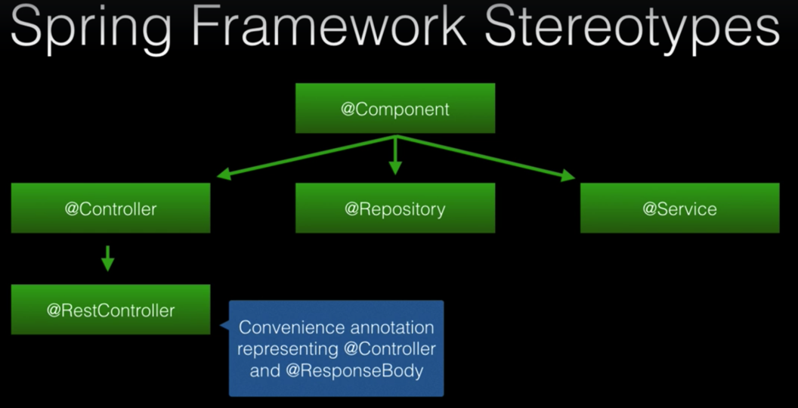
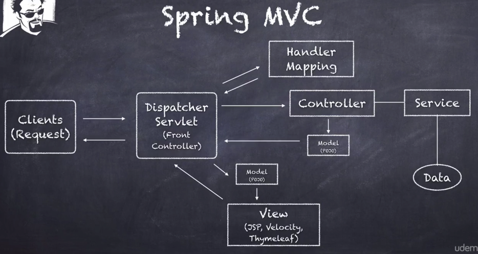

# Spring Note

## Spring

### Basic Concepts

#### Dependency Injection (DI)

Three ways:

- By constructor - **most preferred** :white_check_mark:​
  - If a bean only has one constructor, you can omit the `@Autowired` on the top the constructor.
  - Mark the private property as `final` indicating that it cannot be subsequently changed.
- By setters - area of much debate, may have NullPointerException
- By class properties - least preferred

([Spring DI Patterns: The Good, The Bad, and The Ugly](https://dzone.com/articles/spring-di-patterns-the-good-the-bad-and-the-ugly))

DI via interfaces rather than concrete classes is highly preferred:

- Allows runtime to decide implementation to inject.
- Follows Interface Segregation Principle of SOLID.
- Makes your code more testable.

---

#### Inversion of Control (IoC)

- Allows dependencies to be injected at runtime.
- Dependencies are not predetermined.

---

### Spring Bean Life Cycle







---

### Spring Configuration

Options:

- XML based configuration
  - Introduced in Spring 2.0.
  - Common in legacy Spring Applications.
  - Still supported in Spring 5.
- Annotation based configuration
  - Introduced in Spring 3.0.
  - Component scans `@Component`, `@Controller`, `@Service`, `@Repository`.
- Java based configuration :white_check_mark:​
  - Introduced in Spring 3.0.
  - Uses Java classes to define Spring Beans.
  - Configuration classes are defined with `@Configuration`.
  - Beans are declared with `@Bean`.
- Groovy Bean definition DSL (Domain-Specific Language) configuration
  - Introduced in Spring 4.0.
  - Allows you to declare beans in Groovy.

Industry trend is using Java based configuration.



**When setting these stereotype annotations, set them on top of classes instead of interfaces.**

Q: What is special about the `@Repository` stereotype?

A: Spring will detect platform specific persistence exceptions and re-throw them as Spring exceptions.

---

### Spring Bean Scopes

- Singleton: (**default**) Only one instance of the bean is created in the IoC container.
- Prototype: A new instance is created each time the bean (object) is requested.
- Request: A single instance per http request. Only valid in the context of a web-aware Spring ApplicationContext.
- Session: A single instance per http session. Only valid in the context of a web-aware Spring ApplicationContext.
- Global-session: A single instance per global session. Typically only used in a Portlet context. (Not many people use this.) Only valid in the context of a web-aware Spring ApplicationContext.
- Application: Bean is scoped to the lifecycle of a ServletContext. Only valid in the context of a web-aware Spring ApplicationContext.
- WebSocket: Scopes a single bean definition to the lifecycle of a WebSocket. Only valid in the context of a web-aware Spring ApplicationContext.
- Custom Scope: You can define your own scope by implementing "Scope" interface. (Very rare)

Most commonly used: Singleton and Prototype scope.

---

### External Properties

#### Properties Files

- Specify properties in customized "<file_name>.properties" files. But you need extract code to involve these files in your code. (https://www.udemy.com/spring-framework-5-beginner-to-guru/learn/v4/t/lecture/7437634?start=518)
- (Spring Boot) Specify properties in "application.properties" file. See "application.properties File" section.
- Use YAML "<file_name>.yml" files.

#### Environment Properties

If you need to run Spring program on different environments, e.g. development environment, QA or test environment and product environment, you can set environment properties through defining environment variables, and then access them in your code. (https://www.udemy.com/spring-framework-5-beginner-to-guru/learn/v4/t/lecture/7437636?start=287)

---

## Spring MVC



---

## Spring Boot

### JPA Entity Relationships

#### Unidirectional VS Bidirectional

- Unidirectional: Mapping is done one way. One side of the relationship will not know about the other.
  - Only set owning side as a property in referencing side entity class.
- Bidirectional: Both sides know about each other.
  - Set both sides as properties in each other entity class.

Generally **recommend** to use **Bidirectional** since you can navigate the object graph in either direction.

#### Owning Side VS Referencing Side

**Owning Side**

The one in the relationship who will **own** or hold the foreign key in the database. That is to say, **the table that has the foreign key is the owning side**.

- For instance, a person has many email addresses. "Email" table has "employee_id" as the foreign key, so "Email" entity is the owning side.  

How to decide who is the owning side?

- For OneToOne: you can specify.
- For OneToMany and ManyToOne: "Many" side.

`@JoinColumn` annotation is used in owning side class with foreign key as `name` attribute.

```java
@Entity
public class Email {

    @Id
    @GeneratedValue(strategy = GenerationType.AUTO)
    private Long id;

    @ManyToOne(fetch = FetchType.LAZY)
    @JoinColumn(name = "employee_id")
    private Employee employee;

    // ...

}
```

**Referencing Side**

Inverse side which maps to the owning side.

`mappedBy` is used as an attribute of `@OneToMany` in referencing side class and its value is name of referencing side entity.

```java
@Entity
public class Employee {

    @Id
    @GeneratedValue(strategy = GenerationType.AUTO)
    private Long id;

    @OneToMany(fetch = FetchType.LAZY, mappedBy = "employee")
    private List<Email> emails;

    // ...
}
```

#### Fetch Types

- Lazy Fetch Type: Data is not queried until referenced.
- Eager Fetch Type: Data is queried up front.

JPA 2.1 (Hibernate 5 supports) Fetch Type defaults:

- OneToMany - Lazy
- ManyToMany - Lazy
- OneToOne - Eager
- ManyToOne - Eager

#### Cascade Types

JPA Cascade Types control how state changes are cascaded from parent objects to child objects.

Operations:

- PERSIST: If parent entities are saved, child entities will also be saved.
- MERGE
- REFRESH
- REMOVE
- DETACH: The entities are no longer associated with Hibernate session.
- ALL: Applies all the above options.

If you specify any of the above options, the operation conducted on parent entities will also conduct on child entities (cascade).

By **default**, no operations are cascaded.

#### Inheritance

- MappedSuperClass: A database is not created for the super class.
- Single Table: (**Hibernate default**) One table is used for all subclasses.
  - Disadvantage: unused data columns.
- Joined Table: Base class and subclasses have own tables. But subclass tables only have the additional columns.
  - Fetching subclass entities require a join to the base class table.
  - Large data sets, performance problem.
- Table Per Class

#### Create and Update Timestamps

A **best practice** to use create and update timestamps on your entities for audit purposes.

JPA supports `@PrePersist` and `@PreUpdate`which can be used to support audit timestamps via JPA lifecycle callbacks.

Hibernate provides `@CreationTimestamp` and `@UpdateTimestamp`.

---

### DDL VS DML

- DDL: Data Definition Language, used to define database structures such as tables and indexes.
- DML: Data Manipulation Language, used with data operations such as inserts and updates.

---

### SQL Files for Database Initialization

Spring Boot will look on the root classpath for the files "schema.sql" and "data.sql".

You can put them under "src/main/resources" folder to initialize database when startup.

---

### Run Applications

Three ways to run a Spring Boot application:

- Run in IDE.
- In terminal, `cd` into project folder. Use Maven to run.`mvn clean spring-boot:run`.
- In terminal, `cd` into project folder. Use Maven to compile.`mvn clean install`. Then cd into "target" folder. Use java to execute the .jar file. `java -jar <package_name>.jar`.

---

### application.properties File

Common properties

```properties
server.port=8080
server.servlet.context-path=/<project_name>

spring.datasource.url:jdbc:mysql://127.0.0.1:3306/<table_name>?useSSL=false
spring.datasource.username:<database_username>
spring.datasource.password:<database_password>
spring.datasource.driver:com.mysql.jdbc.Driver

# the way you would like the database to be initialized
spring.jpa.hibernate.ddl-auto=update

# whether or not show sql in console for testing
spring.jpa.hibernate.show-sql=true

spring.jpa.properties.hibernate.dialect:org.hibernate.dialect.MySQL5Dialect
```

How to access properties in properties file? - Use ${ }

```properties
property_name=property_value
property_name2=${property_name}
```

How to access properties in code? - Use annotation.

```java
@Value("${property_name}")
private String property_name;
```
**In real projects, there should be three properties files.**

- application-dev.properties: Configures properties for development environment.
- application-prod.properties: Configures properties for production environment.
- application.properties: Determines which properties file will be used. And common configuration properties for both dev and prod environment can be specified here.
  - For development environment: `spring.profiles.active=dev`.
  - For production environment: `spring.profiles.active=prod`.
  - If there are repetitive properties in "application-<environment_type>.properties" file and "application.properties" file, the latter one will be overridden.

When you run the project in terminal, you can specify which one you will use. `java -jar <project_name>.jar --spring.profiles.active=prod`.

---

##  Practical Skills

When testing using **Postman**, if you are testing `PUT` method, you need to select "**x-www-form-urlencoded**" for RequestParam in Body instead of "**form-data**".
