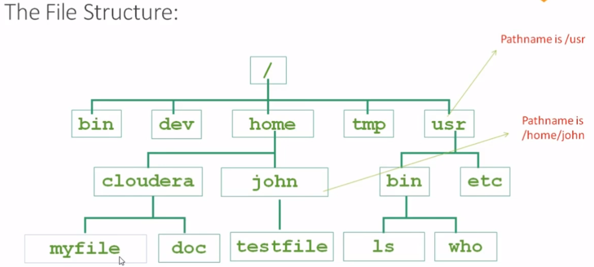
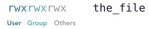
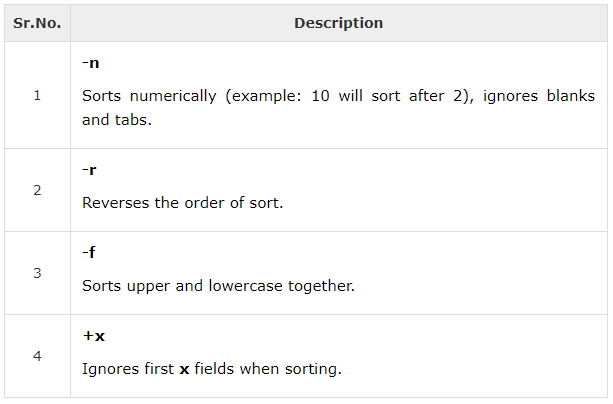

# Unix Note

## User Roles

Users' files are kept separate.

Two types of users: 

- normal user: modify only own files; cannot make system changes.
- superuser (root)

Swith between users: `su <user_name>`

Normal users can be granted temporarily superuser's privileges through `sudo <command>`. Then give up privileges through `sudo -k`.

Fully switch to root user: `su -s`

Switch back to normal user: `exit`

---

## apt (advanced package tool)

Make sure updated versions of software packages are available:`sudo apt-get update`. **Run this command before installing any package.**

Install a new package: `sudo apt-get install <packagename>`

Uninstall a package while keeping config files: `sudo apt-get remove <packagename>`

Uninstall a package without keeping config files: `sudo apt-get remove --purge <packagename>`

Search a package: `apt-cache search <packagename>`

Install git software package: `sudo apt install git`

---

## vi

Create a file or open a file: `vi <filename>`

- Enter into insert mode: press the key **i**.

- Come out of insert mode: press the key **esc**.

- Save the file and quit: Press two keys **Shift + ZZ** or `:wq`

- Save the file: `:w`
- Quit vi: `:q`
- Quit vi without saving: `:q!`
- Save as: `:w <new_file_name>`
- Delete from the cursor position to the end of the current line: `D`
- Delete the current line: `dd`
- Copy the current line: `yy`
- Paste: `p`
- Switches the case of the character under the cursor: `~`
- Find a string: `/`. Find next: `n`
- Replace an item in the current line: `:s/<replace_target>/<substitute>`
- Replace all items in the current line: `:s/<replace_target>/<substitute>/g` (**g** stands for globally)
- Do not know which mode you are in: press key **esc** twice.
- Run commands in vi: `:! <command>`

Open a file in read-only mode: `vi -R <filename>`

---

## Shell

Two major types of shells:

- Bourne-type shell: the default prompt is `$`.
- C shell: the default prompt is `%`.

To create a script, the **shebang** line should be put firstly in the script file. `#!/bin/sh`

**Make the script executable**: `chmod +x <filename>.sh`

Execute the script which is in the current directory: `./<filename>.sh`

Changes user password: `passwd`

Print all environment variables: `printenv`

Print a specific environment variable: `printenv <env_variable_name>`

Displays all system processes: `top`. Use **Ctrl + C** to exit. 

Lists logged-in users: `who`

Upgrade pip3: `pip3 install --upgrade pip`

When `cd`ing a path, if the path contains "space", use `\` to escape it, e.g. `cd my\ path`.

`man`: open manual pages.

`man <command>`: open doc for the specific command.

`apropos "<command_description>"` find the command with this description.

### Shortcuts

- `Ctrl + a`: move curse to the beginning of command line.
- `Ctrl + e`: move curse to the end of command line.
- `Ctrl + u`: crop command before the curse.
- `Ctrl + k`: crop command after the curse.
- `Ctrl + y`: paste the cropped command.
- `Ctrl + r`: search command history.

### Scalar Variables 

By convention, Unix shell variables will have their names in UPPERCASE.

Access the value of a variable: `$<variable_name>`

Make the variable as **read-only**: `readonly <variable_name>`

**Delete** a variable: `unset <variable_name>` (Cannot delete a read-only variable.)

The `$*` special parameter takes the entire list as one argument with spaces between.

The `$@` special parameter takes the entire list and separates it into separate arguments.

This two will act the same unless they are enclosed in double quotes, `" "`.

Example 

test.sh file

```shell
#!/bin/sh

for TOKEN in $*
do
   echo $TOKEN
done
```

Execute test.sh

```shell
$./test.sh Zara Ali 10 Years Old
Zara
Ali
10
Years
Old
```

### Array Variables

```shell
#!/bin/sh

NAME[0]="Zara"
NAME[1]="Qadir"
NAME[2]="Mahnaz"
NAME[3]="Ayan"
NAME[4]="Daisy"
echo "First element: ${NAME[0]}"
echo "Second element: ${NAME[1]}"
echo "All elements: ${NAME[*]}"
echo "All elements: ${NAME[@]}"
```

### Basic Operators

```shell
#!/bin/sh

# Arithmetic Operators
# note: the space cannot be ignored
val=`expr 2 + 2`
echo "Total value : $val"

# note: use \ on the * symbol for multiplication
val=`expr $a \* $b`
echo "a * b : $val"


# Relational Operators
a=1
b=2
# note the space 
if [ $a == $b ]
then
   echo "a is equal to b"
fi

if [ $a != $b ]
then
   echo "a is not equal to b"
fi


# [ $a -eq $b ], [ $a -ne $b ], [ $a -gt $b ], [ $a -lt $b ], [ $a -ge $b ], [ $a -le $b ]
# -o: or 
#-a: and 


# String Operators
a="abc"
b="efg"

# "=" is used for checking string
if [ $a = $b ]
then
   echo "$a = $b : a is equal to b"
else
   echo "$a = $b: a is not equal to b"
fi

if [ $a ]
then
   echo "$a : string is not empty"
else
   echo "$a : string is empty"
fi


# File Test Operators
file="/test.sh"

if [ -r $file ]
then
   echo "File has read access"
els e
   echo "File does not have read access"
fi

if [ -w $file ]
then
   echo "File has write permission"
else
   echo "File does not have write permission"
fi

if [ -x $file ]
then
   echo "File has execute permission"
else
   echo "File does not have execute permission"
fi

if [ -f $file ]
then
   echo "File is an ordinary file"
else
   echo "This is sepcial file"
fi

if [ -d $file ]
then
   echo "File is a directory"
else
   echo "This is not a directory"
fi

if [ -s $file ]
then
   echo "File size is zero"
else
   echo "File size is not zero"
fi

if [ -e $file ]
then
   echo "File exists"
else
   echo "File does not exist"
fi


# Loop
a=0
while [ "$a" -lt 10 ]    # this is loop1
do
   b="$a"
   while [ "$b" -ge 0 ]  # this is loop2
   do
      # "-n" option lets echo avoid printing a new line character
      echo -n "$b "
      b=`expr $b - 1`
   done
   echo
   a=`expr $a + 1`
done

# the result will be 
0
1 0
2 1 0
3 2 1 0
4 3 2 1 0
5 4 3 2 1 0
6 5 4 3 2 1 0
7 6 5 4 3 2 1 0
8 7 6 5 4 3 2 1 0
9 8 7 6 5 4 3 2 1 0


# Loop Control
for var1 in 1 2 3
do
   for var2 in 0 5
   do
      if [ $var1 -eq 2 -a $var2 -eq 0 ]
      then
         # break 2nd enclosing loop
         break 2
      else
         echo "$var1 $var2"
      fi
   done
done

# the result will be 
0
1
2
3
4
5
```

### Substitution

```shell
#!/bin/sh

# Command Substitution
DATE=`date`
echo "Date is $DATE"

USERS=`who | wc -l`
echo "Logged in user are $USERS"

UP=`date ; uptime`
echo "Uptime is $UP"


# Variable Substitution
echo ${var:-"Variable is not set"}
echo "1 - Value of var is ${var}"

echo ${var:="Variable is not set"}
echo "2 - Value of var is ${var}"

unset var
echo ${var:+"This is default value"}
echo "3 - Value of var is $var"

var="Prefix"
echo ${var:+"This is default value"}
echo "4 - Value of var is $var"

echo ${var:?"Print this message"}
echo "5 - Value of var is ${var}"

# the result will be 
Variable is not set
1 - Value of var is
Variable is not set
2 - Value of var is Variable is not set

3 - Value of var is
This is default value
4 - Value of var is Prefix
Prefix
5 - Value of var is Prefix
```

### Quoting Mechanisms

Special characters: `* ? [ ] ' " \ $ ; & ( ) | ^ < > new-line space tab`

Special characters could be quoted by preceding it with a backslash `\` or between **single quotes** `' '`.

Most special characters between **double quotes** `" "` lose their special meaning with some exceptions.

### Input/Output Redirections

Use `>` to redirect standard output into a file. (replace content)

Example:`echo "test" > test.txt` Output "test" to test.txt file. 

Use `>>` to append standard output in a file. 

Discard the output (run the command but do not want to see the output): `<command> > /dev/null`

### Functions

#### Create Functions

Example

test.sh file

```shell
#!/bin/sh

# define your function here
Hello () {
   echo "Hello World"
}

# invoke your function
Hello
```

Execute test.sh 

```shell
$./test.sh
Hello World
```

#### Pass Parameters

```shell
#!/bin/sh
# pass parameters to the function 
Hello () {
   echo "Hello World $1 $2"
}

# invoke your function
Hello Zara Ali
```

#### Return Values 

```shell
#!/bin/sh

Hello () {
   echo "Hello World $1 $2"
   return 10
}

Hello Zara Ali

# capture value returnd by last command
result=$?

echo "Return value is $result"


# the execution result will be 
Hello World Zara Ali
Return value is 10
```

#### Call Functions from Prompt 

1. Define functions in test.sh file. 
2. In terminal, `. test.sh`. (**Note**: there is no `/` after `.`.)
3. Call functions in terminal, `func_name`.

Remove the definition of a function from the shell: `unset .f function_name`

---

## File Management

All data in Unix is organized into files.

### Wildcard

`*`: 0 or more characters 

`?`: 0 or 1 character

`+`: 1 or more characters 

`.`: 1 character except "\n"

### Files Operation

Create an empty file: 

- `echo -n > filename`
- `> filename`
- `touch filename`
- `vi filename`

List all files including hidden files: `ls -a`

List all files (including hidden files) in long listing format: `ls -al`

List files with human readable size: `ls -h`

Find files and folders with specific name: `find <dir> -name "<target_name>"`

When using `cat` to see the content of a file, display line numbers: `cat -b filename`

Count the total number of lines, words, and size in a file: `wc filename`

Count size of a file: `wc -c filename`

Count number of lines in a file: `wc -l filename`

Count number of words in a file: `wc -w filename`

Count words in multiple files: `wc filename1 filename2 filename3`

Copy a file: `cp source_file destination_file`

Rename a file: `mv old_file new_file`

Delete a file: `rm filename`

Delete multiple files: `rm filename1 filename2 filename3`

Delete a file with prompt: `rm -i filename`

Compare two files: `cmp filename1 filename2`

Find differences between two files: `diff filename1 filename2`

`tar `

- `-c`: package without compression
- `-x`: extract  
- `-z`: compress
- `-f`: specify the package name

Compress a **.gz** file using gzip: `gzip filename`

Uncompress a **.gz** file using gunzip: `gunzip filename`

Package a **.tar** file: `tar -cvf packagename filename`

Unpackage a **.tar** file: `tar -xvf filename`

Compress a **.tar.gz** file: `tar -zcvf packagename filename`

Uncompress a **.tar.gz** file: `tar -zxvf filename`

Display the content of a compressed file: `zcat filename`

## Directory Management



Go to home folder: `cd`

Go in your last directory: `cd -`

List files in a directory: `ls dirname`

List files in a directory and sub-directories: `ls -R dirname` ("-R" stands for Recursive)

Create multiple directories: `mkdir dirname1 dirname2 dirname3` 

Create parent directories: `mkdir -p /parentdir/childdir`

Delete an empty directory: `rmdir dirname` 

Delete a non-empty directory: `rm -R dirname`

---

## File Permission 



Default permission of a new file: `644` or `rw-r--r--`.

### Changing Permissions  

#### in absolute mode

Example 

`chmod 755 filename`: set permission of the file as owner with read, write and execute, group with read and execute, and others with read and execute. 


#### in symbolic mode

`chmod <o/u/g> <+/-/=> <r/w/r> filename` 

- `o`: others 
- `u`: owner 
- `g`: group  
- `a`: all of the above
- `+`: add permission  
- `-`: remove permission  
- `=`: set permission  

Example 

`chmod o+wx filename`: add write and execute permissions to other users.  

### Changing Owners and Groups   

Change the owner of filename to the username: `chown username filename` 

Change the group of filename to the username: `chgrp groupname filename` 

---

## Environment

Set an environment variable: `ENVVAR="test"` (**Note**: do not contain space.)

Access an environment variable: `echo $ENVVAR `

### PS1 Variable

The characters that the shell displays as your command prompt are stored in the variable PS1.

Set command prompt to show user name, machine name and working directory: `PS1="[\u@\h \w]\$"`

### PATH Variable

Check PATH variable: `echo $PATH`

Modify PATH variable: `export PATH=$PATH:<new_path>`

---

## Pipes and Filters

#### grep

`grep`: **globally** search for a **regular expression** and **print** all lines containing it.

Example

`cat test.txt | grep "hi"`: print all lines containing "hi" in test.txt file. 

`ls -l | grep "test"`: list all files or directories that contain "test". 

#### sort 

`sort`: arranges lines of text alphabetically or numerically. 



Example

Sorts all files in the current directory modified in August by the order of size:

```shell
$ls -l | grep "Aug" | sort +4n
-rw-rw-r--  1 carol doc      1605 Aug 23 07:35 macros
-rw-rw-r--  1 john  doc      2488 Aug 15 10:51 intro
-rw-rw-rw-  1 john  doc      8515 Aug  6 15:30 ch07
-rw-rw-rw-  1 john  doc     11008 Aug  6 14:10 ch02
```

---

## Processes Management

Start a **background process**: add an ampersand `&` at the end of the command. 

List all your own running processes: `ps`. (process status)

List all your own running processes with more info: `ps -f`.

Stop a background process: `kill -9 <pid>`

If you have a program that calls for lengthy processing, then it is worth to make it a **daemon process** and run it in the background.

---

## Network Communication Utilities

### ping 

The **ping** command sends an echo request to a host available on the network. 

`ping <hostname or ip-address>`

### ftp 

The **ftp** command helps you upload and download your file from one computer to another computer.

`ftp <hostname or ip-address>`

The above command would prompt you for the login ID and the password. Once you are authenticated, you can access the home directory of the login account and you would be able to perform various commands.

| Command       | Description                                                  |
| ------------- | ------------------------------------------------------------ |
| put filename  | Uploads filename from the local machine to the remote machine. |
| get filename  | Downloads filename from the remote machine to the local machine. |
| mput filelist | Uploads more than one file.                                  |
| mget filelist | Downloads more than one file.                                |
| prompt off    | Turns the prompt off.                                        |
| prompt on     | Turns the prompt on.                                         |
| dir           | Lists all the files available in the current directory of the remote machine. |
| cd dirname    | Changes directory to dirname on the remote machine.          |
| lcd dirname   | Changes directory to dirname on the local machine.           |
| quit          | Logout from the current login.                               |

### telnet 

The **telnet** command allows a computer user at one site to make a connection, login and then conduct work on a computer at another site.

`telnet <hostname or ip-address>`

### finger 

The **finger** command displays information about users on a given host (local or remote).

Check all the logged-in users on the local machine:`finger`

Get information about a specific user available on the local machine: `finger <username>`

Check all the logged-in users on the remote machine: `finger @<remote_host_name>`

Get the information about a specific user available on the remote machine: `finger <username>@<remote_host_name>`

---

## Ubuntu 

Display hidden files in File Explorer: Ctrl + h. 

