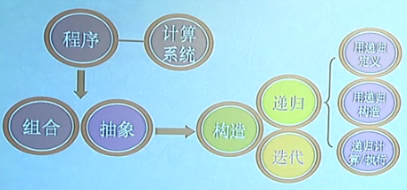
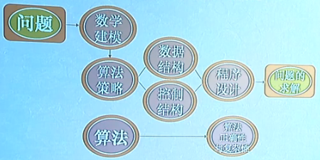

# 软工 Learning Notes
（哈工大公开课：软件工程专业导论）

---

## 第3讲 软件与程序思想 - 组合、抽象、构造、递归

加减乘除运算都可以转换成加减运算来实现。
加减法运算都可以转换成逻辑运算来实现。- “与”、“或”、“非”动作。

“与”、“或”、“非”电路是连接硬件和软件的桥梁。

程序是组合、抽象、构造的过程。**程序的本质：**组合、抽象、构造与执行。

程序构造的基本方法：递归（recursion）与迭代（iteration）。

有些递归程序可以用迭代的方法来构造执行，从而提高运行效率。e.g. 求 n!

---

## 第4讲 软件之灵魂——算法

### 贪心算法

基本思想: 今朝有酒今朝醉。e.g. 以最短路径遍历四个点问题，先选距离最短的路径。

### 算法复杂性：
- 时间复杂性：算法所需时间。
- 空间复杂性：所占存储空间大小。

  

算法复杂性分析主要关注点：循环的层数。

 

### 计算复杂性理论：
- P类问题：所有可以在多项式时间内**求解**的问题。
- NP类问题：所有可以在多项式时间内**验证**的问题。

## 第9讲 工程之方圆——软件工程技术

软件产品属性完全满足用户需求是不现实的。

 

软件质量保证：

- 软件测试
- 软件维护
- 软件配置管理
- 软件过程质量